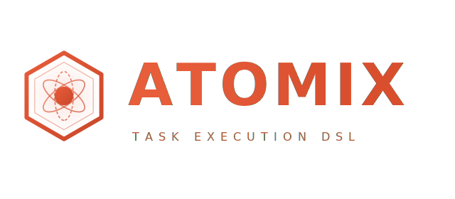
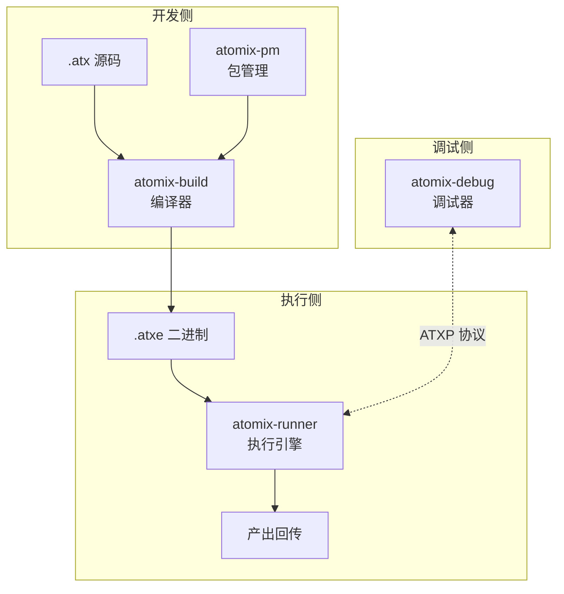

<p align="center">
  
</p>

<p align="center">
  
  
  
  
</p>

专为资源受限的宿主环境设计：不占端口、不跑 daemon、不需要独立集群。编译器 (atomix-build) + 运行时 (atomix-runner) + 调试器 (atomix-debug) + 包管理 (atomix-pm)，全部用 Rust 构建。

## Why Atomix

任务执行的现有方案各有各的妥协：

| 方案 | 问题 |
|------|------|
| Airflow / Temporal | 太重，需要独立集群 |
| Python `subprocess` | 慢，内存碎片，无隔离 |
| WASM | 无原生并发、无任务池、无 hook 体系 |
| 手写 Rust 服务 | 每次都要重复实现调度、内存管理、错误恢复 |

**Atomix 把这三件事打包成了一个工具链。** 写一次 `.atx`，编译、调度、OOM 恢复、产出回传全自动。

### 设计原则

- **寄生 (Parasitic)** — 不占端口、不跑 daemon，编译产物直接嵌入宿主进程执行，部署成本为零。
- **克制 (Restrained)** — ISA 仅 54 条指令，4 种编码模板，16 个寄存器。工具链预估 ~60K 行 Rust，整个项目一个人能读完。
- **自愈 (Resilient)** — 运行时内置内存墙、自适应调度、批次级超时回收；任务挂了不影响宿主。

## Quick Look

```
# demo.atx 片段 — 完整示例见 docs/example.atx

USE : "std/csv"

TOOLS : {
    fn classify(row : dict) : dict {
        return {
            "id":    row["id"],
            "score": row["amount"],
            "ok":    row["amount"] > 0
        }
    }
}

INPUT : {
    CSV : "data/orders.csv" [header] => orders : list[dict]
}

TASK : {
    CALL classify(orders[0]) $         # $ 管道变量
    GOOUT summary : dict = {
        "first_id":  $["id"],
        "total":     len(orders)
    }
}

OUT : {
    summary => HTTP : "https://api.example.com/demo"
}
```

```bash
atomix build demo.atx && atomix run demo.atxe
```

```
[atomix]  build  demo.atx          →  demo.atxe     (12 insns, 288 B)
[atomix]  run    demo               profile=runner  sandbox=enabled
[atomix]  task   summary            status=done     duration=23ms
[atomix]  out    POST → https://api.example.com/demo  200 OK
```

完整语法示例 [`docs/example.atx`](docs/example.atx)（含 WORKS 模板、IF/ELIF/FOR、钩子链等），语法设计文档见 [`docs/语法设计/`](docs/语法设计/)。

## Architecture



| 组件 | 职责 | 边界 |
|------|------|------|
| **atomix-build** | `.atx` → `.atxe` 编译器 (lexer → parser → IR → optimize → link) | 输出平台无关二进制 |
| **atomix-runner** | 任务池 + 四因子自适应调度 + VM/AOT 执行 + 内存墙 | 运行时不感知源码 |
| **atomix-debug** | 三层逆向 + 断点/监视点 + REPL + TUI | 通过 ATXP 协议与 runner 通信 |
| **atomix-pm** | Git 依赖管理 + lock 文件 + 版本解析 | 编译期工具 |
| **ATXP** | 16B 帧头 + CRC16 + 30+ 端点 + Webhook 签名 | 调试器↔运行时的通信契约 |

## Project Phases

```
Phase 1 ─── ISA & IR  ───────────────── 🟢 稳定
  ├─ 54 条 opcode，4 种编码模板 (R3/R2I/R1I/JI)
  ├─ 16 寄存器模型
  └─ .atxe 二进制格式 (header + 6 section types)

Phase 2 ─── 编译器管线 ──────────────── 🟡 设计中
  ├─ lexer → parser → semantic → IR → codegen
  └─ 基础测试框架

Phase 3 ─── 执行引擎 ────────────────── 🟡 设计中
  ├─ 字节码解释器 (VM)
  ├─ 任务池 & 自适应调度器
  └─ 内存墙 & OOM 恢复

Phase 4 ─── 调试器 & 外围工具 ────────── 🔵 规划中
  ├─ atomix-debug (断点/监视点/REPL)
  ├─ atomix-pm (依赖/版本/lock)
  ├─ atomix-format & atomix-lint
  └─ SDK (Python + Rust)
```

## Getting Started

```bash
git clone https://github.com/Lumoa-dev/atomix.git
cd atomix
cargo build --release
cargo test              # 当前 9 个测试，全部通过
cargo run -- --help
```

> **注意:** Atomix 目前处于设计实现阶段，CLI 和运行时仍在构建中。

## Tooling

Atomix 官方不维护 IDE 扩展。语法高亮规则定义在 [`syntaxes/atomix.tmLanguage.json`](syntaxes/atomix.tmLanguage.json)，社区可按需适配任意编辑器。

### GitHub 仓库

`.atx` 文件在 GitHub 上自动高亮 — 语法规则已提交至 [github/linguist](https://github.com/github-linguist/linguist)。

### 终端

用 [`bat`](https://github.com/sharkdp/bat) 替代 `cat`，检查 `.atx` 文件自带颜色：

```bash
# 将语法文件放到 bat 的语法目录下
cp syntaxes/atomix.tmLanguage.json ~/.config/bat/syntaxes/
bat docs/example.atx
```

### 内置编辑器（规划中）

`atomix edit` — 一个终端内的文本编辑器，专为 `.atx` 设计。语法高亮、语法检查、代码补全都内置在 CLI 工具链中，不依赖外部编辑器。

## Design Docs

完整索引 [`docs/index.md`](docs/index.md)（自动生成）

| 文档 | 一句话 |
|------|--------|
| [总纲与哲学](docs/01-总纲与哲学.md) | 九字真言、五区架构、寄生模型 |
| [指令集规范](docs/02-指令集规范.md) | 54 条 ISA、4 种编码模板、Profile 语义矩阵 |
| [通信协议](docs/05-通信协议.md) | ATXP v0.4：16B 帧头 + CRC16 + 30+ 端点 |
| [运行时架构](docs/08-运行时架构.md) | 任务池、批次管理、内存墙、自适应四因子控制器 |
| [编译管线](docs/04-编译管线.md) | lexer → parser → semantic → IR → optimize → link |

## Contributing

在开始之前，建议先阅读 [总纲与哲学](docs/01-总纲与哲学.md) 和 [指令集规范](docs/02-指令集规范.md) 以理解设计背景。

- **提交 issue** — 报告 bug 或提出功能请求
- **完善设计** — 讨论指令集、运行时、协议的设计取舍
- **实现代码** — 查看 [Project Phases](#project-phases) 中 🟡 的项目，选一个下手

## License

双许可证：**MIT** 或 **Apache License 2.0**，任选其一。
