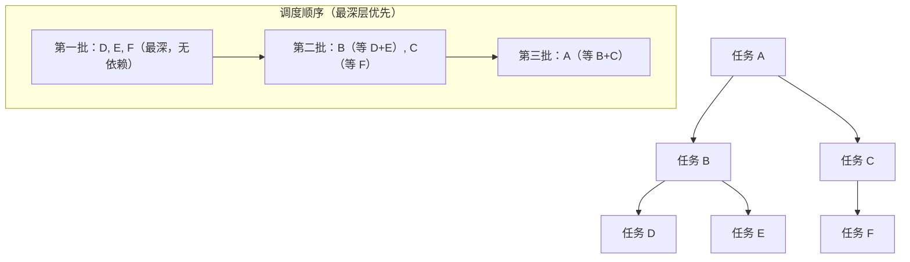
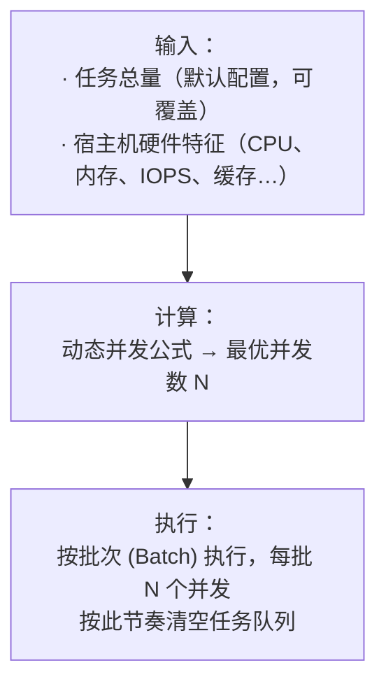
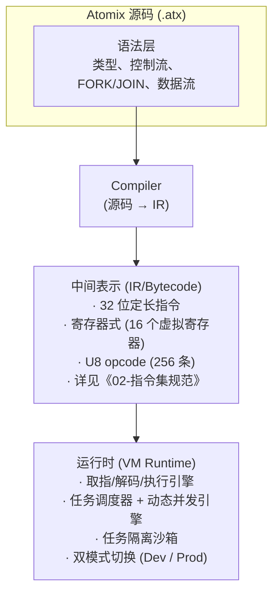

# Atomix 设计总纲与哲学

> 架构版本: v0.1 (设计阶段)
> 最后更新: 2026-07-14

---

## 1. 项目背景与定位

Atomix 是一门**任务执行 DSL**，配备完整的编译器与运行时系统。

它的诞生场景是一台 **2C2G 的服务器**——上面已经跑了 Web 服务器、应用服务、项目管理、爬虫、OSS、数据库、Docker、Nginx，剩下的资源缝隙只够塞下一个极度克制的执行引擎。

在此背景下，Atomix 追求的不仅是"能跑"，而是在资源缝隙中**跑出最大吞吐量**。

### 双模运行

| 模式 | 用途 | 行为 |
|------|------|------|
| **开发模式 (Dev Mode)** | 本地编写、调试 | 单条/单段代码即时执行，快速反馈。类似 REPL |
| **生产模式 (Prod Mode)** | 部署运行 | 源码编译为 IR，提交到常驻执行器 Daemon，按动态并发策略调度执行 |

开发模式解决"我得先看看这行能不能跑"的问题；生产模式解决"我要批量管理任务"的问题。

---

## 2. 九字真言

> **轻量 · 小体积 · 快速 · 安全**

每一条都是定量约束，不是定性口号。

### 2.1 轻量

不依赖大型运行时库（不依赖 JRE、.NET Runtime、V8 等）。

- 编译产物（IR + 执行器）总内存占用以 **MB** 计，不以 GB 计
- CPU 占用以"在缝隙里跑"为标准，不独占整核
- 执行器二进制体积控制在 **数 MB 级别**

### 2.2 小体积

- 编译产出的 IR 文件紧凑
- IR 不携带冗余元信息（非调试模式下）
- 最小部署包只包含执行器（不含编译器）

### 2.3 快速

- 启动速度：微秒级加载 IR，毫秒级启动执行
- 执行速度：接近实现语言本身的速度（用 C 实现的 VM 接近 C 的速度）
- 调度速度：并发决策在纳秒微秒级完成

### 2.4 安全

四个安全维度，全部必须：

| 维度 | 含义 | 实现手段 |
|------|------|----------|
| **内存安全** | 无野指针、无缓冲区溢出、无 Use-After-Free | VM 托管内存，不暴露裸指针 |
| **任务隔离安全** | 一个任务崩溃不影响其他任务和 Daemon | 每个任务在隔离的 VM 上下文中执行 |
| **沙箱安全** | 任务不可越权访问宿主资源 | 指令级权限检查 + 能力声明 |
| **类型安全** | 编译期杜绝类型错误 | 强类型系统 + 编译期检查 |

---

## 3. 任务模型（核心）

### 3.1 基本定义

**任务（Task）是 Atomix 中最小的执行单元。**

```
任务 = 独立执行单元
 ├─ 可派生其他任务 (TASK_FORK)，形成任务树
 ├─ 派生后通过 JOIN 等待并取回结果
 ├─ 被派生的任务自身可再派生（多层嵌套）
 ├─ 不限制嵌套深度，靠额度机制自然约束
 ├─ 任务间不直接通信（无双向消息传递）
 └─ 完全由调度器管理并发额度
```

### 3.2 任务的生命周期


- **预备**：初始化任务上下文、加载输入
- **等待**：排队等待调度器分配资源
- **执行**：实际运行（含派生子任务）
- **产物**：生成任务结果数据（通过 TASK_RET 返回）
- **结束**：回收资源

### 3.3 任务树与依赖图

任务之间通过 **派生（FORK）** 和 **等待（JOIN）** 形成依赖关系，整体构成一个有向无环图。



**核心原则：**

- **派生非阻塞**：`TASK_FORK` 立即返回，子任务进入调度队列，父任务可继续执行
- **等待阻塞**：`TASK_JOIN` / `TASK_JOIN_ALL` 阻塞直到指定子任务完成
- **结果是确定性的**：子任务完成的顺序不影响最终结果（每个子任务有独立句柄，按句柄取结果）
- **依赖图由编译器静态分析得出**，调度器按层级从深到浅分批调度

### 3.4 任务间关系

- 任务之间**不提供双向通信机制**（无消息传递、无 Channel、无共享状态）
- 数据通过 **派生→等待→取结果** 的管道传递：父任务派生子任务，子任务返回结果给父任务
- 不同分支上的任务（如 B 和 C）之间彼此不知道对方存在
- 跨分支数据交换应通过外部媒介：文件、数据库、消息队列
- 类比：如 GitHub Actions 的不同 Workflow——各跑各的，靠外部系统协调

### 3.5 为什么选择这个模型

| 方案 | 是否采用 | 理由 |
|------|----------|------|
| 任务可派生任务（嵌套） | ✅ 采用 | 按需并发，不设硬上限，额度机制自然约束 |
| 任务间双向通信 | ❌ 不采用 | 引入竞态、死锁、耦合，违背隔离原则 |
| 扁平模型（禁止派生） | ❌ 不采用 | 过于严格，无法表达自然的任务分解 |
| 任务树 + 依赖图 + 深度优先 | ✅ 采用 | 编译器可静态分析依赖，调度器可全局优化 |

---

## 4. 动态并发引擎

### 4.1 基本原理

Atomix 的并发数是**自动计算**的，不需要用户手动配置。



### 4.2 硬件特征维度

硬件的不同维度影响力施加到任务执行的不同角度：

| 硬件维度 | 主要影响任务类型 |
|----------|-----------------|
| CPU 核数 / 频率 / 缓存 | CPU 密集型任务 |
| 内存容量 / 带宽 | 内存密集型任务 |
| 磁盘 IOPS / 吞吐 | IO 密集型任务 |
| 网络带宽 / 延迟 | 网络密集型任务 |

### 4.3 语言层面的介入

- 用户可以在 DSL 层面**覆盖/调整**并发参数（可选，非必须）
- 默认状态下，引擎自动完成所有决策——**零配置也能跑出好性能**

---

## 5. 架构总览



---

## 6. 文档体系规范

> 本文档体系的设计原则：**每篇文档只服务一个读者群，只用一种写法。**

---

### 6.1 三类文档

Atomix 的文档按读者群体分为三类，互不混用：

| 目录 / 文档 | 读者 | 职责 |
|---|---|---|
| **`语法设计/`** | 设计者 / 实现者 | 语言规范。精确到可以实现编译器/解析器。 |
| **`教学/`** | 学习者 / 使用者 | 语言教程。学会怎么写代码、怎么用。 |
| **顶层文档**（01-总纲、02-指令集、编译行为） | 所有人 | 各自对应的话题，按话题需要决定写法。 |

**三类文档各司其职，不允许跨类混写。** 在 `语法设计/` 里写教学风格，或者在 `教学/` 里写规范定义，都是违规。

---

### 6.2 语法设计目录规范

`语法设计/` 下的文档使用**模板表示法**，不写 EBNF，不写保姆式教学。

#### 什么是模板表示法

以 Python 的 `def` 为例：

```
<DEF> : def <NAME> ( <PARAMS> ) : <BODY>

<PARAMS> : <PARAM> , <PARAMS> | ε
<PARAM>  : <标识符> [ : <类型> ]
<BODY>   : <STATEMENT> <BODY> | <STATEMENT>
```

每个 `<名称>` 就是一个模板。模板之间靠嵌套组合：
- 只要一个模板的槽位能接受另一种模板，那组合就是合法的
- 文档不需要逐一列举"哪种组合合法"
- 文档只需要定义：**基础模板长什么样 + 语义上说不通的非法情况有哪些**

#### 为什么是这个写法

- **比 EBNF 可读** —— 一眼看出结构，不需要懂 EBNF 的 `*` `|` `[]` `()` 符号体系
- **比教学精确** —— 模板嵌套关系写死了，实现者照着就能写解析器
- **与 Atomix 哲学一致** —— 模板本身就是 Atomix 的最小语法单元，用模板说明模板，自洽

#### 约束

| 条目 | 规则 |
|---|---|
| 格式 | 模板表示法（`<名称> : ...`），不得使用 EBNF 符号 |
| 精确度 | 必须精确到可以实现解析器 |
| 非法情况 | 仅列语义上说不通的情况，不列"这个可以和那个组合但那个不能和这个组合"式的约束穷举 |
| 篇幅 | 克制，不写示例、不写教程 |
| 代码块 | 模板表示法使用缩进式（4 空格）代码块；Atomix 源码示例使用围栏代码块（\`\`\`atomix），标注语言标识 |

---

### 6.3 教学目录规范

`教学/` 下的文档使用**模板 + 示例**写法。

- 先给出模板（与 `语法设计/` 一致，但不要求精确到实现级别）
- 然后给若干典型示例
- 仅列语义上说不通的非法情况
- **不列组合约束总表** —— 不需要写"IF 里可以放 CALL""IF 里可以放 FOR""IF 里可以放 WAIT"这种穷举

合法的组合由模板嵌套自然产生，文档不需要替用户操心"这个能不能和那个一起用"。

---

### 6.4 跨文档引用规则

**一处定义，多处引用。只写增量例外，不写完整定义。**

如果某个语法已在文档 A 中完整定义，文档 B 涉及该语法时：

1. **不允许**在文档 B 中重新详细描述该语法
2. 必须写「详见 文档A.md §X」
3. 仅当该语法在文档 B 的上下文中有**特殊的非法情况**时，才以「在此上下文中」前缀注明

示例（IO 语法中引用箭头运算符）：

```
=> （详见 通用语法.md §4.1）
在此上下文中，=> 的额外非法情况：
- INPUT 区不可在 => 后跟 <= 反向箭头（语义不通顺：输入源不可接收数据回流）
```

---

### 6.5 红线

以下行为视为文档违规，打回重写：

| 违规行为 | 说明 |
|---|---|
| **语法设计目录写教学风格** | 在 `语法设计/` 中写组合约束总表、写示例教程 |
| **教学目录写规范定义** | 在 `教学/` 中写 production rules、EBNF、穷举约束 |
| **跨文档重复定义** | 文档 B 把文档 A 已定义的语法又完整写一遍 |
| **语法设计目录使用 EBNF** | 语法设计目录只认模板表示法，EBNF 另放别处 |
| **非法情况泛滥** | 把「语义通顺的组合」也列入非法情况（如"IF 里不能放 CALL"——这属于语义通顺，不应用作非法） |

---

## 7. 设计文档索引

| 文档 | 内容 |
|------|------|
| **01-总纲与哲学.md** （本文） | 背景、九字真言、任务模型、并发模型、架构总览、文档体系规范 |
| **02-指令集规范.md** | 指令编码格式、寄存器模型、完整指令列表、FORK/JOIN 机制、IR 二进制格式 |
| **编译行为.md** | 五区结构、编译期重排、执行顺序、数据流向 |
| **编译管线.md** | 词法→语法→AST→语义→IR 生成→优化→链接，完整编译器流程 |
| **运行时架构.md** | 任务池、批次管理、内存管理、执行引擎、依赖图调度、沙箱隔离 |
| **执行器设计.md** | 指令执行循环、内存边界检测、安全挂起/恢复、OOM 处理、上下文切换 |
| **配置设计.md** | 资源配置（绝对值/百分比）、公式输入、双层收缩、算例 |
| **外围工具.md** | CLI 命令体系、atomix/atomix-daemon 二进制分布、环境目录 |
| **语法设计/类型系统.md** | 类型总表、源头类型确定机制、类型传播规则、类型检查规则 |
| **语法设计/区外语法.md** | 导入声明、异常定义、枚举、类型别名/泛型、测试定义、元信息块 |
| **语法设计/INPUT语法.md** | INPUT 区模板定义、数据源声明 |
| **语法设计/OUT语法.md** | OUT 区模板定义、数据交付声明 |
| **语法设计/TASK语法.md** | TASK 区编排模板定义 |
| **语法设计/WORKS语法.md** | 可复用任务模板、钩子系统 |
| **语法设计/TOOLS语法.md** | 工具函数、泛型定义 |
| **语法设计/内置函数.md** | 内置函数速查（类型转换、集合、字符串、数学） |
| **语法设计/标准库.md** | 首批标准库模块（json、log、crypto、math、time） |
| **语法设计/包管理.md** | 包管理、模块解析、依赖管理 |
| **语法设计/关键字参考.md** | 关键字字母序参考手册 |
| **附录/钩子与IS值参考.md** | 完整钩子列表与 IS\* 上下文值 |
| **附录/默认装饰器参考.md** | 默认装饰器列表 |
| **附录/数据源地址与参数速查.md** | 各数据源关键词地址格式与参数 |
