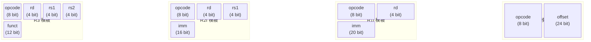

# Atomix 指令集规范 (ISA)

> 架构版本: v0.3 (新增原子指令 + Profile 语义矩阵)
> 最后更新: 2026-07-17
> 指令总数: **54 条**
> Opcode 空间: 256 (已用 54, 保留 202)
> 配套文档: 详见 01-总纲与哲学.md

---

## 1. 基本约定

### 1.1 指令宽度

**32 位定长**，所有指令一律 4 字节。不区分指令类型，取指/解码开销恒为 O(1)。

**32 位定长**，所有指令一律 4 字节。不区分指令类型，取指/解码开销恒为 O(1)。



| 字段 | 宽度 | 说明 |
|------|------|------|
| `opcode` | 8 位 | 指令码，最多 256 条 |
| `operand` | 24 位 | 操作数，解释方式由 opcode 独立决定 |

### 1.2 Opcode 空间分配

| 范围 | 类别 | 已分配 | 保留 |
|------|------|--------|------|
| `0x00–0x0F` | 系统/控制 | 3 | 13 |
| `0x10–0x1F` | 数据搬运 | 5 | 11 |
| `0x20–0x3F` | 算术运算 | 25 | 7 |
| `0x40–0x4F` | 比较/设置 | 6 | 10 |
| `0x50–0x5F` | 控制流 | 6 | 10 |
| `0x60–0x6F` | 并发 (任务管理) | 4 | 12 |
| `0x70–0x7F` | 系统调用 | 1 | 15 |
| `0x80–0x8F` | 内存操作 | 2 | 14 |
| `0x90–0xEF` | *保留扩展* | 0 | 96 |
| `0xF0–0xFF` | 原子/内存屏障 + 宿主/调试 | 2 | 14 |

当前已分配 **54 条**，保留 **202 条** 扩展空间。

### 1.3 操作数编码

解码器维护一张 256 条目的查找表，**每个 opcode 独立指定编码模板**，不按范围推断。

| 模板 | 编码 | 适用场景 |
|------|------|----------|
| **R3** | `[rd:4][rs1:4][rs2:4][funct:12]` | 三寄存器运算 + 功能码扩展 |
| **R2I** | `[rd:4][rs1:4][imm:16]` | 双寄存器 + 16 位立即数 |
| **R1I** | `[rd:4][imm:20]` | 单寄存器 + 20 位立即数 |
| **JI** | `[offset:24]` | 纯立即数/地址偏移 |

> R3 模板的 `funct` 字段可在未来通过一条 opcode 派生最多 4096 条子操作，节省主 opcode 空间。当前各指令直接使用独立 opcode。

**R3 (三寄存器 + funct)：** 见上方编码总图。

**R2I (双寄存器 + 16 位立即数)：** 见上方编码总图。

**R1I (单寄存器 + 20 位立即数)：** 见上方编码总图。

**JI (24 位地址/立即数)：** 见上方编码总图。

### 1.4 字节序

所有多字节字段按 **小端序 (Little-Endian)** 存储。

---

## 2. 寄存器模型

### 2.1 虚拟寄存器

Atomix VM 维护 **16 个 64 位虚拟寄存器**，编号 `R0–R15`。

- 虚拟寄存器不是物理 CPU 寄存器，由 VM 管理
- 不设全局 flags 寄存器：条件状态通过通用寄存器传递
- 类型信息由编译器静态确定，VM 运行时只做位操作

### 2.2 寄存器约定

| 寄存器 | 名称 | 用途 |
|--------|------|------|
| `R0` | `zero` | 硬编码为 0，写入无效 |
| `R1` | `sp` | 栈指针 |
| `R2` | `fp` | 帧指针 |
| `R3` | `ra` | 返回地址寄存器（CALL 指令写入） |
| `R4`–`R7` | `a0`–`a3` | 参数/返回值寄存器（函数调用 + ECALL + 任务参数传递） |
| `R8`–`R13` | `t0`–`t5` | 通用临时寄存器 |
| `R14` | `task_id` | 当前任务 ID（只读） |
| `R15` | `tmp` | 通用临时寄存器 |

---

## 3. 指令详表

### 3.1 系统/控制类 (0x00–0x0F)

| Opcode | 助记符 | 编码模板 | 操作 |
|--------|--------|----------|------|
| `0x00` | `NOP` | JI | 空操作 |
| `0x01` | `TRAP` | R1I | 触发软中断，imm 为中断号（0=HALT, 1=DEBUG） |
| `0x02` | `THROW` | R1I | 抛出异常。`rd` 为异常值。VM 查 `.exn` 段跳转 handler，未找到则栈展开 |

---

### 3.2 数据搬运类 (0x10–0x1F)

所有寄存器为 64 位。窄宽度访问（8/16/32 位）由编译器通过掩码组合实现。

| Opcode | 助记符 | 编码模板 | 操作 |
|--------|--------|----------|------|
| `0x10` | `MOV` | R3 | `rd ← rs1` (寄存器到寄存器) |
| `0x11` | `MOVI` | R2I | `rd ← imm` (加载 16 位立即数，零扩展) |
| `0x12` | `LCONST` | R1I | `rd ← imm` (加载 20 位立即数，零扩展) |
| `0x13` | `LOAD` | R2I | `rd ← u64[rs1 + imm]` (加载 64 位) |
| `0x14` | `STORE` | R2I | `u64[rs_addr + imm] ← rs_data` (存 64 位) |

> **STORE 编码约定：** 第一个寄存器字段（bits 27-24）为基址寄存器 `rs_addr`，第二个寄存器字段（bits 23-20）为数据源寄存器 `rs_data`。
>
> **64 位常量加载：** 编译器通过 `MOVI hi` + `SHL 44` + `MOVI lo` 组合加载完整 64 位值，或通过 `LOAD` 从 `.rodata` 常量区加载。

---

### 3.3 算术运算类 (0x20–0x3F)

| Opcode | 助记符 | 编码模板 | 操作 |
|--------|--------|----------|------|
| `0x20` | `ADD` | R3 | `rd ← rs1 + rs2` |
| `0x21` | `ADDI` | R2I | `rd ← rs1 + imm` (符号扩展) |
| `0x22` | `SUB` | R3 | `rd ← rs1 - rs2` |
| `0x23` | `MUL` | R3 | `rd ← rs1 * rs2` |
| `0x24` | `DIV` | R3 | `rd ← rs1 / rs2` (有符号) |
| `0x25` | `DIVU` | R3 | `rd ← rs1 / rs2` (无符号) |
| `0x26` | `REM` | R3 | `rd ← rs1 % rs2` |
| `0x27` | `AND` | R3 | `rd ← rs1 & rs2` |
| `0x28` | `OR` | R3 | `rd ← rs1 \| rs2` |
| `0x29` | `XOR` | R3 | `rd ← rs1 ^ rs2` |
| `0x2A` | `NOT` | R1I | `rd ← ~rd`（一元运算，源与目标为同一寄存器） |
| `0x2B` | `NEG` | R1I | `rd ← -rd`（一元运算，源与目标为同一寄存器） |
| `0x2C` | `SHL` | R3 | `rd ← rs1 << rs2` |
| `0x2D` | `SHR` | R3 | `rd ← rs1 >> rs2` (算术右移) |
| `0x2E` | `SHRU` | R3 | `rd ← rs1 >> rs2` (逻辑右移) |

> `SUBI`、`MULI` 等立即数变体未提供。编译器使用 `ADDI` + `SUB`/`MUL` 组合或 `MOVI imm` + `SUB`/`MUL` 替代。
>
> **NOT/NEG 使用 R1I 模板：** 一元运算仅涉及单个操作数，无需三寄存器模板。编译器在 IR 生成时将 `rd=NOT(rs)` 映射为 `MOV rd, rs` + `NOT rd`。

### 3.3.1 浮点运算 (0x2F–0x38)

Atomix 的浮点采用 **IEEE 754 双精度（64 位）**。浮点指令复用同一套 64 位通用寄存器——opcode 决定将寄存器内容解释为整数还是浮点，VM 不做运行时类型标记。

> **类型安全由编译器保障。** 将整数寄存器传给浮点指令（或反之）的行为未定义——编译器在语义分析阶段杜绝此类错误，VM 不做运行时检查。

| Opcode | 助记符 | 编码模板 | 操作 |
|--------|--------|----------|------|
| `0x2F` | `FADD` | R3 | `rd ← rs1 + rs2` (IEEE 754 double) |
| `0x30` | `FSUB` | R3 | `rd ← rs1 - rs2` |
| `0x31` | `FMUL` | R3 | `rd ← rs1 * rs2` |
| `0x32` | `FDIV` | R3 | `rd ← rs1 / rs2` |
| `0x33` | `FEQ` | R3 | `rd ← (rs1 == rs2) ? 1 : 0` |
| `0x34` | `FNE` | R3 | `rd ← (rs1 != rs2) ? 1 : 0` |
| `0x35` | `FLT` | R3 | `rd ← (rs1 < rs2) ? 1 : 0` |
| `0x36` | `FLE` | R3 | `rd ← (rs1 <= rs2) ? 1 : 0` |
| `0x37` | `ITOF` | R1I | `rd ← float(rd)`（整数→浮点转换） |
| `0x38` | `FTOI` | R1I | `rd ← int(rd)`（浮点→整数，向零截断） |

**浮点比较** 遵循 IEEE 754 语义：
- 任意操作数为 `NaN` 时，`FEQ`/`FNE`/`FLT`/`FLE` 均返回 `false`（`NaN` 与任何值无序）
- `FGT`/`FGE` 可由 `FLT`/`FLE` 交换操作数得到，不设独立指令

**类型转换**（`ITOF`/`FTOI`）为寄存器内转换——源与目标为同一寄存器：
- `ITOF rd`：将 `rd` 的 64 位有符号整数转为 IEEE 754 双精度浮点，写回 `rd`
- `FTOI rd`：将 `rd` 的 IEEE 754 双精度浮点转为 64 位有符号整数（向零截断），写回 `rd`

> **无浮点立即数。** 浮点常量由编译器存入 `.rodata` 段，通过 `LOAD` 指令加载到寄存器。
>
> **无 FMA（Fused Multiply-Add）。** 融合乘加为可选扩展，当前不提供。编译器需要 `a * b + c` 时生成 `FMUL` + `FADD` 序列。
>
> **舍入模式：** 默认就近舍入（Round-to-Nearest, Ties-to-Even），遵循 IEEE 754 默认方向。不提供动态舍入模式切换。

---

### 3.4 比较/设置类 (0x40–0x4F)

比较结果以 **布尔值（0 或 1）** 写入目标寄存器。

| Opcode | 助记符 | 编码模板 | 操作 |
|--------|--------|----------|------|
| `0x40` | `SEQ` | R3 | `rd ← (rs1 == rs2) ? 1 : 0` |
| `0x41` | `SNE` | R3 | `rd ← (rs1 != rs2) ? 1 : 0` |
| `0x42` | `SLT` | R3 | `rd ← (rs1 < rs2) ? 1 : 0` (有符号) |
| `0x43` | `SLE` | R3 | `rd ← (rs1 <= rs2) ? 1 : 0` (有符号) |
| `0x44` | `SGT` | R3 | `rd ← (rs1 > rs2) ? 1 : 0` (有符号) |
| `0x45` | `SGE` | R3 | `rd ← (rs1 >= rs2) ? 1 : 0` (有符号) |

> 与立即数比较（如 `rs1 < imm`）由编译器通过 `MOVI imm` + `SLT` 组合实现。
>
> 无符号比较（`SLTU`/`SGTU`）可由有符号版本通过位变换得到。

---

### 3.5 控制流类 (0x50–0x5F)

跳转目标均为 **相对偏移（以指令数计）**，解码器自动 ×4 得到字节偏移。

| Opcode | 助记符 | 编码模板 | 操作 |
|--------|--------|----------|------|
| `0x50` | `JMP` | JI | `pc ← pc + offset` (无条件跳转) |
| `0x51` | `JZ` | R1I | 若 `rd == 0`，则 `pc ← pc + offset` |
| `0x52` | `JNZ` | R1I | 若 `rd != 0`，则 `pc ← pc + offset` |
| `0x53` | `CALL` | JI | `R3 ← pc + 1; pc ← pc + offset` |
| | | | 返回地址隐式写入 R3(ra)，编译器约定使用 R3 做返回。|
| `0x54` | `JMPR` | R1I | `pc ← rd` (寄存器绝对跳转，用于函数返回) |
| `0x55` | `JALR` | R2I | `rd ← pc + 1; pc ← rs1 + imm` (间接调用) |

**用法模式：**
- 函数调用：`CALL offset` → 返回地址自动存 R3，跳转到目标
- 函数返回：`JMPR ra` → pc ← R3（零栈开销，叶子函数无需压栈）
- 条件分支：先用 `SLT Rd, Rs1, Rs2` 比较，再用 `JNZ Rd, offset` 分支
- 间接调用：`JALR Rd, Rs, imm`

> **偏移范围：** `CALL`、`JMP` 使用 24 位有符号偏移（JI 模板），范围 ±8,388,608 条指令（±32 MB）。`JZ`、`JNZ` 使用 R1I 模板（20 位偏移），范围 ±524,288 条指令（±2 MB），适用短条件分支。长距离条件分支由编译器通过 `JZ` 反向跳转 + `JMP` 组合实现。

---

### 3.6 并发/任务管理类 (0x60–0x6F)

Atomix 的任务模型：**任务定义 + 依赖图 + 额度批准**。

- 每个任务是独立执行单元，拥有自己的寄存器上下文
- 一个任务可以派生其他已定义的任务，形成任务树/依赖图
- 不设硬性嵌套层数上限，靠额度机制自然约束
- 依赖图由编译器静态分析得出，调度器按最深层优先执行
- 所有 OS 资源访问走 `ECALL`，并发指令只做任务编排

**任务定义表（不占 opcode 槽位）：**

任务元信息在 IR 的 `.task` 段中预定义。每个条目：
- `task_id`(2B)：编译器分配的 16 位唯一 ID
- `entry_offset`(4B)：任务代码在 `.text` 段的指令偏移
- `dep_count`(2B)：直接依赖的子任务数
- `dep_list`(变长)：依赖的子任务 ID 列表

#### 指令列表

| Opcode | 助记符 | 编码模板 | 操作 |
|--------|--------|----------|------|
| `0x60` | `TASK_FORK` | R1I | `rd ← fork(imm)` |
| | | | 按任务定义 ID `imm` 派生一个子任务，句柄存 `rd`（64 位不透明值）。 |
| | | | **参数传递：当前任务的 R4–R7 自动复制到子任务的 R4–R7。** |
| | | | 非阻塞：立即返回，子任务进入调度队列。 |
| `0x61` | `TASK_JOIN` | R2I | `rd ← join(rs1)` |
| | | | 阻塞直到 `rs1` 所指向的子任务完成，原始返回值写入 `rd`。 |
| `0x62` | `TASK_RET` | R1I | `return(rd)` |
| | | | 结束当前任务，将 `rd` 的值作为本任务的原始返回值。 |
| `0x63` | `TASK_SELF` | R1I | `rd ← self()` |
| | | | 将当前任务自身的句柄写入 `rd`。 |

#### IR 执行示例

```
TASK_FORK  R6, 1          ; 派生任务 B（ID=1），句柄→R6
TASK_FORK  R7, 2          ; 派生任务 C（ID=2），句柄→R7
TASK_FORK  R8, 3          ; 派生任务 D（ID=3），句柄→R8

TASK_JOIN  R10, R6        ; 等 B 完成，原始结果→R10
TASK_JOIN  R11, R7        ; 等 C 完成，原始结果→R11
TASK_JOIN  R12, R8        ; 等 D 完成，原始结果→R12

; R10, R11, R12 中是三个原始返回值
; 聚合/组合 → 上层代码自行决定
```

#### 依赖图调度

```
编译时：扫描所有 TASK_FORK → 构建有向依赖图 → 拓扑排序 → 填充 .task 段

运行时（调度器）：
  1. 读取 .task 段，获得依赖图
  2. 按层级从深到浅分批：
     最深（无依赖）→ 首批
     ...             逐层向上
     根任务          → 最后
  3. 每层按可用额度分批执行
  4. 每层全部完成，结果向上传递
```

---

### 3.7 系统调用类 (0x70–0x7F)

宿主 OS 资源访问（网络、文件、内存分配等）通过统一网关完成。

| Opcode | 助记符 | 编码模板 | 操作 |
|--------|--------|----------|------|
| `0x70` | `ECALL` | R1I | 系统调用。`imm` 为调用号，参数在 R4–R7，返回值在 R4。 |

**ECALL 调用约定：**

| 字段 | 作用 |
|------|------|
| `imm` | 系统调用号（如 0=alloc, 1=free, 2=tcp_connect, 3=fs_open, …） |
| `R4` | 参数 1 / 返回值 |
| `R5` | 参数 2 |
| `R6` | 参数 3 |
| `R7` | 参数 4 |

VM 遇到 `ECALL` 时：
1. 将 `imm`（调用号）和 R4–R7 传递给宿主 OS 的 syscall 转发层
2. 若操作阻塞（如 TCP_RECV），VM 自动挂起当前任务、释放并发额度、切换上下文
3. 操作就绪后恢复任务，R4 存放返回值

**系统调用号表**（由宿主层定义，独立于 ISA 规范）：

| 调用号 | 功能 | 参数 |
|--------|------|------|
| 0 | `alloc(size)` | R4=size → R4=addr |
| 1 | `free(addr)` | R4=addr |
| 2 | `tcp_connect(ip, port)` | R4=ip, R5=port → R4=fd |
| 3 | `tcp_send(fd, data, len)` | R4=fd, R5=data, R6=len → R4=sent |
| 4 | `tcp_recv(fd, buf, len)` | R4=fd, R5=buf, R6=len → R4=received |
| 5 | `tcp_listen(port)` | R4=port → R4=fd |
| 6 | `tcp_accept(fd)` | R4=fd → R4=client_fd |
| 7 | `tcp_close(fd)` | R4=fd |
| 8 | `dns_lookup(hostname)` | R4=hostname_ptr → R4=ip |
| 9 | `fs_open(path, flags)` | R4=path, R5=flags → R4=fd |
| 10 | `fs_read(fd, buf, len)` | R4=fd, R5=buf, R6=len → R4=read |
| 11 | `fs_write(fd, data, len)` | R4=fd, R5=data, R6=len → R4=written |
| 12 | `fs_close(fd)` | R4=fd |
| 13 | `fs_seek(fd, offset)` | R4=fd, R5=offset → R4=pos |
| 14 | `fs_stat(path)` | R4=path → R4=stat_ptr |
| 15+ | *(保留扩展)* | — |

---

### 3.8 内存操作类 (0x80–0x8F)

纯 CPU 级的内存操作，不涉及宿主 OS。堆内存分配通过 `ECALL` 完成。

| Opcode | 助记符 | 编码模板 | 操作 |
|--------|--------|----------|------|
| `0x80` | `MCPY` | R3 | `memcpy(dst=rd, src=rs1, len=rs2)` |
| `0x81` | `MSET` | R3 | `memset(dst=rd, val=rs1, len=rs2)` |

> **MCPY/MSET 寄存器约定：** `rd` 承载目标地址（dst），`rs1` 承载源地址/填充值，`rs2` 承载长度。此顺序与 C 标准库 `memcpy(dst, src, len)` 参数顺序一致——`rd` 对应第一个参数 `dst`。
>
> 所有内存操作在任务沙箱内进行，不可访问沙箱之外的空间。

---

### 3.9 原子与内存屏障类 (0xF0–0xF3)

以下指令为 AOT 多核执行提供硬件级内存排序和原子性保证。在 VM 单线程 dispatch 模式下，这些指令为 NOP（VM 天然 FIFO 顺序且无并发数据竞争）；在 AOT 模式下映射到目标平台的对应原生指令。

| Opcode | 助记符 | 编码模板 | 操作 |
|--------|--------|----------|------|
| `0xF0` | `FENCE` | R1I | 内存屏障。`imm` 编码屏障模式（见下）。`rd` 保留，必须为 0。 |
| `0xF1` | `CAS` | R3 | 原子比较并交换。`rd`=期望值(入)/旧值(出)，`rs1`=地址，`rs2`=新值。`funct[0]` 编码宽度：0=64位，1=32位。`funct[11:1]` 保留。 |

**FENCE 屏障模式（imm 字段）：**

| imm | 名称 | 语义 |
|-----|------|------|
| `0` | `FULL` | 全屏障。之前所有 LOAD/STORE 在之后任何 LOAD/STORE 之前全局可见。映射为 x86 `mfence` / ARM `dmb sy` |
| `1` | `ACQUIRE` | 获取屏障。之后 LOAD/STORE 不会被重排到本指令之前。用于锁的 acquire 语义。映射为 ARM `dmb ishld`，x86 上为 NOP（x86 LOAD 自带 acquire 语义） |
| `2` | `RELEASE` | 释放屏障。之前 LOAD/STORE 不会被重排到本指令之后。用于锁的 release 语义。映射为 ARM `dmb ish`，x86 上为 NOP（x86 STORE 自带 release 语义） |
| `3` | `IO` | I/O 屏障。强于 FULL——确保对 MMIO 区域的写入在屏障后全局可见。仅 AOT embedded profile 使用 |

**CAS 操作语义（伪代码）：**

```
atomically {
    old = u64[rs1];            // 或 u32，取决于 funct[0]
    if old == rd:
        u64[rs1] = rs2;        // 原子写入新值
    rd = old;                  // 始终返回旧值
}
// 调用方通过比较 rd（旧值）与原始期望值判断成功:
//   rd == expected → CAS 成功，新值已写入
//   rd != expected → CAS 失败，rd 中是内存位置的当前值
```

**CAS 典型用法（自旋锁示例）：**

```
; 获取锁: 期望 lock==0, 新值=1
MOV   R8, 0           ; expected = 0 (unlocked)
MOV   R9, 1           ; new_value = 1 (locked)
.spin:
CAS   R8, [lock_addr], R9   ; atomically: if [lock]==0: [lock]←1; R8←old
JNZ   R8, .spin       ; if old != 0, someone else holds it, retry

; 释放锁: 直接写入 0
STORE [lock_addr], 0
FENCE RELEASE          ; 确保锁释放对后续 acquire 可见
```

> **funct[0]=1（32 位 CAS）用于节省内存带宽。** 在嵌入式 profile 下，32 位原子操作足以覆盖大多数计数器/指针的并发需求，同时避免 64 位 CAS 在某些 MCU（如 Cortex-M3）上不可用的问题。


---

## 4. IR 二进制格式

### 4.1 总体结构

```
偏移      大小      字段
─────────────────────────────────────────────────
0x00       4        Magic: "ATMX" (0x584D5441)
0x04       2        Version: 0x0001 (v0.2)
0x06       2        Flags
                    bit 0: 调试模式
                    bit 1: 沙箱启用
                    bit 2-15: 保留
0x08       4        Entry: 根任务入口指令偏移
0x0C       4        TotalInstrs: .text 段总指令数
0x10       2        SectionCount: 段数量
0x12       2        Padding: 对齐填充 (0x0000)
─────────────────────────────────────────────────
                   Header 总大小: 0x14 (20) 字节
─────────────────────────────────────────────────

紧跟 Header 的是 Section Table，每个条目 12 字节：
偏移      大小      字段
─────────────────────────────────────────────────
0x00       2        SectionType
0x02       2        SectionFlags
0x04       4        Offset: 从文件头到段数据的偏移
0x08       4        Length: 段数据长度 (字节)
─────────────────────────────────────────────────
                   Section Table 总大小 = 12 × SectionCount
─────────────────────────────────────────────────

段类型 (SectionType):
0x0001    .text     指令序列（4 字节对齐）
0x0002    .rodata   只读数据区（8 字节对齐）
0x0003    .task     任务定义表
0x0004    .debug    调试信息（可选，开发模式用）
0x0005    .exn      异常表（TRY 块编译产物）
0x0006    .zones    区域生命周期表（加载/卸载编排）
```

### 4.2 .text 段

连续排列的 4 字节指令块，指令数由 Header.TotalInstrs 记录。

```
偏移 = .text 段起始地址 + (指令偏移 × 4)

每个指令:
  byte[0] = opcode
  byte[1] = operand[7:0]
  byte[2] = operand[15:8]
  byte[3] = operand[23:16]
```

### 4.3 .rodata 段

存放字符串、大常量等只读数据。起始地址 8 字节对齐。

格式：裸字节序列，无内部结构。编译器通过相对偏移引用。

### 4.4 .task 段

任务定义表，每个任务一个变长条目：

```
偏移      大小      字段
─────────────────────────────────────────────────
0x00       2        task_id (16 位唯一 ID)
0x02       4        entry_offset (在 .text 段的指令偏移)
0x06       2        dep_count (直接依赖的子任务数)
0x08       2 × N    dep_list (依赖的子 task_id 列表)
─────────────────────────────────────────────────
                   每个条目大小 = 8 + 2 × dep_count
─────────────────────────────────────────────────
```

条目按 task_id 升序排列。第 0 号条目为根任务。

### 4.5 .debug 段（可选）

格式由工具链自由定义，运行时加载器可忽略此段。

### 4.6 .exn 段（异常表）

异常表记录 TRY 块编译后生成的保护区域。每个条目 16 字节，等长：

```
偏移      大小      字段
─────────────────────────────────────────────────
0x00       4        start_pc: 保护区域起始指令偏移
0x04       4        end_pc: 保护区域结束指令偏移（不含）
0x08       4        handler_pc: 异常处理器入口指令偏移
0x0C       2        filter: 过滤条件
                      0 = 捕获全部异常
                      1 = 按 ISERROR 类型匹配
                      2 = 按 ISTIMEOUT 匹配
0x0E       2        padding: 对齐填充 (0x0000)
─────────────────────────────────────────────────
                   每个条目 16 字节
```

**运行时行为：**

当 VM 执行 `THROW rd` 时：
1. 以当前 `pc` 为键查 `.exn` 表，找满足 `start_pc ≤ pc < end_pc` 的条目
2. **找到**：将异常值存入 R4，跳转到 `handler_pc`
3. **未找到**：从当前栈帧恢复调用者的 `pc`（通过 RA），重复步骤 1
4. 到达根任务仍无 handler：任务以 ERROR 状态终止

**Handler 的职责（由编译器生成）：**
- 检查异常条件（ISERROR 类型、ISTIMEOUT 值等）
- 条件匹配 → 执行 TRY 块体 → 恢复正常流
- 条件不匹配 → 重新 `THROW`（继续栈展开）

**链式 TRY 的编译：** 多个共享同一 handler 的 `TRY` 调用生成多个 `.exn` 条目，全部指向同一个 `handler_pc`。

### 4.7 .zones 段（区域生命周期表）

`.zones` 段是编译器写给执行器的**加载/卸载剧本**。它把 `.text` 段中的指令按来源区域分区，并标注每个分区的生命周期。

每条目 16 字节，等长：

```
偏移      大小      字段
─────────────────────────────────────────────────
0x00       2        zone_id: 区域标识
                      0 = 区外 (USE/FROM/type/enum/EXCEPTION/元信息)
                      1 = TOOLS
                      2 = INPUT
                      3 = WORKS
                      4 = TASK
                      5 = OUT
                      6 = TEST
0x02       1        lifecycle: 生命周期策略
                      0 = 常驻 (persistent)      — 最先加载，最后卸载
                      1 = 即用即卸 (exec_unload)  — 加载→执行→立即卸载
                      2 = 懒加载 (lazy)          — 触发时才加载
0x03       1        flags: 附加标记
                      bit 0 = 需修剪 (prune)     — 执行前做依赖分析，清理不可达代码
                      bit 1-7 = 保留
0x04       4        text_start: 本区域在 .text 段中的起始指令偏移
0x08       4        text_end: 本区域在 .text 段中的结束指令偏移（不含）
─────────────────────────────────────────────────
```

**执行器行为：**

执行器启动后，按 `.zones` 条目顺序依次处理：

```
常驻型 (persistent):
  → 启动时加载对应 .text 区间
  → 始终保持，直到所有其他 zone 处理完毕后卸载

即用即卸 (exec_unload):
  → 加载对应 .text 区间
  → 从 text_start 执行到 text_end（或遇到 RETURN/THROW）
  → 立即卸载

懒加载 (lazy):
  → 启动时不加载
  → 等前一阶段发信号后才加载
  → 执行完毕后立即卸载
```

**修剪 (prune) 标记：**

当 TASK zone 标记了 `prune` 时，执行器在加载 TASK 之前做一次闭包分析：

1. 从 TASK 的 `text_start` 出发，遍历所有 CALL 和 TASK_FORK 目标
2. 将 WORKS zone 中**未被引用**的模板和 TOOLS 中**未被引用**的函数标记为不可达
3. 执行 TASK 时跳过不可达代码（或直接不加载对应区间）

> **修剪由编译器预计算。** `.zones` 段中的 `prune` 标记实际对应编译器在链接阶段已完成的闭包分析结果。执行器收到的是修剪后的最小闭包——`prune` 标记更多是告诉执行器"这个 zone 的代码已经过闭包分析，只包含可达代码"。

**典型 .zones 表：**

| zone_id | lifecycle | flags | 含义 |
|---------|-----------|-------|------|
| 0 (区外) | persistent | 0 | 类型/异常/导入路径，全程常驻 |
| 1 (TOOLS) | persistent | 0 | 函数签名表，全程常驻 |
| 2 (INPUT) | exec_unload | 0 | 加载→拉数据→产出常量→卸 |
| 3 (WORKS) | persistent | prune | 全量注册，等 TASK 修剪 |
| 4 (TASK) | exec_unload | prune | 修剪后执行，产出 GOOUT→卸 |
| 5 (OUT) | lazy | 0 | TASK 完成后才加载→交付→卸 |

---

## 5. 设计理由 / 边界说明

### 5.1 为什么总共只有 54 条指令？

- **CPU 级与 syscall 级分离：** 网络/文件/内存分配等涉及宿主 OS 的操作统一走 `ECALL`，不由 VM 直接实现。移除 15 条 OS 相关指令。
- **移除宽度糖指令：** `LOAD8/16/32`、`STORE8/16/32` 由编译器用掩码组合实现，保留 `LOAD`/`STORE` 各 1 条。移除 6 条。
- **移除立即数/无符号变体糖：** `SUBI`、`MULI`、`SEQI`/`SNEI`/`SLTI`/`SGTI`、`SLTU`/`SGTU` 可由编译器用 `MOVI` + 基础指令组合。移除 8 条。
- **无冗余 opcode：** 移除 `HALT`/`DEBUG`（合入 `TRAP`）、`LUI`（合入 `MOVI`+`SHL` 组合）。移除 3 条。
- **浮点运算：** 新增 10 条浮点指令（FADD/FSUB/FMUL/FDIV + 4 条比较 + 2 条转换），覆盖 IEEE 754 双精度的基本运算需求。不设 FMA、不设浮点立即数、不设动态舍入模式切换。

### 5.2 为什么浮点复用整数寄存器？

Atomix 不设独立的浮点寄存器文件。16 个 64 位通用寄存器既承载整数也承载浮点——由 opcode 决定解释方式。

- **寄存器文件减半：** 独立 FP 寄存器文件需要额外 16 个 64 位寄存器，上下文切换开销翻倍。复用后上下文切换仍为 16 次 MOV
- **编译器已有类型信息：** 语义分析阶段已确定每个寄存器在每条指令处的类型，VM 不需要运行时 tag
- **与轻量原则一致：** 独立 FP 寄存器文件是 RISC 的惯例但不是铁律。在 41 条基础指令上只增加 10 条新 opcode 即可完成浮点支持，不增加 VM 核心复杂度

### 5.3 为什么 CALL 采用 JAL 风格？

- 叶子函数零栈开销（返回地址留在寄存器即可）
- 编译器自行决定何时溢出到栈，非每条 CALL 强制访存
- 尾调用优化：直接 `JMPR Rs` 即可

### 5.4 为什么废止全局 flags？

- 消除 CMP→Jcc 数据依赖，编译器可自由重排指令
- 比较结果写入通用寄存器，可暂存多个值后统一判断
- 简化 VM 实现

### 5.5 为什么 Load/Store 只保留 64 位版本？

- 所有寄存器宽度为 64 位，窄访问等价于加载 + 掩码
- 减少 opcode 占用（6→2）
- 编译器可针对目标平台的特性优化掩码生成

### 5.6 为什么 ECALL 是 CPU 级指令而非另一个段？

- 任务执行流程中可能在任何位置发起系统调用
- 阻塞型 ECALL（如 `tcp_recv`）触发的任务挂起/恢复机制与 VM 的调度器深度耦合
- 作为指令实现可以统一处理"阻塞→挂起→恢复"的完整生命周期

### 5.7 为什么指令偏移以指令数计而非字节数？

- 定长指令下两者等价（指令数 × 4 = 字节数）
- 解码器少一次乘法操作（节省一个 ALU 操作）
- 对调试器友好（断点位置以指令号表示更直观）

---

## 6. Profile 语义矩阵

以下 7 条指令的行为取决于执行 profile。未列出的 47 条指令在所有 profile 下语义完全一致。

| 指令 | runner (默认) | embedded | bare |
|------|-------------|----------|------|
| `ECALL` | 回调 Runner syscall 转发层；阻塞型调用（tcp_recv/fs_read 等）触发任务挂起→调度器切换上下文。**不能省略。** | 直连硬件抽象层（HAL）。ECALL alloc→RTOS malloc，ECALL tcp_connect→lwIP socket。阻塞型调用通过 RTOS 信号量挂起当前 task。**不能省略。** | **illegal。** 无宿主可回调，执行即 THROW。 |
| `TASK_FORK` | 回调 Runner 调度器创建子任务，纳入任务池管理。 | 创建 RTOS task（`xTaskCreate`），任务数受 RTOS `configMAX_PRIORITIES` 限制。 | **illegal。** |
| `TASK_JOIN` | 回调 Runner 调度器阻塞等待子任务完成。 | RTOS `xTaskNotifyWait` 或信号量等待子任务完成通知。 | **illegal。** |
| `TASK_RET` | 回调 Runner 调度器标记任务完成，回收槽位。返回值通过调度器传递给 join 方。 | RTOS `vTaskDelete(NULL)` 自删除；返回值通过队列或通知传递给 join 方。 | **illegal。** |
| `TASK_SELF` | 回调 Runner 获取当前任务句柄。 | RTOS `xTaskGetCurrentTaskHandle()`。 | **illegal。** |
| `TRAP` | `imm=0`(HALT) → 回调 Runner 优雅停止任务。`imm=1`(DEBUG) → 回调调试器（若本地 debugger 已连接则进入交互；否则 NOP）。 | `imm=0` → 进入低功耗等待中断（`wfi`/`wfe`）。`imm=1` → 触发 SWD 断点（`bkpt`），若调试器未连接则 NOP。 | `imm=0` → **死循环**（无调度器可回调）。`imm=1` → **忽略**（无调试器）。 |
| `THROW` | 查 `.exn` 表跳转 handler。未找到 → 栈展开（逐帧查表）。到达根任务仍无 handler → 任务以 ERROR 终止，回调 Runner。 | 查 `.exn` 表跳转 handler。未找到 → 栈展开。到达根任务仍无 handler → 任务终止，RTOS 释放资源。 | 查 `.exn` 表跳转 handler。未找到 → 栈展开。到达根任务仍无 handler → **死循环**（无上层可报告错误）。 |
| `FENCE` | 在 VM 模式下为 **NOP**（VM 单线程 dispatch，天然 FIFO 顺序）。在 AOT 模式下映射到 `mfence`(x86) / `dmb`(ARM)。 | 映射到 `dmb`(ARM) / `fence`(RISC-V)。`FENCE IO` 用于 MMIO 区域同步。 | 同 embedded。 |
| `CAS` | 在 VM 模式下为 **NOP**（VM 单线程，无并发竞争）。在 AOT 模式下映射到 `cmpxchg`(x86) / `cas`(ARM64)。 | 映射到 `ldrex/strex`(ARM) 或 `lr/sc`(RISC-V)。32 位 CAS（`funct[0]=1`）在仅支持 32 位原子的 MCU 上使用。 | 同 embedded。 |

### 6.1 Profile 选择机制

Profile 在 `.atxe` header 的 `Flags` 字段声明（bit 3-4）：

| Flags[4:3] | Profile | 说明 |
|-----------|---------|------|
| `00` | `runner` | 默认。必须运行在 atomix-runner 中。 |
| `01` | `embedded` | 需要 RTOS 抽象层。 |
| `10` | `bare` | 纯计算闭包。禁止 ECALL/TASK_*/TRAP(0)。 |
| `11` | *保留* | — |

Runner 加载 `.atxe` 时校验：若 header 声明 `embedded` 但运行在 `runner` 中 → 拒绝加载（错误 `412 VERSION_MISMATCH`：profile 不兼容）。反之亦然。

---

## 7. 附录：完整编码速查表

| Opcode | 助记符 | 模板 | 操作摘要 |
|--------|--------|------|----------|
| `0x00` | `NOP` | JI | 空操作 |
| `0x01` | `TRAP` | R1I | 软中断 (imm=0:HALT, 1:DEBUG) |
| `0x02` | `THROW` | R1I | 抛异常，rd=异常值，查 .exn 表跳转 |
| `0x10` | `MOV` | R3 | `rd ← rs1` |
| `0x11` | `MOVI` | R2I | `rd ← imm` (16位) |
| `0x12` | `LCONST` | R1I | `rd ← imm` (20位) |
| `0x13` | `LOAD` | R2I | `rd ← u64[rs1 + imm]` |
| `0x14` | `STORE` | R2I | `u64[rs_addr + imm] ← rs_data` |
| `0x20` | `ADD` | R3 | `rd ← rs1 + rs2` |
| `0x21` | `ADDI` | R2I | `rd ← rs1 + imm` |
| `0x22` | `SUB` | R3 | `rd ← rs1 - rs2` |
| `0x23` | `MUL` | R3 | `rd ← rs1 * rs2` |
| `0x24` | `DIV` | R3 | `rd ← rs1 / rs2` (有符号) |
| `0x25` | `DIVU` | R3 | `rd ← rs1 / rs2` (无符号) |
| `0x26` | `REM` | R3 | `rd ← rs1 % rs2` |
| `0x27` | `AND` | R3 | `rd ← rs1 & rs2` |
| `0x28` | `OR` | R3 | `rd ← rs1 \| rs2` |
| `0x29` | `XOR` | R3 | `rd ← rs1 ^ rs2` |
| `0x2A` | `NOT` | R1I | `rd ← ~rd` |
| `0x2B` | `NEG` | R1I | `rd ← -rd` |
| `0x2C` | `SHL` | R3 | `rd ← rs1 << rs2` |
| `0x2D` | `SHR` | R3 | `rd ← rs1 >> rs2` (算术) |
| `0x2E` | `SHRU` | R3 | `rd ← rs1 >> rs2` (逻辑) |
| `0x2F` | `FADD` | R3 | `rd ← rs1 + rs2` (IEEE 754 double) |
| `0x30` | `FSUB` | R3 | `rd ← rs1 - rs2` (IEEE 754 double) |
| `0x31` | `FMUL` | R3 | `rd ← rs1 * rs2` (IEEE 754 double) |
| `0x32` | `FDIV` | R3 | `rd ← rs1 / rs2` (IEEE 754 double) |
| `0x33` | `FEQ` | R3 | `rd ← (rs1 == rs2)` (浮点) |
| `0x34` | `FNE` | R3 | `rd ← (rs1 != rs2)` (浮点) |
| `0x35` | `FLT` | R3 | `rd ← (rs1 < rs2)` (浮点) |
| `0x36` | `FLE` | R3 | `rd ← (rs1 <= rs2)` (浮点) |
| `0x37` | `ITOF` | R1I | `rd ← float(rd)` (int→float) |
| `0x38` | `FTOI` | R1I | `rd ← int(rd)` (float→int) |
| `0x40` | `SEQ` | R3 | `rd ← (rs1 == rs2)` |
| `0x41` | `SNE` | R3 | `rd ← (rs1 != rs2)` |
| `0x42` | `SLT` | R3 | `rd ← (rs1 < rs2)` (有符号) |
| `0x43` | `SLE` | R3 | `rd ← (rs1 <= rs2)` (有符号) |
| `0x44` | `SGT` | R3 | `rd ← (rs1 > rs2)` (有符号) |
| `0x45` | `SGE` | R3 | `rd ← (rs1 >= rs2)` (有符号) |
| `0x50` | `JMP` | JI | `pc ← pc + offset` |
| `0x51` | `JZ` | R1I | 若 `rd==0` 则跳转 |
| `0x52` | `JNZ` | R1I | 若 `rd!=0` 则跳转 |
| `0x53` | `CALL` | JI | `R3 ← pc+1; pc ← pc+offset` |
| `0x54` | `JMPR` | R1I | `pc ← rd` |
| `0x55` | `JALR` | R2I | `rd ← pc+1; pc ← rs1+imm` |
| `0x60` | `TASK_FORK` | R1I | 派生子任务 `imm`，句柄→rd |
| `0x61` | `TASK_JOIN` | R2I | `rd ← join(rs1)` |
| `0x62` | `TASK_RET` | R1I | 当前任务结束，返回 `rd` |
| `0x63` | `TASK_SELF` | R1I | `rd ← self()` |
| `0x70` | `ECALL` | R1I | 系统调用 `imm`，参数 R4-R7 |
| `0x80` | `MCPY` | R3 | `memcpy(dst=rd, src=rs1, len=rs2)` |
| `0x81` | `MSET` | R3 | `memset(dst=rd, val=rs1, len=rs2)` |
| `0xF0` | `FENCE` | R1I | 内存屏障。imm=0:FULL, 1:ACQUIRE, 2:RELEASE, 3:IO |
| `0xF1` | `CAS` | R3 | 原子 compare-and-swap。rd=expected/old, rs1=addr, rs2=new |
