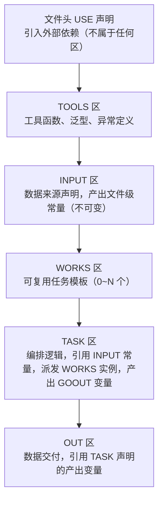
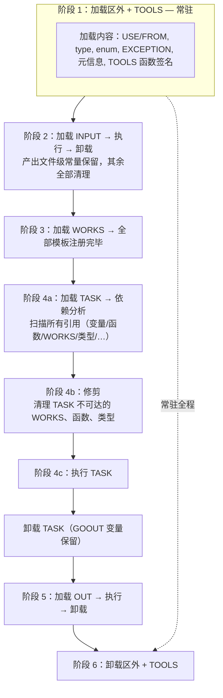
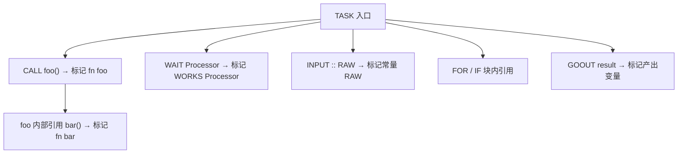

# Atomix 编译行为

> 架构版本: v0.1 (设计阶段)
> 最后更新: 2026-07-15

---

## 1. 五区结构

Atomix 源码在逻辑上由五个基础区域构成，外加文件头 USE 声明：



**各区约束：**

| 区/声明 | 数量 | 说明 |
|---------|------|------|
| `USE`（文件头） | 任意 | 不属于任何区 |
| `TOOLS` | 有且仅有一个 | 工具函数、类型定义 |
| `INPUT` | 有且仅有一个 | 数据来源 |
| `WORKS` | 任意（0~N） | 可复用任务模板 |
| `TASK` | 有且仅有一个 | 编排核心 |
| `OUT` | 有且仅有一个 | 数据交付 |

### 1.1 数据流向

数据在各区之间单向流动，不存在反向引用：


- **TASK 区**可以引用 INPUT 区定义的常量（通过 `INPUT : <常量名>`）
- **OUT 区**可以引用 TASK 区中 `GOOUT` 声明的产出变量
- **TASK 区**可通过 `WAIT` 派发 WORKS 实例
- **所有区**均可引用 TOOLS 区定义的函数、泛型和异常
- 反向引用不存在——TASK 不能引用 OUT，INPUT 不能引用 TASK，TASK 不能引用 WORKS 以外的区

### 1.2 为什么 `GOOUT` 写在 TASK 区？

`GOOUT` 出现在 TASK 区而不是 OUT 区，是因为职责边界不同：

| 区 | 负责 | 不负责 |
|----|------|--------|
| TASK | 计算、编排、决定"产出什么" | 不关心产出怎么交付 |
| OUT | 将产出发送到目标地址 | 不关心产出是怎么算出来的 |

`GOOUT batch_data : list` 的意思是"我 TASK 算完了，声明 `batch_data` 这个变量是对外可见的产出"。这个声明是**计算的结果**，所以它属于 TASK。

OUT 区只做一件事：引用这些已声明的变量，决定怎么把它们送出去：

```
// TASK 区：声明产出
CALL : process(INPUT : RAW) => GOOUT result

// OUT 区：决定交付方式
result => HTTP : "https://api.com/upload" (method=POST)
result => JSON : "/tmp/backup.json"
```

---

## 2. 编译期重排

编译器在编译期间会对源码进行**五区重排**，不论用户在文件中以什么顺序书写，编译器都会重排为固定顺序：

```
// 用户的书写顺序（任意）：
TASK : { ... }
OUT : { ... }
INPUT : { ... }
TOOLS : { ... }
WORKS : { ... }

// 编译器重排为：
TOOLS : { ... }
INPUT : { ... }
WORKS : { ... }
TASK : { ... }
OUT : { ... }
```

**重排后的顺序是固定的**（TOOLS → INPUT → WORKS → TASK → OUT），但书写顺序完全自由。

这使得：
- **用户书写自由**——可按直觉组织代码，不强制遵守物理顺序
- **依赖关系清晰**——编译器静态分析依赖图，确保没有循环引用
- **数据流确定**——从上到下，单向、无环、可预测

---

## 3. 加载与卸载生命周期

Atomix 的核心优化策略：**不是在编译完一次性加载全部代码再执行，而是按阶段流式加载——用到的留、用完的卸、没用的根本不进内存。**

### 3.1 完整生命周期



### 3.2 各阶段详述

**阶段 1 — 区外 + TOOLS（常驻）**

最先加载，最后卸载。它们是全文件的基础设施——导入路径、类型定义、函数签名。从阶段 1 一直到阶段 6，始终在内存中。

```
加载内容：
  · USE / FROM 声明的外部依赖路径
  · type 别名（含泛型参数）
  · enum 定义
  · EXCEPTION 层级
  · 元信息块 (#! ... !#)
  · TOOLS 區所有 함수 签名（函数体暂不加载）

卸载时机：阶段 6（OUT 执行完毕后）
```

**阶段 2 — INPUT（即用即卸）**

INPUT 是数据入口，不是常驻代码。加载 → 执行 → 卸载，一气呵成。

```
加载 INPUT → 执行所有数据源声明 → 产出文件级常量 → 立即卸载

卸载内容：
  · INPUT 区内的临时变量、中间缓冲区
  · 网络连接、文件句柄等 I/O 资源
  · 所有非产出常量的局部数据

保留内容：
  · 数据源产出的文件级常量（RAW、CONFIG 等）——不可变，供后续阶段引用
```

**阶段 3 — WORKS（全量注册）**

所有 WORKS 模板在此阶段加载并注册到模板表。TASK 通过 `WAIT` 派发时需要模板已存在。

虽然全量加载，但**此时不执行**任何 WORKS 代码体——仅注册模板元信息（名称、属性列表、方法签名）。

**阶段 4 — TASK（依赖修剪 + 执行）**

这是最关键的阶段。分为两步：

**4a. 依赖分析**

编译器从 TASK 入口出发，遍历所有可达的引用：



遍历完成后，所有**未被标记**的内容进入修剪列表。

**4b. 修剪（Pruning）**

```
清理对象：
  · 未被 TASK（直接或间接）调用的 TOOLS 函数 → 函数体卸载
  · 未被 TASK 派发的 WORKS 模板 → 模板定义 + 方法体卸载
  · 未被引用的 type 别名 → 类型表移除
  · 未被使用的 INPUT 常量 → 常量表移除

保留对象：
  · TASK 可达的所有代码和数据的闭包
  · GOOUT 变量（OUT 阶段需要）
```

**4c. 执行**

修剪后的最小闭包在 VM 中执行。TASK 执行完毕后自身卸载，GOOUT 变量传递到下一阶段。

**阶段 5 — OUT（懒加载）**

OUT 区在整个 TASK 执行期间**完全不加载**——它不需要知道编排逻辑，只需要知道最终产出物。TASK 完成后才加载 OUT：

```
加载 OUT → 引用 GOOUT 变量 → 执行交付声明 → 卸载 OUT
```

**阶段 6 — 收尾**

OUT 执行完毕后，区外定义和 TOOLS 函数签名卸载。整个文件执行流程结束。

### 3.3 行内执行顺序

每行代码从左到右执行。数据经箭头运算符 `=>`/`<=` 传递时，先求值右侧，再执行移动，最后将结果绑定到左侧。

---

## 4. 顺序的推导

固定顺序（区外 → TOOLS → INPUT → WORKS → TASK → OUT）不是随意定的，每一步都有因果链。但更关键的不是顺序本身，而是**每个阶段的生命周期——谁常驻、谁即卸、谁懒加载**。

### 为什么区外 + TOOLS 常驻

区外定义（USE/FROM、type、enum、EXCEPTION）和 TOOLS 函数签名是**全文件的基础设施**。从 INPUT 的数据源到 TASK 的编排再到 OUT 的交付——所有阶段都可能引用类型、调用函数、匹配异常。因此它们最先加载、最后卸载。

这也是**装饰器不需要 `TOOLS::` 前缀**的原因：TOOLS 的函数始终在全局可见的命名空间中。

```
TOOLS {
    fn compress(data : bytes) : bytes { ... }
}

INPUT :
    HTTP : "url" [compress] => DATA : bytes   # compress 直接用
```

### 为什么 INPUT 跑完就卸载

INPUT 是数据入口。它的职责是"把数据从外部接进来，产出常量"——执行完毕即卸载。

INPUT 执行完毕后，以下全部卸载：
- 临时变量、中间缓冲区
- 网络连接、文件句柄等 I/O 资源
- 所有非产出常量的局部数据

**唯一保留的**：产出的文件级常量（不可变）。这就强迫用户在 INPUT 区说清楚所有数据来源——INPUT 跑完就没了，TASK 里不可能回头再去拉数据。

### 为什么 WORKS 在 TASK 之前加载

TASK 通过 `WAIT` 派发 WORKS 模板。如果 TASK 执行时模板不存在，派发失败。因此 WORKS 全量加载到模板表后再进入 TASK。

但全量加载不意味着全量保留——下一节说明。

### 为什么 TASK 执行前要做依赖修剪

这是 Atomix 编译器最激进的优化。TASK 加载后、执行前，编译器做一次**全量依赖分析**：从 TASK 入口出发遍历所有可达引用，标记"谁被需要"。遍历结束后，**未标记的全部清理**：

```
清理对象：
  · 未被 TASK 调用的 TOOLS 函数 → 函数体不进入 VM
  · 未被 TASK 派发的 WORKS 模板 → 模板定义 + 方法体不进入 VM
  · 未被引用的 type 别名 / INPUT 常量 → 从符号表移除

保留对象：
  · TASK 可达的所有代码和数据的传递闭包
  · GOOUT 变量（OUT 阶段需要）
```

修剪后进入 VM 的只有 TASK 实际需要的最小闭包。**一个项目可能定义了 50 个 WORKS 模板和 200 个工具函数，但某个 TASK 只用其中 5 个——那么只有这 5 个进入执行。**

### 为什么 OUT 懒加载

OUT 区在整个 TASK 执行期间**完全不加载**。它不需要知道编排逻辑——只需要知道最终 GOOUT 出来的变量是什么。TASK 执行完毕、卸载之后，OUT 才加载进来执行交付。

```
TASK 执行中 → OUT 不在内存中
TASK 完成     → 加载 OUT → 执行交付 → 卸载 OUT
```

这避免了 OUT 的交付逻辑占用 TASK 执行期间的内存。

### 为什么 TASK 和 WORKS 不能当装饰器

装饰器 `[func]` 的本质是数据流转发函数——数据在源和目标之间经过装饰器处理。TASK 和 WORKS 的定位是编排和计算，不参与 I/O 数据流转发。只有 TOOLS 中的纯函数适合做"中间处理"。

### 总结

| 序号 | 阶段 | 加载时机 | 卸载时机 | 设计含义 |
|------|------|----------|----------|----------|
| 1 | 区外 + TOOLS | 最先 | 最后 | 全局基础设施，全程常驻 |
| 2 | INPUT | TOOLS 之后 | 执行后立即 | 即用即卸，仅保留产出常量 |
| 3 | WORKS | INPUT 之后 | TASK 修剪阶段清理未用者 | 全量注册，按需保留 |
| 4 | TASK | WORKS 之后 | 执行完毕后 | 依赖修剪后执行最小闭包 |
| 5 | OUT | TASK 完成后 | 执行后立即 | 懒加载，不占 TASK 内存 |

---

## 5. 相关文档

| 文档 | 内容 |
|------|------|
| **01-总纲与哲学.md** | 项目背景、九字真言、任务模型、架构总览 |
| **02-指令集规范.md** | 指令编码、寄存器模型、52 条指令详表、IR 格式 |
| **通用语法.md** | 大小写规则、词法、标识符、关键词、字面量、表达式、箭头运算符、变量声明、USE、跨域引用 |
