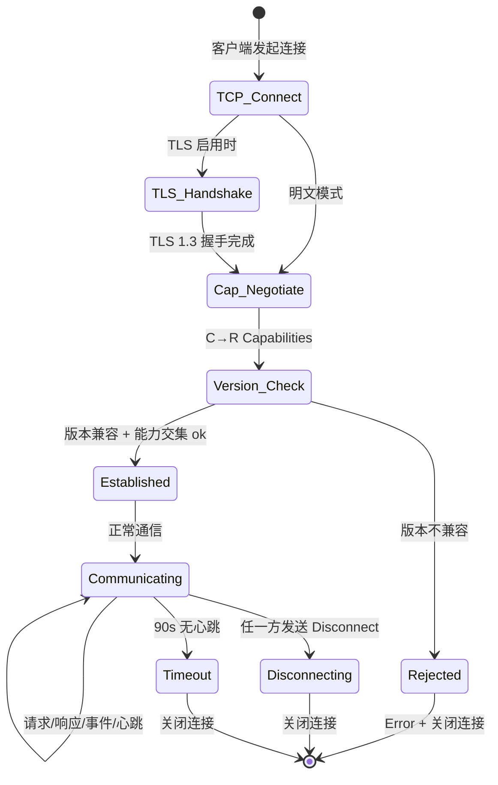
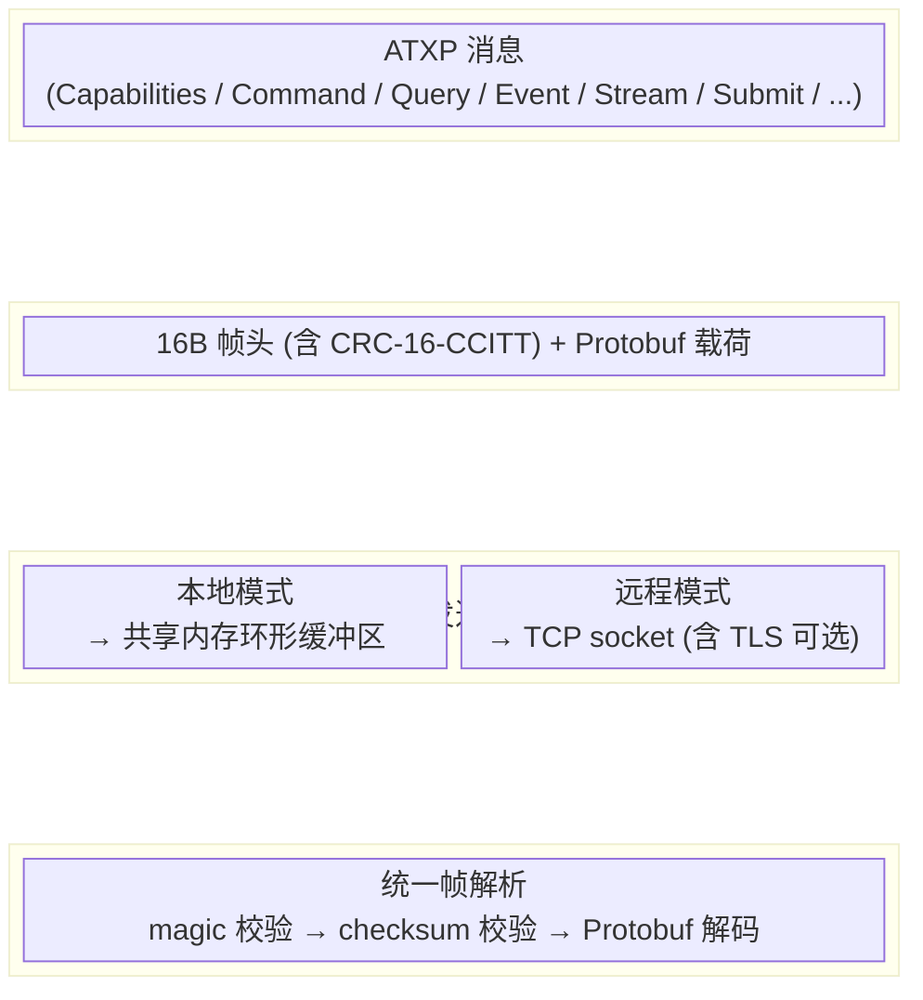

# Atomix 通信协议 (ATXP)

> 架构版本: v0.4 (提交/产出协议 + Debug 扩展)
> 最后更新: 2026-07-16
> 设计原则: 统一报文层 + 可插拔传输层
> 序列化方案: 固定帧头 (16B, 含 CRC-16-CCITT checksum) + Protobuf 载荷 + 紧凑二进制流
> 配套文件: `docs/atxp.proto`（独立 Protobuf schema）
> 配套文档: `docs/sdk-设计.md`（Python/Rust SDK 设计）

---

## 1. 概述

ATXP（Atomix Transfer Protocol）是 Atomix 工具链各后端之间的通信协议。它覆盖以下通信场景：

| 场景 | 通信双方 | 传输层 |
|------|---------|--------|
| 本地深度检查 | `atomix-dbg` ↔ `atomix-runner` | 共享内存 / IPC |
| 远程深度检查 | `atomix-dbg` ↔ `atomix-runner` | TCP |
| 任务注入执行 | `atomix-pm` / `atomix-dbg` → `atomix-runner` | TCP |
| 远程状态查询 | `atomix-dbg` ↔ `atomix-runner` | TCP |
| 安全裁决 | `atomix-runner` 收到命令后校验 `deny_commands` | — |

### 1.1 核心原则

- **统一报文层**：所有传输层共享同一套消息类型、字段定义和端点模型
- **可插拔传输层**：同一报文可通过共享内存、IPC、TCP 不同的传输层收发
- **能力协商**：连接建立时协商双方能力（本地模式 vs 远程模式），决定哪些功能可用
- **紧凑二进制**：报文序列化使用 **固定帧头 + Protobuf 载荷**，高频路径使用嵌入式紧凑二进制

### 1.2 设计决策摘要

| 决策项 | 选择 | 理由 |
|--------|------|------|
| 载荷序列化 | Protobuf (prost) | Schema evolution、强类型、Rust 生态成熟 |
| 帧头格式 | 手写 16B 固定布局 | 简单、零依赖，含 CRC-16 校验和 |
| 帧完整性 | CRC-16-CCITT (12B 覆盖) | 检测帧头损坏 + payload_len 越界保护 |
| 响应匹配 | (seq_id, req_type) 二元组 | req_type 回显避免同 seq_id 的不同请求类型混淆 |
| 高频流数据 | 嵌入式紧凑 C struct → Protobuf `bytes` | 避开 Protobuf 编解码开销，含 format_version 版本兼容 |
| 本地传输 | 共享内存 + 三环形缓冲区 | 微秒级延迟、大带宽 |
| 存活检测 | PID + boot_nonce 双重校验 | 防止 PID 复用导致的误判 |
| 远程传输 | TCP + 帧定界 | 标准、可靠、可加密 |
| TLS | rustls (可选) | Rust 原生，无 OpenSSL 依赖 |
| 压缩 | zstd | 压缩比和速度均优于 gzip |
| Webhook 签名 | HMAC-SHA256(webhook_secret, prefix+body) | 密钥分离 + 上下文前缀防重放 |

---

## 2. 传输层

### 2.1 本地传输（共享内存 / IPC）

**使用场景：** `atomix-dbg` 与本地 `atomix-runner` 通信。

**特点：**
- 高频数据推送（执行轨迹、内存槽变化、寄存器快照）
- 低延迟（微秒级），可做实时可视化
- 大带宽（足以传输完整执行录制）

#### 2.1.1 共享内存布局

```
共享内存段 (ShmRegion)
┌────────────────────────────────────────────┐ 0x00000000
│              控制区 (Control Block)          │  4 KB
│  magic, version, state, buffer 元信息        │
├────────────────────────────────────────────┤ 0x00001000
│         C→R 命令环形缓冲区 (CmdRingBuf)       │  64 KB
│          debugger → runner 方向              │
├────────────────────────────────────────────┤ 0x00011000
│         R→C 事件环形缓冲区 (EventRingBuf)     │  64 KB
│          runner → debugger 方向              │
├────────────────────────────────────────────┤ 0x00021000
│         轨迹流环形缓冲区 (StreamRingBuf)       │  16 MB
│          runner → debugger 方向（专用大缓冲）   │
└────────────────────────────────────────────┘ 0x01021000

总大小: 4 KB + 64 KB + 64 KB + 16 MB = ~16.13 MB
```

#### 2.1.2 控制区结构

控制区位于共享内存的起始 4 KB，采用 C 结构体布局（所有字段小端序）：

```
Offset  Size  Field           说明
─────────────────────────────────────────
0x000   4B    magic            0x41544D58 ("ATMX")
0x004   2B    version          0x0001
0x006   2B    layout           0x0001（布局版本，结构体有变时递增）
0x008   4B    state            见状态码表
0x00C   4B    reserved         保留

0x010   8B    cmd_buf_offset   命令缓冲区起始偏移（=0x1000）
0x018   8B    cmd_buf_size     命令缓冲区大小（=0x10000）
0x020   8B    cmd_write_ptr    写入指针（原子 u64，runner 读）
0x028   8B    cmd_read_ptr     读取指针（原子 u64，debugger 写）

0x030   8B    event_buf_offset 事件缓冲区起始偏移（=0x11000）
0x038   8B    event_buf_size   事件缓冲区大小（=0x10000）
0x040   8B    event_write_ptr  写入指针（原子 u64，debugger 读）
0x048   8B    event_read_ptr   读取指针（原子 u64，runner 写）

0x050   8B    stream_buf_offset 轨迹流缓冲区起始偏移（=0x21000）
0x058   8B    stream_buf_size   轨迹流缓冲区大小（=0x1000000）
0x060   8B    stream_write_ptr  写入指针（原子 u64，debugger 读）
0x068   8B    stream_read_ptr   读取指针（原子 u64，runner 写）

0x070   8B    stream_seq        当前轨迹流序列号（原子 u64）
0x078   8B    stream_overflow   溢出计数（原子 u64，环形覆盖检测）
0x080   8B    runner_pid        Runner 进程 PID
0x088   8B    dbg_pid           Debugger 进程 PID
0x090   8B    boot_nonce        Runner 启动随机数（PID 复用检测）
0x098   ...   padding          填充至 4KB
─────────────────────────────────────────
```

**State 状态码：**

| 值 | 常量 | 说明 |
|----|------|------|
| `0x00` | `UNINIT` | 共享内存已创建但未初始化 |
| `0x01` | `READY` | Runner 已就绪，等待 debugger 连接 |
| `0x02` | `CONNECTED` | Debugger 已连接，正常通信中 |
| `0x03` | `DISCONNECTING` | 某一端正断开，缓冲区排空中 |
| `0x04` | `ERROR` | 错误状态（详情见错误日志） |

#### 2.1.3 环形缓冲区操作

每个环形缓冲区是 **无锁 SPSC（Single Producer, Single Consumer）**：

```
写入流程（生产者）:
1. 计算帧总长度: total_len = 16 (header) + payload_len
2. 原子读 read_ptr，计算可用空间: avail = size - (write_ptr - read_ptr)
3. 如果 avail < total_len + 4（4 字节长度前缀）→ 等待或报告溢出
4. 写入长度前缀: [total_len: 4B LE]
5. 写入帧数据: [header: 16B][payload: payload_len B]
6. 内存屏障 (fence)
7. 原子写 write_ptr += total_len + 4

读取流程（消费者）:
1. 原子读 write_ptr，计算可读数据: readable = write_ptr - read_ptr
2. 如果 readable < 4 → 等待通知
3. 读长度前缀: total_len = *(uint32_t*)(buf + read_ptr % size)
4. 读帧数据: total_len 字节
5. 内存屏障 (fence)
6. 原子写 read_ptr += total_len + 4
```

**溢出处理策略：**
- **命令/事件缓冲区**：阻塞等待（生产者等待消费者排空），不丢消息
- **轨迹流缓冲区**：环形覆盖旧数据，生产者继续写入；消费者通过 `stream_overflow` 计数器检测数据丢失，通过 `stream_seq` 检测断号

#### 2.1.4 同步与通知

| 平台 | 通知机制 | 说明 |
|------|---------|------|
| Linux | `eventfd` | 生产者写入数据后 `write(eventfd, &val, 8)`，消费者 `poll`/`epoll` 等待 |
| Windows | `Named Event` | `SetEvent` / `WaitForSingleObject` |

每端各自创建一个通知对象：
- **Runner 通知 Debugger**：runner 往事件/轨迹缓冲区写入后触发（`eventfd_r2c`）
- **Debugger 通知 Runner**：debugger 往命令缓冲区写入后触发（`eventfd_c2r`）

通知对象名称约定：`atomix-{runner_pid}-r2c`、`atomix-{runner_pid}-c2r`

#### 2.1.5 生命周期

```
启动阶段:
  Runner 启动
  → 创建/打开共享内存（shm_open / CreateFileMapping）
  → 初始化控制区（写入布局信息、设置 state=READY）
  → 创建通知对象
  → 等待 debugger 连接

连接阶段:
  Debugger 启动
  → 打开共享内存
  → 校验 magic + version
  → CAS state: READY → CONNECTED
  → 发送 Capabilities 消息到命令缓冲区
  → 通知 Runner
  Runner 收到 Capabilities
  → 回复 Capabilities 到事件缓冲区
  → 通知 Debugger
  → 连接建立完成

断开阶段:
  主动断开方:
  → 发送 Disconnect 消息
  → CAS state: CONNECTED → DISCONNECTING
  → 等待缓冲区排空（最多 5 秒）
  → CAS state: DISCONNECTING → READY（允许重连）

  异常断开检测:
  → 每 5 秒检查对端 PID 是否存活
  → 同时校验共享内存中 boot_nonce == 本地记录的 boot_nonce
  → 若 PID 已死 或 boot_nonce 不匹配 → state = READY（重置缓冲区指针，等待新连接）

  PID + boot_nonce 双重校验的意义:
  - 单纯检查 PID 存活存在竞态：旧 Runner 死亡 → PID 被 OS 回收 → 新进程复用了相同 PID
  - boot_nonce 在 Runner 启动时随机生成，写入共享内存控制区
  - 即使 PID 被复用，boot_nonce 不匹配说明共享内存来自另一个 Runner 实例
  - Debugger 连接时也记录 boot_nonce，断开检测时做双重校验
```

---

### 2.2 远程传输（TCP）

**使用场景：** `atomix-dbg` 与远程 `atomix-runner` 通信。

**特点：**
- 一问一答模式为主（请求→响应）
- 低频率、小报文（设置断点、读取寄存器、单步）
- 不传输完整执行轨迹（带宽限制）
- 连接生命周期由 `origin` 命令管理

#### 2.2.1 帧定界

ATXP 帧头中的 `payload_len` 字段直接用于 TCP 帧定界——不需要额外的 Length-Prefix 层。帧头包含 CRC-16-CCITT 校验和用于完整性验证。


```
帧头定长: 16 字节
checksum 覆盖: bytes 2-13 (CRC-16-CCITT over 12B)
checksum 不覆盖: magic (用于帧识别) + payload (由 Protobuf 保证)

接收流程:
  1. 阻塞读取 16 字节（严格读取直到满）
  2. 校验 magic == 0x4154
     → 失败: 丢弃, 继续以 16B 为单位搜索下一个 magic（帧同步恢复）
  3. 计算 checksum = crc16_ccitt(bytes 2-13)
     校验 checksum == frame[14..16]
     → 失败: 丢弃, 日志告警 "ATXP checksum mismatch"
  4. 校验 payload_len:
     - Stream 帧 (msg_type=0x08): payload_len ≤ 1 MB
     - 其他帧:                   payload_len ≤ 16 MB
     → 超限: 丢弃, 回复 Error { code: 413 }
  5. 阻塞读取 payload_len 字节
  6. flags & 0x01 (C bit) → zstd 解压
  7. 根据 msg_type 选择 Protobuf message 解码 → 消息处理
```

**帧同步恢复机制：** 当 magic 校验失败时，接收方以 16 字节为单位滑动搜索 0x4154，最多搜索 256 字节。若未找到则关闭连接。

#### 2.2.2 连接握手与能力协商



**版本兼容规则：**
- `protocol_version` 主版本号（高 8 位）必须一致，否则拒绝
- 次版本号（低 8 位）不一致时，选较低者
- `features` 位字段取交集（双方都支持的功能才启用）

#### 2.2.3 能力特征位（Features Bitfield）

`features` 字段为 64 位位掩码，定义每组通信方可选的能力：

| 位 | 常量 | 说明 |
|----|------|------|
| `0` | `FEAT_QUERY` | 支持 Query/QueryResult |
| `1` | `FEAT_COMMAND` | 支持 Command（断点、控制） |
| `2` | `FEAT_INJECT` | 支持 Inject（任务推送） |
| `3` | `FEAT_STREAM_TRACE` | 支持执行轨迹流（仅本地模式） |
| `4` | `FEAT_STREAM_SLOT` | 支持内存槽流（仅本地模式） |
| `5` | `FEAT_RECORD` | 支持执行录制/回放（仅本地模式） |
| `6` | `FEAT_COMPRESS` | 支持压缩传输 |
| `7` | `FEAT_TLS` | 支持 TLS 加密 |
| `8` | `FEAT_CONTEXT` | 支持 IS* 上下文变量查询 |
| `9` | `FEAT_SYMBOLS` | 支持符号表查询 |
| `10` | `FEAT_TYPES` | 支持类型信息查询 |
| `11` | `FEAT_SOURCEMAP` | 支持源码映射查询 |
| `12` | `FEAT_EVAL` | 支持表达式求值 |
| `13` | `FEAT_SEGMENTS` | 支持 IR 段内容查询 |
| `14` | `FEAT_WATCHPOINT` | 支持数据断点（内存监视） |
| `15` | `FEAT_HOOK_EVENTS` | 支持钩子生命周期事件 |
| `16-63` | *保留* | 未来扩展 |

#### 2.2.4 保活与心跳

```
心跳间隔 (HEARTBEAT_INTERVAL): 30 秒
心跳超时 (HEARTBEAT_TIMEOUT):   90 秒（3 个间隔无响应）

流程:
  任一端在 30 秒内无任何消息发出 → 发送 Heartbeat 消息
  收到任意消息 → 重置计时器
  任一端在 90 秒内未收到任何消息 → 判定对端死亡，关闭连接

Heartbeat 消息:
  msg_type = HEARTBEAT (0x0B)
  payload: Heartbeat { client_time: uint64 }
```

#### 2.2.5 断线重连策略

ATXP **不维护服务端会话状态**。重连即全新连接：

```
Client 断线检测:
  → 清理本地订阅/等待中的请求
  → 退避重连: 1s → 2s → 4s → 8s → 16s → 32s (上限)
  → 连接成功后: 重新发送 Capabilities 协商
  → 重新订阅所有断点/事件

Server 断线检测:
  → 清理该连接的所有订阅
  → 任务继续执行，不受影响
  → 等待新连接
```

#### 2.2.6 TLS 配置

TLS 为可选功能，配置在 `runner.toml` 的 `[network.tls]` 段：

```toml
[network]
listen = "0.0.0.0:9000"

# 不配置此段 = 明文 TCP
# [network.tls]
# cert = "/etc/atomix/certs/server.crt"
# key  = "/etc/atomix/certs/server.key"
# ca   = "/etc/atomix/certs/ca.crt"  # 可选：客户端证书验证（mTLS）
```

**实现说明：** 使用 `rustls` crate（Rust 原生 TLS，不依赖 OpenSSL）。TLS 版本最低 1.2，推荐 1.3。

#### 2.2.7 `origin` 命令与连接管理

`atomix origin` CLI 命令管理远程连接：

```bash
# 建立连接
atomix origin connect 192.168.1.100:9000 --name prod-runner

# 断开
atomix origin disconnect prod-runner
atomix origin disconnect --all

# 查看状态
atomix origin list
# 输出:
#   NAME          ADDRESS              STATUS    UPTIME
#   prod-runner   192.168.1.100:9000   active    2h 15m
#   staging       10.0.0.5:9000        inactive  —
```

维护一个本地连接池 (`~/.atomix/origins.json`) 记录活跃连接的元数据。

---

### 2.3 传输层抽象



传输层对报文层透明。一条消息的设计不关心它是走共享内存还是走 TCP。传输层只负责两件事：
1. **发送**：帧 → 传输介质
2. **接收**：传输介质 → 帧

消息路由、序列化、checksum 校验全部在报文层处理。

---

## 3. 报文层

### 3.1 能力协商

连接建立后，双方首先交换能力声明：

```
C → R: Capabilities {
    mode:             LOCAL | REMOTE
    protocol_version: 0x0001
    features:         [64-bit bitfield]
}

R → C: Capabilities {
    mode:             LOCAL | REMOTE
    protocol_version: 0x0001
    features:         [64-bit bitfield]
    deny_commands:    [string list]         // 仅远程模式
}
```

能力协商决定：
- 本地模式：支持全部功能（轨迹推送、录制、实时可视化）
- 远程模式：仅支持请求-响应类操作，不支持流式推送

**协商结果：** 取 `min(客户端版本, 服务端版本)` 和 `features_c & features_s`（位与）作为实际生效的能力集。

---

### 3.2 消息结构（帧头）

每条消息统一为 **固定 16 字节帧头 + 可变长度载荷**：

```
字节    宽度    字段          说明
─────────────────────────────────────────
0-1     2B     magic          魔数 0x4154 ("AT")
2       1B     version        协议版本 (0x01)
3       1B     msg_type       消息类型（见 §3.3 消息类型表）
4-7     4B     seq_id         序列号（u32 LE，请求-响应匹配）
8       1B     flags          控制标记位（见下方位定义）
9-12    4B     payload_len    载荷长度（u32 LE，不含帧头）
13      1B     req_type       回显字段（响应帧回显原请求的 msg_type；非响应帧=0）
14-15   2B     checksum       CRC-16-CCITT 校验和，覆盖 bytes 2-13 (共 12B)
─────────────────────────────────────────
        16B    帧头固定开销
16+     N      payload        载荷（Protobuf 序列化，或紧凑二进制，
                              由 msg_type 决定具体解析方式）
```

**Flags 位定义：**

```
Bit 7   6   5   4   3   2   1   0
┌───┬───┬───┬───┬───┬───┬───┬───┐
│ R │ R │ R │ R │ P │ E │ A │ C │
└───┴───┴───┴───┴───┴───┴───┴───┘
  │   │   │   │   │   │   │   │
  │   │   │   │   │   │   │   └── C: Compressed (载荷经 zstd 压缩)
  │   │   │   │   │   │   └────── A: Ack Requested (请求对端回复 Ack)
  │   │   │   │   │   └────────── E: Error (本帧是错误响应)
  │   │   │   │   └────────────── P: is_response (本帧是响应帧, req_type 有效)
  │   │   │   └────────────────── R: 保留（必须为 0）

Bit 0 (C) - Compressed:
  0 = 载荷未压缩
  1 = 载荷经 zstd 压缩（收端先解压再 Protobuf 解码）

Bit 1 (A) - Ack Requested:
  0 = 不需确认
  1 = 对端收到后应回复 Ack（seq_id 匹配）
  注：所有 Command/Query/Inject/Submit 应设置此位

Bit 2 (E) - Error:
  0 = 正常消息
  1 = 本帧载荷为 Error 消息（msg_type = ERROR 时自然置位）

Bit 3 (P) - is_response:
  0 = 请求帧或事件帧（req_type 字段为 0，忽略）
  1 = 响应帧（req_type 字段回显原请求的 msg_type，用于 (seq_id, req_type) 匹配）
```

**checksum 计算：**

```
算法: CRC-16-CCITT (poly=0x1021, init=0xFFFF)
覆盖范围: bytes 2–13，即 version + msg_type + seq_id + flags + payload_len + req_type (共 12 字节)
不覆盖: magic (2B) — magic 用于帧识别，checksum 用于帧完整性校验
不覆盖: payload — 载荷完整性由 Protobuf 解析保证（损坏的 Protobuf 解析失败）

发送方:
  checksum = crc16_ccitt(&frame[2..14])  // 覆盖 12 字节
  写入 frame[14..16] = checksum (LE)

接收方:
  computed = crc16_ccitt(&frame[2..14])
  if computed != checksum_from_frame → 丢弃此帧（日志告警，不回复）
```

**payload_len 上限校验（接收方解析流程）：**

```
帧解析流程:
  1. 阻塞读取 16 字节帧头
  2. 校验 magic == 0x4154
     → 失败: 丢弃, 继续读下一个 16 字节（帧同步恢复）
  3. 校验 checksum (crc16 over bytes 2-13)
     → 失败: 丢弃, 日志告警 "ATXP checksum mismatch"
  4. 校验 payload_len:
     - Stream 帧:  payload_len ≤ 1 MB
     - 其他帧:     payload_len ≤ 16 MB
     → 超限: 丢弃, 回复 Error { code: 413, message: "payload too large" }
  5. 阻塞读取 payload_len 字节
  6. flags & 0x01 (C bit) → zstd 解压
  7. 根据 msg_type 选择对应 Protobuf message 解码
```

**序列号管理：**
- `seq_id` 由请求发起方递增（从 1 开始，0 为特殊值表示"不需要匹配"）
- 响应帧的 `seq_id` 与请求帧一致，**同时 req_type 回显请求帧的 msg_type**
- 匹配规则：发送方等待 `(seq_id, req_type)` 匹配的响应帧。例如：
  - 发送 Command (msg_type=0x04, seq_id=5)
  - 期待收到 Ack (msg_type=0x02, seq_id=5, req_type=0x04, flags.P=1) 或 Error (msg_type=0x03, seq_id=5, req_type=0x04, flags.P=1)
  - 匹配条件: `seq_id == 5 AND req_type == 0x04 AND flags.P == 1`
- `req_type` 使客户端能区分"这是对我哪个请求的回复"，避免同一 seq_id 的不同请求类型混淆
- 单连接内独立递增，重连后归零
- 溢出后回绕到 1

**最大载荷限制：**
- 命令/查询/响应：**16 MB**（足够容纳任一完整消息）
- 流数据单帧：**1 MB**（防止单帧过大阻塞其他通信）
- 如果超过限制，发送方应分片（使用 Stream 机制）

---

### 3.3 消息类型与载荷定义

#### 3.3.1 消息类型枚举

| Type ID | 名称 | 方向 | 载荷格式 | 说明 |
|---------|------|------|---------|------|
| `0x01` | `Capabilities` | 双向 | Protobuf | 能力协商 |
| `0x02` | `Ack` | 双向 | Protobuf | 确认 |
| `0x03` | `Error` | 双向 | Protobuf | 错误报告 |
| `0x04` | `Command` | C → R | Protobuf | 控制命令（断点、单步、继续、暂停） |
| `0x05` | `Query` | C → R | Protobuf | 查询请求（寄存器、内存、调用栈） |
| `0x06` | `QueryResult` | R → C | Protobuf | 查询响应 |
| `0x07` | `Event` | R → C | Protobuf | 事件通知（断点命中、任务完成、OOM） |
| `0x08` | `Stream` | R → C | Protobuf + 紧凑二进制 | 数据流块（仅本地模式） |
| `0x09` | `Inject` | C → R | Protobuf | 任务注入（推送 .atxe，不等待结果） |
| `0x0A` | `InjectResult` | R → C | Protobuf | 注入结果 |
| `0x0B` | `Heartbeat` | 双向 | Protobuf | 保活心跳 |
| `0x0C` | `Disconnect` | 双向 | Protobuf | 主动断开通知 |
| `0x0D` | `Submit` | C → R | Protobuf | 任务提交（源码/二进制，含产出回传配置） |
| `0x0E` | `SubmitResult` | R → C | Protobuf | 提交确认（含 task_id 或编译错误） |
| `0x0F` | `TaskOutput` | R → C | Protobuf | 任务产出（OUT zone 数据） |
| `0x10` | `OutputRequest` | C → R | Protobuf | 拉取任务产出（POLL 模式） |

#### 3.3.2 Protobuf Schema（核心消息）

以下为 ATXP 的完整 Protobuf schema（独立 `.proto` 文件见 `docs/atxp.proto`）：

```protobuf
syntax = "proto3";
package atxp;

// ─── 枚举 ─────────────────────────────────────────

enum Mode {
    LOCAL  = 0;
    REMOTE = 1;
}

enum Operation {
    GET         = 0;
    SET         = 1;
    SUBSCRIBE   = 2;
    UNSUBSCRIBE = 3;
    EVAL        = 4;   // 表达式求值（用于 eval 端点）
}

enum EventType {
    // 基础事件
    BREAKPOINT_HIT  = 0;
    STATE_CHANGE    = 1;
    OOM_WARNING     = 2;
    TASK_COMPLETE   = 3;
    TASK_ERROR      = 4;
    STEP_COMPLETE   = 5;
    RUNNER_STOPPED  = 6;
    TASK_CREATED    = 7;
    TASK_SUSPENDED  = 8;

    // 钩子生命周期事件 (Hook Lifecycle)
    HOOK_STEP       = 10;   // STEP 钩子触发
    HOOK_CALL       = 11;   // CALL 钩子触发
    HOOK_RETURN     = 12;   // CALL_AFTER 钩子触发
    HOOK_ERROR      = 13;   // CALL_ERROR 钩子触发
    HOOK_PROP_GET   = 14;   // GET 属性钩子触发
    HOOK_PROP_SET   = 15;   // SET 属性钩子触发
    HOOK_FORK       = 16;   // FORK 子任务钩子触发
    HOOK_JOIN       = 17;   // JOIN 子任务钩子触发
    HOOK_INIT       = 18;   // INIT 钩子触发
    HOOK_START      = 19;   // START 钩子触发
    HOOK_DONE       = 20;   // DONE 钩子触发
    HOOK_DEL        = 21;   // DEL 钩子触发
    HOOK_FINALLY    = 22;   // FINALLY 钩子触发

    // 数据事件
    WATCHPOINT_HIT  = 30;   // 数据断点（内存监视）命中
    VARIABLE_CHANGE = 31;   // 被监视的变量值变更
    PROPERTY_ACCESS = 32;   // 属性读写访问
    DATA_DELIVERED  = 33;   // OUT 数据投递完成
    DECORATOR_CHAIN = 34;   // 装饰器链执行事件
}

enum StreamType {
    TRACE        = 0;  // 载荷为紧凑 TraceBatch
    MEMORY_SLOT  = 1;  // 载荷为紧凑 SlotLayoutBatch
    LOG          = 2;  // 载荷为 LogEntry
}

enum CompressionAlgo {
    NONE = 0;
    ZSTD = 1;
    GZIP = 2;
}

enum DisconnectReason {
    NORMAL           = 0;
    VERSION_MISMATCH = 1;
    DENIED           = 2;
    TIMEOUT          = 3;
    PROTOCOL_ERROR   = 4;
}

// 任务提交相关枚举
enum SubmitMode {
    SOURCE = 0;  // 提交 .atx 源码, Runner 负责编译
    BINARY = 1;  // 提交 .atxe 编译产物, Runner 直接执行
}

enum OutputMode {
    POLL     = 0;  // 调用方主动轮询 tasks/{tid}/output
    CALLBACK = 1;  // Runner 完成后 POST 到 callback_url
    STREAM   = 2;  // Runner 在连接上实时推送 TaskOutput
}

enum SubmitStatus {
    ACCEPTED      = 0;  // 已接受, 进入任务池
    REJECTED      = 1;  // 拒绝 (认证失败/资源不足/deny_commands)
    COMPILE_ERROR = 2;  // 源码编译失败
}

// ─── 任务提交消息 ─────────────────────────────────

message Submit {
    SubmitMode mode           = 1;
    string source             = 2;   // mode=SOURCE 时: .atx 源码内容
    bytes binary              = 3;   // mode=BINARY 时: .atxe 编译产物
    string task_name          = 4;
    OutputMode output_mode    = 5;   // 产出回传方式
    string callback_url       = 6;   // output_mode=CALLBACK 时: webhook URL
    map<string,string> callback_headers = 7; // 自定义 HTTP 头
    string auth_token         = 8;   // 认证令牌
    string tenant_id          = 9;   // 多租户隔离标识
    uint32 priority           = 10;  // 任务优先级 (0=最低, 10=最高)
    uint64 timeout_ms         = 11;  // 执行超时 (0=无限制)
    map<string,string> metadata = 12; // 自定义元数据
    CompileOptions compile_opts = 13; // 源码模式的编译选项
}

message CompileOptions {
    uint32 opt_level          = 1;   // 优化级别 (0/1/2/3, 默认 0=dev)
    bool debug_info           = 2;   // 是否包含 .debug 段
    repeated string defines   = 3;   // 条件编译宏定义
}

message SubmitResult {
    SubmitStatus status       = 1;
    string task_id            = 2;   // 成功时分配的任务 ID
    string message            = 3;
    repeated CompileError compile_errors = 4; // 编译错误详情
}

message CompileError {
    uint32 line               = 1;
    uint32 col                = 2;
    string message            = 3;
    string source_line        = 4;
}

message TaskOutput {
    string task_id            = 1;
    SubmitStatus status       = 2;   // ACCEPTED=DONE, REJECTED=ERROR, COMPILE_ERROR=TIMEOUT
    bytes output              = 3;   // OUT zone 输出数据 (JSON/二进制)
    string error              = 4;   // 错误描述
    TaskStats stats           = 5;   // 执行统计
    repeated OutputFile files = 6;   // 产出文件列表
    uint64 started_at         = 7;   // 开始时间 ns
    uint64 completed_at       = 8;   // 完成时间 ns
    map<string,string> metadata = 9; // 回传元数据
}

message OutputFile {
    string name               = 1;
    string path               = 2;   // Runner 上的产出文件路径
    uint64 size               = 3;
    string mime_type          = 4;
    bytes content             = 5;   // 小文件直接嵌入 (最大 1MB)
}

message OutputRequest {
    string task_id            = 1;
    uint32 wait_ms            = 2;   // 长轮询等待时间 (0=立即返回, 最大 30000)
}

// ─── 核心消息 ─────────────────────────────────────

message Capabilities {
    Mode mode                = 1;
    uint32 protocol_version  = 2;   // 0xMMmm, 高8位主版本, 低8位次版本
    uint64 features          = 3;   // 64位特征位字段
    repeated string deny_commands = 4; // 服务端发送, 客户端忽略
}

message Ack {
    uint32 status = 1;              // 0 = 成功
    string message = 2;             // 可选详情
}

message Error {
    uint32 code    = 1;             // 错误码 (见 §7)
    string message = 2;             // 人类可读的错误描述
    string endpoint = 3;            // 触发错误的端点 (可选)
}

message Command {
    string endpoint     = 1;        // 端点路径
    Operation operation = 2;        // GET / SET / SUBSCRIBE / UNSUBSCRIBE
    bytes data          = 3;        // 操作数据 (Protobuf-encoded, 类型取决于 endpoint+operation)
}

message Query {
    string endpoint     = 1;
    Operation operation = 2;
    bytes params        = 3;        // 查询参数 (Protobuf-encoded)
}

message QueryResult {
    string endpoint = 1;
    bytes data      = 2;            // 结果数据 (Protobuf-encoded, 类型取决于 endpoint)
}

message Event {
    string endpoint   = 1;
    EventType type    = 2;
    bytes data        = 3;          // 事件数据 (Protobuf-encoded)
    uint64 timestamp  = 4;          // 事件发生的纳秒时间戳 (Unix epoch)
}

message Stream {
    StreamType type  = 1;
    uint64 seq       = 2;           // 流序列号 (从 0 递增)
    bool last        = 3;           // 是否为当前流的最后一帧
    uint64 timestamp = 4;           // 生成时的纳秒时间戳
    bytes data       = 5;           // 流数据 (紧凑二进制, 格式取决于 type)
}

message Inject {
    string task_name          = 1;
    bytes atxe_binary         = 2;   // .atxe 文件完整内容
    CompressionAlgo compression = 3;  // 压缩算法
    bool compressed           = 4;   // 是否已压缩 (冗余, 与 compression 一致)
}

message InjectResult {
    uint32 status  = 1;             // 0 = 成功, 非0 = 错误码
    string task_id = 2;             // 分配的任务 ID (成功时)
    string message = 3;             // 错误描述 (失败时)
}

message Heartbeat {
    uint64 client_time = 1;         // 发送方当前时间戳 (用于 RTT 估算)
}

message Disconnect {
    DisconnectReason reason = 1;
    string message          = 2;
}
```

---

### 3.4 端点模型

每一端的可操作对象统一建模为"端点"。端点路径使用类似文件系统路径的层级结构，支持路径参数 `{name}`。

#### 3.4.1 完整端点树

```
runner                          ← 执行引擎本身
├── status                      → 引擎状态
├── config                      → 引擎配置
├── controller                  → 自适应控制器内部状态 (监控/调优)
├── log                         → 引擎日志流
├── tasks                       → 任务列表
├── submit                      → 任务提交入口 (Submit/SubmitResult)
│
└── tasks/{tid}                 ← 具体任务 (tid = task_id)
    ├── status                  → 任务状态
    ├── config                  → 任务级配置覆盖
    ├── regs                    → 当前步骤寄存器快照 + 类型标注 (16 × u64)
    ├── mem                     → 内存视图 (分页读取)
    ├── stack                   → 调用栈
    ├── breakpoints             → 断点 + 数据监视点列表
    ├── dataflow                → 数据流向图
    ├── timeline                → 执行时间线
    ├── log                     → 任务日志流
    ├── context                 → IS* 上下文变量 (72个运行时自省值)
    ├── symbols                 → 符号表 (函数名→pc, 变量名→寄存器/栈偏移)
    ├── types                   → 当前作用域类型信息 (每个变量的类型+值)
    ├── sourcemap               → 源码映射 (pc ↔ 源文件:行号)
    ├── stats                   → 执行统计
    ├── eval                    → 表达式求值
    ├── zones                   → 当前 Zone 加载状态
    ├── steps                   → 步骤列表
    ├── output                  → 任务产出 (POLL 模式拉取)
    ├── callback                → 回调管理 (CALLBACK 模式注册/管理)
    │
    ├── steps/{sid}             ← 具体步骤 (sid = 步骤名称或索引)
    │   ├── status              → 步骤状态
    │   ├── regs                → 步骤完成时寄存器状态
    │   ├── mem                 → 步骤内存视图
    │   ├── stack               → 步骤调用栈
    │   ├── log                 → 步骤日志流
    │   └── trace               → 步骤执行轨迹流 (仅本地模式)
    │
    ├── segments/{seg}          ← IR 段内容 (seg = debug/task/exn/zones/text/rodata)
    │                            → 逆向工程：读原始段数据或结构化解析
    │
    └── slots                   → 任务占用的内存槽布局 (仅本地模式)

端点路径格式: "runner/tasks/{tid}/steps/{sid}/regs"
路径参数: {tid} = 任务ID (32字节 hex), {sid} = 步骤标识符, {seg} = IR段名称
```

#### 3.4.2 各端点的操作支持与数据结构

每个端点按支持的操作（GET / SET / SUBSCRIBE）对应特定的输入/输出数据结构。以下用类似 Protobuf message 的方式定义。

**`runner/status`** — GET

```
GET 返回 RunnerStatus {
    state:          enum { INIT=0, RUNNING=1, STOPPING=2, STOPPED=3, ERROR=4 }
    mode:           enum { LOCAL=0, REMOTE=1 }
    uptime_ms:      uint64
    version:        string                 // runner 版本号
    task_count:     uint32                 // 当前池中任务总数
    running_count:  uint32                 // 当前执行中任务数
    mem_used_mb:    uint32                 // 当前物理内存使用 (MB)
    mem_limit_mb:   uint32                 // 配置的内存上限 (MB)
    cpu_usage_pct:  float                  // 当前 CPU 使用率 (%)
}
```

**`runner/config`** — GET / SET

```
GET 返回 RunnerConfig {
    listen_addr:     string                // TCP 监听地址
    task_dir:        string                // 任务持久化目录
    state_dir:       string                // 运行时状态目录
    max_tasks:       uint32                // 任务池最大容量
    max_concurrent:  uint32                // 最大并发批次
    quantum:         uint32                // 协作式抢占的时间片 (指令数)
    stream_buf_mb:   uint32                // 轨迹流缓冲区大小 (MB)
    deny_commands:   repeated string       // 拒绝的命令列表
    tls_enabled:     bool                  // TLS 是否启用
    heartbeat_ms:    uint32                // 心跳间隔 (毫秒)
    trace_level:     enum { OFF=0, FUNCTION=1, SPARSE=2, BRANCH=3, FULL=4 }
    trace_sparse_n:  uint32                // SPARSE 级别的采样间隔
}

SET 接受 RunnerConfig (部分字段可写):
    可写: max_concurrent, quantum, deny_commands, trace_level, trace_sparse_n
    只读: listen_addr, task_dir, state_dir, stream_buf_mb, tls_enabled, heartbeat_ms
```

**`runner/tasks`** — GET

```
GET 返回 TaskList {
    tasks: repeated TaskInfo {
        task_id:     string
        name:        string
        state:       uint32               // 状态码 (0x0000-0x3FFF, 见运行时架构)
        disk_addr:   uint64               // 磁盘存储地址
        mem_addr:    uint64               // 内存地址 (0 = 未加载)
        created_at:  uint64               // 创建时间 (ns)
        started_at:  uint64               // 开始执行时间 (0 = 未开始)
        cycles:      uint64               // 累计执行周期
        memory_mb:   uint32               // 当前占用内存 (MB)
    }
}
```

**`runner/tasks/{tid}/status`** — GET

```
GET 返回 TaskStatus {
    task_id:        string
    state:          uint32                // 状态码
    current_step:   string                // 当前步骤名称
    current_pc:     uint32                // 当前程序计数器
    total_cycles:   uint64
    memory_used:    uint64                // 字节
    started_at:     uint64                // ns
    error_message:  string                // 错误时的描述 (空 = 正常)
}
```

**`runner/tasks/{tid}/config`** — GET / SET

```
GET/SET TaskConfig {
    quantum_override: uint32              // 0 = 使用全局配置
    max_steps:         uint32             // 最大执行步骤 (0 = 无限制)
    timeout_ms:        uint64             // 任务超时 (0 = 无超时)
    log_level:         enum { OFF=0, ERROR=1, WARN=2, INFO=3, DEBUG=4, TRACE=5 }
}
```

**`runner/tasks/{tid}/regs`** — GET

```
GET 返回 RegisterSnapshot {
    regs: uint64[16]                     // R0-R15, 固定 16 个
    pc:   uint32                         // 当前程序计数器
    annotations: repeated RegAnnotation { // 寄存器的类型标注 (可选, debug 模式)
        reg_id:      uint32
        var_name:    string              // 变量名 (如 "userCount")
        type:        string              // 类型 (如 "int", "str*")
        value_display: string            // 人类可读展示值
    }
}
注: R0 (zero) 始终为 0; R14 (task_id) 运行时只读
```

**`runner/tasks/{tid}/mem`** — GET

```
GET 参数 MemQueryParams {
    base_addr: uint64                     // 起始虚拟地址
    size:      uint32                     // 读取大小 (最大 4096 字节)
}

GET 返回 MemoryRegion {
    base_addr: uint64
    size:      uint32
    data:      bytes                      // 实际读取的字节
    readable:  bool                       // 是否可读页
    writable:  bool                       // 是否可写页
    exec:      bool                       // 是否可执行页
}

大内存区域的查询通过多次分页请求完成。
```

**`runner/tasks/{tid}/stack`** — GET

```
GET 返回 CallStack {
    frames: repeated StackFrame {
        func_name:  string                // 函数名 (或 "<anonymous>")
        pc:         uint32                // 返回地址
        fp:         uint64                // 帧指针值
        sp:         uint64                // 栈指针值
        task_id:    string                // 跨任务调用的来源任务
        step_name:  string                // 所在步骤
    }
}
```

**`runner/tasks/{tid}/breakpoints`** — GET / SET / SUBSCRIBE

```
GET 返回 BreakpointList {
    breakpoints: repeated Breakpoint {
        id:           uint32
        pc:           uint32              // 断点地址
        enabled:      bool
        hit_count:    uint64              // 累计命中次数
        condition:    string              // 条件表达式 (空 = 无条件)
        one_shot:     bool                // 命中一次后自动删除
    }
}

SET 接受 BreakpointList:
    全量替换: 传完整列表覆盖现有断点
    增量操作: 通过 SET + 端点 "runner/tasks/{tid}/breakpoints/add" 添加单个
    删除: 通过 SET + 端点 "runner/tasks/{tid}/breakpoints/del/{id}" 删除单个

SUBSCRIBE 返回 Event (type = BREAKPOINT_HIT):
    BreakpointEvent {
        bp_id:    uint32
        pc:       uint32
        task_id:  string
        step_id:  string
        regs:     RegisterSnapshot       // 断点命中时的寄存器状态
    }
```

**`runner/tasks/{tid}/dataflow`** — GET (仅本地模式)

```
GET 返回 DataFlowGraph {
    nodes: repeated DataFlowNode {
        id:       string
        label:    string                  // 步骤/函数名
        type:     enum { SOURCE=0, TRANSFORM=1, SINK=2 }
    }
    edges: repeated DataFlowEdge {
        from_node:  string
        to_node:    string
        data_tag:   string               // 数据标签 (变量名/类型)
        bytes:      uint64               // 传输字节数
    }
}
```

**`runner/tasks/{tid}/timeline`** — GET (仅本地模式)

```
GET 返回 Timeline {
    events: repeated TimelineEvent {
        timestamp_ns: uint64
        pc:           uint32
        opcode:       uint32             // 执行的指令 opcode
        category:     enum { MEM_READ=0, MEM_WRITE=1, CALL=2, RET=3,
                             ECALL=4, FORK=5, JOIN=6, OOM=7, BREAKPOINT=8,
                             HOOK=9, WATCHPOINT=10, EXCEPTION=11,
                             ZONE_CHANGE=12, STEP_START=13, STEP_END=14 }
        detail:       string             // 附加说明
    }
}

支持分页: GET 参数 TimelineParams { start_ns: uint64, end_ns: uint64, max_events: uint32 }
```

**`runner/tasks/{tid}/steps/{sid}/regs`** — GET

```
GET 返回 RegisterSnapshot (同上)
表示特定步骤完成时的寄存器状态。
```

**`runner/tasks/{tid}/steps/{sid}/trace`** — SUBSCRIBE (仅本地模式)

```
SUBSCRIBE 返回 Stream (type = TRACE):
    载荷为紧凑二进制 TraceBatch (见 §4.1)
```

**`runner/tasks/{tid}/slots`** — GET (仅本地模式)

```
GET 返回 SlotLayout {
    slots: repeated SlotInfo {
        slot_id:    uint32
        task_id:    string               // 占用任务 (空 = FREE)
        base_addr:  uint64               // 虚拟地址基址
        size:       uint64               // 分配总大小
        used:       uint64               // 实际使用量
        watermark:  uint64               // 历史最高水位线
        status:     enum { FREE=0, SAFE=1, WARNING=2, RESERVED=3 }
        zone:       enum { NORMAL=0, SLIPWAY=1, DEAD=2 }
    }
}
```

**`runner/log`** — SUBSCRIBE

```
LogEntry (Protobuf or compact):
    timestamp_ns: uint64
    level:        enum { ERROR=0, WARN=1, INFO=2, DEBUG=3, TRACE=4 }
    source:       string                 // "runner" / "task:{tid}" / "batch"
    message:      string
```

**`runner/tasks/{tid}/log`** — SUBSCRIBE

```
同 runner/log, 但仅包含该任务相关的日志。
```

#### 3.4.2a Debug 扩展端点

以下端点为源码级调试、逆向工程、性能分析和运行时自省提供支持。

**`runner/controller`** — GET（监控/调优）

```
GET 返回 ControllerState {
    // 批次管理
    n_batch:           uint32           // 当前批次大小
    hard_ceiling:      uint32           // 硬上限 H
    soft_ceiling:      uint32           // 软上限 S
    backlog_depth:     uint32           // 积压任务数
    high_backlog_mode: bool             // 是否进入高积压模式
    cold_start_phase:  bool             // 是否处于冷启动阶段

    // 四因子
    beta:              double           // 积压因子
    lambda_speed:      double           // 速度因子
    sigma_volume:      double           // 容量因子
    gamma_variance:    double           // 波动因子
    merged_factor:     double           // 加权合并因子

    // OOM 反馈
    alpha_mem_current: double           // 当前 α_mem 值
    oom_count:         uint32           // 累计 OOM 次数
    oom_state:         string           // "INCREASE" / "DECREASE" / "HYSTERESIS"

    // 槽位统计
    total_slots:       uint32           // 总槽位数
    used_slots:        uint32           // 已用槽位
    slipway_slots:     uint32           // 滑道备用槽位
    dead_slots:        uint32           // 死区待回收槽位
    slot_size_mb:      double           // 单槽大小 (MB)
    slipway_multiplier: double          // 滑道乘数
}
```

**`runner/tasks/{tid}/context`** — GET（IS\* 上下文变量）

```
GET 返回 TaskContext {
    // ── 异常相关 ──
    is_error:          bool
    is_error_type:     string           // 异常类型名
    is_error_message:  string
    is_error_stack:    string           // 异常栈 JSON
    is_error_line:     uint32
    is_error_code:     int32
    is_child_error:    bool

    // ── 时间相关 ──
    is_timeout:        bool
    is_elapsed:        uint64           // ns
    is_start_time:     uint64           // ns epoch
    is_remaining:      uint64           // ns
    is_wait_time:      uint64
    is_queue_time:     uint64
    is_suspend_time:   uint64
    is_duration:       uint64
    is_current_time:   uint64

    // ── 计数相关 ──
    is_call_count:     uint32
    is_retry_count:    uint32
    is_retry_limit:    uint32
    is_depth:          uint32           // 调用深度
    is_child_count:    uint32
    is_pipe_count:     uint32
    is_pipe_index:     uint32
    is_step_index:     uint32
    is_total_steps:    uint32
    is_iteration:      uint32

    // ── 调用上下文 ──
    is_method:         string           // 当前方法名
    is_args:           string           // JSON 编码的调用参数
    is_params:         string           // 参数列表
    is_return:         string           // JSON 编码的返回值
    is_caller:         string           // 调用者名称
    is_step_name:      string
    is_work_name:      string
    is_self:           string           // 当前 WORKS 实例名

    // ── 属性上下文 ──
    is_property:       string
    is_prop_value:     string
    is_prop_type:      string
    is_prop_access:    string           // "read" / "write"
    is_default:        string

    // ── 任务上下文 ──
    is_task_id:        string
    is_phase:          string           // 当前生命周期阶段
    is_status:         string
    is_parent:         string           // 父任务 ID
    is_child_id:       string
    is_children:       repeated string  // 所有子任务 ID
    is_child_name:     string
    is_child_return:   string
    is_grandchild_id:  string
    is_task_tree:      string           // JSON 编码的任务树

    // ── 数据相关 ──
    is_big_size:       bool
    is_warning:        bool
    is_data_size:      uint64
    is_data_type:      string
    is_data_state:     string
    is_data_checksum:  string

    // ── 系统/环境 ──
    is_line:           uint32
    is_file:           string
    is_mode:           string           // "dev" / "prod"
    is_debug:          bool             // debug 模式是否启用
    is_env:            string
    is_version:        string
    is_cancel_reason:  string
    is_interrupt_code: uint32
    is_suspend_reason: string
    is_cleanup_target: string
    is_decorator_name: string
    is_concurrency_id: uint32
    is_quota:          uint32
}
```

**`runner/tasks/{tid}/types`** — GET（类型信息）

```
GET 返回 TypeInfo {
    variables: repeated VariableInfo {
        name:          string           // 变量名
        type:          string           // "int", "str", "list[dict[str,int]]", ...
        kind:          enum { REGISTER=0, STACK=1, GLOBAL=2 }
        index:         uint32           // 寄存器号或栈偏移
        value_raw:     uint64           // 当前裸值
        value_display: string           // 人类可读展示（如 "42", "\"hello\"", "[1,2,3]"）
        scope:         string           // 所属作用域 (函数名/步骤名)
    }
    functions: repeated FunctionInfo {
        name:          string
        signature:     string           // "(int, str) -> bool"
        pc:            uint32           // 入口 PC
        is_available:  bool             // false = 被剪枝优化掉
        is_generic:    bool             // 泛型函数
    }
}
```

**`runner/tasks/{tid}/symbols`** — GET（符号表）

```
GET 返回 SymbolTable {
    symbols: repeated Symbol {
        name:        string
        kind:        enum { FUNCTION=0, VARIABLE=1, PARAMETER=2, CONSTANT=3, LABEL=4, TYPE=5 }
        type:        string             // 类型注解
        address:     uint64             // PC (函数) 或 寄存器号/栈偏移 (变量)
        size:        uint32             // 占用字节数
        source_line: uint32             // 源文件行号
        scope:       string             // 所属作用域
    }
}
```

**`runner/tasks/{tid}/sourcemap`** — GET（源码映射——逆向工程核心）

```
GET 返回 SourceMap {
    source_file:  string                // 源文件路径
    entries: repeated SourceMapEntry {
        pc_start:    uint32             // IR 指令偏移起始
        pc_end:      uint32             // IR 指令偏移结束
        source_line: uint32             // 源文件行号
        source_col:  uint32             // 源文件列号
        source_text: string             // 源文件该行文本内容
        step_name:   string             // 所属步骤名
        zone_name:   string             // 所属 Zone 名
        func_name:   string             // 所属函数名
        ast_node:    string             // 对应的 AST 节点类型 (可选)
    }
}
```

**`runner/tasks/{tid}/segments/{seg}`** — GET（IR 段内容查询——逆向工程基础）

```
seg 可选值: "text", "rodata", "debug", "task", "exn", "zones"

GET 返回 SegmentData {
    name:         string                // 段名称
    section_type: uint32                // SectionType 枚举值 (0x0001-0x0006)
    size:         uint32                // 段大小 (字节)
    raw_data:     bytes                 // 原始段字节

    // 结构化解析 (当 runner 支持对应解析器时填充)
    parsed:       oneof {
        debug_info: DebugSegment        // .debug 段解析结果
        task_defs:  TaskSegment         // .task 段解析结果
        exn_table:  ExnSegment          // .exn 段解析结果
        zones_def:  ZonesSegment        // .zones 段解析结果
    }
}

DebugSegment {
    entries: repeated DebugEntry {
        pc:          uint32
        source_line: uint32
        source_col:  uint32
        func_name:   string
        var_name:    string
        type_name:   string
        kind:        enum { FUNC_START=0, FUNC_END=1, VAR_DECL=2, VAR_END=3, LINE=4, AST_NODE=5 }
    }
}

TaskSegment {
    tasks: repeated TaskDef {
        name:         string
        entry_pc:     uint32
        dependencies: repeated string   // 依赖的其他 task 名
        steps:        repeated string   // 步骤名列表
    }
}

ExnSegment {
    handlers: repeated ExceptionHandler {
        start_pc:      uint32
        end_pc:        uint32
        handler_pc:    uint32
        exception_type: string          // 捕获的异常类型
    }
}

ZonesSegment {
    zones: repeated ZoneDef {
        name:      string
        start_pc:  uint32
        end_pc:    uint32
        lifecycle: enum { PERSISTENT=0, EXEC_UNLOAD=1, LAZY=2, PRUNE=3 }
    }
}
```

**`runner/tasks/{tid}/eval`** — EVAL（表达式求值）

```
请求: Query {
    endpoint:   "runner/tasks/{tid}/eval",
    operation:  EVAL,
    params:     EvalRequest {
        expression: string              // 要执行的表达式, 如 "x + 1", "len(items)", "user.name"
        timeout_ms: uint32              // 最大执行时间 (0 = 使用默认 500ms)
    }
}

返回: QueryResult {
    data: EvalResult {
        expression:  string             // 原始表达式 (回显)
        type:        string             // 结果类型
        value:       string             // JSON 编码的结果值
        error:       string             // 执行错误 (空 = 成功)
        duration_ns: uint64             // 求值耗时
    }
}

安全限制:
  - Eval 在任务 VM 的隔离沙箱内执行
  - 不可调用 ECALL (网络/文件/系统)
  - 不可执行 TASK_FORK/TASK_JOIN
  - 超时自动中断
  - 远程模式下受 deny_commands 约束 (规则: "tasks/*/eval EVAL")
```

**`runner/tasks/{tid}/stats`** — GET（执行统计）

```
GET 返回 TaskStats {
    total_instrs:      uint64           // 累计执行指令数
    ecall_count:       uint64           // ECALL 次数
    blocking_count:    uint64           // 阻塞次数 (ECALL 导致挂起)
    oom_count:         uint64           // OOM 事件次数
    quantum_count:     uint64           // 时间片耗尽导致的上下文切换次数
    context_switches:  uint32           // 总上下文切换次数
    exception_count:   uint32           // 异常抛出次数
    wall_time_ns:      uint64           // 墙上时间
    cpu_time_ns:       uint64           // CPU 时间
    peak_mem:          uint64           // 峰值内存 (字节)
    current_mem:       uint64           // 当前内存 (字节)
    io_read_bytes:     uint64           // IO 读取字节
    io_write_bytes:    uint64           // IO 写入字节
    net_rx_bytes:      uint64           // 网络接收字节
    net_tx_bytes:      uint64           // 网络发送字节
}
```

**`runner/tasks/{tid}/steps`** — GET（步骤列表）

```
GET 返回 StepList {
    total:       uint32                 // 总步骤数
    current:     uint32                 // 当前步骤索引 (0-based)
    steps: repeated StepInfo {
        step_id:     string
        name:        string
        index:       uint32             // 0-based 顺序
        status:      enum { PENDING=0, RUNNING=1, DONE=2, ERROR=3, SKIPPED=4 }
        started_at:  uint64             // ns
        completed_at: uint64            // ns (0 = 未完成)
        cycle_count: uint64
        has_trace:   bool               // 是否有可订阅的 trace 流
        error_msg:   string             // 错误信息 (status=ERROR 时)
    }
}
```

**`runner/tasks/{tid}/zones`** — GET（Zone 加载状态）

```
GET 返回 ZoneState {
    zones: repeated ZoneInfo {
        name:        string
        lifecycle:   enum { PERSISTENT=0, EXEC_UNLOAD=1, LAZY=2, PRUNE=3 }
        loaded:      bool               // 当前是否已加载
        start_pc:    uint32
        end_pc:      uint32
        size_bytes:  uint64
        symbols:     uint32             // 包含的符号数
    }
}
```

#### 3.4.2b 数据断点（Watchpoint）扩展

原有的 `breakpoints` 端点扩展为同时支持 **PC 断点**和**数据监视点**：

```
Breakpoint 扩展定义:

message Breakpoint {
    uint32 id            = 1;
    BreakpointType type  = 2;           // PC / MEM_READ / MEM_WRITE / MEM_ACCESS
    uint32 pc            = 3;           // type=PC 时有效
    uint64 mem_addr      = 4;           // type=MEM_* 时有效: 监视的内存地址
    uint32 mem_size      = 5;           // type=MEM_* 时有效: 1/2/4/8 字节
    bool enabled         = 6;
    uint64 hit_count     = 7;
    string condition     = 8;           // 条件表达式 (空 = 无条件)
    bool one_shot        = 9;           // 命中一次后自动删除
}

enum BreakpointType {
    BP_PC         = 0;                 // PC 断点 (原行为)
    BP_MEM_READ   = 1;                 // 内存读取监视
    BP_MEM_WRITE  = 2;                 // 内存写入监视
    BP_MEM_ACCESS = 3;                 // 内存读写监视
}

WATCHPOINT_HIT 事件的 data 载荷:
WatchpointEvent {
    bp_id:      uint32
    pc:         uint32                 // 触发时的 PC
    task_id:    string
    step_id:    string
    access_type: enum { READ=0, WRITE=1 }
    mem_addr:   uint64
    mem_size:   uint32
    mem_value:  uint64                 // 写入值 (READ 时为读取到的值)
    regs:       RegisterSnapshot       // 触发时的寄存器状态
}
```

#### 3.4.2c 任务提交与产出端点

以下端点为非调试场景的"任务提交→执行→结果回传"闭环提供支持。

**`runner/submit`** — 任务提交入口

```
请求: Submit 消息 (msg_type=0x0D)
    Submit {
        mode:          SOURCE | BINARY
        source:        string           // mode=SOURCE 时: .atx 源码内容
        binary:        bytes            // mode=BINARY 时: .atxe 编译产物
        task_name:     string
        output_mode:   POLL | CALLBACK | STREAM
        callback_url:  string           // output_mode=CALLBACK 时: webhook URL
        callback_headers: map<string,string> // 自定义 HTTP 回调头
        auth_token:    string           // 认证令牌 (runner 校验)
        tenant_id:     string           // 多租户隔离标识
        priority:      uint32           // 0=最低, 10=最高
        timeout_ms:    uint64           // 0=无超时
        metadata:      map<string,string>
        compile_opts:  CompileOptions {
            opt_level:  uint32          // 0/1/2/3 (0=dev 模式)
            debug_info: bool            // 是否嵌入 .debug 段
            defines:    repeated string // 条件编译宏
        }
    }

响应: SubmitResult 消息 (msg_type=0x0E)
    SubmitResult {
        status:   ACCEPTED | REJECTED | COMPILE_ERROR
        task_id:  string               // ACCEPTED 时的任务 ID
        message:  string
        compile_errors: repeated CompileError {
            line:        uint32
            col:         uint32
            message:     string
            source_line: string
        }
    }

提交后的三种产出获取方式:

  POLL 模式:
    C → R: OutputRequest { task_id, wait_ms: 5000 }
    R → C: TaskOutput { ... } 或 空响应 (任务未完成)

  CALLBACK 模式:
    Runner 完成后 HTTP POST callback_url:
      Body: JSON { task_id, status, output, stats, ... }
      Headers: callback_headers + X-Atomix-Task-Id + X-Atomix-Signature

  STREAM 模式:
    提交后保持连接, Runner 通过 TaskOutput 消息实时推送
    产出分块: 多个 Stream 消息承载大产出
```

**`runner/tasks/{tid}/output`** — POLL 模式产出拉取

```
请求: OutputRequest 消息 (msg_type=0x10)
    OutputRequest {
        task_id:  string
        wait_ms:  uint32               // 长轮询等待时间 (0=立即返回, 最大 30000)
    }

响应: TaskOutput 消息 (msg_type=0x0F)
    TaskOutput {
        task_id:      string
        status:       enum { DONE=0, ERROR=1, TIMEOUT=2, RUNNING=3 }
        output:       bytes            // OUT zone 数据 (JSON/二进制, 取决于任务 OUT 区定义)
        error:        string           // 错误描述
        stats:        TaskStats        // 执行统计 (ecall次数, 内存峰值...)
        files:        repeated OutputFile {
            name:      string
            path:      string          // Runner 上的产出路径
            size:      uint64
            mime_type: string
            content:   bytes           // ≤1MB 的文件直接嵌入, 超过则为空
        }
        started_at:   uint64           // ns
        completed_at: uint64           // ns
        metadata:     map<string,string>
    }

注意:
  - 如果任务已完成: 立即返回产出
  - 如果任务执行中 + wait_ms > 0: 阻塞等待直到完成或超时
  - 如果任务不存在或无权访问: 返回 Error 404/403
```

**`runner/tasks/{tid}/callback`** — CALLBACK 模式回调管理

```
GET   → 查看当前注册的回调信息
SET   → 注册/更新回调 URL 和 headers
DELETE → 取消回调

GET 返回 CallbackInfo {
    callback_url:     string
    callback_headers: map<string,string>
    last_fired_at:    uint64           // 上次回调触发时间 (0=未触发)
    retry_count:      uint32           // 当前重试次数
    max_retries:      uint32           // 最大重试次数 (默认 3)
}

SET 接受 CallbackConfig {
    callback_url:     string
    callback_headers: map<string,string>
    max_retries:      uint32           // 默认 3
    retry_delay_ms:   uint32           // 重试间隔 (默认 5000)
}

CALLBACK 回调请求格式 (Runner → Webhook):
    POST {callback_url}
    Headers:
        Content-Type: application/json
        X-Atomix-Task-Id: {task_id}
        X-Atomix-Event: task_completed | task_error | task_timeout
        X-Atomix-Signature: HMAC-SHA256(auth_token, body)
        {自定义 callback_headers}
    Body (JSON):
        {
            "task_id": "...",
            "status": "DONE",
            "output": { ... },
            "stats": { ... },
            "started_at": 1700000000000000000,
            "completed_at": 1700000005000000000,
            "metadata": { ... }
        }

CALLBACK 重试策略:
    - 首次失败: 5s 后重试
    - 第二次失败: 15s 后重试
    - 第三次失败: 45s 后重试
    - 全部失败: 记录错误日志, 标记 callback_status=FAILED
```

#### 3.4.3 SUBSCRIBE 的生命周期

```
订阅流程:
  1. C → R: Command { endpoint: "runner/tasks/t1/breakpoints", operation: SUBSCRIBE }
  2. R → C: Ack { status: 0 }                                   // 订阅确认
  3. ... 等待 ...
  4. R → C: Event { endpoint: "...", type: BREAKPOINT_HIT, ... }  // 事件推送
  5. R → C: Event { endpoint: "...", type: BREAKPOINT_HIT, ... }  // 可能多次

取消订阅:
  C → R: Command { endpoint: "runner/tasks/t1/breakpoints", operation: UNSUBSCRIBE }
  R → C: Ack { status: 0 }                                       // 取消确认

连接断开:
  所有该连接的订阅自动取消，无需显式 UNSUBSCRIBE

订阅上限:
  单一连接最多 64 个并发订阅，超出返回 Error 503
```

---

## 4. 本地特有功能（仅共享内存 / IPC）

以下功能仅在本地模式下可用，因为它们依赖于高频、大带宽的传输能力。

### 4.1 执行轨迹流

Runner 执行任务时，实时将每条指令的执行信息写入共享内存。

#### 4.1.1 轨迹记录紧凑格式

每条轨迹记录采用紧凑二进制格式（C struct 布局，全部小端序）：

```
TraceRecord 紧凑格式:
┌─────────┬──────┬─────────────────────────────────┐
│ Offset  │ Size │ Field                           │
├─────────┼──────┼─────────────────────────────────┤
│ 0x00    │ 4B   │ pc: u32 LE                      │ 程序计数器
│ 0x04    │ 1B   │ opcode: u8                      │ 执行的指令码
│ 0x05    │ 1B   │ flags: u8                       │ 标志位 (见下)
│ 0x06    │ 2B   │ timestamp_delta: u16 LE         │ 时间增量 (ns/100)
│         │      │                                 │
│ ── 以下字段仅在 flags 对应位为 1 时存在 ──────     │
│         │      │                                 │
│ 0x08    │ 1B   │ reg_count: u8                   │ 变更寄存器数 (0-16)
│ 0x09    │ 1B   │ mem_count: u8                   │ 变更内存数 (0-4)
│         │      │                                 │
│ ── 寄存器变更列表 ────────────────────────────    │
│ (reg_count 组)                                   │
│         │ 1B   │ reg_id: u8 (0-15)               │
│         │ 8B   │ reg_value: u64 LE               │
│         │      │                                 │
│ ── 内存变更列表 ──────────────────────────────    │
│ (mem_count 组)                                   │
│         │ 4B   │ mem_addr: u32 LE                │ 地址 (相对任务基址偏移)
│         │ 1B   │ mem_size: u8 (1/2/4/8)          │ 写入大小
│         │ 8B   │ mem_value: u64 LE               │ 写入值
└─────────┴──────┴─────────────────────────────────┘

最小记录 (无 reg/mem 变更):       8 字节
典型记录 (2 reg 变更):           8 + 2 + 2×(1+8) = 28 字节
完整记录 (16 reg + 4 mem):      8 + 2 + 16×9 + 4×13 = 206 字节
```

**Flags 位定义：**

```
Bit 7   6   5   4   3   2   1   0
┌───┬───┬───┬───┬───┬───┬───┬───┐
│ R │ R │ R │ R │ R │ B │ M │ R │
└───┴───┴───┴───┴───┴───┴───┴───┘
                              └── R: has_reg_changes (1 = 有寄存器变更列表)
                          └────── M: has_mem_changes  (1 = 有内存变更列表)
                      └────────── B: is_branch         (1 = 控制流转移指令)
```

**timestamp_delta 编码：** 从本条记录到上一条记录的时间差，单位 = 100 ns。全量时间戳通过累加还原。最大 delta = 65535 × 100 ns ≈ 6.55 ms。超出时插入一条 opcode=NOP (0x00) 的垫片记录补齐。

#### 4.1.2 批次打包

多个 TraceRecord 打包为一个 **TraceBatch**，放入 Stream 消息的 `data` 字段：

```
TraceBatch (紧凑二进制):
┌─────────┬──────┬─────────────────────────────────┐
│ 0x00    │ 1B   │ trace_format_version: u8 (=0x01)│ 格式版本号
│ 0x01    │ 3B   │ reserved (padding)              │ 保留对齐
│ 0x04    │ 4B   │ count: u32 LE                   │ 本批轨迹记录数
│ 0x08    │ 8B   │ base_timestamp: u64 LE          │ 本批起始时间戳 (ns, 绝对)
│ 0x10    │ 4B   │ total_size: u32 LE              │ 本批总字节数 (不含自身头部)
│ 0x14    │ N    │ records: TraceRecord[count]     │ 连续存放的轨迹记录
└─────────┴──────┴─────────────────────────────────┘

版本兼容规则:
  - 主版本号 (高 4 位) 不同 → 拒绝解析, 丢弃整个 batch
  - 次版本号 (低 4 位) 不同 → 尽力解析: 已知字段正常读取, 遇到未知字段时根据
    records 中的 size 信息跳过 (每条 TraceRecord 的大小可从 flags 字段推算)
  - 当前版本: 0x10 = 主版本 1, 次版本 0

流协议:
  Stream.type = TRACE
  Stream.seq  = 批次序列号 (从 0 递增)
  Stream.last = false (多数情况) / true (流结束)
  Stream.data = TraceBatch 二进制
```

#### 4.1.3 采样策略

| 级别 | 常量 | 说明 |
|------|------|------|
| 0 | `OFF` | 不记录轨迹 |
| 1 | `FUNCTION` | 仅在函数调用/返回时记录 (opcode=CALL/RET) |
| 2 | `SPARSE` | 每 N 条指令记录一条 (N 可配置, 默认 100) |
| 3 | `BRANCH` | 记录所有控制流变更指令 (CALL/RET/JMP/BRx) |
| 4 | `FULL` | 记录每条指令 |

采样级别通过 `runner/config` 的 `trace_level` 字段配置：

```
SET runner/config { trace_level: 2, trace_sparse_n: 50 }
```

默认级别为 `SPARSE` (N=100)，兼顾可观测性与带宽。

如启用 `FULL`，16 MB 环形缓冲区在 1M instr/s 下约可持续 0.5–2 秒。超时后 oldest 数据被覆盖，消费者通过 `stream_overflow` 和 `stream_seq` 检测数据丢失。

---

### 4.2 内存槽模型可视化

Runner 将内存槽布局实时推送到共享内存。

#### 4.2.1 槽位记录格式

```
SlotRecord (紧凑二进制):
┌─────────┬──────┬─────────────────────────────────┐
│ 0x00    │ 4B   │ slot_id: u32 LE                 │ 槽位编号
│ 0x04    │ 32B  │ task_id: char[32]               │ 占用任务 (全0 = 未使用)
│ 0x24    │ 8B   │ base_addr: u64 LE               │ 虚拟地址基址
│ 0x2C    │ 8B   │ size: u64 LE                    │ 分配总大小
│ 0x34    │ 8B   │ used: u64 LE                    │ 实际使用量
│ 0x3C    │ 8B   │ watermark: u64 LE               │ 历史最高水位
│ 0x44    │ 1B   │ status: u8                      │ FREE=0/SAFE=1/WARNING=2/RESERVED=3
│ 0x45    │ 1B   │ zone: u8                        │ NORMAL=0/SLIPWAY=1/DEAD=2
│ 0x46    │ 2B   │ padding (reserved)              |
└─────────┴──────┴─────────────────────────────────┘
固定大小: 72 字节/槽
```

#### 4.2.2 推送策略

| 触发条件 | 推送内容 | 频率 |
|---------|---------|------|
| 任务分配槽位 | 受影响的槽位（增量） | 实时 |
| 任务释放槽位 | 受影响的槽位（增量） | 实时 |
| 水位线变化超过 10% | 受影响的槽位 | 实时 |
| 定期快照 | 全量槽位布局 | 每 500 ms |
| OOM 警戒触发 | 全量槽位布局 + 任务列表 | 即时 |

#### 4.2.3 流格式

```
SlotLayoutBatch (紧凑二进制):
┌─────────┬──────┬─────────────────────────────────┐
│ 0x00    │ 1B   │ slot_format_version: u8 (=0x01) │ 格式版本号
│ 0x01    │ 3B   │ reserved (padding)              │ 保留对齐
│ 0x04    │ 4B   │ count: u32 LE                   │ 槽位数
│ 0x08    │ 4B   │ flags: u32 LE                   │ bit 0 = 全量快照
│ 0x0C    │ N    │ slots: SlotRecord[count]        │
└─────────┴──────┴─────────────────────────────────┘

版本兼容规则同 TraceBatch: 主版本不兼容则拒绝, 次版本差异则尽力解析。

流协议:
  Stream.type = MEMORY_SLOT
  Stream.seq  = 快照序列号
  Stream.data = SlotLayoutBatch 二进制
```

#### 4.2.4 滑道区域标记

在 `SlotRecord.zone` 中标记每个槽位所属的滑道区域：

| zone 值 | 名称 | 含义 |
|---------|------|------|
| `0` | `NORMAL` | 正常工作区——槽位正常使用中 |
| `1` | `SLIPWAY` | 备用滑道——预分配但未激活，OOM 时可快速切换 |
| `2` | `DEAD` | 死区——等待合并回收的释放槽位 |

Debugger 端根据这些标记实现"俄罗斯方块滑道"可视化效果。

---

### 4.3 完整执行录制

将一次完整的任务执行录制为文件，后续可回放。

#### 4.3.1 录制文件格式 (ATXR)

```
ATXR 文件布局:
═══════════════════════════════════════════════════

Header (128 字节):
┌─────────┬──────┬─────────────────────────────────┐
│ 0x00    │ 4B   │ magic: "ATXR" (0x52585441)      │
│ 0x04    │ 2B   │ version: u16 LE = 0x0001        │
│ 0x06    │ 2B   │ flags: u16 LE                   │
│ 0x08    │ 32B  │ task_id: UTF-8, null-padded     │
│ 0x28    │ 64B  │ task_name: UTF-8, null-padded   │
│ 0x68    │ 8B   │ start_time: u64 LE (ns epoch)   │
│ 0x70    │ 8B   │ end_time: u64 LE (ns epoch)     │
│ 0x78    │ 8B   │ total_cycles: u64 LE            │
│ 0x80    │ 8B   │ trace_count: u64 LE             │ 轨迹记录总数
│ 0x88    │ 4B   │ snapshot_count: u32 LE          │ 快照总数
│ 0x8C    │ 4B   │ index_count: u32 LE             │ 索引条目数
│ 0x90    │ 8B   │ trace_offset: u64 LE            │ Trace Section 文件偏移
│ 0x98    │ 8B   │ snapshot_offset: u64 LE         │ Snapshot Section 文件偏移
│ 0xA0    │ 8B   │ index_offset: u64 LE            │ Index Section 文件偏移
│ 0xA8    │ 24B  │ reserved (padding)              │
└─────────┴──────┴─────────────────────────────────┘

Flags:
  bit 0: has_compression (Trace Section 是否 zstd 压缩)
  bit 1: has_memory_snapshots (Snapshot 是否包含完整内存转储)
  bit 2-15: reserved

───────────────────────────────────────────────────

Trace Section (位于 trace_offset):
┌─────────┬──────┬─────────────────────────────────┐
│         │ N    │records: TraceRecord[trace_count]│ 连续存放, 可能 zstd 压缩
└─────────┴──────┴─────────────────────────────────┘

───────────────────────────────────────────────────

Snapshot Section (位于 snapshot_offset):
  每个 Snapshot:
  ┌─────────┬──────┬─────────────────────────────────┐
  │ 0x00    │ 8B   │ timestamp_ns: u64 LE            │
  │ 0x08    │ 4B   │ pc: u32 LE                      │
  │ 0x0C    │ 4B   │ step_id_len: u32 LE             │ 步骤名称长度
  │ 0x10    │ N1   │ step_id: UTF-8                  │ 步骤名称
  │ ...     │ 128B │ regs: u64[16] LE                │ 完整寄存器文件 (R0-R15)
  │ ...     │ 4B   │ mem_size: u32 LE                │ 内存转储大小
  │ ...     │ N2   │ mem_data: bytes                 │ 完整内存快照 (可选, 取决于 flags)
  └─────────┴──────┴─────────────────────────────────┘

───────────────────────────────────────────────────

Index Section (位于 index_offset):
  每个 IndexEntry:
  ┌─────────┬──────┬─────────────────────────────────┐
  │ 0x00    │ 8B   │ timestamp_ns: u64 LE            │ 用于快速 seek
  │ 0x08    │ 8B   │ trace_seq: u64 LE               │ 对应的轨迹记录序号
  └─────────┴──────┴─────────────────────────────────┘
  按 timestamp_ns 升序排列, 支持二分查找。
```

#### 4.3.2 录制控制

启动录制通过 `Command` 消息：

```
→ Command {
    endpoint:   "runner/tasks/t1",
    operation:  SET,
    data:       RecordingCommand {
        action:       START_RECORDING,
        output_path:  "/tmp/t1.atxr",
        level:        FULL,
        snapshots:    BREAKPOINT_ONLY,
    }
}

← Ack { status: 0 }

... 录制进行中 ...

→ Command { endpoint: "runner/tasks/t1", operation: SET,
    data: RecordingCommand { action: STOP_RECORDING } }

← Ack { status: 0 }
```

录制控制参数：
| 参数 | 可选值 | 说明 |
|------|--------|------|
| `action` | `START_RECORDING` / `STOP_RECORDING` / `PAUSE` / `RESUME` | 录制动作 |
| `output_path` | 文件路径 | 输出 `.atxr` 文件路径 |
| `level` | `FUNCTION` / `SPARSE` / `BRANCH` / `FULL` | 轨迹采样级别 |
| `snapshots` | `NONE` / `BREAKPOINT_ONLY` / `OOM_ONLY` / `FULL` | 快照触发策略 |

#### 4.3.3 回放控制

回放通过 `Command` 消息控制：

```
→ Command {
    endpoint:   "runner/replay",
    operation:  SET,
    data:       ReplayCommand {
        action:     LOAD,
        file_path:  "/tmp/t1.atxr",
    }
}

← Ack { status: 0 }

→ Command {
    endpoint:   "runner/replay",
    operation:  SET,
    data:       ReplayCommand {
        action:     PLAY,
        speed:      1.0,
        direction:  FORWARD,
    }
}

(PLAY 后)
← Event { endpoint: "runner/replay", type: STATE_CHANGE, data: { state: "PLAYING" } }
← Stream { type: TRACE, data: TraceBatch... }   // 按时间轴推送轨迹
← Stream { type: TRACE, ... }
← Event { endpoint: "runner/replay", type: STATE_CHANGE, data: { state: "STOPPED" } }
```

回放控制参数：
| 参数 | 可选值 | 说明 |
|------|--------|------|
| `action` | `LOAD` / `PLAY` / `PAUSE` / `STOP` / `SEEK` / `STEP` | 回放动作 |
| `file_path` | 文件路径 | LOAD 时使用 |
| `seek_ns` | uint64 | SEEK 目标时间戳 (ns) |
| `speed` | float | 回放速度倍率 (0.1x – 10x) |
| `direction` | `FORWARD` / `BACKWARD` | 回放方向 |

---

## 5. 远程特有功能（仅 TCP）

### 5.1 安全裁决

远程 runner 收到命令后，先检查 `deny_commands` 列表。

#### 5.1.1 deny_commands 配置格式

在 `runner.toml` 的 `[security]` 段定义：

```toml
[security]
deny_commands = [
    "task --config",               # 禁止修改任务配置
    "runner stop",                 # 禁止停止 runner
    "tasks/*/config SET",          # 禁止修改任何任务的配置
    "tasks/*/breakpoints SET",     # 禁止设置断点
    "* SUBSCRIBE",                 # 禁止所有订阅
]
```

#### 5.1.2 匹配规则

每条规则格式为 `"<endpoint_pattern> [<operation>]"`：

| 规则 | 匹配范围 |
|------|---------|
| `"task --config"` | 精确匹配端点（忽略空格，匹配 `task` 端点） |
| `"runner stop"` | 精确匹配端点 |
| `"tasks/*/config SET"` | 匹配任意 `tasks/{tid}/config` 且 operation=SET |
| `"tasks/*/breakpoints"` | 匹配所有 `tasks/{tid}/breakpoints` 端点，不限操作 |
| `"* SUBSCRIBE"` | 匹配所有端点且 operation=SUBSCRIBE |
| `"tasks/**"` | 匹配 `tasks/` 下所有层级的端点 |

**Glob 语法：**
- `*` — 匹配单层路径段（不含 `/`）
- `**` — 匹配零或多层路径段
- `?` — 匹配单个非 `/` 字符
- 无通配符时做精确字符串匹配

**匹配算法：**

```
function is_denied(endpoint, operation):
    for rule in deny_commands:
        (ep_pattern, op_filter) = parse_rule(rule)
        if glob_match(ep_pattern, endpoint):
            if op_filter is None or operation == op_filter:
                return true
    return false

parse_rule(rule):
    parts = rule.rsplit(" ", 1)
    if len(parts) == 2 and parts[1] in {"GET", "SET", "SUBSCRIBE", "UNSUBSCRIBE"}:
        return (parts[0], parts[1])
    else:
        return (rule, None)
```

#### 5.1.3 审计日志

被拒绝的操作将被记录到 runner 日志：

```
→ C: Command { endpoint: "tasks/t1/config", operation: SET, ... }

(Runner 校验)
  拒绝 → 记录: "[SECURITY] denied SET tasks/t1/config from 192.168.1.50:54321"
  返回 → Error { code: 403, message: "operation denied by runner config" }
```

如开启审计模式，所有操作（包括通过的）都记录到 `/var/log/atomix/audit.log`。

---

### 5.2 压缩传输

任务注入（推送 `.atxe`）在远程模式下需要压缩。

#### 5.2.1 压缩配置

```toml
[network.compression]
algorithm = "zstd"              # "none" / "zstd" / "gzip"
level     = 3                   # zstd: 1-22, gzip: 1-9
threshold = 1024                # 大于此字节数才压缩 (0 = 始终压缩)
```

#### 5.2.2 压缩触发规则

| 消息类型 | 压缩字段 | 触发条件 |
|---------|---------|---------|
| `Inject` | `atxe_binary` | 始终（二进制通常较大） |
| `QueryResult` | `data` | `data.len > threshold` |
| `Stream` | `data` | 不压缩（本地模式不走 TCP） |

压缩后在帧头 `flags` 中设置 `C` 位 (bit 0)。接收方检查 `flags & 0x01`，若为 1 则先 zstd 解压再 Protobuf 解码。

#### 5.2.3 压缩流程

```
发送端:
  1. Protobuf 序列化消息 → raw_payload
  2. 如果 raw_payload.len > threshold:
       compressed = zstd_compress(raw_payload, level)
       payload = compressed
       flags |= 0x01  // C bit
     else:
       payload = raw_payload
  3. 写入帧头 (flags 含压缩标记) + payload

接收端:
  1. 读取帧头, 检查 flags & 0x01
  2. 如果压缩: raw_payload = zstd_decompress(payload)
     否则: raw_payload = payload
  3. Protobuf 解码 raw_payload → 消息
```

---

### 5.3 任务提交与产出回传

这是 ATXP 的核心业务协议——非调试场景下，外部系统（如 Arche、CI/CD、Python/Rust SDK）通过此协议将任务提交给 Runner 执行，并获取执行结果。

#### 5.3.1 场景概述

```
宿主项目                           Atomix Runner
  │                                    │
  │  ① 提交任务 (Submit)                │
  │  · 源码 (.atx) 或 二进制 (.atxe)    │
  │  · 指定产出回传方式                 │
  │  · 认证令牌 + 租户标识              │
  │ ──────────────────────────────→    │
  │                                    │
  │  ② 确认 (SubmitResult)             │
  │  · ACCEPTED → 拿到 task_id         │
  │  · REJECTED → 检查原因             │
  │  · COMPILE_ERROR → 查看编译错误     │ 
  │ ←──────────────────────────────    │
  │                                    │
  │              ③ Runner 执行任务      │
  │          (编译→加载→VM执行→OUT)     │
  │                                    │
  │  ④ 获取产出                        │
  │  · POLL: 轮询 TaskOutput           │
  │  · CALLBACK: Runner POST webhook   │
  │  · STREAM: 连接上实时推送           │
  │ ←──────────────────────────────    │
```

#### 5.3.2 提交模式

| 模式 | 说明 | 适用场景 |
|------|------|---------|
| `SOURCE` | 提交 .atx 源码，Runner 负责编译 | SDK 集成、动态生成任务 |
| `BINARY` | 提交 .atxe 编译产物，Runner 直接加载 | CI/CD 预编译、生产发布 |

**SOURCE 模式流程：**

```
1. 调用方发送 Submit { mode: SOURCE, source: ".atx 内容...", compile_opts: {...} }
2. Runner 调用 atomix-build 编译源码
3. 成功 → SubmitResult { status: ACCEPTED, task_id: "a1b2..." }
4. 失败 → SubmitResult { status: COMPILE_ERROR, compile_errors: [...] }
5. 编译产物缓存在 Runner 的 task_dir 中
```

**BINARY 模式流程：**

```
1. 调用方预先编译 .atx → .atxe (本地 atomix-build)
2. 调用方发送 Submit { mode: BINARY, binary: .atxe bytes, ... }
3. Runner 校验 .atxe 格式 (magic, version, 签名)
4. 成功 → SubmitResult { status: ACCEPTED, task_id: "a1b2..." }
5. .atxe 写入 Runner 的 task_dir
```

#### 5.3.3 产出回传方式

| 方式 | 说明 | 时延 | 适用场景 |
|------|------|------|---------|
| `POLL` | 调用方定时轮询 `tasks/{tid}/output` | 秒级 | 简单集成、不支持 webhook 的环境 |
| `CALLBACK` | Runner 完成任务后 HTTP POST 回调 | 毫秒级 | 有公网可达的 webhook 端点 |
| `STREAM` | 保持 ATXP 连接, Runner 实时推送 | 毫秒级 | 持久连接、本地 IPC 模式 |

**POLL 模式示例：**

```
→ OutputRequest { task_id: "a1b2", wait_ms: 5000 }
← (5秒内任务完成)
← TaskOutput { status: DONE, output: "{...JSON...}", stats: {...} }
```

**CALLBACK 模式回调格式：**

```json
POST https://arche.example.com/api/atomix/callback
Headers:
  Content-Type: application/json
  X-Atomix-Task-Id: a1b2c3d4
  X-Atomix-Event: task_completed
  X-Atomix-Signature: sha256=9f86d081...

Body:
{
  "task_id": "a1b2c3d4",
  "status": "DONE",
  "output": {
    "result": "processed 1500 records",
    "count": 1500,
    "errors": 0
  },
  "stats": {
    "total_instrs": 450000,
    "wall_time_ns": 45000000000,
    "peak_mem": 4194304
  },
  "started_at": 1700000000000000000,
  "completed_at": 1700000045000000000
}
```

**签名验证算法：**

```
X-Atomix-Signature = "sha256=" + hex(HMAC-SHA256(webhook_secret, "atomix-callback:" + request_body))
```

调用方收到回调后应验证签名以确保请求来自 Runner。

**安全设计要点：**
- `webhook_secret` 与 `auth_token` **分离**：auth_token 用于提交认证, webhook_secret 用于回调签名, 互不干扰
- **上下文前缀 `"atomix-callback:"`**：防止同一密钥被用于其他 HMAC 场景的重放攻击。即使攻击者截获了回调 payload，无法在非回调上下文中重放
- 签名密钥轮换时，`[security]` 段支持 `webhook_secret` 和 `webhook_secret_previous` 双密钥过渡

#### 5.3.4 认证与多租户

**认证 (auth_token)：**

在 `runner.toml` 中配置允许的令牌：

```toml
[security]
auth_tokens = [
    "atomix-dev-token-2024",
    "arche-prod-token-xxxx",
]
webhook_secret = "whsec_xxxxxxxxxxxxxxxx"    # 回调签名密钥（与 auth_token 分离）
# webhook_secret_previous = "whsec_old_xxx"  # 密钥轮换过渡期旧密钥 (可选)
```

客户端在 `Submit.auth_token` 中携带令牌。Runner 校验：
- 令牌在白名单中 → 接受
- 令牌不在白名单 → SubmitResult { status: REJECTED, message: "unauthorized" }

**多租户隔离 (tenant_id)：**

`Submit.tenant_id` 用于区分不同宿主项目。Runner 按租户：
- 隔离任务命名空间（同 tenant 内 task_name 唯一）
- 隔离磁盘存储（`task_dir/{tenant_id}/`）
- 隔离资源配额（每个 tenant 独立的 max_concurrent）
- 隔离回调（不同 tenant 的回调 URL 独立管理）

配置示例：

```toml
[tenants.arche]
auth_token = "arche-prod-token-xxxx"
max_concurrent = 10
priority = 5

[tenants.other_project]
auth_token = "other-token-yyyy"
max_concurrent = 2
priority = 2
```

#### 5.3.5 优先级调度

`Submit.priority` (0-10) 影响任务在池中的调度顺序：

| 优先级 | 说明 |
|--------|------|
| 0-2 | 低优先级（批量任务、后台处理） |
| 3-7 | 常规优先级（默认 5） |
| 8-10 | 高优先级（用户交互、紧急处理） |

批次管理器在选择下一个任务时，按优先级降序排列同状态任务。

#### 5.3.6 错误处理

| 场景 | SubmitResult.status | 说明 |
|------|-------------------|------|
| 源码编译失败 | `COMPILE_ERROR` | compile_errors 包含详细错误 |
| 认证失败 | `REJECTED` | message: "unauthorized" |
| 资源不足 | `REJECTED` | message: "resource exhausted" |
| 任务名冲突 | `REJECTED` | 同 tenant 内 task_name 重复 |
| .atxe 格式错误 | `REJECTED` | magic 或 version 不匹配 |
| 执行超时 | `TaskOutput.status = TIMEOUT` | 超过 timeout_ms |
| VM 异常 | `TaskOutput.status = ERROR` | error 字段包含详细信息 |

#### 5.3.7 完整流程时序

```
Python SDK (Arche)                     Atomix Runner
  │                                        │
  │── TCP Connect ────────────────────────→│
  │── Capabilities ───────────────────────→│
  │←─ Capabilities ───────────────────────│
  │                                        │
  │── Submit ─────────────────────────────→│
  │   mode: SOURCE                         │
  │   source: "TASK cleanup { ... }"       │
  │   output_mode: CALLBACK                │
  │   callback_url: "https://.../callback" │
  │   auth_token: "arche-prod-token-xxxx"  │
  │   tenant_id: "arche"                   │
  │                                        │
  │           Runner 编译源码 → .atxe       │
  │           Runner 加载 .atxe → VM       │
  │                                        │
  │←─ SubmitResult ───────────────────────│
  │   status: ACCEPTED                     │
  │   task_id: "a1b2c3d4"                  │
  │                                        │
  │         (SDK 可以断开或保持连接)         │
  │                                        │
  │            Runner 执行任务...           │
  │            CALL parse(RAW)             │
  │            OUT → result                │
  │                                        │
  │            Runner POST callback:        │
  │←────────── POST /api/atomix/callback ──│
  │            { task_id, status: DONE,    │
  │              output: {...}, stats }     │
  │                                        │
  │  或 (STREAM 模式, 保持连接):            │
  │←─ TaskOutput ─────────────────────────│
  │   status: DONE, output: {...}          │
  X                                        X
```

---

## 6. 与 runner.toml 的配置映射

完整的 `runner.toml` 配置与 ATXP 协议的映射关系：

```toml
# /etc/atomix/runner.toml

[runner]
name     = "prod-01"             # → RunnerStatus.name
listen   = "0.0.0.0:9000"        # → TCP 监听地址
task_dir = "/var/atomix/tasks"   # → 任务池磁盘目录
state_dir = "/var/atomix/state"  # → 运行时状态目录

[resources]
cpu     = "1.5"
memory  = "256MB"
iops    = 5000
network = "10MB/s"

[network]
listen = "0.0.0.0:9000"

# TLS (可选)
[network.tls]
cert = "/etc/atomix/certs/server.crt"
key  = "/etc/atomix/certs/server.key"
# ca = "/etc/atomix/certs/ca.crt"   # 可选: mTLS

# 压缩
[network.compression]
algorithm = "zstd"               # → CompressionAlgo 枚举
level     = 3
threshold = 1024                 # 字节

[security]
deny_commands = [                # → Capabilities.deny_commands
    "task --config",
    "runner stop",
]
audit_log     = "/var/log/atomix/audit.log"
webhook_secret = "whsec_xxxxxxxx"  # → 回调签名密钥 (与 auth_token 分离)
# webhook_secret_previous = "..."  # → 密钥轮换过渡期旧密钥 (可选)

[debug]
enabled         = true           # 是否启用调试端点
shared_mem      = "atomix-debug-shm-{pid}"  # → 共享内存名称模板
stream_buf_mb   = 16             # → 轨迹流缓冲区大小 (MB)
trace_level     = "sparse"       # → 默认采样级别
trace_sparse_n  = 100            # → SPARSE 级别的间隔

[heartbeat]
interval_ms = 30000              # → 心跳间隔
timeout_ms  = 90000              # → 心跳超时

[limits]
max_tasks         = 10000        # → 任务池最大容量
max_concurrent    = 50           # → 最大并发批次
max_subscriptions = 64           # → 单连接最大订阅数
max_payload_mb    = 16           # → 单帧最大载荷 (MB)
quantum           = 1000         # → 协作式抢占时间片 (指令数)
```

---

## 7. 错误码

| 错误码 | 名称 | 含义 | 来源 |
|--------|------|------|------|
| `0` | `OK` | 成功 | — |
| `400` | `BAD_REQUEST` | 请求格式错误（非法端点路径、无效操作） | 报文层 |
| `401` | `UNAUTHORIZED` | 能力协商失败（版本不兼容、特征位不匹配） | 能力协商 |
| `403` | `FORBIDDEN` | 被 `deny_commands` 规则拒绝 | 安全裁决 |
| `404` | `NOT_FOUND` | 端点不存在（任务不存在、步骤不存在） | 端点路由 |
| `405` | `NOT_SUPPORTED` | 不支持的操作（远程模式请求本地功能、端点不支持该操作） | 端点路由 |
| `408` | `TIMEOUT` | 操作超时（任务未在时限内响应） | 执行层 |
| `409` | `CONFLICT` | 状态冲突（对已停止的任务请求单步） | 执行层 |
| `412` | `VERSION_MISMATCH` | 格式版本不兼容（轨迹流/槽位流主版本不匹配） | 报文层 |
| `413` | `PAYLOAD_TOO_LARGE` | 载荷超过最大限制 | 报文层 |
| `415` | `CHECKSUM_MISMATCH` | 帧头 CRC-16-CCITT 校验失败（数据损坏或协议不同步） | 报文层 |
| `429` | `TOO_MANY_REQUESTS` | 请求过于频繁（速率限制） | 报文层 |
| `500` | `INTERNAL_ERROR` | Runner 内部错误（VM panic、未知异常） | Runner |
| `503` | `BUSY` | Runner 忙（OOM 恢复中、满载、拒绝新连接） | Runner |
| `504` | `NOT_CONNECTED` | 未连接（客户端在建立连接前发送消息） | 传输层 |

---

## 8. 附录

### A. 完整通信时序示例

#### A.1 本地调试会话

```
Debugger                          Runner
  │                                │
  │── 打开共享内存 ───────────────→│ (state=READY)
  │   CAS state: READY→CONNECTED   │
  │                                │
  │── CmdRingBuf: Capabilities ──→│ mode=LOCAL, features=0x3F
  │←─ EventRingBuf: Capabilities ─│ mode=LOCAL, features=0x3F
  │                                │
  │── CmdRingBuf: Command ────────→│ SET breakpoints
  │←─ EventRingBuf: Ack ──────────│
  │── CmdRingBuf: Command ────────→│ SUBSCRIBE breakpoints
  │←─ EventRingBuf: Ack ──────────│
  │── CmdRingBuf: Command ────────→│ SET status=RUN
  │←─ EventRingBuf: Ack ──────────│
  │                                │
  │         ... Runner 执行任务 ... │
  │                                │
  │←─ StreamRingBuf: ═══════════ │ 轨迹流不间断推送
  │                                │
  │←─ EventRingBuf: Event ────────│ BREAKPOINT_HIT pc=0x42
  │                                │
  │── CmdRingBuf: Query ──────────→│ GET regs
  │←─ EventRingBuf: QueryResult ──│ RegisterSnapshot{...}
  │                                │
  │── CmdRingBuf: Command ────────→│ SET step=1 (单步)
  │←─ EventRingBuf: Event ────────│ STEP_COMPLETE
  │                                │
  │── CmdRingBuf: Disconnect ─────→│
  │   CAS state: CONNECTED→READY   │
  X                                X
```

#### A.2 远程任务注入

```
pm/dbg                            Runner
  │                                │
  │── TCP Connect ────────────────→│
  │── Capabilities ───────────────→│ mode=REMOTE
  │←─ Capabilities ───────────────│ mode=REMOTE, deny_commands=[...]
  │                                │
  │── Inject ─────────────────────→│ task_name="cleanup"
  │                                │ atxe_binary={zstd 压缩}
  │                                │
  │←─ Ack ────────────────────────│ status=0
  │                                │
  │            (任务进入池排队)      │
  │                                │
  │←─ Event ──────────────────────│ TASK_CREATED task_id="abc123"
  │        ... 等待 ...            │
  │←─ Event ──────────────────────│ TASK_COMPLETE
  │                                │
  │── Disconnect ─────────────────→│ reason=NORMAL
  X                                X
```

### B. 与 atomix CLI 的映射

| CLI 命令 | ATXP 操作 |
|---------|----------|
| `atomix task status <id>` | Query `runner/tasks/{id}/status` GET |
| `atomix task list` | Query `runner/tasks` GET |
| `atomix task regs <id>` | Query `runner/tasks/{id}/regs` GET |
| `atomix task step <id> [n]` | Command `runner/tasks/{id}/status` SET |
| `atomix task continue <id>` | Command `runner/tasks/{id}/status` SET |
| `atomix task break <id> <pc>` | Command `runner/tasks/{id}/breakpoints` SET |
| `atomix task watch <id> <addr>` | Command `runner/tasks/{id}/breakpoints` SET (type=MEM_WRITE) |
| `atomix task trace <id>` | Command `runner/tasks/{id}/steps/{sid}/trace` SUBSCRIBE |
| `atomix task record <id>` | Command `runner/tasks/{id}` SET + START_RECORDING |
| `atomix task eval <id> <expr>` | Query `runner/tasks/{id}/eval` EVAL |
| `atomix task context <id>` | Query `runner/tasks/{id}/context` GET |
| `atomix task symbols <id>` | Query `runner/tasks/{id}/symbols` GET |
| `atomix task types <id>` | Query `runner/tasks/{id}/types` GET |
| `atomix task source <id> [pc]` | Query `runner/tasks/{id}/sourcemap` GET |
| `atomix task segments <id> <seg>` | Query `runner/tasks/{id}/segments/{seg}` GET |
| `atomix task stats <id>` | Query `runner/tasks/{id}/stats` GET |
| `atomix task steps <id>` | Query `runner/tasks/{id}/steps` GET |
| `atomix task zones <id>` | Query `runner/tasks/{id}/zones` GET |
| `atomix task mem <id> [addr]` | Query `runner/tasks/{id}/mem` GET |
| `atomix task stack <id>` | Query `runner/tasks/{id}/stack` GET |
| `atomix task dataflow <id>` | Query `runner/tasks/{id}/dataflow` GET |
| `atomix task timeline <id>` | Query `runner/tasks/{id}/timeline` GET |
| `atomix task slots <id>` | Query `runner/tasks/{id}/slots` GET |
| `atomix task log <id> [--follow]` | Query/Subscribe `runner/tasks/{id}/log` |
| `atomix origin connect <addr>` | TCP Connect + Capabilities 交换 |
| `atomix runner status` | Query `runner/status` GET |
| `atomix runner controller` | Query `runner/controller` GET |
| `atomix runner config` | Query `runner/config` GET |

### C. Protobuf 独立文件

完整 schema 位于 `docs/atxp.proto`，可直接与 [prost](https://github.com/tokio-rs/prost) 配合：

```bash
protoc --proto_path=docs --rust_out=crates/atxp/src/ atxp.proto
```

或通过 `prost-build` 在 `build.rs` 中自动编译。

---

> 本文档为 ATXP 协议的**完整设计**，架构版本 v0.3 (Debug 扩展)。所有需求框架已填充为精确的二进制格式、Protobuf schema、端点定义和算法描述。后续实现应严格按此文档进行编码。
