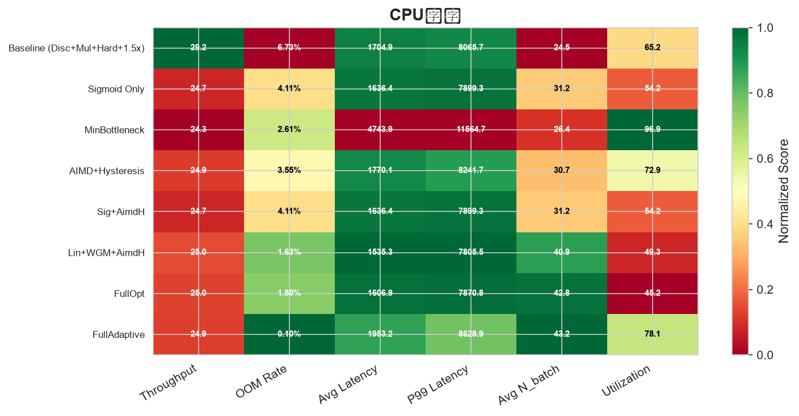

# Atomix Runner 完整架构设计

> 架构版本: v0.3（全面修订）
> 最后更新: 2026-07-20
> 状态: **设计冻结 — 待仿真验证后进入实现**
> 文档中涉及到的算法已经在 /sim/ 下完成仿真

---

## 1. 总体架构

### 1.1 核心命题

Atomix Runner 在**资源紧缺环境**下寄生运行。核心约束：

- 物理内存有限（可能低至 64–256 MB）
- CPU 核心有限（1–4 核常见）
- 磁盘/网络延迟不可控
- 但**吞吐量必须够高**才有竞争力

因此架构设计的三个基石：**内存颗粒度精确、热路径零Runtime介入、线程数与内存并行度解耦**。

### 1.2 组件关系

```
┌─────────────────────────────────────────────────────────────────┐
│                           Runtime（主线程）                       │
│                                                                  │
│  ┌─────────────┐  ┌──────────────┐  ┌────────────────────────┐  │
│  │  TaskPool   │  │ BatchManager │  │     SlotManager         │  │
│  │  (元数据仓)  │  │ (N_batch决策) │  │  (虚地址池 + 物理分配)   │  │
│  └──────┬──────┘  └──────┬───────┘  └───────────┬────────────┘  │
│         │                │                       │               │
│         │    ┌───────────┴───────────┐           │               │
│         │    │  Regression Model     │           │               │
│         │    │  (线性回归修正预测)    │           │               │
│         │    └───────────────────────┘           │               │
│         │                                        │               │
└─────────┼────────────────────────────────────────┼───────────────┘
          │  事件通道 (lock-free SPSC)              │  内存映射
          ▼                                        ▼
┌─────────────────────────────────────────────────────────────────┐
│                    Executor 线程池                                │
│                                                                  │
│  ┌──────────────┐  ┌──────────────┐  ┌──────────────┐           │
│  │  Executor[0] │  │  Executor[1] │  │  Executor[2] │  ← N_batch│
│  │  Thread 0    │  │  Thread 1    │  │  Thread 2    │    个线程  │
│  │  VmState[0]  │  │  VmState[1]  │  │  VmState[2]  │    1:1:1  │
│  │  SandboxMem  │  │  SandboxMem  │  │  SandboxMem  │           │
│  └──────┬───────┘  └──────┬───────┘  └──────┬───────┘           │
│         │                 │                 │                    │
│         ▼                 ▼                 ▼                    │
│  物理内存页           物理内存页          物理内存页             │
│  (按需分配)           (按需分配)          (按需分配)             │
└─────────────────────────────────────────────────────────────────┘
          ▲                                        ▲
          │                                        │
   ┌──────┴──────┐                         ┌──────┴──────┐
   │  磁盘仓库    │                         │  编译预测    │
   │  (.atxe 池) │                         │  memory_prof │
   └─────────────┘                         └─────────────┘
```

### 1.3 分层职责

| 层 | 组件 | 职责 | 运行位置 |
|:---|:-----|:-----|:---------|
| **监管层** | Runtime | 任务池管理、N_batch 决策、内存槽位分配、事件处理、回归模型维护 | 主线程 |
| **执行层** | Executor | 指令取指/解码/执行、Quantum 计时、OOM 自检、事件上报 | N_batch 个线程 |
| **存储层** | 磁盘仓库 | .atxe 二进制持久化、TaskMeta 持久化、统计数据持久化 | 磁盘 |

**关键约束**：Executor 正常执行时 Runtime 零介入。Executor 只在**异常/完成/阻塞**三种情况下通过事件通道上报。

---

## 2. Executor 定义

### 2.1 Executor = VM = 线程（1:1:1）

**Executor 是持有 VmState 并驱动其执行指令的执行体。**

```
Executor {
  ┌──────────────────────────────────────┐
  │ 寄存器文件: [u64; 16]                │
  │ PC: usize                            │
  │ SandboxMemory: Vec<u8>               │
  │   ├── .text (从 .atxe 加载)          │
  │   ├── .rodata (从 .atxe 加载)        │
  │   ├── 堆区 (运行时按需增长)           │
  │   └── 栈区 (运行时按需增长)           │
  │ Quantum 计数器: u32                   │
  │ 状态: Running / Suspended / Halted    │
  │ 事件上报点: &AtomicU64 (Runtime分配)  │
  │ 任务元信息: task_id, slot_id          │
  └──────────────────────────────────────┘
}
```

每个 Executor：
- **独占一个线程**（线程数 = N_batch，由 BatchManager 决定）
- **独占一个 VmState**（没有"切换 VM"的概念，不需要 context save/restore）
- **直接操作自己的 SandboxMemory**（没有中间层、没有间接调用）
- **是"挂机托管"的**——Runtime 把任务和数据分配好之后，Executor 独立执行，正常时不需要和 Runtime 通信

### 2.2 线程数 VS N_batch

```
N_batch = Executor 线程数 = 同时存在于内存中的 VmState 数

线程数固定规则：
  N_batch ≤ CPU 核心数  → 每个 Executor 独占一个核心，零 OS 上下文切换
  N_batch > CPU 核心数  → OS 时间片轮转，但量子充足（~1ms）下开销可忽略
```

N_batch 由 BatchManager 动态计算，但 Executor 线程数变化时**不销毁线程**——多余的线程进入 idle 状态等待新任务。

### 2.3 Executor 主循环

```rust
// Executor 线程的主函数
fn executor_main(mut exec: Executor, event_tx: &AtomicU64) {
    loop {
        match exec.state {
            Running => {
                let should_yield = exec.run_quantum(QUANTUM);
                if should_yield {
                    // quantum 耗尽，上报 Yield 事件
                    event_tx.store(Event::Yield(exec.task_id), Ordering::Release);
                    // 等待 Runtime 分配下一个 quantum（或新任务）
                    exec.wait_for_signal();
                }
            }
            Halted => {
                event_tx.store(Event::TaskDone(exec.task_id, exec.retval), Ordering::Release);
                exec.wait_for_new_task();  // Runtime 分配下一个任务
            }
            Suspended(OOM) => {
                event_tx.store(Event::Oom(exec.task_id, exec.memory_usage), Ordering::Release);
                exec.wait_for_expand();    // Runtime 分配更多内存
            }
            Suspended(Blocked) => {
                event_tx.store(Event::Blocked(exec.task_id), Ordering::Release);
                exec.wait_for_wakeup();    // Runtime 在条件满足时唤醒
            }
            Error(e) => {
                event_tx.store(Event::TaskError(exec.task_id, e), Ordering::Release);
                exec.wait_for_new_task();  // 错误任务终止，分配下一个
            }
        }
    }
}
```

### 2.4 Executor 热路径

Executor 在正常执行时**没有 Runtime 介入的空间**：

```
一条指令的路径（release build）：

  ADD Rd, Rs1, Rs2
    → fetch: 读 self.text[self.pc]           ← 1 次 Vec 索引
    → decode: 拆 opcode + rd + rs1 + rs2    ← 位运算
    → exec: self.regs[rd] = self.regs[rs1] + self.regs[rs2]
                                              ← 2 次 reg 读取 + 1 次写入
    → pc++: self.pc += 1                     ← 整数加法
    → quantum: self.quantum += 1             ← 整数加法
    → 检查: self.quantum < QUANTUM           ← 整数比较

  无锁、无分配、无 Runtime 调用、无 indirect dispatch。
```

OOM 检查不在热路径上——它只插在 `ECALL alloc` 和 `STORE`（栈扩展）之前。这些分配操作本身就不是热路径。

---

## 3. 任务生命周期

### 3.1 完整流转

```
                    ┌──────────────────────┐
    HTTP / 文件     │     任务接入          │
    ─────────────►  │  · 分配 task_id       │
                    │  · 写入磁盘           │
                    │  · 记录 disk_offset   │
                    │  · 读取 memory_profile│
                    └──────────┬───────────┘
                               │
                     ┌─────────▼──────────┐
                     │    TaskPool         │
                     │  (轻量元数据)        │
                     │  ≈ 65 字节/任务      │
                     └─────────┬──────────┘
                               │
                    ┌──────────▼──────────┐
                    │  等待槽位分配         │
                    │  (依赖 BatchManager) │
                    └──────────┬──────────┘
                               │
                    ┌──────────▼──────────┐
                    │  预载                │
                    │  · 磁盘 → 内存缓冲   │
                    │  · Runtime 决定时机   │
                    └──────────┬──────────┘
                               │
                    ┌──────────▼──────────┐
                    │  槽位分配            │
                    │  · SlotManager 分配  │
                    │  · 虚地址 → 物理内存  │
                    └──────────┬──────────┘
                               │
                    ┌──────────▼──────────┐
                    │  Executor 加载执行   │
                    │  · .atxe → VmState   │
                    │  · run_quantum 循环  │
                    └──────────┬──────────┘
                               │
                    ┌──────────▼──────────┐
                    │  完成 / 清理         │
                    │  · 回写结果到磁盘     │
                    │  · 释放物理内存       │
                    │  · 槽位回收           │
                    │  · 更新统计样本       │
                    └─────────────────────┘
```

### 3.2 TaskMeta — 轻量任务元数据

**关键设计**：任务本身（.atxe 二进制）**不在内存中**。只在磁盘上。内存中的只有 TaskMeta：

```rust
struct TaskMeta {
    task_id: u16,              // 4 字节（4B）
    name: [u8; 32],            // 32 字节
    disk_offset: u64,          // 8 字节 — .atxe 文件中的偏移
    disk_size: u32,            // 4 字节 — .atxe 文件大小
    memory_addr: AtomicU64,    // 8 字节 — 运行时的内存地址（运行时填充/更新）
    status: AtomicU8,          // 1 字节 — Init/Ready/Running/Done/Error
    entry_point: u32,          // 4 字节 — 入口 PC 偏移
    compiler_peak_mb: f32,     // 4 字节 — 编译预测峰值（MB）
    actual_peak_mb: f32,       // 4 字节 — 实际峰值（执行后填入）
}
// 总计 ≈ 65 字节 / 任务

// 100 万个任务 → 65 MB     ✅ 可接受（按需分批加载）
// 1 亿个任务   → 6.5 GB    ⚠️ 需按 backlog 分批加载 TaskMeta
```

### 3.3 双地址管理

每个任务始终维护两个地址：

| 地址 | 含义 | 生命周期 | 是否变更 |
|:-----|:-----|:---------|:---------|
| **disk_addr** | .atxe 二进制在磁盘仓库中的位置 | 任务入池到清理 | ❌ 固定 |
| **mem_addr** | 运行时 SandboxMemory 的基址 | 仅在 Running 期间有效 | ✅ 每次加载可能不同 |

**关键**：mem_addr 每次任务加载到 Executor 时都可能不同（取决于 SlotManager 的实时分配策略）。因此 Executor 不保存"这个任务应该在哪"——Runtime 在分配槽位时把 mem_addr 写入 TaskMeta，Executor 通过 `memory_addr` 原子变量读取。

### 3.4 预载机制

Runtime 知道每个 Executor 的当前执行进度，也知道 TaskPool 中下一个就绪任务是谁。因此可以在当前任务执行期间**异步预加载下一任务的 .atxe**：

```
时间线：

T1: Executor[0] 还在执行任务 A（还剩 ~300 条指令）
    → Runtime 从 TaskPool 中选出下一个就绪任务 B
    → 开始异步拉取任务 B 的 .atxe（网络 → 磁盘）

T2: 任务 A 完成
    → 任务 B 的 .atxe 已在本机磁盘
    → 直接从磁盘加载到 Slot[0]（不需要等网络）
    → Executor[0] 加载 VmState，开始执行任务 B

对比：
  · 无预载：任务完成 → 现拉网络 → 等传输 → 加载 → 执行
  · 有预载：网络延迟被隐藏在执行时间背后
```

预载深度可动态调整：
- 网络延迟高 → 预载 2–3 个
- 任务执行时间短 → 预载 2–3 个
- 网络好 + 任务时间长 → 预载 1 个足够

### 3.5 "不进内存"原则

```
任务在以下状态下，.atxe 二进制不在物理内存中：

  · 刚入池（Init）            → 在磁盘
  · 等待依赖（Blocked）        → 在磁盘
  · 就绪但无空槽位（Ready）     → 在磁盘
  · 执行完成（Done）           → 在磁盘（结果已回写）
  · 异常终止（Error）          → 在磁盘（错误已记录）

只有以下状态，任务在物理内存中：

  · 正在执行（Running）        → 在 Executor 的 SandboxMemory 中
  · OOM 挂起等待扩容（OOM）    → 仍在 SandboxMemory 中（被冻结）
```

**这意味着**：100 万个任务入池，内存里最多只有 N_batch 个 VmState。其他 >999,900 个任务只有 65 字节的 TaskMeta。

---

## 4. 内存模型

### 4.1 整体架构

```
                    ┌─────────────────────────┐
                    │   物理内存总量 P MB      │
                    │   (OS 报告可用内存)      │
                    └───────────┬─────────────┘
                                │
                    ┌───────────▼─────────────┐
                    │   安全冗余 β_safety      │
                    │   (默认 15%，宿主预留)    │
                    └───────────┬─────────────┘
                                │
                    ┌───────────▼─────────────┐
                    │   可分配内存池 M         │
                    │   M = P × (1 - β_safety)│
                    └───────────┬─────────────┘
                                │
         ┌──────────────────────┼──────────────────────┐
         ▼                      ▼                      ▼
  ┌──────────────┐    ┌──────────────────┐    ┌──────────────────┐
  │   N_batch     │    │   滑道预留空间    │    │  碎片/管理开销    │
  │  个活动槽位   │    │   = 2 × slot_size │    │                  │
  │  (按需分配)   │    │   (始终不分配)    │    │                  │
  └──────┬───────┘    └──────────────────┘    └──────────────────┘
         │
         ├── Slot[0]: 虚地址 0x0000_0000 (任务 A, 峰值 10MB)
         ├── Slot[1]: 虚地址 0x0000_0100 (任务 B, 峰值 8MB)
         ├── ...
         └── Slot[n-1]
```

### 4.2 虚到实地址分配

**核心思想**：虚地址预分配是管理结构，物理内存按需分配。

```
BatchManager 算出 N_batch = 8
SlotManager 预分配 8 个虚地址槽位 + 2 个滑道槽位：

虚地址空间（线性映射，每槽间隔足够大）:
  Slot[0]:  0x0000_0000_0000  ← 理论起始地址
  Slot[1]:  0x0000_0001_0000  ← 16MB 间隔
  Slot[2]:  0x0000_0002_0000
  ...
  Slot[7]:  0x0000_0007_0000
  ─────────────────────────
  Slip[0]:  0x0000_0008_0000  ← 滑道，永不分配
  Slip[1]:  0x0000_0009_0000  ← 滑道，永不分配

实际物理内存分配（不按槽位均分，按任务实际需求）:
  任务 A（编译器预测 10MB）分配到 Slot[0]:
    → 只分配 10MB 物理内存（不是 16MB）
    → 虚地址 0x0000_0000_0000 映射到这 10MB

  任务 B（编译器预测 8MB）分配到 Slot[1]:
    → 只分配 8MB 物理内存
    → 虚地址 0x0000_0001_0000 映射到这 8MB
```

**优势**：Slot[0] 和 Slot[1] 之间的空洞（16MB - 10MB - 8MB）留着给内存扩展或给其他任务共享。**物理内存不浪费**。

### 4.3 槽位管理

```
struct Slot {
    slot_id: u16,
    vaddr: u64,                  // 虚地址基址
    physical_size: u64,          // 已分配的物理内存大小
    max_size: u64,               // 最大可扩展大小（槽位上限）
    task_id: Option<u16>,        // 当前占用任务（None = 空闲）
    status: SlotStatus,          // Free / Occupied / Dead / Slipway
}
```

槽位分配算法：
```
输入: 任务 T（带有 compile_peak = comp_mb）
      可用槽位列表 free_slots
      修正系数 δ = actual_peak / compile_peak（滑动平均）

1. 预估峰值 = comp_mb × max(δ, 1.2)   ← 安全向上取整，至少 1.2x
2. 在 free_slots 中找 max_size ≥ 预估峰值的槽位
3. 如果有 → 分配，physical_size = 预估峰值
4. 如果没有 → 把任务放入等待队列，等槽位释放
```

### 4.4 滑道溢出机制

当任务 OOM（实际需求超过 assigned max_size）：

```
1. Executor 检测到水位线越过 → 暂停执行
2. Executor 上报 OOM 事件（含当前用量 + 预估扩展量）
3. Runtime 收到事件：
   a. 检查滑道是否有足够空间
   b. 如果有 → 把任务移到滑道区域
      · 原槽位标记为 Dead
      · 任务 VmState 迁移到滑道槽位
      · 扩展 physical_size
   c. 如果没有 → 触发 AIMD 反馈降低 N_batch
4. Executor 恢复执行

滑道始终保留 2 个槽位（1.5x ~ 3x 标准槽位大小），永不分配给新任务。
```

### 4.5 物理内存按需分配

SandboxMemory 底层使用**惰性分配**：

```rust
struct SandboxMemory {
    data: Vec<u8>,        // 物理缓冲区
    capacity: usize,       // 已分配的物理容量
    watermark_high: u64,   // 水位线上限（75%）
    watermark_low: u64,    // 水位线下限（60%，退出警戒）
    heap_base: u64,
    stack_base: u64,
    usage: u64,            // 当前使用量
}
```

- `Vec<u8>` 初始容量 = 编译预测峰值 × 修正系数
- 不预分配多余空间
- 如果运行时超出，通过 `resize()` 扩展（触发 OOM 流程）

**不对 Executor 做页粒度懒映射**——因为那需要 MMU 或复杂的页表模拟，破坏热路径性能。物理内存一次性分配到位，但只分配"够用"的量。

### 4.6 死区合并（Defrag）

任务完成或 OOM 滑移后，原槽位变成"死区"（Dead slot）：

```
初始布局:
  [Slot0: task A] [Slot1: task B] [Slot2: free] [Slip: free] [Slip: free]

task A OOM → 滑入 Slip[0]:
  [Slot0: DEAD] [Slot1: task B] [Slot2: free] [Slip0: task A] [Slip1: free]

task B 完成:
  [Slot0: DEAD] [Slot1: free] [Slot2: free] [Slip0: task A] [Slip1: free]
                            ↑ 合并相邻空闲槽位
  [Slot0: DEAD] [Slot1+2: free (合并)] [Slip0: task A] [Slip1: free]

等到 ROI 合适的时机：
  评估：
    · 当前碎片率 > 30%
    · 且 dead slot 数量 > 2
    · 且当前没有紧急事件
  执行：
    · 把 task A 从 Slip[0] 移回 Slot[0]
    · 或者把 task A 移到 Slot[1+2]（更大），释放 Slip
```

**ROI 计算**：

```
defrag_cost = 迁移任务数 × 迁移时间
defrag_benefit = 回收的死区大小 × 预期驻留时间
               + 碎片率下降带来的分配成功率提升

如果 defrag_benefit > defrag_cost × 2，执行合并。
```

死区合并不需要实时——它是**后台任务**，在 Runtime 空闲时执行。

---

## 5. 事件通道

### 5.1 阻塞型 ECALL 策略

**阻塞型 ECALL 直接阻塞当前 Executor 线程，不做特殊处理。**

```
Executor 遇到 tcp_recv / fs_read 等阻塞型 ECALL：
  → 阻塞在系统调用上
  → 该 Executor 的线程挂起
  → 其他 Executor 线程不受影响（各线程独立）
  → 系统调用返回后继续执行

不引入异步 IO 框架、不返回 Blocked 事件、不回收线程。
```

**理由**：
- Executor = 线程 = VM（1:1:1），阻塞一个不影响其他
- 引入异步 IO 的复杂度远大于收益（需要 IO 框架、回调、状态机）
- 当前阶段不需要"省这个线程"——线程本身就在那，阻塞了也不占 CPU
- 如果将来需要优化（如线程数太少、阻塞频繁），可以后续升级为 io_uring / epoll 事件驱动方案，但不影响现有架构

### 5.2 无锁 SPSC 设计

**原则**：Executor 只写自己的事件点，Runtime 只读所有事件点。单生产者单消费者，天然无锁。

```
Runtime 启动时创建固定大小的事件数组：

  exec_events: [AtomicU64; N_batch]

  Executor[i] 只写 exec_events[i]
  Runtime     只读 exec_events[0..N_batch-1]

写入是原子的（AtomicU64::store）
读取是原子的（AtomicU64::load）
不存在两个线程竞争同一个地址的情况。
```

### 5.2 事件编码

每个事件用一个 u64 编码：

```
  63    48 47    40 39    32 31                0
  ┌────────┬────────┬────────┬──────────────────┐
  │ task_id│ event  │ reserve│     payload       │
  │ 16 bit │ 8 bit  │ 8 bit  │     32 bit        │
  └────────┴────────┴────────┴──────────────────┘

event 类型:
  0x01 = Yield       (quantum 耗尽，请求继续)
  0x02 = TaskDone    (任务正常完成，payload = 返回值)
  0x03 = TaskError   (任务异常终止，payload = 错误码)
  0x04 = Oom         (OOM 挂起，payload = 当前内存用量)
  0x05 = Heartbeat   (定期心跳，payload = 指令数)

Event::None = 0（无事件）

> 阻塞型 ECALL（tcp_recv、fs_read 等）直接阻塞当前 Executor 线程，
> 不需要上报事件。详见 §5.1。
```

### 5.3 Runtime 事件处理

```
Runtime 主循环：

  loop {
      // 1. 检查事件（非阻塞，0 开销当无事件时）
      for i in 0..N_batch {
          let raw = exec_events[i].load(Ordering::Acquire);
          if raw == 0 { continue; }
          exec_events[i].store(0, Ordering::Release);  // 消费
          handle_event(i, raw);  // 根据事件类型处理
      }

      // 2. 处理非事件任务（轮询间隔）
      //    · 检查预载时机
      //    · 检查死区合并时机
      //    · 更新 BatchManager 统计

      // 3. 等待（没有事件时休眠一小段时间）
      if no_events_pending() {
          std::thread::sleep(Duration::from_micros(100));
      }
  }
```

**注意**：Runtime 的"轮询"不是忙等——它是事件驱动的，在事件通道为空时休眠。Executor 上报事件时通过一个**条件变量**唤醒 Runtime（不增加锁竞争，因为条件变量是边缘触发）。

### 5.4 Executor 统计信息共享

Executor 定期（每 quantum 结束时）把运行时统计写入共享内存区域。Runtime 通过它获取全貌，不需要锁：

```
exec_stats: [ExecutorStats; N_batch]   ← 每个 Executor 独占一个元素

struct ExecutorStats {
    pc: AtomicU32,              // 当前 PC
    memory_usage: AtomicU64,    // 当前内存用量
    total_instrs: AtomicU64,    // 总指令数
    total_quantums: AtomicU32,  // 已完成 quantum 数
}
```

Executor 写自己的条目（store），Runtime 读所有条目（load）。单写单读，无需锁。

---

## 6. 调度与负载均衡

### 6.1 任务分配模型

```
TaskPool (就绪任务队列)
       │
       │ 分配策略
       ▼
  ┌─────────┐  ┌─────────┐  ┌─────────┐
  │Exec[0]  │  │Exec[1]  │  │Exec[2]  │  ← N_batch 个
  │Thread 0 │  │Thread 1 │  │Thread 2 │
  └─────────┘  └─────────┘  └─────────┘
```

当 Executor 完成当前任务（TaskDone）或 quantum 耗尽（Yield）时，Runtime 为其分配下一个任务：

```
分配时机：
  · Executor 上报 TaskDone → 立即分配下一个
  · Executor 上报 Yield → 立即分配同一任务的下一 quantum
  · 新任务入池 → 如果有空闲 Executor，立即分配
```

### 6.2 负载均衡算法

**目标**：避免出现"劳模线程"——某些 Executor 忙死，某些 Executor 闲着。

```
算法: 加权最少任务 + 抗偏斜

输入:
  - 就绪任务列表 ready_tasks: Vec<TaskId>
  - Executor 负载统计 load[i]: 当前正在执行的任务的剩余指令估计

输出:
  - 分配映射: ready_task_j → Executor[i]

步骤:
  1. 如果有 Executor 处于 idle（没有任务）
     → 优先分配给它

  2. 否则，计算每个 Executor 的当前负载：
     load[i] = quantum_remaining[i] + pending_io[i] × io_weight
     其中 quantum_remaining[i] = 该 Executor 在 quantum 耗尽前还剩多少指令
          pending_io[i] = 该 Executor 上阻塞的 IO 操作数

  3. 选择负载最低的 Executor：
     selected = argmin(load)
     
  4. 如果多个 Executor 负载接近（差距 < 10%）：
     → 从这些中随机选一个（避免"惊群"效应）

  5. 特殊规则：
     - 如果 ready_tasks 数量 ≥ N_batch × 2（高积压）
       → 改成批量分配：每个 Executor 一次分配 2-3 个任务
       → 减少分配频率，降低 Runtime 调度开销
```

**2 线程时的简化**：N_batch = 2 时直接轮询。

```
2 线程轮询分配：
  ready_task[0] → Executor[0]
  ready_task[1] → Executor[1]
  ready_task[2] → Executor[0]
  ready_task[3] → Executor[1]
  ...
```

### 6.3 预载调度算法

预载在 Runtime 主循环中决策：

```
输入:
  - 每个 Executor 的进度估计（剩余指令数）
  - TaskPool 中下一个就绪任务的列表
  - 网络/磁盘延迟估计 network_latency_ms

算法:
  for each executor[i] in active_executors:
      remaining_instrs = exec_stats[i].total_instrs - exec_stats[i].pc  // 估算
      remaining_time_ms = remaining_instrs × instr_per_ms

      // 如果剩余时间 > 网络延迟，可以预载
      if remaining_time_ms > network_latency_ms × 1.5:
          next_task = peek_next_ready_task(executor[i])
          if next_task 的 .atxe 不在磁盘上:
              async_fetch(next_task)  // 从网络拉取到磁盘
          // 已经在磁盘上则不需要做任何事
```

**预载深度**：
```
prefetch_depth = clamp(
    (avg_exec_time_ms / network_latency_ms).ceil() as u32,
    1,
    MAX_PREFETCH_DEPTH   // 默认 3
)
```

网络好时预载少，网络差时预载多。

### 6.4 任务树（TASK_FORK）调度

**基本原则**：子任务不特殊优先，和普通任务一样从 TaskPool 申请额度。

```
父任务（通过 TASK_FORK 产生任务树）的执行流程：

1. 父任务被加载到 Executor，开始执行
2. 遇到 TASK_FORK 指令 → 产生子任务依赖树
   → Runtime 识别到该任务存在任务树
   → 从最深层依赖（叶子节点）开始调度
   
3. 子任务调度规则：
   · 子任务进入 TaskPool，标记为普通任务
   · 没有任何优先级提升——和所有其他任务一样等待槽位
   · 有额度就用，没额度就等着
   · 所有子任务全部完成前，父任务处于 Suspended(WaitingChildren) 状态

4. 父任务等待策略：
   · 正常情况下：子任务在 TaskPool 中按顺序获得槽位并执行
   · 全部子任务完成后，父任务恢复执行
   
5. 槽位让出机制（高积压场景）：
   · 如果父任务等待时间过长（超过 YIELD_THRESHOLD），且持续无空闲槽位
   · 父任务将自己的当前状态冻结并迁移回磁盘
   · 空出的槽位分配给子任务使用
   · Runtime 接管任务树的调度，继续轮转子任务
```

```
任务树示例：

        父任务 P
        /     \
       A       B
      / \     / \
     D   E   F   G

执行顺序：
  1. 父任务 P 加载，识别到任务树
  2. 先调度最深层：D, E, F, G（无依赖）
     → 它们像普通任务一样申请槽位
     → 哪个先拿到槽位就先执行
  3. D, E 完成后 → A 变为就绪，申请槽位
  4. F, G 完成后 → B 变为就绪，申请槽位
  5. A, B 完成后 → P 变为就绪，申请槽位
  6. P 恢复执行

所有步骤中，子任务和普通任务在同一个 TaskPool 中公平竞争槽位。
无优先级倾斜。
```

## 7. 自适应控制体系

### 7.1 N_batch 计算（修订版）

**硬上限 H** 保持原有公式：

```
H = ⌊ min(C, M, I, N) ⌋

C = (CPU_cores × α_cpu) / CPU_per_task
M = (MEM_free  × α_mem) / MEM_per_task_effective
I = (IOPS_avail × α_io) / IOPS_per_task
N = (NET_avail  × α_net) / NET_per_task
```

**修订点**：`MEM_per_task_effective` 不再是固定值或简单编译预测，而是：

```
MEM_per_task_effective = regression_corrected_peak(task)

regression_corrected_peak(task) = 
    if regression_model.ready:
        α × task.compiler_peak_mb + β
    else:
        task.compiler_peak_mb × 1.5   // 冷启动阶段，保守估计

其中 α 和 β 来自线性回归模型（详见 §7.3）
```

**软上限 S** 保持因子合并 + 加权几何平均，但因子列表增加一个新因子：

```
新增因子：置信因子 θ

θ(r²) = 0.70 + 0.30 × r²
  r² = 回归模型的拟合优度（0~1）

行为：
  r² → 0: θ → 0.70（回归不可靠，收缩 N_batch）
  r² → 1: θ → 1.00（回归可靠，不收缩）

因子列表更新：[β(积压), λ(速度), σ(体积), γ(方差), θ(置信)]
权重分配：[0.20, 0.20, 0.20, 0.15, 0.25]
        （θ 获得最高权重，因为内存精度直接影响 OOM 风险）
```

### 7.2 编译器内存预测

沿用原设计（见下文 §冷启动协议）。每个 .atxe 文件头携带 `memory_profile`：

```rust
struct MemoryProfile {
    code_mb: f32,      // .text 段大小（精确）
    rodata_mb: f32,    // .rodata 段大小（精确）
    stack_mb: f32,     // 栈峰值（上界）
    heap_mb: f32,      // 堆峰值（上界）
    peak_mb: f32,      // 总和上界 = code + rodata + max(stack, heap)
}
```

### 7.3 线性回归修正

**样本收集**：每个任务执行完成后，Runtime 记录一条样本：

```
样本: (compiler_peak_mb, actual_peak_mb)

持久化路径: <data_dir>/stats/memory_samples.csv
格式:
  timestamp, task_id, compiler_peak_mb, actual_peak_mb, 
  task_type, text_size, rodata_size, heap_alloc_count
```

**回归训练**：
```
当样本数 ≥ 50 时，触发一次回归更新：

actual_peak = α × compiler_peak + β + ε

使用普通最小二乘法（OLS）求解 α 和 β：
  α = Σ((x_i - x̄)(y_i - ȳ)) / Σ((x_i - x̄)²)
  β = ȳ - α × x̄

r² = 1 - Σ(y_i - ŷ_i)² / Σ(y_i - ȳ)²
```

**何时使用**：
- 样本数 ≥ 50 且 r² ≥ 0.6 → 使用回归修正
- 样本数 < 50 或 r² < 0.6 → 退回到保守估计（×1.5）
- 每 200 个新样本重新训练一次

**为什么线性回归够用**：
编译预测 `peak_mb` 本身是上界估计。实际峰值与编译预测之间存在线性关系——预测偏高但成比例。线性回归就是学这个"偏高系数"，让分配更精确。它不需要复杂模型。

### 7.4 冷启动协议（修订版）

原设计的冷启动（N_batch = 2 起步）针对"所有任务全进内存"的模型。现在任务和数据分离，冷启动的重点从"怕内存爆"变成**"怕回归模型没有数据"**。

```
阶段 0（首任务 — 无数据）:
  N_batch = 1
  使用编译预测 peak_mb × 1.5 分配槽位
  执行完成后记录 actual_peak / compiler_peak

阶段 1（前 5 个任务 — 少量数据）:
  N_batch = min(2, H)
  每次执行后更新 δ = actual_peak / compiler_peak 的滑动平均
  用 δ × compiler_peak 作为后续分配的依据

阶段 2（5~50 个任务 — 积累期）:
  N_batch = min(H, S)，但 MEM_per_task 使用 δ × compiler_peak
  回归模型还没有足够样本，仍用滑动平均值

阶段 3（≥50 个任务 — 稳定期）:
  回归模型可用（r² ≥ 0.6）
  N_batch = min(H, S)，MEM_per_task 使用回归修正值
  此后 N_batch 接近硬件极限
```

**与原方案的关键区别**：
- 不再需要"N_batch = 2 固定爬坡"
- 爬坡速度取决于任务完成数（每个任务都提供数据）
- 回归模型成熟后自动收敛

---

## 8. 算法规范

### 8.1 负载均衡算法

```
输入:
  ready: Vec<TaskId>      // 就绪任务列表
  exec_load: [f64; N]     // 每个 Executor 的当前负载估计
  exec_idle: [bool; N]    // 每个 Executor 是否空闲

输出:
  assignment: HashMap<TaskId, usize>  // 任务 → Executor 索引

if N == 2:
    // 2 线程直接轮询
    for (i, task) in ready.iter().enumerate():
        assignment[task] = i % 2
else:
    for task in ready:
        // 优先分配给空闲 Executor
        idle_indices: Vec<usize> = (0..N).filter(|i| exec_idle[*i]).collect()
        if !idle_indices.is_empty():
            selected = idle_indices[rand(idle_indices.len())]
        else:
            // 选负载最低的
            min_load = exec_load.iter().min_by(|a, b| a.partial_cmp(b))
            candidates = (0..N).filter(|i| exec_load[i] ≈ min_load ± 10%)
            selected = candidates[rand(candidates.len())]
        
        assignment[task] = selected
        exec_load[selected] += task.estimated_instrs

return assignment
```

### 8.2 预载调度算法

```
输入:
  active: Vec<ExecutorInfo>       // 活跃 Executor 信息
  task_pool: TaskPool             // 任务池
  network_rtt_ms: f64             // 网络往返延迟估计

每个 Event::TaskDone 或 Event::Yield 处理后触发:

for exec in active:
    if exec.status != Running:
        continue
    
    remaining_instrs = exec.quantum_remaining()
    remaining_time_ms = remaining_instrs × AVG_IPC_RATE_NS / 1_000_000
    
    if remaining_time_ms < PREFETCH_THRESHOLD_MS:  // 默认 50ms
        continue
    
    next_tasks = task_pool.peek_next(exec.task_id, prefetch_depth)
    for task in next_tasks:
        if !task.is_on_disk():
            task.start_async_fetch(network_rtt_ms)
```

### 8.3 死区合并算法

```
输入:
  slots: Vec<Slot>                // 所有槽位（含滑道）
  active_executors: Vec<Status>   // 当前活跃度

触发时机:
  · Runtime 事件循环空闲时
  · 每次槽位状态变更后（TaskDone / OOM Slip）

算法:
  1. 计算当前碎片率:
     dead_total = Σ dead_slot.size
     free_total = Σ free_slot.size
     total = Σ all_slot.size
     fragmentation = (dead_total + free_total) / total

  2. 如果 fragmentation < 30% → 不合并（收益不够）
  
  3. 枚举所有可合并的方案:
     for each dead_slot d:
         for each adjacent slot s:
             if s is Free or Dead:
                 merged_size = d.size + s.size
                 // 评估把 d 中的任务移到 merged 是否值得
                 cost = estimate_migrate_cost(d.task)
                 benefit = merged_size × expected_idle_time(d)
                 if benefit > cost × 2:
                     execute_merge(d, s)

  4. 执行迁移:
     migrate_task(d.task → target_slot)
     mark d as Free
     merge adjacent free slots

复杂度: O(S²) 其中 S = 槽位数（通常 ≤ 64），可接受
```

### 8.4 线性回归预测算法

```
struct RegressionModel {
    alpha: f64,          // 斜率
    beta: f64,           // 截距
    r_squared: f64,      // 拟合优度
    sample_count: u64,   // 样本数
    last_trained_at: u64, // 上次训练时的样本数
}

impl RegressionModel {
    fn predict(compiler_peak: f64) -> f64 {
        if self.sample_count < MIN_SAMPLES || self.r_squared < MIN_R_SQUARED {
            return compiler_peak * SAFETY_MULTIPLIER;  // 退回到 ×1.5
        }
        let predicted = self.alpha * compiler_peak + self.beta;
        predicted.max(compiler_peak * 0.5)  // 不能低于编译器预测的一半
              .min(compiler_peak * 3.0)     // 但不能无限高
    }

    fn train(samples: &[(f64, f64)]) {
        // OLS 训练
        let n = samples.len() as f64;
        let sum_x: f64 = samples.iter().map(|(x, _)| x).sum();
        let sum_y: f64 = samples.iter().map(|(_, y)| y).sum();
        let mean_x = sum_x / n;
        let mean_y = sum_y / n;
        
        let num: f64 = samples.iter().map(|(x, y)| (x - mean_x) * (y - mean_y)).sum();
        let den: f64 = samples.iter().map(|(x, _)| (x - mean_x).powi(2)).sum();
        
        if den.abs() < 1e-10 { return; }  // 除零保护
        
        self.alpha = num / den;
        self.beta = mean_y - self.alpha * mean_x;
        
        // 计算 r²
        let ss_res: f64 = samples.iter().map(|(x, y)| (y - (self.alpha * x + self.beta)).powi(2)).sum();
        let ss_tot: f64 = samples.iter().map(|(_, y)| (y - mean_y).powi(2)).sum();
        self.r_squared = 1.0 - ss_res / ss_tot;
        self.sample_count = samples.len() as u64;
    }
}
```

### 8.5 冷启动算法

```
冷启动状态机:

enum ColdStartPhase {
    Bootstrap,       // 阶段 0: 第 1 个任务
    WarmUp,          // 阶段 1: 2~5 个任务
    Accumulate,      // 阶段 2: 6~49 个任务
    Stable,          // 阶段 3: ≥50 个任务且 r² ≥ 0.6
}

每个任务完成后的状态转换:

match phase {
    Bootstrap => {
        n_batch = 1
        delta = actual_peak / compiler_peak
        phase = WarmUp
    }
    WarmUp => {
        delta = EMA(delta, actual_peak / compiler_peak, 0.3)
        n_batch = min(2, H)
        if completed_count >= 5: phase = Accumulate
    }
    Accumulate => {
        delta = EMA(delta, actual_peak / compiler_peak, 0.1)
        n_batch = min(H, S_with_delta)
        if completed_count >= 50: try_train_regression()
        if regression.ready: phase = Stable
    }
    Stable => {
        n_batch = min(H, S_with_regression)
        // 每 200 个任务重新训练一次
        if completed_count - last_train_count >= 200: try_train_regression()
    }
}
```

---

## 9. 持久化存储布局

```
<data_dir>/
├── repo/                          # .atxe 仓库
│   ├── 0000.atxe                  # task_id = 0 的 .atxe
│   ├── 0001.atxe
│   └── ...
│
├── meta/                          # TaskMeta 持久化
│   ├── tasks.db                   # SQLite / 自定义二进制
│   └── task_index.idx
│
├── stats/                         # 统计数据
│   ├── memory_samples.csv         # 编译预测 VS 实际峰值
│   ├── batch_decisions.json       # 每次 N_batch 决策记录
│   ├── executor_stats.json        # Executor 运行统计
│   └── regression_model.json      # 线性回归模型参数
│
└── runner.toml                    # Runner 配置文件
```

---

## 10. 未解决的问题（下一轮讨论）

| 问题 | 说明 | 依赖 |
|:-----|:-----|:-----|
| **Heartbeat 频率** | Executor 的心跳上报频率多少？太快浪费，太慢 Runtime 不敏感 | 仿真调参 |
| **死区合并触发阈值** | 碎片率多少触发？多长时间检查一次？ | 仿真验证 |
| **回归模型更新时机** | 固定 200 样本还是根据误差变化动态触发？ | 数据积累后 |

---

## 11. 仿真验证

仿真框架位于 [`sim/`](../sim/)，用离散时间步进模拟 Runner 的完整任务生命周期，对比 9 种算法变体在 10 个场景下的表现。算法变体涵盖不同的因子平滑方法、合并策略、OOM 反馈和滑道策略组合。

### 算法变体

| 变体 | 平滑 | 合并 | OOM 反馈 | 滑道 |
|------|------|------|----------|------|
| Baseline | Discrete | Mul | Hard | 1.5x |
| Sigmoid Only | Sigmoid | Mul | Hard | 1.5x |
| MinBottleneck | Discrete | Min | Hard | 1.5x |
| AIMD+Hysteresis | Discrete | Mul | AIMD+Hys | 1.5x |
| Sig+AimdH | Sigmoid | Mul | AIMD+Hys | 1.5x |
| Lin+WGM+AimdH | Linear | WGM | AIMD+Hys | Dynamic |
| FullOpt | Sigmoid | WGM | AIMD+Hys | Dynamic |
| FullAdaptive | Adaptive | WGM | AIMD+Hys | P95 |
| FullOpt_v0.3 | Sigmoid | WGM | AIMD+Hys | Dynamic |

### 场景概览

各场景的完整报告（含图表）位于 `sim/reports/`，以下为关键结果汇总。

---

#### ① 稳态混合负载

恒定速率 15 tasks/s 到达的 4 象限混合任务，测试基准吞吐量和稳定性。


| 变体 | 吞吐量 | OOM% | 平均延迟 | P99 | N_batch |
|------|--------|------|---------|-----|---------|
| Baseline | 12.4/s | 0.00% | 2971ms | 16532ms | 10.6 |
| FullOpt | 12.7/s | 0.00% | 2391ms | 19468ms | 10.6 |
| FullAdaptive | 13.0/s | 0.00% | 2769ms | 29210ms | 10.5 |
| Lin+WGM+AimdH | **13.6/s** | 0.00% | 3190ms | 30041ms | 8.9 |

> 稳态下各变体差异不大。Lin+WGM（线性插值 + 加权几何平均）有最高吞吐量但延迟方差较大。

---

#### ② 突发冲击

10s 处突发 5× 任务涌入持续 15s，测试积压处理能力。


| 变体 | 吞吐量 | OOM% | 平均延迟 | P99 | N_batch |
|------|--------|------|---------|-----|---------|
| Baseline | 14.0/s | 0.00% | 2208ms | 14097ms | 11.3 |
| FullOpt | 14.1/s | 0.00% | 2029ms | 14709ms | 11.4 |
| FullAdaptive | 14.3/s | 0.00% | 2022ms | 14424ms | 11.3 |
| Lin+WGM+AimdH | **15.2/s** | 0.00% | 3209ms | 30342ms | 9.8 |

> 突发场景下 Lin+WGM 吞吐领先 8%，但以更高延迟为代价。AIMD+Hysteresis 在突发前后的恢复较平滑。

---

#### ③ 内存压力

80% 任务为大内存类型（100-800MB），测试 OOM 反馈回路和滑道效果。


| 变体 | 吞吐量 | OOM% | 平均延迟 | P99 | N_batch |
|------|--------|------|---------|-----|---------|
| Baseline | 3.9/s | 0.00% | 19289ms | 84008ms | 5.6 |
| FullOpt | **4.1/s** | 0.00% | 20182ms | 89084ms | 5.6 |
| Lin+WGM+AimdH | 2.9/s | 0.00% | 21914ms | 84151ms | 5.2 |

> 内存压力下吞吐量大幅下降（因大任务排队）。FullOpt 通过加权几何平均略微提升。Lin+WGM 的保守策略在此场景下过度收缩 N_batch。

---

#### ④ CPU 压力

大量 CPU 密集型任务（60% 小快 + 25% 小慢），测试槽位利用率和吞吐量上限。




| 变体 | 吞吐量 | OOM% | 平均延迟 | P99 | N_batch |
|------|--------|------|---------|-----|---------|
| Baseline | 27.8/s | 0.00% | 1749ms | 8424ms | 19.9 |
| FullOpt | 27.7/s | 0.00% | 1666ms | 8113ms | 19.9 |
| Lin+WGM+AimdH | **28.5/s** | 0.00% | 2104ms | 17133ms | 18.1 |

> CPU 场景下 N_batch 接近硬件上限（~20），所有变体吞吐量接近。CPU 是硬瓶颈时算法差异被压缩。

---

#### ⑤ 震荡测试

负载在轻重之间快速切换，测试算法稳定性和振荡抑制。


| 变体 | 吞吐量 | OOM% | 平均延迟 | P99 | N_batch |
|------|--------|------|---------|-----|---------|
| Baseline | 16.8/s | 0.00% | 4391ms | 17168ms | 7.4 |
| FullAdaptive | **17.7/s** | 0.00% | 4290ms | 55957ms | 7.2 |
| Lin+WGM+AimdH | 17.5/s | 0.00% | 4509ms | 23413ms | 5.8 |

> 震荡场景下 FullAdaptive（自适应平滑）吞吐最高，自适应陡峭度调节在此场景发挥了作用。但 P99 方差极大。

---

#### ⑥ 长跑稳定性

模拟长时间运行（300s），检测漂移/退化。


| 变体 | 吞吐量 | OOM% | 平均延迟 | P99 | N_batch |
|------|--------|------|---------|-----|---------|
| Baseline | 10.6/s | 0.00% | 4738ms | 53682ms | 8.7 |
| FullAdaptive | 10.9/s | 0.00% | 3208ms | 28977ms | 8.3 |
| Lin+WGM+AimdH | **11.3/s** | 0.00% | 4710ms | 31205ms | 7.1 |

> 长跑场景所有变体均无退化/漂移，算法稳定性通过。Lin+WGM 吞吐最高。

---

#### ⑦ 不平衡负载

任务执行时间差异极大（10ms-20000ms），测试负载均衡效果。


| 变体 | 吞吐量 | OOM% | 平均延迟 | P99 | N_batch |
|------|--------|------|---------|-----|---------|
| Baseline | 18.4/s | 0.00% | 2818ms | 22495ms | 13.6 |
| Lin+WGM+AimdH | **18.8/s** | 0.00% | 3376ms | 37764ms | 12.1 |

> 不平衡负载下 Lin+WGM 有微小优势。各变体差异不大，负载均衡器在此场景起了主要作用。

---

#### ⑧ 冷启动预测误差

编译器预测初始不准确（偏差 2-3×），测试冷启动协议适应性。


| 变体 | 吞吐量 | OOM% | 平均延迟 | P99 | N_batch |
|------|--------|------|---------|-----|---------|
| Baseline | 3.9/s | 0.00% | 4746ms | 58885ms | 6.6 |
| FullAdaptive | **4.1/s** | 0.00% | 4666ms | 59350ms | 6.1 |
| Lin+WGM+AimdH | **4.3/s** | 0.00% | 5911ms | 59811ms | 5.2 |

> 冷启动场景下 FullAdaptive 和 Lin+WGM 的保守策略有助于减少预测误差的影响。总体吞吐较低因回归模型需积累样本。

---

#### ⑨ 高碎片回收

高内存压力 + 频繁 OOM，测试死区碎片回收与 ROI 评估。


| 变体 | 吞吐量 | OOM% | 平均延迟 | P99 | N_batch |
|------|--------|------|---------|-----|---------|
| Baseline | 5.5/s | 0.00% | 10058ms | 57017ms | 4.3 |
| FullOpt | 5.9/s | 0.00% | 14346ms | 83658ms | 4.2 |
| FullAdaptive | **6.4/s** | 0.00% | 12683ms | 71254ms | 4.1 |

> 高碎片场景 FullAdaptive 吞吐领先（+16%），自适应平滑在此场景最能适应碎片变化。N_batch 普遍较低反映了内存紧张。

---

#### ⑩ 大批量小任务预载

极高到达率（50 tasks/s），任务极小（1-50ms CPU），测试预载调度器。


| 变体 | 吞吐量 | OOM% | 平均延迟 | P99 | N_batch |
|------|--------|------|---------|-----|---------|
| **全部** | **51.1/s** | 0.00% | **36ms** | **77ms** | **~46** |

> 小任务场景下所有变体表现完全一致。任务极小（1-50ms），预载调度器始终能提前就绪，延迟极低（36ms）。N_batch 接近硬件上限（~46）。

---

### 综合结论

| 场景 | 推荐变体 | 理由 |
|------|---------|------|
| 稳态/CPU/不平衡 | Lin+WGM+AimdH | 最高吞吐，CPU 瓶颈时延迟可接受 |
| 内存压力/高碎片 | FullOpt / FullAdaptive | 自适应平滑在内存紧张时更优 |
| 突发/震荡 | FullAdaptive | 自适应陡峭度调节抑制振荡 |
| 冷启动 | FullOpt + 回归模型 | 回归模型积累后逐步改善 |
| 预载密集型 | 任意变体 | 任务过小时算法差异消失 |

**总体推荐**：`FullOpt`（Sigmoid + WGM + AIMD+Hysteresis + Dynamic）覆盖大部分场景，`FullAdaptive` 在内存紧张和振荡场景有额外增益。

> 完整报告数据位于 [`sim/reports/`](../sim/reports/)，包含各场景的原始 CSV、JSON 汇总和所有图表。
> 仿真框架位于 [`sim/`](../sim/)，运行 `python -m sim.main --quick` 快速验证。

---

> **本文件是 Runner 架构的唯一权威设计文档。**
