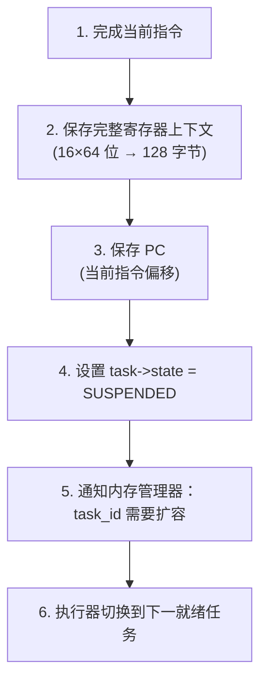
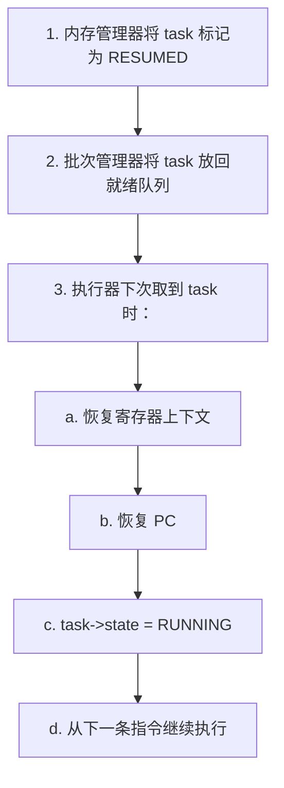
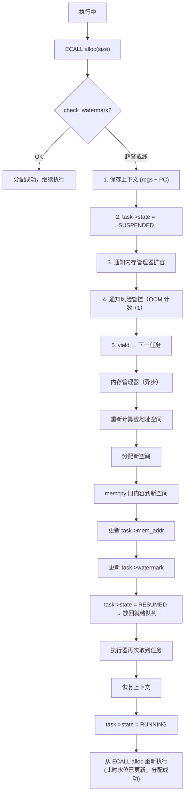

# Atomix 执行器设计

> 架构版本: v0.1 (设计阶段)
> 配套文档: 详见 运行时架构.md、02-指令集规范.md

---

## 1. 概述

执行器（Executor）是 VM 中**实际跑指令**的组件。它从批次管理器拿到任务，取指、解码、执行，在时间片耗尽或阻塞时让出。

执行器有三个核心能力：

| 能力 | 说明 |
|------|------|
| **指令执行** | 标准取指/解码/执行循环，52 条指令 |
| **安全挂起** | 执行中途检测到内存不足时，安全暂停任务，扩容后恢复 |
| **上下文切换** | 寄存器保存/恢复，任务间无缝切换 |

---

## 2. 指令执行循环

```
while (task->state == RUNNING) {
    instr = fetch(task->pc);          // 从 task->mem_addr + pc*4 取 32 位指令
    opcode = instr & 0xFF;
    operand = instr >> 8;

    handler = dispatch_table[opcode]; // 256 条目查找表
    handler(task, operand);           // 每条指令一个 C 函数

    task->pc++;
    task->quantum_consumed++;

    if (task->quantum_consumed >= QUANTUM) {
        yield(task);                  // 时间片耗尽，让出
        break;
    }
}
```

**dispatch_table** 是 256 个函数指针的数组，未使用的 opcode 指向 `illegal_instruction` 处理函数。

---

## 3. 内存边界检测

每个任务在加载时获得一个**预分配虚地址空间**（详见 运行时架构.md §5.1）。执行器在执行过程中持续监控内存使用。

### 3.1 水位线机制

任务内存空间划分为三个区段：


| 区段 | 范围 | 行为 |
|------|------|------|
| 安全区 | 0% – 75% 水位 | 正常分配，不触发任何检查 |
| 警戒线 | 75% – 90% 水位 | ECALL alloc 前检查，超过则触发 OOM_WARNING 事件；允许完成当前 Step |
| 保留区 | 90% – 100% | 拒绝所有新分配；触发强制 GC；若仍不足则任务滑入滑道扩容 |

- **安全区**：正常分配，不触发任何检查
- **警戒线**：每次分配时检查——若超过此线，标记"即将 OOM"
- **保留区**：预留的缓冲空间，供暂停过程中保存上下文等关键操作使用

### 3.2 触发检测的时机

执行器在以下指令执行**之前**检查内存水位：

| 指令 | 检查原因 |
|------|----------|
| `ECALL alloc` | 堆内存分配 |
| `CALL` | 新栈帧可能触发栈扩展 |
| `TASK_FORK` | 子任务上下文分配 |
| `LOAD`/`STORE`（栈相对） | 大偏移可能触发栈增长 |

### 3.3 检测开销

水位线比较是一条整数比较指令（`current_usage > watermark`），嵌在 dispatch 路径中。不触发 OOM 时**零额外开销**（分支预测友好）。

---

## 4. 安全挂起与恢复

### 4.1 挂起协议

当检测到内存越过警戒线：



**关键约束：** 挂起永远发生在指令边界。不存在"执行到一半的指令需要回滚"的情况。

### 4.2 暂停指令注入

执行器不需要"插入"额外的停止指令。水位线检查是 dispatch 循环的内联逻辑：

```c
static inline bool check_watermark(Task* task, size_t alloc_size) {
    if (task->mem_used + alloc_size > task->watermark) {
        suspend_task(task);
        return false;  // 调用者看到 false，跳过分配操作
    }
    return true;
}

// 在 ECALL alloc 的处理函数中:
case ECALL_ALLOC:
    if (!check_watermark(task, task->regs[R4])) return;
    task->regs[R4] = do_alloc(task, task->regs[R4]);
    break;
```

没有信号、没有中断、没有指令注入——就是**在分配点之前多看一行判断**。

### 4.3 恢复协议

内存管理器完成扩容后：



任务不感知自己被挂起过——恢复后的寄存器、PC、内存内容与挂起前完全一致。

---

## 5. OOM 处理完整流程



---

## 6. 上下文切换

### 6.1 切换时机

| 触发条件 | 切换类型 |
|----------|----------|
| QUANTUM 耗尽（1000 条指令） | 协作式让出 |
| ECALL 阻塞（tcp_recv, fs_read...） | 阻塞式挂起 |
| OOM（内存越警戒线） | 紧急挂起 |
| TASK_JOIN（等待子任务） | 阻塞式挂起 |
| TASK_RET（任务完成） | 终止 |

### 6.2 切换开销

```
保存: 16×8 字节 (regs) + 8 字节 (PC) + 8 字节 (SP/FP) = 144 字节
      ≈ 18 条 MOV 指令

恢复: 同上，≈ 18 条 MOV 指令

总开销: ~36 条指令 ≈ 在 1M 条/秒的执行速率下 ≈ 36 微秒
```

### 6.3 零拷贝上下文

寄存器和 PC 保存在任务的 `TaskContext` 结构体中，不在栈上。切换时不涉及 `memcpy`——只是指针重定向：

```c
// 不是 memcpy(&save_area, regs, ...)
// 而是直接写任务的上下文结构
task->ctx.regs[R0] = ...;
task->ctx.regs[R1] = ...;
...
task->ctx.pc = task->pc;
```

---

## 7. 与批次管理器的协作

执行器不决策并发数——那是批次管理器的职责。执行器只报告：

| 报告事件 | 含义 |
|----------|------|
| 任务正常完成 | 释放槽位，回收内存 |
| 任务 OOM 挂起 | 风险管控计数 +1 |
| 任务阻塞（ECALL） | 释放当前槽位给其他任务 |
| QUANTUM 耗尽 | 任务放回就绪队列末尾 |

批次管理器根据报告调整 N_batch（详见 运行时架构.md §4–§5）。

---

## 8. 指令级安全

### 8.1 边界检查

```
LOAD  Rd, [Rs + imm]  →  检查 Rs+imm 是否在 task->mem_addr 范围内
STORE [Rd + imm], Rs  →  同上
JMPR  Rd              →  检查 Rd 是否指向 .text 段内有效指令
```

越界访问不崩溃——转为 `THROW` 安全异常，由任务的 TRY 块或上层捕获。

### 8.2 非法指令

dispatch_table 中未分配的 opcode → `illegal_instruction(task)` → `THROW` 非法指令异常。

### 8.3 除零

`DIV Rd, Rs1, Rs2` 当 `Rs2 == 0` 时 → `THROW` 除零异常。

---

## 9. 执行统计

执行器维护每个任务的运行时统计，供动态并发公式使用：

| 指标 | 说明 |
|------|------|
| `total_instrs` | 已执行指令数 |
| `ecall_count` | 系统调用次数 |
| `blocking_count` | 阻塞次数（ECALL 阻塞 + TASK_JOIN） |
| `oom_count` | OOM 挂起次数 |
| `quantum_count` | 时间片耗尽次数 |
| `wall_time` | 实际执行耗时。批次管理器用于计算 μ_t、σ_t、v_t |
| `peak_mem` | 执行期间内存峰值 (MB)。批次管理器用于计算 μ_m、σ_m |

---

> 执行器是 VM 中最内层的循环。设计原则：**热路径零开销、挂起在指令边界、扩容对任务透明**。
