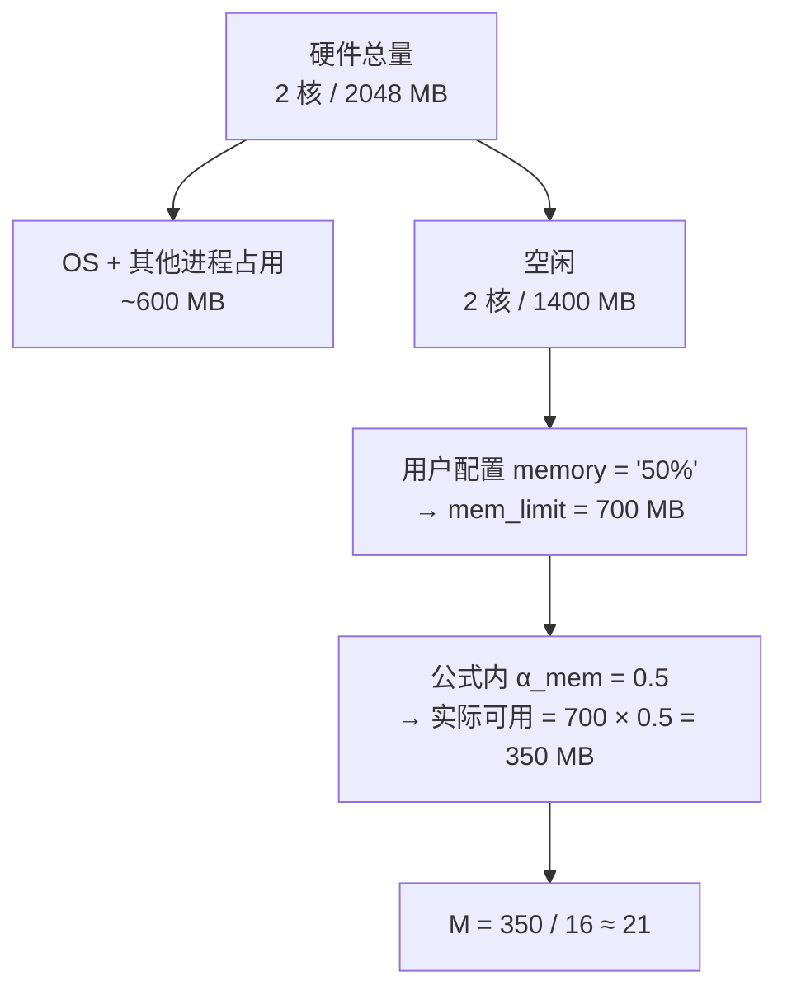

# Atomix 资源配置

> 架构版本: v0.1 (设计阶段)
> 配套文档: 详见 运行时架构.md §4、外围工具.md

---

## 1. 设计原则

Atomix 的资源策略就两个字：**克制**。不抢 CPU、不占满内存、不跑满磁盘。

资源配置决定的是：**实际可用量**——不是硬件总量。公式用实际可用量去算并发上限，不是用总量。

配置支持两种写法：

| 写法 | 示例 | 含义 |
|------|------|------|
| **绝对值** | `"256MB"` `"1.5"` `"5000"` | 硬写一个值 |
| **百分比** | `"50%"` `"75%"` | 基于检测值的百分比 |

---

## 2. 配置位置

### 2.1 Runner 配置（生产环境）

`/etc/atomix/runner.toml` 或 `--config` 指定路径：

```toml
[resources]
cpu     = "75%"        # 使用 75% 的 CPU 核数
memory  = "50%"        # 使用 50% 的空闲内存
iops    = "50%"        # 使用 50% 的磁盘 IOPS
network = "60%"        # 使用 60% 的网络带宽

# 或绝对值
[resources]
cpu     = "1.5"        # 精确 1.5 核
memory  = "256MB"      # 最多 256 MB
network = "10MB/s"     # 最多 10 MB/s
```

### 2.2 项目配置（开发/测试）

`atomix.toml` 的 `[settings.runtime]` 段（已有基础字段，扩展资源项）：

```toml
[settings.runtime]
max_memory = "256MB"       # 已有字段，等同于 resources.memory
cpu        = "50%"         # 新增
```

### 2.3 命令行临时覆盖

```bash
atomix runner run cleanup --max-memory 128MB --cpu 1
```

命令行覆盖 > 项目配置 > Runner 配置。优先级链：CLI > atomix.toml > runner.toml。

---

## 3. 百分比的计算基准

百分比不是基于硬件总量，而是基于**检测值**：

| 配置项 | 100% 的基准 | 检测方式 |
|--------|------------|----------|
| `cpu` | 物理核数 | `sysconf(_SC_NPROCESSORS_ONLN)` / `GetSystemInfo` |
| `memory` | **空闲**物理内存 | OS 查询空闲页数 × 页大小 |
| `iops` | 启动时基准测试结果 | 随机 4K 读 30 秒取均值 |
| `network` | 网卡带宽上限 | `ethtool` / `GetIfEntry` |

> **memory 基于空闲内存而非总内存。** 一台 2GB 服务器，OS + Web 服务 + 数据库占了 600MB，空闲只有 1400MB。`memory = "50%"` 意味着 Atomix 最多拿 700MB——不会去抢那 600MB 已用的。

---

## 4. 公式中的使用

用户配置的可用量直接替代 OS 检测值，进入并发公式：

```
H = min( C, M, I, N )

C = (cpu_limit  × α_cpu) / CPU_per_task     # cpu_limit 来自用户配置
M = (mem_limit  × α_mem) / MEM_per_task     # mem_limit 来自用户配置
I = (iops_limit × α_io)  / IOPS_per_task    # iops_limit 来自用户配置
N = (net_limit  × α_net) / NET_per_task     # net_limit 来自用户配置
```

其中 `α_*` 是内部保留系数（详见 运行时架构.md §4.2），与用户配置独立——用户配的是"给 Atomix 多少"，α 是"Atomix 自己留多少余量"。

**两层收缩示意：**



---

## 5. 完整配置参考

```toml
# /etc/atomix/runner.toml

[runner]
listen   = "0.0.0.0:9000"
task_dir = "/var/atomix/tasks"
state_dir = "/var/atomix/state"

# 资源配置（绝对值写法）
[resources]
cpu     = "1.5"        # 使用 1.5 个 CPU 核
memory  = "256MB"      # 使用 256 MB 内存
iops    = 5000          # 使用 5000 IOPS
network = "10MB/s"     # 使用 10 MB/s 带宽

# 资源配置（百分比写法——与上面二选一，不可混用）
# [resources]
# cpu     = "75%"
# memory  = "50%"
# iops    = "50%"
# network = "60%"

# 内部保留系数覆盖（可选——通常不需要改）
[coefficients]
alpha_cpu = 0.75
alpha_mem = 0.50
alpha_io  = 0.50
alpha_net = 0.60

# 每任务资源估算覆盖（可选——根据实际任务特征调整）
[per_task]
cpu     = 0.25    # 每任务平均 CPU 核数
memory  = 16      # 每任务内存 MB
iops    = 100     # 每任务 IOPS
network = 1.0     # 每任务带宽 MB/s
```

---

## 6. 算例：配置如何影响并发

**同一个 2C2G 服务器，不同配置的结果：**

| 方案 | CPU | Memory | 效果 | 并发数 |
|------|-----|--------|------|--------|
| 极克制 | 25% (0.5核) | 25% (350MB) | Runner 几乎不可察觉 | ~1-2 |
| 均衡 (推荐) | 50% (1核) | 50% (700MB) | 明显吞吐，不影响其他服务 | ~4-6 |
| 激进 | 75% (1.5核) | 75% (1050MB) | 最大化吞吐，可能挤压宿主 | ~8-10 |

同一个硬件，从"一次跑 1 个"到"一次跑 10 个"——全由配置的克制程度决定。

---

> 资源配置决定了公式的输入。公式不变，输入变了，输出自然变。配置越克制，Atomix 越卑微——这正是设计意图。
