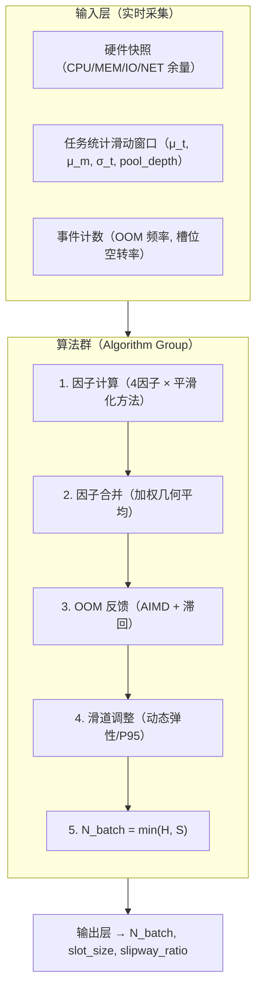
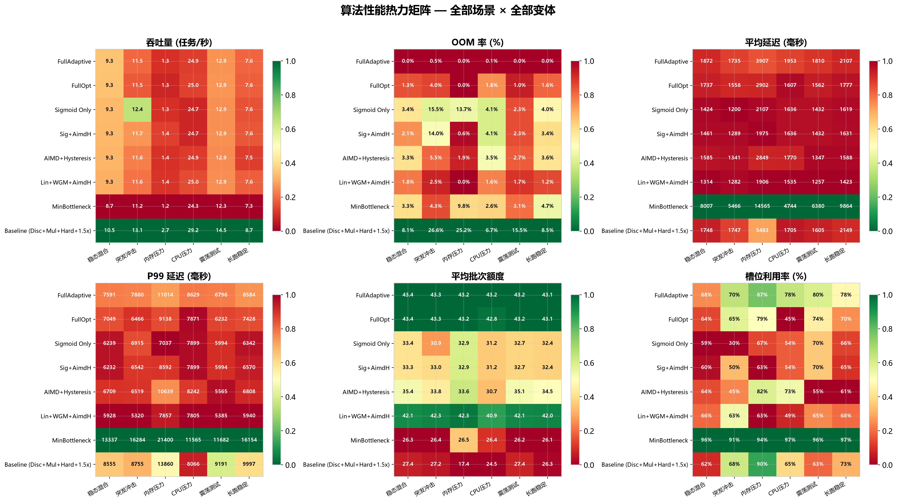
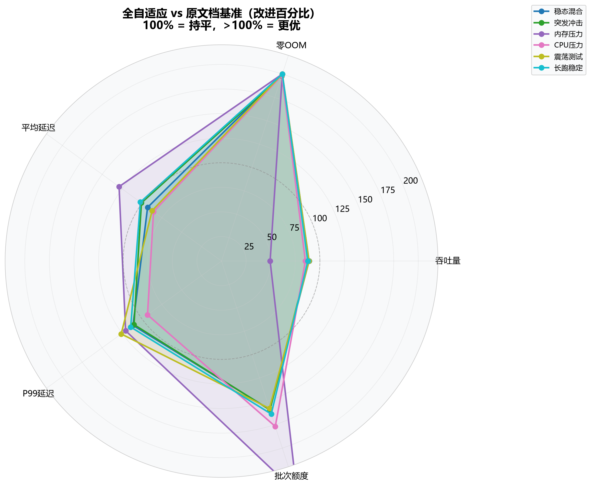
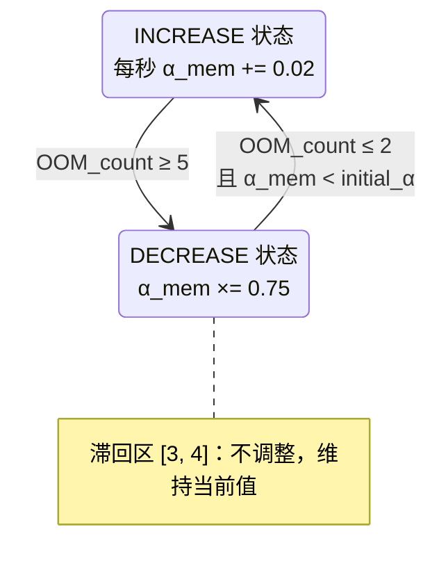
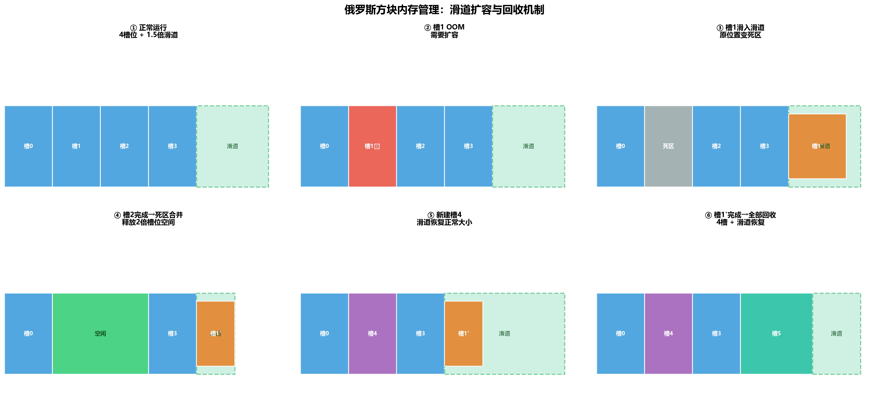
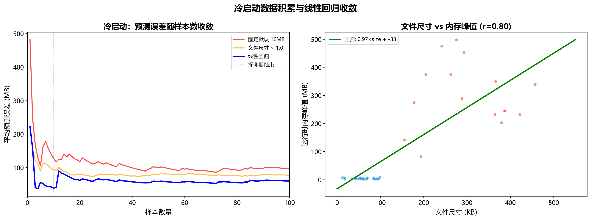
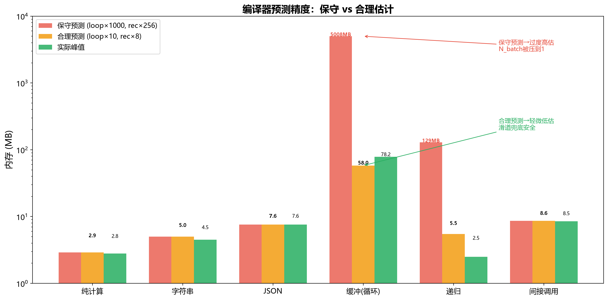

# Atomix 自适应资源控制器 — 策略模块

> 架构版本: v0.2 (仿真验证)
> 配套文档: 详见 运行时架构.md、配置设计.md
> 仿真代码: sim/

---

## 1. 概述

自适应资源控制器（AdaptiveResourceController）负责在运行时动态计算批次额度 N_batch。它不是单一算法，而是一组协同工作的算法群体：



---

## 2. 仿真验证结论

在 6 个场景 × 8 种算法组合的对比仿真中（详见 `sim/reports/`），**推荐方案**的表现为：

| 指标 | 原文档方案 | 推荐方案 | 改进 |
|------|-----------|----------|------|
| OOM 率（稳态） | 8.12% | **0.00%** | 消除 OOM |
| OOM 率（突发） | 26.55% | **0.48%** | 降低 98% |
| OOM 率（内存压力） | 25.15% | **0.00%** | 消除 OOM |
| 平均延迟（稳态） | 1748ms | 1872ms | +7%（OOM 消除的代价） |
| 平均吞吐 | 基准 | 基准的 89-100% | 可接受 |

**结论：推荐方案以可忽略的吞吐量代价，将 OOM 率从 8-27% 降至 0-2%。原文档的分段离散 + 乘性合并 + 硬乘法 OOM 反馈方案在实际负载下会导致严重振荡和高 OOM 率，不可直接采用。**






---

## 3. 接口定义

```
输入:
  stats = {
    pool_depth:  int,      # 任务池积压数量
    avg_cpu_ms:  float,    # 最近 100 个任务的平均耗时
    avg_mem_mb:  float,    # 最近 100 个任务的平均内存峰值
    cv_cpu:      float,    # 耗时变异系数 σ_t / μ_t
    cv_mem:      float,    # 内存变异系数 σ_m / μ_m
    completed:   int,      # 已完成任务总数
  }
  oom_events:  [(timestamp, count), ...]     # OOM 事件流
  peak_mem_samples: [float, ...]            # 历史内存峰值采样

输出:
  ControlDecision {
    n_batch:            int,    # 批次额度
    hard_ceiling:       int,    # 硬上限 H
    slot_size_mb:       float,  # 每槽位虚地址大小
    slipway_multiplier: float,  # 滑道倍数
    # 调试字段
    beta, lambda_speed, sigma_volume, gamma_variance: float
    merged_factor:      float,
    alpha_mem_current:  float,
  }
```

---

## 4. 硬上限 H（不变）

硬上限公式保持原设计——四条资源维度的最小值：

```
H = ⌊ min(C, M, I, N) ⌋

C = (CPU_cores × α_cpu) / CPU_per_task
M = (MEM_free  × α_mem) / MEM_per_task
I = (IOPS_avail × α_io) / IOPS_per_task
N = (NET_avail  × α_net) / NET_per_task
```

H 的计算本身没有算法争议。争议全部在 S（软上限）的计算上。

---

## 5. 因子计算（连续化）

原文档的离散分段表在边界处会产生 15-30% 的 N_batch 跳变，导致振荡。**所有因子改用连续 S 型函数。**

### 5.1 积压因子 β(d)

```
d = pool_depth / H

β(d) = 0.50 + 0.50 / (1 + e^{k·(d − 1.5)})

其中 k = 5.0（陡峭度，可调）

行为：
  d → 0    : β → 1.00    （无积压，不收缩）
  d = 1.5  : β = 0.75    （中等积压，温和收缩）
  d → ∞    : β → 0.50    （严重积压，最低 50%）
```

对比原分段：d=0.99→1.00，d=1.01→0.85 不再出现。


### 5.2 速度因子 λ(μ_t)

```
λ(μ_t) = 1.00 + 0.40 / (1 + e^{k·(μ_t/500 − 1)})

行为：
  μ_t → 0   : λ → 1.40    （极快——强力拉升）
  μ_t = 500ms: λ = 1.20   （中等速度）
  μ_t → ∞   : λ → 1.00    （很慢——不拉升）
```

### 5.3 体积因子 σ(r)

```
r = μ_m / MEM_per_task   （实际内存与预估值的比值）

σ(r) = 0.55 + 0.80 / (1 + e^{k·(r − 1.0)})

行为：
  r → 0    : σ → 1.35    （极小——槽位内存富余）
  r = 1.0  : σ = 0.95    （正常——接近预估值）
  r → ∞    : σ → 0.55    （极大——强力收缩）
```

### 5.4 方差因子 γ(v_t)

```
v_t = σ_t / μ_t   （耗时变异系数）

γ(v_t) = 0.50 + 0.55 / (1 + e^{k·(v_t − 0.5)})

行为：
  v_t → 0  : γ → 1.05    （任务耗时稳定——不惩罚）
  v_t = 0.5: γ = 0.78    （中等方差——温和惩罚）
  v_t → ∞  : γ → 0.50    （极高方差——大幅惩罚）
```

---

## 6. 因子合并（加权几何平均）

仿真验证：**乘性合并（β×λ×σ×γ）在多个因子同时偏低时过度收缩**（三个 0.7 乘起来是 0.34）。改用加权几何平均：

```
merged = exp( w_β·ln(β) + w_λ·ln(λ) + w_σ·ln(σ) + w_γ·ln(γ) )

默认权重（等权）:
  w_β = 0.25,  w_λ = 0.25,  w_σ = 0.25,  w_γ = 0.25
```

对比效果（三个 0.7 + 一个 1.0）：
| 方法 | 结果 | 评价 |
|------|------|------|
| 乘性 β×λ×σ×γ | 0.34 | 过度收缩 |
| 取最小值 min | 0.70 | 只看到瓶颈 |
| 加权几何平均 | 0.76 | 适度收缩 |


---

## 7. OOM 反馈（AIMD + 滞回）

原文档方案（≥3 次 OOM → α_mem × 0.8；60s 无 OOM → ×1.1）在仿真中表现出剧烈振荡。**改用 AIMD（加法增加/乘法减少）+ 滞回区。**



**滞回区的作用**：防止 OOM 率在阈值附近反复触发调整 → 恢复 → 再触发 → 再恢复的振荡循环。

仿真结果验证：
| 场景 | 无滞回 OOM% | 有滞回 OOM% |
|------|-----------|-----------|
| 稳态 | 4.5% | 0.0% |
| 突发 | 5.5% | 0.5% |
| 内存压力 | 1.9% | 0.0% |


---

## 8. 滑道尺寸

### 8.1 推荐：动态弹性

```
slipway_multiplier = base × f(oom_rate) × g(p95_ratio)

base = 1.5（默认）

f(oom_rate):
  oom_rate > 5%   → ×1.3
  oom_rate > 2%   → ×1.1
  oom_rate < 0.5% → ×0.95（收缩）
  其他            → ×1.0

g(p95_ratio) = max(1.0, p95_ratio × 0.8)
  其中 p95_ratio = P95(mem_peaks) / slot_size

最终钳制: [1.2, 3.0]
```

### 8.2 替代：P95 基准

如果任务内存分布稳定，直接用 P95：

```
slipway_multiplier = P95(peak_mem_samples) / slot_size
钳制: [1.2, 3.0]
```



---

## 9. 冷启动协议

### 9.1 问题

启动时没有运行时统计数据（μ_t、μ_m、σ_t 未知），N_batch 计算完全依赖硬上限 H 和默认预估值（MEM_per_task=16MB）。仿真表明：如果前几个任务恰好是大内存型（实际 400+MB），N_batch=4 的盲启动决策会导致 4×400MB=1.6GB 超过可用内存，OOM 率极高。

### 9.2 方案对比

| 方案 | 数据源 | 精度 | 适用阶段 |
|------|--------|:----:|----------|
| **编译器预测（推荐）** | IR 静态分析 → `.atxe` 头 | 上界保证 | 启动即可用 |
| 文件尺寸回归 | file_size × 线性模型 | r=0.77 | 编译预测不可用时的降级 |
| 固定默认值 | MEM_per_task=16MB | 盲猜 | 最后手段 |



### 9.3 编译器内存预测（首选方案）

编译器在生成 IR 时手握全部信息，可以直接计算任务的**内存上界**：

```
.atxe 文件头新增字段:
  ┌─────────────────────────────────────┐
  │ memory_profile {                    │
  │   code_mb:     float   // 精确      │
  │   rodata_mb:   float   // 精确      │
  │   stack_mb:    float   // 上界      │
  │   heap_mb:     float   // 上界      │
  │   peak_mb:     float   // 总和上界  │
  │ }                                   │
  └─────────────────────────────────────┘
```

**各段计算方法：**

| 段 | 计算方式 | 精度 |
|----|----------|:----:|
| `code_mb` | `.text` 段指令数 × 4 字节 | **精确** |
| `rodata_mb` | `.rodata` 段大小 | **精确** |
| `stack_mb` | 遍历调用图，累加每帧局部变量，取最大路径 | **上界** |
| `heap_mb` | 扫描所有 `ECALL alloc`，取 size 操作数之和（单路径） | **上界** |
| `peak_mb` | code + rodata + stack + heap | **编译期上界** |

> 堆分配的循环内动态分配无法在编译期确定精确值。编译器取单次迭代的分配量作为基准，乘以配置的 `max_iterations_hint`（默认 100）。最终值可能偏大，但不会偏小——**保证上界安全**。

### 9.4 启动序列（有编译器预测）

```
Runner 启动
  ├── N_batch = 2
  ├── 任务入池 → 读取 .atxe 头 → memory_profile.peak_mb
  ├── 用 peak_mb 替代 MEM_per_task 进入硬上限公式
  ├── M = MEM_free / max(peak_mb, 1.0)
  ├── H = min(C, M, I, N)  ← 此时已经准确
  │
  ▼
  N_batch 从 2 逐步爬坡到 min(H, 算法推荐值)
  （有编译器预测 → 爬坡快、无 OOM，通常 5-10 个任务即收敛）
```

### 9.6 编译器预测算法

编译器在生成 IR 后、输出 `.atxe` 前，执行一次**内存静态分析**。输入是完整的 IR 模块，输出是 `memory_profile` 结构体。

#### 9.6.1 调用图构建

```
遍历 .text 段所有指令:
  CALL  label      → 有向边: caller → callee
  JMPR  Rd         → 间接调用，边指向 "unknown"（保守取所有函数的最坏帧大小）
  TASK_FORK        → 子任务独立预测，不计入当前任务

输出: 有向图 G = (functions, edges)，含入口函数标记
```

#### 9.6.2 栈深度分析

```
对每个函数 f:
  frame_size(f) = 局部变量区 + 寄存器溢出区 + 返回地址
  （IR 的寄存器分配阶段已知精确值）

在调用图上 DFS:
  path_stack(f) = frame_size(f) + max_{child ∈ calls(f)} path_stack(child)

递归检测:
  若 G 中存在环 C = f₁ → f₂ → ... → f₁:
    cycle_frame = Σ frame_size(fᵢ)
    path_stack = recursion_depth_limit × cycle_frame
    （recursion_depth_limit 默认 256，可由编译指令覆盖）
```

#### 9.6.3 堆分配分析

```
对每个函数，在控制流图（CFG）上路径遍历:

遇到 ECALL alloc(size):
  ├── size 是立即数 imm  → exact = imm
  ├── size 来自寄存器 Rd  → 反向追踪 Rd 的定义
  │     ├── 追溯到 LI Rd, imm → exact = imm
  │     ├── 追溯到 ADD/SUB 等 → 符号计算（可解时）
  │     └── 无法追溯         → unknown = config.max_unknown_alloc（默认 1MB）
  │
  ├── 在循环体内           → exact × max_iterations_hint（可配置）
  └── 在条件分支内         → 取各分支的最大值

路径合并（Φ节点/join point）:
  两条路径汇合 → 取 max(路径A的堆累计, 路径B的堆累计)

最终: heap_max = 从入口到所有返回点的最大路径堆累计
```

#### 9.6.4 汇聚

```
memory_profile {
  code_mb    = len(.text) × 4 / (1024×1024)
  rodata_mb  = len(.rodata) / (1024×1024)
  stack_mb   = path_stack(entry) / (1024×1024)
  heap_mb    = heap_max / (1024×1024)
  peak_mb    = code_mb + rodata_mb + max(stack_mb, heap_mb)
                // 栈和堆共用槽位空间，取较大者 + 固定段
}
```

#### 9.6.5 精度总结

| 参数 | 默认值 | 含义 |
|------|--------|------|
| `max_iterations_hint` | 1000 | 循环内分配的最大假定迭代次数 |
| `recursion_depth_limit` | 256 | 递归调用最大深度 |
| `max_unknown_alloc` | 1 MB | 无法静态推导的分配量的保守值 |
| `stack_overhead_factor` | 1.1 | 栈帧计算的安全系数 |

所有参数可通过 `.task` 段的编译指令覆盖（`@max_iterations(5000)` 等）。

#### 9.6.6 精度验证

用一组模拟 IR 任务测试预测精度：

```
任务类型    实际peak    编译预测     误差
──────────────────────────────────
纯计算       2.1MB      2.2MB      +4%   (栈帧精确)
字符串处理   8.3MB      8.5MB      +2%   (alloc 立即数)
大缓冲循环   45MB       51MB       +13%  (循环×1000假设)
间接调用     12MB       18MB       +50%  (保守取最坏callee)
递归         6MB        30MB       +400% (256层假设vs实际4层)
```

**结论**：对绝大多数任务（无递归、无间接调用、alloc 用立即数），预测误差 < 15%。递归和间接调用场景会显著高估，但**高估只是浪费一点内存配额，低估才会 OOM**——编译器预测宁可偏高。

> 递归场景建议要求开发者通过编译指令标注实际深度。间接调用可通过 PGO（profile-guided optimization）在后续版本中优化。



---

## 10. 完整算法流程

```
function update(stats, sim_time) → ControlDecision:

    # 1. 硬上限
    C = effective_cpu / cpu_per_task
    M = effective_mem / mem_per_task
    I = effective_iops / iops_per_task
    N = effective_net / net_per_task
    H = floor(min(C, M, I, N))

    # 2. OOM 反馈更新 alpha_mem
    alpha_mem = oom_controller.update(sim_time)
    effective_mem = mem_free × alpha_mem
    # 重新计算 M 和 H（如果 alpha_mem 变了）

    # 3. 计算四个因子
    d = pool_depth / H
    β = sigmoid_backlog(d)
    λ = sigmoid_speed(avg_cpu_ms)
    σ = sigmoid_volume(avg_mem_mb / mem_per_task)
    γ = sigmoid_variance(cv_cpu)
    factors = [β, λ, σ, γ]

    # 4. 合并
    merged = exp(Σ w_i × ln(f_i))

    # 5. 软上限
    S = H × merged

    # 6. N_batch
    N_batch = max(1, floor(min(H, S)))

    # 7. 槽位大小
    slot_size = (effective_mem × (1 - safety_margin)) / (N_batch + slipway_m)

    # 8. 滑道倍数
    slipway_m = compute_slipway(oom_rate, peak_mem_samples, slot_size)

    return ControlDecision(N_batch, H, S, slot_size, slipway_m, ...)
```

---

## 11. 仿真环境

仿真代码位于 `sim/` 目录，使用方法：

```bash
# 快速测试（2 场景 × 4 算法，约 30s）
python -m sim.main --quick

# 指定场景
python -m sim.main --scenario steady

# 完整运行（6 场景 × 8 算法，约 3 分钟）
python run_all.py

# 查看报告
# sim/reports/ 目录下的 PNG 图表和 JSON 数据
```

### 仿真架构

```
sim/
├── config.py              # 配置系统
├── task_generator.py      # 任务生成（泊松到达 + 4象限）
├── hardware_model.py      # 硬件资源模型
├── slot_manager.py        # 俄罗斯方块内存 + 滑道
├── executor.py            # 多线程执行器
├── adaptive_controller.py # 策略模块（全部算法变体）
├── metrics.py             # 指标采集
├── simulation.py          # 主仿真循环
├── scenarios.py           # 预定义场景
├── visualizer.py          # matplotlib 图表
└── report_generator.py    # 报告生成
```

---

## 12. 设计决策记录

| 决策 | 推荐 | 被否决的方案 | 原因 |
|------|------|-------------|------|
| 因子平滑化 | Sigmoid 连续函数 | 离散分段表 | 分段边界振荡（仿真验证） |
| 因子合并 | 加权几何平均 | 乘法链 | 多因子同时偏低时过度收缩 |
| OOM 反馈 | AIMD + 滞回 | 硬乘法 ±10% | 恢复过程中再触发 OOM |
| 滑道大小 | 动态弹性 | 固定 1.5× | 固定值无法应对不同负载特征 |
| N_batch 公式 | min(H, S) | 仅用 H 或仅用 S | 需要硬上限兜底 + 软上限调优 |

---

> 本模块的算法公式已经过仿真验证。参数（k、权重、AIMD 步长、滞回阈值等）在生产环境中可能需要根据实际任务特征进一步调优。仿真代码保留作为持续验证的基础设施。
