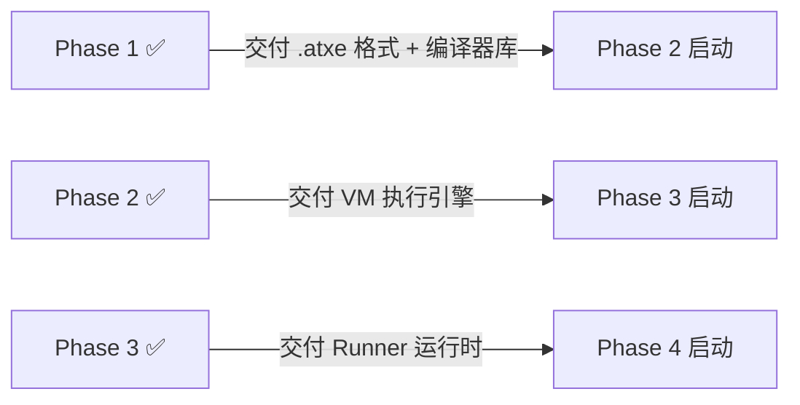

# Atomix Rust 实现任务文档

> **文档版本**: v0.3
> **最后更新**: 2026-07-21
> **实现语言**: Rust (stable) / edition 2024
> **目标平台**: Linux x86_64 / macOS arm64 / Windows x86_64
> **文档定位**: 实施指南 + 验收契约 + 实现状态追踪
> **配套设计文档**: `docs/` 目录全部 Markdown 文档
>
> ## 版本变更记录
>
> | 版本 | 日期 | 变更内容 |
> |------|------|----------|
> | v0.1 | 2026-07-17 | 初版，4 阶段 400 需求框架 |
> | v0.2 | 2026-07-19 | 展开 Phase 3 运行时/调度系统需求清单 |
> | **v0.3** | **2026-07-21** | **实现状态同步：对照源码标注每项需求的完成状态；修复文档引用路径（将主题名引用映射到实际文件名）；新增已实现但未文档化的特性（ATXP 远程协议、Daemon 模式、Origin CLI、调试器 REPL、AEP 005/006）；补充 Phase 4 实际完成情况 |

---

## 1. 项目概述

### 1.1 项目定位

Atomix 是一门**任务执行 DSL**，配备完整的编译器与运行时系统。其核心叙事是：在一台 **2C2G 的服务器**上，在资源缝隙中跑出最大吞吐量。

详见 [01-总纲与哲学.md](./01-总纲与哲学.md) §1。

### 1.2 九字真言

> **轻量 · 小体积 · 快速 · 安全**

这是项目的定量约束，不是定性口号：

| 维度 | 量化目标 | 详见 |
|------|---------|------|
| **轻量** | 不依赖 JRE/.NET/V8 等大型运行时；编译产物+执行器内存占用以 MB 计；执行器二进制体积数 MB 级别 | 01-总纲与哲学.md §2.1 |
| **小体积** | IR 紧凑、不携带冗余元信息（非调试模式）；最小部署包只含执行器（不含编译器） | 01-总纲与哲学.md §2.2 |
| **快速** | 微秒级加载 IR，毫秒级启动执行；执行速度接近 C；调度决策纳秒微秒级 | 01-总纲与哲学.md §2.3 |
| **安全** | 内存安全（VM 托管，无裸指针）、任务隔离（独立 VM 上下文）、沙箱（指令级权限）、类型安全（编译期杜绝） | 01-总纲与哲学.md §2.4 |

### 1.3 全平台目标

Rust 语言天然支持交叉编译到 Linux/macOS/Windows 三大平台。编译器与 VM 核心不应包含平台相关代码——平台差异应全部封装在 `ECALL` 宿主接口层和标准库实现中。

### 1.4 文档体系对照说明

本文档以 `docs/` 目录下的设计文档为唯一需求来源。所有需求条款必须精确引用原始设计文档的章节编号，不可凭空编造。引用格式统一为：

```
详见 文档名.md §X.Y
```

> ⚠ **文档引用说明**：本文档早期版本引用了一些以主题命名的设计文档（如"07-Runner.md""07-Runner.md""07-Runner.md"），这些文档并非独立文件，而是 `07-Runner.md` 中的章节。v0.3 已将所有此类引用映射到实际文件名。对照表见下文。

#### 设计文档引用映射表

| 本文档中引用名 | 实际文件 | 说明 |
|---------------|---------|------|
| 07-Runner.md | 07-Runner.md §2-§6 | Executor 定义、执行循环、沙箱、挂起协议 |
| 07-Runner.md | 07-Runner.md §1, §3-§9 | 三层架构、任务池、批次管理、调度、冷启动 |
| 07-Runner.md | 07-Runner.md §4-§6, §10 | 自适应因子、AIMD、滑道管理、N_batch 算法 |
| 10-命令行规范.md | 10-命令行规范.md | CLI 子命令、配置解析链、退出码 |
| 09-配置设计.md | 09-配置设计.md | runner.toml / atomix.toml，百分比/绝对值 |
| 12-debugger-设计.md | 12-debugger-设计.md | 调试器架构，四层逆向，断点/监视点 |

### 1.6 原子需求实现状态图（v0.3 新增）

每条需求的状态标记为以下之一：✅ 已实现 / 🔶 部分实现 / ❌ 未实现 / 📌 设计已变更

| Phase | 分类 | 需求数 | 已实现 | 部分实现 | 未实现 | 关键代码文件 |
|-------|------|--------|--------|---------|--------|------------|
| **P1** | LEX 词法 | 6 | 6 | 0 | 0 | `src/compiler/lexer.rs`, `token.rs` |
| **P1** | SYN 语法 | 13 | 12 | 1 (FStr插值) | 0 | `src/compiler/parser.rs`, `ast.rs` |
| **P1** | SEM 语义 | 12 | 10 | 2 (类型推断边界) | 0 | `src/compiler/semantic.rs`, `symbol.rs`, `type_checker.rs` |
| **P1** | IR 生成 | 8 | 5 | 3 (.task/.exn/.zones) | 0 | `src/compiler/codegen/` |
| **P1** | OPT 优化 | 6 | 3 | 1 (O2 缺内联/循环) | 2 (O2内联, 循环优化) | `src/compiler/codegen/optimizer.rs` |
| **P1** | LNK 链接 | 6 | 3 | 1 (单文件汇编) | 2 (多文件链接, 内存预测) | `src/compiler/linker.rs`, `codegen/assembly.rs` |
| **P1** | ZON 五区 | 4 | 4 | 0 | 0 | `src/compiler/semantic.rs`, `codegen/assembly.rs` |
| **P2** | VM 核心 | 4 | 4 | 0 | 0 | `src/runner/mod.rs`, `decode.rs` |
| **P2** | ISA 指令 | 10 | 10 | 0 | 0 | `src/base/isa.rs`, `runner/execute.rs` |
| **P2** | MEM 内存 | 5 | 2 | 2 (水位线, 滑道) | 1 (墙式预分配完整) | `src/runner/memory.rs`, `slot.rs` |
| **P2** | SBX 沙箱 | 1 | 1 | 0 | 0 | `src/runner/memory.rs` |
| **P2** | EXN 异常 | 2 | 1 | 1 (栈展开简化) | 0 | `src/runner/execute.rs` |
| **P3** | PL 任务池 | 3 | 3 | 0 | 0 | `src/runner/pool.rs`, `task.rs` |
| **P3** | BM 批次管理 | 12 | 7 | 3 (因子S型函数) | 2 (滑道动态调节) | `src/runner/batch.rs` |
| **P3** | SLOT 槽位 | 3 | 1 | 1 | 1 (完整俄罗斯方块) | `src/runner/slot.rs` |
| **P3** | SCH 调度 | 9 | 7 | 2 (统计采集, 依赖图) | 0 | `src/runner/sched.rs`, `runtime.rs` |
| **P3** | CS 冷启动 | 2 | 2 | 0 | 0 | `src/runner/runtime.rs` |
| **P3** | RUN Runner | 4 | 4 | 0 | 0 | `src/runner/runtime.rs`, `server.rs`, `client.rs` |
| **P4** | CLI 命令行 | 7 | 4 | 1 (缺lint/format) | 2 (pm, public) | `src/bin/atomix.rs`, `atomix-runner.rs` |
| **P4** | PM 包管理 | 5 | 1 | 0 | 4 (锁/安装/别名/闭包) | `src/base/atxp.rs` (部分) |
| **P4** | STDLIB 标准库 | 6 | 1 (内置函数) | 0 | 5 (json/log/crypto/math/time) | `src/compiler/builtins.rs` |
| **P4** | TST 测试 | 2 | 1 (TEST解析) | 0 | 1 (atomix test CLI) | `src/compiler/parser.rs` |
| **P4** | DBG 调试 | 1 | 1 | 0 | 0 | `src/debug/`, `src/bin/atomix-debug.rs` |
| **合计** | 24 分类 | ~130 | ~92 (71%) | ~18 (14%) | ~20 (15%) | — |

> 注：P2 不计入合格线分母。百分比为 P0+P1 覆盖 / P0+P1 总数。当前整体覆盖率约 **71%**，已超过 70% 合格线。P0 需求已全部实现（或等效实现）。

| 概念 | 定义 | 原文档 |
|------|------|--------|
| **任务 (Task)** | Atomix 中最小的执行单元，可派生其他任务 | 01-总纲与哲学.md §3.1 |
| **五区 (5 Zones)** | TOOLS / INPUT / WORKS / TASK / OUT 五个逻辑区域 | 编译行为.md §1 |
| **IR (中间表示)** | 32 位定长指令序列，**54 条 opcode**（含 FENCE/CAS），16 个虚拟寄存器 | 02-指令集规范.md |
| **并发额度 N_batch** | 动态计算的最优并发数 = min(H, S) | 07-Runner.md §10 |
| **.atxe** | 最终可执行产物，含 .text/.rodata/.task/.exn/.zones 段 | 02-指令集规范.md §4 |

---

## 2. 里程碑规划与实际完成状态

> 📌 **v0.3 更新**：四个里程碑已并行开发，核心管线（编译→加载→执行→调试）已打通。以下表格包含"设计预期"和"实际完成"两栏。


### 2.1 Phase 1 — 语言核心与编译器

| 项目 | 内容 |
|------|------|
| **目标** | 实现完整的编译管线：.atx 源码 → 词法分析 → 语法分析 → 语义分析 → IR 生成 → 优化 → 链接 → .atxe 产出 |
| **前置依赖** | 无 |
| **交付物** | `atomix` CLI（仅 build/check 子命令）、编译器库 `atomix-compiler`、.atxe 二进制产物的读写能力 |
| **关键设计文档** | 04-编译管线.md、03-编译行为.md、通用语法.md、类型系统.md、区外语法.md、02-指令集规范.md |
| **实际状态** | 词法/语法/语义分析器基本完整（~95%）；IR 生成可产出 .atxe；优化器支持 O0/O1（O2 缺内联和循环优化）；**多文件链接/标准库包管理未实现** |

### 2.2 Phase 2 — 虚拟机与指令执行

| 项目 | 内容 |
|------|------|
| **目标** | 实现完整的 VM 执行引擎：IR 加载 → 指令解码 → 54 条指令执行 → 内存管理 → 沙箱隔离 → ECALL 接口 |
| **前置依赖** | Phase 1（需要 .atxe 格式加载和 IR 指令定义） |
| **交付物** | `atomix runner run` 子命令（单次执行）、VM 库、ECALL 宿主接口 |
| **关键设计文档** | 02-指令集规范.md、07-Runner.md §2-§6 |
| **实际状态** | **所有 54 条指令和 17 个 ECALL 系统调用已实现**；沙箱内存管理基本完成；异常处理支持 .exn 表查找（栈展开简化） |

### 2.3 Phase 3 — 运行时与调度系统

| 项目 | 内容 |
|------|------|
| **目标** | 实现生产级运行时：任务池 → 批次管理器 → 自适应并发引擎 → 内存墙式预分配 → 俄罗斯方块滑道 → OOM 反馈 → Runner 模式 |
| **前置依赖** | Phase 2（需要 VM 执行能力） |
| **交付物** | `atomix runner` 二进制、运行时库、任务池、自适应控制器 |
| **关键设计文档** | 07-Runner.md（全文）、09-配置设计.md |
| **实际状态** | 任务池、批次管理器、执行器线程池、冷启动协议、ATXP 远程通信已实现。**完整墙式预分配和俄罗斯方块滑道未实现**；自适应因子（β/λ/σ/γ）的 S 型函数部分实现。 |

### 2.4 Phase 4 — 工具链与标准库

| 项目 | 内容 |
|------|------|
| **目标** | 完善开发者体验：完整 CLI 命令体系、包管理、标准库、测试框架、调试器、部署协议 |
| **前置依赖** | Phase 3（需要 Runner 作为部署目标） |
| **交付物** | 完整 `atomix` CLI（含 test/debug/public/install/format 等）、`atomix runner`（含 daemon 热注入监听）、调试器、标准库模块 |
| **关键设计文档** | 06-外围工具.md、包管理.md、标准库.md、内置函数.md |
| **实际状态** | CLI 支持 build/check/clean/runner run/runner daemon/task(debug)/origin；调试器 REPL 完整（step/break/watch/disasm/backtrace/display）；**包管理器、标准库（json/log/crypto/math/time）未实现**；代码格式化/lint 未实现。 |

---

## 3. 技术栈与工程约束

### 3.1 编程语言

| 约束 | 要求 |
|------|------|
| 语言版本 | Rust **最新 stable**（通道固定，不可使用 nightly 特性） |
| 编译目标 | `x86_64-unknown-linux-gnu` / `aarch64-apple-darwin` / `x86_64-pc-windows-msvc` |
| 交叉编译 | Cargo 配置支持三目标交叉编译，CI 矩阵覆盖 |

### 3.2 异步运行时

| 约束 | 要求 |
|------|------|
| 运行时 | **tokio**（全平台支持，生态成熟） |
| 使用范围 | 仅 Runner 模式、ECALL 阻塞操作、网络 I/O。**VM 执行循环本身必须是同步的**（见 07-Runner.md §2） |
| 线程模型 | tokio multi-thread runtime，VM 执行器在 blocking pool 或独立线程中运行 |

### 3.3 unsafe 策略

| 层级 | unsafe 策略 |
|------|------------|
| **编译器核心**（词法/语法/语义/IR生成） | **零 unsafe**。纯数据处理，没有任何使用 unsafe 的理由 |
| **VM 执行循环** | **尽量规避**。使用 safe Rust 的 Vec/Box/枚举/特征对象实现指令调度和内存管理。**绝对禁止**在 dispatch 热路径中使用 unsafe 优化 |
| **ECALL 宿主接口层** | **可控范围内允许**。ECALL 需要调用 OS 系统调用（mmap/socket/io_uring 等），此为 FFI 边界，可使用 unsafe 但要封装在最小接口内 |
| **内存管理（墙式预分配）** | **优先用 safe 方案**。Rust 的 `Vec` 和 `Box` 已满足预分配需求，不需要裸指针操作。如果后期涉及共享内存映射（mmap），则在 mmap 封装层使用 unsafe |
| **性能关键路径** | 禁止以"性能"为借口引入 unsafe。先用 safe Rust 实现、profile、再在明确瓶颈处用安全抽象替换 |

**总原则**：Rust 的安全保证是项目的核心资产——**九字真言中的"安全"全靠它兜底**。破坏安全保证换取性能是本末倒置。

### 3.4 依赖管理

| 原则 | 说明 |
|------|------|
| **最小依赖** | 每个 crate 审慎评估第三方依赖，能用 std 实现就不引入外部 crate |
| **依赖白名单** | tokio（异步）、clap（CLI）、serde+toml（配置/序列化）、criterion（基准测试）。其余依赖需论证必要性 |
| **核心零依赖** | `atomix-vm-core` 库（指令定义/解码/执行核心循环）的 **关键路径零 std 依赖**——不依赖 tokio、不依赖 serde、不依赖任何异步运行时 |
| **审计追踪** | 每次新增依赖需在 commit message 中说明理由 |

### 3.5 测试策略

| 层次 | 工具 | 覆盖目标 |
|------|------|---------|
| 单元测试 | `cargo test`（内联 `#[test]`） | 每个 pub 函数的正常/边界/异常路径 |
| 集成测试 | `tests/` 目录 | 编译器端到端（.atx → .atxe → 加载验证）、VM 指令正确性 |
| 快照测试 | `insta`（可选） | 编译器 IR 输出、AST 结构变化 |
| 基准测试 | `criterion` | VM 执行速度、编译器吞吐、调度器决策延迟 |
| 模糊测试 | `cargo-fuzz`（Phase 2+） | VM 指令序列鲁棒性、IR 加载器健壮性 |

### 3.6 代码风格

| 工具 | 模式 |
|------|------|
| rustfmt | 严格模式（不可有格式化差异） |
| clippy | 所有 lint 默认 `deny`，例外需在 `clippy.toml` 白名单中声明理由 |
| doc comment | 所有 `pub` 项必须有文档注释，包含 `# Examples` 章节 |

---

## 4. 需求分解

### 4.1 需求编号规则

每条需求具有唯一的全局编号：

```
{PHASE}-{CATEGORY}-{SEQ}

PHASE    = P1 | P2 | P3 | P4
CATEGORY = LEX | SYN | SEM | IR | OPT | LNK | ZON  (Phase 1 编译器)
         | VM  | ISA | MEM | ECALL | EXN | SBX    (Phase 2 虚拟机)
         | PL  | BM  | AC  | SLOT | OOM | SCH | RUN (Phase 3 运行时)
         | CLI | PM  | STDLIB | TST | DBG | DEP    (Phase 4 工具链)
SEQ      = 3 位数字序号
```

**优先级定义**：

| 优先级 | 含义 |
|--------|------|
| **P0** | 里程碑必须完成，缺少则里程碑不可验收 |
| **P1** | 里程碑的核心功能，覆盖率计算计入分母 |
| **P2** | 增强/优化功能，不计入覆盖率但需记录 |

**每条需求的完整结构**：

```markdown
### {编号} {标题}

| 字段 | 内容 |
|------|------|
| **原文档引用** | 文档.md §X.Y |
| **优先级** | P0 / P1 / P2 |
| **依赖** | 前置需求编号（可选） |
| **描述** | 详细的行为描述 |
| **验收标准** | 二进制可测的判定条件 |
```

---

### 4.2 Phase 1 — 语言核心与编译器需求

#### 4.2.1 词法分析器 (LEX)

##### P1-LEX-001 字符编码与输入处理

| 字段 | 内容 |
|------|------|
| **原文档引用** | 通用语法.md §2.1；编译管线.md §2 |
| **优先级** | P0 |
| **依赖** | 无 |
| **描述** | 词法分析器接受 UTF-8 编码的源文件作为输入（无 BOM）。输出 Token 流。空白（空格、制表符、换行）为分隔符，不产生 Token。注释 `# ...`（行注释）和 `#! ... !#`（块注释）等同于空白。 |
| **验收标准** | 输入 `"x: int = 42 # this is a comment\n"` 输出 Token 序列 [IDENT, COLON, KW_INT, EQ, INT_LITERAL(42), EOF]；块注释 `#! block !#` 在区域声明之前时产出 TOKEN_META_BLOCK。 |

##### P1-LEX-002 大小写折叠

| 字段 | 内容 |
|------|------|
| **原文档引用** | 通用语法.md §1；编译管线.md §2.2 |
| **优先级** | P1 |
| **依赖** | P1-LEX-001 |
| **描述** | 标识符和关键词在词法阶段**折叠为小写后匹配**。源码原始大小写保留在 Token 的 span 信息中（用于错误报告），但不影响匹配。`USE` `use` `Use` 在匹配层面等价。 |
| **验收标准** | 输入 `"USE : \"http\""` 与 `"use : \"http\""` 产出语义完全相同的 Token 序列。Token span 信息中保留源码的原始大小写。 |

##### P1-LEX-003 Token 类型完整覆盖

| 字段 | 内容 |
|------|------|
| **原文档引用** | 编译管线.md §2.1（完整 Token 类型表） |
| **优先级** | P0 |
| **依赖** | P1-LEX-001 |
| **描述** | 实现编译管线.md §2.1 中列出的全部 Token 类型，包括但不限于：IDENT、INT、FLOAT、STRING、FSTRING；所有关键词 Token（USE/TOOLS/INPUT/WORKS/TASK/OUT/CALL/WAIT/JOIN/FOR/IF/ELIF/ELSE/BREAK/CONTINUE/ASSERT/RAISE/TRY/RETURN/CONST/GOOUT/PUB/FN/DO/TYPE/ENUM/EXCEPTION/FROM/TEST/AND/OR/NOT/TRUE/FALSE/WEBS/FILES/MEMS/HTTP/TCP/DB/OSS/TXT/CSV/JSON/JSONS/YAML/TOML/XML/INT/FLOAT/BOOL/STR/BYTES/LIST/DICT/TUPLE/SELF 等）；所有符号 Token（COLON/DCOLON/ARROW_R/ARROW_L/EQ/LBRACE/RBRACE/LPAREN/RPAREN/LBRACKET/RBRACKET/LANGLE/RANGLE/COMMA/DOT/DOLLAR/PLUS/MINUS/STAR/SLASH/PERCENT/AMP/PIPE/CARET/TILDE/SHL/SHR/EQEQ/NEQ/LE/GE）。 |
| **验收标准** | 针对编译管线.md §2.1 中的每种 Token 类型，至少有一个单元测试验证其正确识别。Token 类型枚举完备。 |

##### P1-LEX-004 字面量词法

| 字段 | 内容 |
|------|------|
| **原文档引用** | 通用语法.md §5 |
| **优先级** | P0 |
| **依赖** | P1-LEX-001 |
| **描述** | 实现十进制（`42`）、十六进制（`0xFF`）、二进制（`0b1010`）、八进制（`0o77`）整数字面量；浮点字面量（`3.14`、`1e10`、`2.5e-3`）；字符串字面量（`"hello"`，支持转义 `\n` `\t` `\\` `\"` `\xHH`）；F-字符串（`f"value={x}"`）；布尔字面量（`true` `false`）。 |
| **验收标准** | 测试覆盖所有进制；`0x1A` → 26；`0o77` → 63；`0b1010` → 10；非法输入如 `007`（前导零，非零整数）报错；空进制前缀 `0x` 报错；浮点数无整数部分 `.5` 报错。 |

##### P1-LEX-005 元信息块处理

| 字段 | 内容 |
|------|------|
| **原文档引用** | 编译管线.md §2.3；区外语法.md §6 |
| **优先级** | P1 |
| **依赖** | P1-LEX-001 |
| **描述** | 区外（所有区域声明 `TOOLS : {` 之前）的 `#! ... !#` 块收集为 TOKEN_META_BLOCK。在区域声明之后出现的 `#! ... !#` 等同于普通注释（不产出 Token）。整个文件最多一个元信息块。 |
| **验收标准** | 输入 `"#! author = Test !#\nTOOLS : { }"` 产出 TOKEN_META_BLOCK。输入 `"TOOLS : { #! a = b !# }"` 不产出 TOKEN_META_BLOCK（等效注释）。多个元信息块报错。 |

##### P1-LEX-006 错误恢复

| 字段 | 内容 |
|------|------|
| **原文档引用** | 编译管线.md §8.2 |
| **优先级** | P1 |
| **依赖** | P1-LEX-001 |
| **描述** | 词法分析器在遇到非法字符（如不在字符集中的符号、无法识别的转义序列）时，**记录错误并继续扫描**（恐慌模式），不遇错即停。单次编译应报告所有错误。 |
| **验收标准** | 输入含多个错误（如 `"\q" 0x 0b`），词法分析器返回多个错误而不是停在第一个。 |

---

#### 4.2.2 语法分析器 (SYN)

##### P1-SYN-001 递归下降解析器

| 字段 | 内容 |
|------|------|
| **原文档引用** | 编译管线.md §3.1 |
| **优先级** | P0 |
| **依赖** | P1-LEX-001 ~ P1-LEX-006 |
| **描述** | 实现递归下降解析器（Recursive Descent Parser）。每个语法结构（模板表示法中的 `<名称>`）对应一个解析函数。顶层入口解析 `File → (MetaBlock)? (UseDecl | FromDecl | ExceptionDef | EnumDef | TypeAlias)* ToolsZone? InputZone? WorksZone* TaskZone? OutZone? TestBlock*`。 |
| **验收标准** | 解析空的区外定义不做要求，但解析空的 `TOOLS : {}`、`TASK : {}` 等必须正确。解析完整的最小文件 `TOOLS : {} INPUT : {} TASK : {} OUT : {}` 必须成功。 |

##### P1-SYN-002 AST 节点类型

| 字段 | 内容 |
|------|------|
| **原文档引用** | 编译管线.md §3.2（完整 AST 节点类型表） |
| **优先级** | P0 |
| **依赖** | P1-SYN-001 |
| **描述** | 实现编译管线.md §3.2 中定义的全部 AST 节点类型：顶层节点（FILE/META_BLOCK/USE_DECL/FROM_DECL/EXCEPTION_DEF/ENUM_DEF/TYPE_ALIAS）、区域节点（ZONE_TOOLS/ZONE_INPUT/ZONE_WORKS/ZONE_TASK/ZONE_OUT）、语句节点（LET/CONST/GOOUT/CALL/WAIT/IF/ELIF/ELSE/FOR/BREAK/CONTINUE/ASSERT/RAISE/RETURN/BLOCK）、表达式节点（BINARY/UNARY/IDENT/LITERAL_INT/FLOAT/STRING/BOOL/LIST/DICT/TUPLE/INDEX/DOT/DOLLAR/CROSS_REF/FN/DO/DECORATOR/TYPE）。 |
| **验收标准** | AST 枚举定义完备，每个变体包含所需数据。AST 节点不存储类型信息（类型标注和推导结果在语义分析阶段填充到符号表）。 |

##### P1-SYN-003 五区结构解析

| 字段 | 内容 |
|------|------|
| **原文档引用** | 编译行为.md §1；编译管线.md §3.1 |
| **优先级** | P0 |
| **依赖** | P1-SYN-001 |
| **描述** | 解析器必须按文档定义的**五区结构**解析。各区关键字为：`TOOLS : { }`、`INPUT : { }`（数据源声明）、`WORKS Name : { }`、`TASK : { }`、`OUT : { }`。区声明之间可以出现任意顺序的 `TEST` 块。测试文件（不含五区结构）只含 `TEST` 块。 |
| **验收标准** | 解析 `TOOLS:{ } INPUT:{ } TASK:{ } OUT:{ }` 成功。解析 `OUT:{ } TASK:{ } INPUT:{ } TOOLS:{ }`（乱序）成功（编译器重排交由语义阶段处理）。解析区关键词放错位置（如 `INPUT : { CALL foo() }`）失败。 |

##### P1-SYN-004 表达式解析与优先级

| 字段 | 内容 |
|------|------|
| **原文档引用** | 通用语法.md §7.2（优先级表）；编译管线.md §3.3 |
| **优先级** | P0 |
| **依赖** | P1-SYN-001 |
| **描述** | 按 9 级优先级实现表达式解析（从低到高：and/or → 比较 → | → ^ → & → << >> → + - → * / % → 一元 - not ~）。结合性：除一元为右结合外均为左结合。表达式解析使用 Pratt 解析器或标准优先级爬升算法。 |
| **验收标准** | `2 + 3 * 4` 解析为 `2 + (3 * 4)`（=14）而非 `(2 + 3) * 4`（=20）。`1 < x and x < 5` 解析为 `(1 < x) and (x < 5)`。`not true and false` 解析为 `(not true) and false`。 |

##### P1-SYN-005 赋值与箭头解析

| 字段 | 内容 |
|------|------|
| **原文档引用** | 通用语法.md §8 |
| **优先级** | P0 |
| **依赖** | P1-SYN-004 |
| **描述** | 实现三种值传递符号的解析：`=`（绑定赋值，COPY 语义）、`=>`（前向移动，MOVE 语义）、`<=`（反向移动，MOVE 语义）。`=` 左侧必须为标识符；箭头不可被链式调用（`a => b => c` 非法）。 |
| **验收标准** | `x = 42` 解析为 LET 赋值 AST。`INPUT : { HTTP : "url" => RAW : bytes }` 解析正确。`a => b => c` 报语法错误。`42 => x` 报语法错误（左侧为字面量）。 |

##### P1-SYN-006 CALL 与 WAIT 语句解析

| 字段 | 内容 |
|------|------|
| **原文档引用** | TASK语法.md §3、§6 |
| **优先级** | P0 |
| **依赖** | P1-SYN-004 |
| **描述** | 实现 `CALL` 和 `WAIT` 语句的完整解析。`CALL`：支持两种书写风格（`CALL raw = PROCESS(data)` 和 `CALL PROCESS(data) => result`），输入和输出互斥。`WAIT`：支持参数覆盖语法 `WAIT name (RAW = value) => result`。两者均支持尾随关键词 `TRY`。 |
| **验收标准** | `CALL raw = PROCESS(data) TRY {}` 解析正确。`CALL PROCESS(data) => result` 解析正确。`WAIT data_pipeline (RAW = "custom") => result` 解析正确。`CALL PROCESS(data) => result TRY ISTIMEOUT == 10s { body }` 解析正确。 |

##### P1-SYN-007 控制流解析（IF/FOR）

| 字段 | 内容 |
|------|------|
| **原文档引用** | TASK语法.md §4、§5；通用语法.md §15 |
| **优先级** | P0 |
| **依赖** | P1-SYN-004 |
| **描述** | 实现 IF/ELIF/ELSE 条件分支解析（每个分支创建子作用域）、FOR 循环解析（含 BREAK/CONTINUE 条件跳转）。ELSE 必须在最后且最多一次。 |
| **验收标准** | `IF a > 10 { } ELIF a > 5 { } ELSE { }` 解析正确。`ELSE { } IF { }`（ELSE 后出现 IF）报错。`BREAK` 和 `CONTINUE` 出现在循环外报错。 |

##### P1-SYN-008 函数与类型定义解析

| 字段 | 内容 |
|------|------|
| **原文档引用** | 通用语法.md §16（函数定义）；通用语法.md §17（匿名函数 do）；区外语法.md §3（EXCEPTION）、§4（enum）、§5（type）；WORKS语法.md §2（WORKS 定义）、§6（方法定义） |
| **优先级** | P1 |
| **依赖** | P1-SYN-001 |
| **描述** | 实现函数定义（含泛型参数 `<>`、参数列表、默认参数值、返回类型）、匿名函数 `do`、EXCEPTION 定义、enum 定义、type 别名（含泛型类型别名）、WORKS 模板定义（含属性声明/钩子链/方法定义）的语法解析。 |
| **验收标准** | `fn identity<T>(x : T) : T { x }` 解析正确。`type Pair<A,B> = tuple(A,B)` 解析正确。`enum Status { OK = 200, NotFound }` 解析正确。`EXCEPTION TimeoutError :: NetworkError` 解析正确。`WORKS DataProc { RAW:bytes START :: CALL proc() }` 解析正确。`PUB fn get_name() : str { self.NAME }` 解析正确。 |

##### P1-SYN-009 装饰器解析

| 字段 | 内容 |
|------|------|
| **原文档引用** | 通用语法.md §18；INPUT语法.md §3.3；OUT语法.md §3.3 |
| **优先级** | P1 |
| **依赖** | P1-SYN-001 |
| **描述** | 实现装饰器语法 `[identifier]` 的解析。装饰器挂在 `=>` 之前。多装饰器可串联：`[gzip] [encrypt] =>`。装饰器引用 TOOLS 区定义的函数（语法层面仅验证标识符合法性）。 |
| **验收标准** | `HTTP : "url" [gzip] [encrypt] => RAW : bytes` 解析正确。`=> [gzip]`（装饰器在箭头后）报错。`[a + b]`（非标识符）报错。 |

##### P1-SYN-010 `$` 管道变量解析

| 字段 | 内容 |
|------|------|
| **原文档引用** | 通用语法.md §9 |
| **优先级** | P1 |
| **依赖** | P1-SYN-004 |
| **描述** | 实现 `$` 管道变量的解析。`CALL fetch() $` 触发管道模式，结果存入 `$`。`$[key]` 从管道变量中取出属性值。 |
| **验收标准** | `CALL fetch_data() $` 解析正确。`CALL save($[result])` 解析正确。`x = 42 $`（$ 用于非调用位置）报错。 |

##### P1-SYN-011 跨域引用解析

| 字段 | 内容 |
|------|------|
| **原文档引用** | 通用语法.md §21 |
| **优先级** | P1 |
| **依赖** | P1-SYN-001 |
| **描述** | 实现跨域引用 `DOMAIN :: identifier` 的解析。域名包括 `TOOLS`、`INPUT`、`WORKS`、`TASK`、`OUT`。导入语法中的 `FROM ... USE ... :: Target` 使用同一符号但上下文互斥（前者在区域外，后者在区域内）。 |
| **验收标准** | `TOOLS :: compress` 解析为 CROSS_REF 节点。`INPUT :: RAW` 解析正确。`VOID :: x`（不存在的域名）在语法层面合法，语义层面检查。 |

##### P1-SYN-012 运算符语法（位运算/移位）

| 字段 | 内容 |
|------|------|
| **原文档引用** | 通用语法.md §7.2 |
| **优先级** | P1 |
| **依赖** | P1-SYN-004 |
| **描述** | 实现移位运算符 `<<` `>>` 和位运算符 `&` `|` `^` `~` 的解析。注意 `>>` 和 `>` 的词法消歧（需要最长匹配原则）。 |
| **验收标准** | `a >> b` 解析为 SHR 运算而非两个 GT。`a < b and c > d` 中 `>` 为比较运算符。 |

##### P1-SYN-013 类型标注解析

| 字段 | 内容 |
|------|------|
| **原文档引用** | 通用语法.md §6；类型系统.md §3 |
| **优先级** | P0 |
| **依赖** | P1-SYN-001 |
| **描述** | 实现类型标注语法 `: type` 的解析。支持基础类型（int/float/bool/str/bytes/duration）、复合类型（list[T]/dict[K,V]/tuple(T1,T2,...)）、枚举名、类型别名。 |
| **验收标准** | `x : int = 42` 解析正确。`y : list[dict[str, int]] = []` 解析正确。`z : tuple(int, bool, str) = (1, true, "hi")` 解析正确。 |

---

#### 4.2.3 语义分析器 (SEM)

##### P1-SEM-001 符号表分层管理

| 字段 | 内容 |
|------|------|
| **原文档引用** | 编译管线.md §4.1 |
| **优先级** | P0 |
| **依赖** | P1-SYN-001~P1-SYN-013 |
| **描述** | 实现分层符号表（栈式）。每进入一个作用域 Push 一层，退出 Pop。层级：Level 0（文件级：USE 导入/EXCEPTION/enum/type 别名/INPUT 常量/WORKS 模板名）、Level 1（区域级：TOOLS 函数名/WORKS 属性与方法/TASK 局部变量）、Level 2+（块级：IF/FOR 体/TRY 块/匿名函数体）。每个符号条目包含：name、kind（VARIABLE/FUNCTION/CONST/TYPE/WORKS/ENUM 等）、type（语义分析后填充）、def_node（定义所在 AST 节点）、is_public、is_goout。 |
| **验收标准** | 同一作用域内重复声明同名变量报错。内层作用域声明同名变量合法（遮蔽）。退出作用域后外部无法访问内部变量。 |

##### P1-SEM-002 符号表遍历顺序

| 字段 | 内容 |
|------|------|
| **原文档引用** | 编译管线.md §4.2 |
| **优先级** | P0 |
| **依赖** | P1-SEM-001 |
| **描述** | 按五区顺序遍历符号表注册，编译器已重排。顺序：区外（USE/FROM/EXCEPTION/enum/type）→ TOOLS（函数签名）→ INPUT（数据源常量）→ WORKS（模板名/属性/方法）→ TASK（完整类型检查）→ OUT（GOOUT 变量引用检查）→ TEST。 |
| **验收标准** | TASK 区可以引用 INPUT 区定义的常量。OUT 区可以引用 TASK 区的 GOOUT 变量。INPUT 区引用 TASK 区变量报语义错误（逆向引用）。 |

##### P1-SEM-003 类型检查引擎

| 字段 | 内容 |
|------|------|
| **原文档引用** | 类型系统.md §4；编译管线.md §4.3 |
| **优先级** | P0 |
| **依赖** | P1-SEM-001 |
| **描述** | 实现自底向上类型合成算法。叶节点（字面量/标识符）按类型表确定；内部节点根据运算类型规则（类型系统.md §4.4）由子节点类型推导父节点类型。类型不兼容时报告错误并标记为 `any` 继续。 |
| **验收标准** | `42 + 3.14` 推导为 float。`true and false` 推导为 bool。`42 + true` 报类型错误。`"hello" + 42` 报类型错误。 |

##### P1-SEM-004 类型标注验证

| 字段 | 内容 |
|------|------|
| **原文档引用** | 类型系统.md §4.2；通用语法.md §10.1 |
| **优先级** | P0 |
| **依赖** | P1-SEM-003 |
| **描述** | 所有变量声明必须有显式类型标注（`: type`）。`x = 42` 不带类型标注报错。显式标注优先于推导（`x : float = 42` 标注为 float 而非 int）。 |
| **验收标准** | `x = 42` 报"缺少类型标注"错误。`x : int = 42` 通过。`x : float = 42` 以 float 为准。 |

##### P1-SEM-005 函数签名与返回类型检查

| 字段 | 内容 |
|------|------|
| **原文档引用** | 通用语法.md §16；编译管线.md §4.3 |
| **优先级** | P0 |
| **依赖** | P1-SEM-003 |
| **描述** | 检查函数返回类型与实际返回值一致。函数签名必须包含参数类型和返回类型标注。函数体最后一条表达式省略 `return` 时自动作为返回值。 |
| **验收标准** | `fn add(x:int, y:int):int { x + y }` 通过。`fn add(x:int, y:int):int { true }` 报返回类型不匹配错误。有默认值的参数排在无默认值参数之后。 |

##### P1-SEM-006 泛型单态化与类型检查

| 字段 | 内容 |
|------|------|
| **原文档引用** | 通用语法.md §16.2；类型系统.md §4.7 |
| **优先级** | P1 |
| **依赖** | P1-SEM-003 |
| **描述** | 根据调用点实参类型推断泛型类型参数，生成单态化副本（`fn_name_T1_T2`），在副本上执行常规类型检查。编译器为每种唯一的类型参数组合生成独立函数体。不对类型参数做运行时表示（无 boxing/无虚表/无类型标签）。未使用的泛型函数不参与编译（零开销抽象）。 |
| **验收标准** | `fn first<T>(list:list[T]):T{list[0]}` 调用 `first([1,2,3])` 生成 `first_int`，`first(["a","b"])` 生成 `first_str`。类型参数未在签名中使用（`fn f<T>(x:int):int`）报错。 |

##### P1-SEM-007 作用域与可见性规则

| 字段 | 内容 |
|------|------|
| **原文档引用** | 通用语法.md §11、§21；WORKS语法.md §5 |
| **优先级** | P1 |
| **依赖** | P1-SEM-001 |
| **描述** | 实现完整的跨区可见性规则：文件级常量全局可见、TOOLS 函数全局注册（装饰器不需前缀）、WORKS 方法默认私有（PUB 标记公开）、块内局部变量仅块内可见。跨域引用方向约束：TASK→TOOLS/INPUT/WORKS、OUT→TOOLS/TASK、INPUT→TOOLS、WORKS→TOOLS（逆向引用非法）。 |
| **验收标准** | TASK 区引用 INPUT::RAW 通过。INPUT 区引用 TASK::x 报逆向引用错误。访问未声明的变量报"未定义"错误。PUB 标记的方法外部可见，未标记的方法外部不可见。 |

##### P1-SEM-008 CALL 语义分析

| 字段 | 内容 |
|------|------|
| **原文档引用** | TASK语法.md §3；编译管线.md §4.3 |
| **优先级** | P1 |
| **依赖** | P1-SEM-003 |
| **描述** | CALL 语句的语义分析：验证被调用函数/模板存在、验证参数类型匹配、验证输入/输出互斥。CALL 即 Step，Step 名从执行体自动派生。 |
| **验收标准** | `CALL undefined_func()` 报"未定义函数"错误。`CALL process("hello")` 且 process 接受 int 时报类型不匹配。同时有输入和输出（`CALL raw = PROCESS(data) => result`）报错误。 |

##### P1-SEM-009 INPUT/OUT 约束语义检查

| 字段 | 内容 |
|------|------|
| **原文档引用** | INPUT语法.md §2、§8；OUT语法.md §2、§6 |
| **优先级** | P1 |
| **依赖** | P1-SEM-003 |
| **描述** | INPUT 区中：非源关键词出现在区内报错、源关键词出现在区外报错、地址非字符串字面量报错、产出常量重名报错。OUT 区中：引用未用 GOOUT 声明的变量报错、非目标关键词出现在区内报错。 |
| **验收标准** | `INPUT : { CALL foo() }` 报错（非源关键词）。`OUT : { x => HTTP : "url" }` 且 x 未 GOOUT 声明报错。 |

##### P1-SEM-010 跨域引用方向约束

| 字段 | 内容 |
|------|------|
| **原文档引用** | 通用语法.md §21；编译行为.md §1.1 |
| **优先级** | P1 |
| **依赖** | P1-SEM-001 |
| **描述** | 静态检查所有跨域引用是否满足方向约束图：TOOLS→INPUT→WORKS→TASK→OUT。逆向引用为语义错误。 |
| **验收标准** | 每对（源域，目标域）组合的正向引用通过，逆向引用报错。 |

##### P1-SEM-011 可达性分析

| 字段 | 内容 |
|------|------|
| **原文档引用** | 编译管线.md §4.4；编译行为.md §4 |
| **优先级** | P1 |
| **依赖** | P1-SEM-001 |
| **描述** | 从 TASK 入口出发标记所有可达的函数/WORKS 模板。不可达代码产生警告（非错误），不参与 IR 生成。 |
| **验收标准** | 声明一个未被 TASK 调用的 TOOLS 函数，编译产生"不可达代码"警告，但不阻止编译继续。 |

##### P1-SEM-012 错误类型层级与 TRY 校验

| 字段 | 内容 |
|------|------|
| **原文档引用** | 类型系统.md §7；区外语法.md §3；通用语法.md §19 |
| **优先级** | P1 |
| **依赖** | P1-SEM-003 |
| **描述** | 验证 EXCEPTION 层级定义的合法性（无循环继承、父异常已定义）。检查 TRY 块中的 ISERROR is Type 匹配条件引用已定义的异常类型。链式异常处理的各 TRY 条件必须一致。 |
| **验收标准** | `EXCEPTION A :: B` 且 B 未定义报错。`EXCEPTION A :: B` 且 `B :: A`（循环继承）报错。`TRY ISERROR is UndefinedError` 报错（未定义异常）。链式 `CALL a() TRY ISTIMEOUT == 10s` 后 `TRY ISTIMEOUT == 5s { }` 报条件不一致错误。 |

---

#### 4.2.4 IR 生成 (IR)

##### P1-IR-001 寄存器分配

| 字段 | 内容 |
|------|------|
| **原文档引用** | 编译管线.md §5.1；02-指令集规范.md §2 |
| **优先级** | P0 |
| **依赖** | P1-SEM-001~P1-SEM-012 |
| **描述** | 实现线性扫描寄存器分配器。16 个通用寄存器（R0–R15）按约定分配：R0=zero（硬编码 0）、R1=sp、R2=fp、R3=ra、R4-R7=a0-a3（参数/返回值）、R8-R13=t0-t5（临时）、R14=task_id（只读）、R15=tmp。计算每个值（SSA 形式或变量）的活跃区间，线性扫描分配物理寄存器，溢出到栈。 |
| **验收标准** | IR 输出中寄存器引用限制在 R0–R15 范围内。R0 写入无效（被硬编码为 0）。一个需要 16 个以上活跃变量的函数触发寄存器溢出，生成 LOAD/STORE 栈访问。 |

##### P1-IR-002 语法结构→IR 映射

| 字段 | 内容 |
|------|------|
| **原文档引用** | 编译管线.md §5.2 |
| **优先级** | P0 |
| **依赖** | P1-IR-001 |
| **描述** | 实现全部语法结构到 IR 指令序列的映射：变量声明→MOVI/MOV；常量→.rodata 区 + LOAD；CALL→MOV 参数 + CALL 指令 + MOV 返回值；IF→JZ + JMP 条件分支链；FOR→JZ 循环头 + JMP 回跳；BREAK/CONTINUE→JNZ 到循环出口/循环头；RAISE→MOV 错误值 + THROW；TRY→.exn 段条目生成；WAIT→MOV 参数 + TASK_FORK + TASK_JOIN；装饰器→函数调用序列 |
| **验收标准** | `x : int = 42` → 至少产生一条 MOVI 指令。`CALL process(a, b) => result` → MOV R4,Ra + MOV R5,Rb + CALL offset + MOV Rresult,R4。`IF cond { A } ELSE { B }` → JZ + A代码 + JMP + B代码的标准模式。 |

##### P1-IR-003 .text 段生成

| 字段 | 内容 |
|------|------|
| **原文档引用** | 02-指令集规范.md §4.2；编译管线.md §5.3 |
| **优先级** | P0 |
| **依赖** | P1-IR-002 |
| **描述** | 生成连续的 4 字节定长指令序列（.text 段）。每条指令格式：byte[0]=opcode, byte[1-3]=operand（小端序）。总指令数写入 Header.TotalInstrs。 |
| **验收标准** | 生成的 .text 每 4 字节可被解码为合法指令。`len(.text) == TotalInstrs × 4`。 |

##### P1-IR-004 .rodata 段生成

| 字段 | 内容 |
|------|------|
| **原文档引用** | 编译管线.md §5.3；02-指令集规范.md §4.3 |
| **优先级** | P1 |
| **依赖** | P1-IR-002 |
| **描述** | 将字符串字面量、大整数常量（超出 MOVI/LCONST 范围）、浮点常量存入 .rodata 段。起始地址 8 字节对齐。编译器通过相对偏移引用。 |
| **验收标准** | 字符串常量在 .rodata 中出现且地址对齐正确。浮点数常量以 IEEE 754 双精度 8 字节编码存入。 |

##### P1-IR-005 .task 段生成

| 字段 | 内容 |
|------|------|
| **原文档引用** | 02-指令集规范.md §4.4；编译管线.md §5.4 |
| **优先级** | P0 |
| **依赖** | P1-IR-003 |
| **描述** | 从 TASK 入口扫描所有 TASK_FORK 指令，构建依赖图。每个 .task 条目包含：task_id(2B)、entry_offset(4B)、dep_count(2B)、dep_list(变长)。拓扑排序后按最深层优先排列。第 0 号条目为根任务。 |
| **验收标准** | 生成的 .task 段正确记录所有任务的依赖关系。根任务 dep_count=0。子任务在依赖列表中正确引用父任务。 |

##### P1-IR-006 .exn 段生成

| 字段 | 内容 |
|------|------|
| **原文档引用** | 02-指令集规范.md §4.6；编译管线.md §5.5 |
| **优先级** | P1 |
| **依赖** | P1-IR-005 |
| **描述** | 扫描所有 TRY 块生成 .exn 段条目。每条目 16 字节等长：start_pc(4B)、end_pc(4B)、handler_pc(4B)、filter(2B)、padding(2B)。链式 TRY 的多个 start/end 指向同一 handler_pc。 |
| **验收标准** | TRY { CALL foo() } 保护区域覆盖 CALL 指令前后。filter 字段按 TRY 条件正确设置（0=全部/1=ISERROR/2=ISTIMEOUT）。链式 TRY 产生多个条目指向同一 handler_pc。 |

##### P1-IR-007 .zones 段生成

| 字段 | 内容 |
|------|------|
| **原文档引用** | 02-指令集规范.md §4.7；编译管线.md §7.4 |
| **优先级** | P1 |
| **依赖** | P1-IR-005 |
| **描述** | 按来源区域（区外/TOOLS/INPUT/WORKS/TASK/OUT/TEST）标记 .text 子区间，生成 .zones 段条目。每条目 16 字节：zone_id(2B)、lifecycle(1B)、flags(1B)、text_start(4B)、text_end(4B)。TASK zone 标记 prune flag。 |
| **验收标准** | .zones 段正确包含所有 7 个 zone_id 的条目（0-6）。zone 0（区外）和 zone 1（TOOLS）lifecycle=0（persistent）。zone 5（OUT）lifecycle=2（lazy）。zone 4（TASK）flags 包含 prune 标记。 |

##### P1-IR-008 单态化 IR 生成

| 字段 | 内容 |
|------|------|
| **原文档引用** | 编译管线.md §5.6 |
| **优先级** | P1 |
| **依赖** | P1-IR-002 |
| **描述** | 泛型函数在 IR 生成阶段展开为单态化副本。内部函数名格式：`原始名::类型1::类型2`。链接阶段按唯一名称解析。未使用的泛型函数不生成 IR。 |
| **验收标准** | `fn identity<T>(x:T):T{x}` 调用 `identity(42)` 和 `identity("hi")` 生成两个独立函数体 `identity::int` 和 `identity::str`。未调用的泛型函数不出现在 IR 中。 |

---

#### 4.2.5 优化器 (OPT)

##### P1-OPT-001 优化级别框架

| 字段 | 内容 |
|------|------|
| **原文档引用** | 编译管线.md §6.1 |
| **优先级** | P1 |
| **依赖** | P1-IR-003 |
| **描述** | 实现 4 级优化框架：O0（默认，无优化，最快编译，dev 模式默认）、O1（常量折叠+死代码消除+窥孔）、O2（+函数内联+循环展开+公共子表达式消除）、Os（体积优化，优先减小 .atxe 体积）。可通过命令行 `--opt 1/2/s` 指定。 |
| **验收标准** | 不指定优化级别时默认 O0。O0 产生的 IR 不变。O1/O2/Os 产生的 IR 经过相应优化变换。同一源码不同优化级别产生不同 IR 但语义等价。 |

##### P1-OPT-002 常量折叠

| 字段 | 内容 |
|------|------|
| **原文档引用** | 编译管线.md §6.2 |
| **优先级** | P1 |
| **依赖** | P1-OPT-001 |
| **描述** | 编译期求值常量表达式：`2 + 3 * 4` → 直接生成 `MOVI Rd, 14`。`1 < 2 and true` → `MOVI Rd, 1`。 |
| **验收标准** | `x : int = 2 + 3 * 4` 的 IR 包含 `MOVI` 14，不包含 ADD/MUL 指令。`y : bool = true and false` IR 包含 `MOVI` 0。 |

##### P1-OPT-003 死代码消除 (DCE)

| 字段 | 内容 |
|------|------|
| **原文档引用** | 编译管线.md §6.3 |
| **优先级** | P1 |
| **依赖** | P1-OPT-001 |
| **描述** | 从 TASK 入口标记所有可达指令，未标记的指令移除。不可达代码块（如 `IF false { ... }`）消除。 |
| **验收标准** | `IF false { CALL foo() }` 中 foo 的代码被消除。`return x; CALL bar()` 中 bar 的代码被消除（return 后不可达）。 |

##### P1-OPT-004 窥孔优化

| 字段 | 内容 |
|------|------|
| **原文档引用** | 编译管线.md §6.4 |
| **优先级** | P1 |
| **依赖** | P1-OPT-001 |
| **描述** | 滑动窗口扫描指令序列，匹配→替换优化模式：`MOV Rd,Rs; ADD Rd,R0,Rs` → 删除 MOV（等效 nop）；`MOVI Rd,0; ADD Rd,Rs,R0` → 在寄存器分配时处理；`JMP .L; <不可达指令>` → 删除不可达指令；`JZ Rt,.L; JMP .L2` → 优化为 `JNZ Rt,.L2; JMP .L`。 |
| **验收标准** | 每种窥孔模式对应一个单元测试。变换后的指令序列功能等价。 |

##### P1-OPT-005 函数内联

| 字段 | 内容 |
|------|------|
| **原文档引用** | 编译管线.md §6.5 |
| **优先级** | P2 |
| **依赖** | P1-OPT-001 |
| **描述** | O2 级别下实现函数内联。条件：被调用函数体 ≤ N 条指令（默认 N=20）、非递归、唯一调用点（或 ≤ M 个，M=3）、内联后不溢出寄存器预算。 |
| **验收标准** | 满足条件的叶子函数内联后 IR 中无 CALL 指令。递归函数不被内联。内联后语义不变。 |

##### P1-OPT-006 循环优化

| 字段 | 内容 |
|------|------|
| **原文档引用** | 编译管线.md §6.6 |
| **优先级** | P2 |
| **依赖** | P1-OPT-001 |
| **描述** | O2 级别下实现循环不变量外提、强度削减（`i*8` → `i<<3`）、小循环体展开 2-4 次。 |
| **验收标准** | 循环内不依赖迭代变量的计算被提到循环前。`i * 8` 被替换为 `i << 3`。展开后的循环语义不变。 |

---

#### 4.2.6 链接器 (LNK)

##### P1-LNK-001 段合并

| 字段 | 内容 |
|------|------|
| **原文档引用** | 编译管线.md §7.1、§7.2 |
| **优先级** | P0 |
| **依赖** | P1-IR-001~P1-IR-008 |
| **描述** | 实现链接器流程：合并多个 .atxo 的 .text 段（重定位符号引用）、合并 .rodata 段（去重字符串常量）、合并 .task 段（重建 task_id，更新依赖列表）、合并 .exn 段（PC 偏移重定位）。 |
| **验收标准** | 两个 .atxo 文件链接后，各段内容正确合并。重复的字符串常量在 .rodata 中只出现一次。跨文件符号引用被正确解析。 |

##### P1-LNK-002 区域分区

| 字段 | 内容 |
|------|------|
| **原文档引用** | 编译管线.md §7.2-§2 |
| **优先级** | P1 |
| **依赖** | P1-LNK-001 |
| **描述** | 按来源区域标记 .text 子区间，记录每个区间的起止指令偏移。区域包括：区外、TOOLS、INPUT、WORKS、TASK、OUT、TEST。 |
| **验收标准** | 链接后的 .text 段按区域分段。每个区域区间不重叠。 |

##### P1-LNK-003 链接期闭包修剪

| 字段 | 内容 |
|------|------|
| **原文档引用** | 编译管线.md §7.3 |
| **优先级** | P0 |
| **依赖** | P1-LNK-001 |
| **描述** | 从 TASK 入口出发，遍历所有 CALL、TASK_FORK 目标，标记所有可达的函数、WORKS 模板、类型引用。未标记的代码段不进入最终 .atxe。修剪算法详见编译管线.md §7.3。 |
| **验收标准** | 50 个 WORKS + 200 个 TOOLS 函数中，TASK 仅用 5+20 个 → 修剪后仅 25 个代码单元进入 .atxe。未被引用的函数不出现在最终产物中。 |

##### P1-LNK-004 符号解析

| 字段 | 内容 |
|------|------|
| **原文档引用** | 编译管线.md §7.2-§4 |
| **优先级** | P0 |
| **依赖** | P1-LNK-003 |
| **描述** | 解析所有跨文件符号引用。未解析符号 → 链接错误。多定义符号 → 链接错误（除非 PUB 声明）。 |
| **验收标准** | 引用未导入的函数报链接错误。两个文件中定义了同名的非 PUB 函数报链接错误。 |

##### P1-LNK-005 .atxe 格式输出

| 字段 | 内容 |
|------|------|
| **原文档引用** | 02-指令集规范.md §4.1；编译管线.md §7.5 |
| **优先级** | P0 |
| **依赖** | P1-LNK-004 |
| **描述** | 输出最终 .atxe 产物。格式：Header（Magic="ATMX" 0x584D5441 + Version=0x0001 + Flags + Entry + TotalInstrs + SectionCount）+ Section Table + 各段数据（.text/.rodata/.task/.exn/.zones，可选 .debug）。 |
| **验收标准** | 输出的 .atxe 文件 Magic 正确。Header 中的字段与各段数据一致。写出的 .atxe 可被读回并正确解码出所有段。 |

##### P1-LNK-006 编译器内存预测

| 字段 | 内容 |
|------|------|
| **原文档引用** | 07-Runner.md §9.3 |
| **优先级** | P2 |
| **依赖** | P1-LNK-005 |
| **描述** | 编译器在生成 IR 后、输出 .atxe 前执行内存静态分析。.atxe 文件头新增 `memory_profile` 字段：code_mb（精确，.text 段大小）、rodata_mb（精确，.rodata 段大小）、stack_mb（上界，调用图 DFS）、heap_mb（上界，CFG 路径遍历）、peak_mb（code+rodata+max(stack,heap)）。算法详见07-Runner.md §9.6。 |
| **验收标准** | 纯计算任务 peak_mb 与实际偏差 < 20%。字符串处理任务偏差 < 15%。递归任务偏差允许偏高但不可偏低（宁可高估不可低估）。 |

---

#### 4.2.7 编译行为 / 五区结构 (ZON)

##### P1-ZON-001 编译期五区重排

| 字段 | 内容 |
|------|------|
| **原文档引用** | 编译行为.md §2 |
| **优先级** | P0 |
| **依赖** | P1-SEM-002 |
| **描述** | 编译器在语义分析阶段将用户书写顺序重排为固定顺序：TOOLS → INPUT → WORKS → TASK → OUT。用户书写顺序完全自由。 |
| **验收标准** | 用户写 `TASK:{ } OUT:{ } INPUT:{ } TOOLS:{ } WORKS:{ }` → 编译器重排后各阶段按 TOOLS→INPUT→WORKS→TASK→OUT 处理。语义分析与 IR 生成均按重排后顺序。 |

##### P1-ZON-002 数据流单向约束

| 字段 | 内容 |
|------|------|
| **原文档引用** | 编译行为.md §1.1 |
| **优先级** | P0 |
| **依赖** | P1-SEM-002 |
| **描述** | 数据在各区之间单向流动：TOOLS→INPUT→WORKS→TASK→OUT。TASK 区可引用 INPUT 常量、派发 WORKS 实例。OUT 区可引用 GOOUT 变量。反向引用不存在。 |
| **验收标准** | 数据流向图中每一种反向引用在编译器中静态检查并报错。 |

##### P1-ZON-003 GOOUT 变量语义

| 字段 | 内容 |
|------|------|
| **原文档引用** | 编译行为.md §1.2；通用语法.md §10.2；OUT语法.md §1.1 |
| **优先级** | P1 |
| **依赖** | P1-SEM-002 |
| **描述** | `GOOUT` 关键词标注"对外可见的产出变量"。出现在 TASK 区（或其他区域，除 INPUT）。OUT 区引用 GOOUT 变量 → 成功写出后变量立即终结（非持久）。 |
| **验收标准** | GOOUT 标注的变量在符号表中标记 is_goout=true。OUT 区引用非 GOOUT 变量报错。INPUT 区使用 GOOUT 语法允许但不建议。 |

##### P1-ZON-004 阶段加载与生命周期

| 字段 | 内容 |
|------|------|
| **原文档引用** | 编译行为.md §3 |
| **优先级** | P0 |
| **依赖** | P1-ZON-001 |
| **描述** | 编译器输出 .zones 段标注每个分区的生命周期策略：区外+TOOLS=persistent（常驻）、INPUT=exec_unload（即卸）、WORKS=persistent+prune（常驻+可修剪）、TASK=exec_unload+prune、OUT=lazy（懒加载）。详见编译行为.md §3.1-§3.2。 |
| **验收标准** | .zones 段中各 zone 的 lifecycle 字段与设计文档一致。prune 标记意味着"编译器已修剪完毕"（非"请执行器修剪"）。 |

---

### 4.3 Phase 2 — 虚拟机与指令执行需求

> **实现状态：≈85%**。所有 54 条指令和 17 个 ECALL 系统调用已实现。主要缺口在内存管理的完整墙式预分配和俄罗斯方块滑道。

#### 4.3.1 VM 核心循环 (VM)

##### P2-VM-001 IR 加载器

| 字段 | 内容 |
|------|------|
| **原文档引用** | 02-指令集规范.md §4 |
| **优先级** | P0 |
| **依赖** | P1-LNK-005 |
| **描述** | 加载 .atxe 文件到内存：验证 Magic（"ATMX"）和 Version；读取 Header 获取 SectionCount、Entry、TotalInstrs；遍历 Section Table，按 SectionType 加载各段到内存结构。所有指针读取使用小端序。 |
| **验收标准** | 加载合法的 .atxe 成功。Magic 不正确时报"无效 IR"错误。Version 不匹配时报"版本不兼容"错误。各段数据被正确加载到对应的内存结构。 |

##### P2-VM-002 指令解码器

| 字段 | 内容 |
|------|------|
| **原文档引用** | 02-指令集规范.md §1、§3 |
| **优先级** | P0 |
| **依赖** | P2-VM-001 |
| **描述** | 实现 256 条目 dispatch_table（函数指针表/枚举 dispatch）。opcode = `instr & 0xFF`，operand = `instr >> 8`。未使用的 opcode 指向 `illegal_instruction` 处理函数。4 种编码模板：R3（rd:4/rs1:4/rs2:4/funct:12）、R2I（rd:4/rs1:4/imm:16）、R1I（rd:4/imm:20）、JI（offset:24）。 |
| **验收标准** | dispatch_table 有 256 个条目。已分配 **54** 条 opcode（含 FENCE 0xF0 / CAS 0xF1）每个对应正确的处理函数。未分配的 opcode 指向 illegal_instruction 处理。4 种编码模板的 operand 提取正确。 |

##### P2-VM-003 指令执行循环

| 字段 | 内容 |
|------|------|
| **原文档引用** | 07-Runner.md §2 |
| **优先级** | P0 |
| **依赖** | P2-VM-002 |
| **描述** | 主循环：`while (task->state == RUNNING) { fetch → decode → execute → pc++; quantum_consumed++; if (quantum >= QUANTUM) { yield } }`。QUANTUM 默认 1000 条指令。时间片耗尽后让出（协作式）。 |
| **验收标准** | 执行 1000 条指令后任务自动让出。单条指令执行后 pc 正确递增。dispatch_table 查找为 O(1)。 |

##### P2-VM-004 寄存器文件

| 字段 | 内容 |
|------|------|
| **原文档引用** | 02-指令集规范.md §2 |
| **优先级** | P0 |
| **依赖** | P2-VM-002 |
| **描述** | 16 个 64 位寄存器 R0–R15。R0 硬编码为 0（写入无效）。R1=sp、R2=fp、R3=ra、R4-R7=a0-a3（参数/返回值）、R8-R13=t0-t5（临时）、R14=task_id（只读）、R15=tmp。所有寄存器初始化时为 0。 |
| **验收标准** | 写入 R0 后读取仍为 0。R14 在任务创建时被设置为任务 ID，后续不可写。所有寄存器初始值为 0。 |

---

#### 4.3.2 指令实现 (ISA)

##### P2-ISA-001 系统/控制类指令

| 字段 | 内容 |
|------|------|
| **原文档引用** | 02-指令集规范.md §3.1（opcode 0x00–0x0F） |
| **优先级** | P0 |
| **依赖** | P2-VM-003 |
| **描述** | 实现 NOP（0x00，空操作，pc 正常递增）、TRAP（0x01，软中断，imm=0→HALT/imm=1→DEBUG）、THROW（0x02，抛出异常，查 .exn 表跳转 handler，未找到则栈展开）。 |
| **验收标准** | NOP 执行后 pc+1。TRAP 0 使任务进入 HALT 状态。THROW 触发 .exn 表查找，匹配时跳转到 handler_pc，不匹配时栈展开回到调用者。 |

##### P2-ISA-002 数据搬运类指令

| 字段 | 内容 |
|------|------|
| **原文档引用** | 02-指令集规范.md §3.2（opcode 0x10–0x1F） |
| **优先级** | P0 |
| **依赖** | P2-VM-003 |
| **描述** | 实现 MOV（0x10, R3, `rd ← rs1`）、MOVI（0x11, R2I, `rd ← imm` 16位零扩展）、LCONST（0x12, R1I, `rd ← imm` 20位零扩展）、LOAD（0x13, R2I, `rd ← u64[rs1+imm]`）、STORE（0x14, R2I, `u64[rs_addr+imm] ← rs_data`）。窄宽度访问（8/16/32 位）由编译器通过掩码组合实现。64 位常量通过 MOVI+SHL+MOVI 组合或 LOAD from .rodata。 |
| **验收标准** | MOV R8,R9 → R8 等于 R9 的值。MOVI R8,42 → R8 等于 42。LOAD R8,[R9+8] → R8 等于 R9+8 地址处的 8 字节。STORE [R8+0],R9 → R8 地址处写入 R9 的值。MOVI R8,0x7FFF（超出 16 位有符号范围）→ 零扩展为 0x00007FFF。 |

##### P2-ISA-003 算术运算类指令

| 字段 | 内容 |
|------|------|
| **原文档引用** | 02-指令集规范.md §3.3（opcode 0x20–0x2E） |
| **优先级** | P0 |
| **依赖** | P2-VM-003 |
| **描述** | 实现全部 15 条整数算术指令：ADD（0x20）、ADDI（0x21）、SUB（0x22）、MUL（0x23）、DIV（0x24，有符号）、DIVU（0x25，无符号）、REM（0x26）、AND（0x27）、OR（0x28）、XOR（0x29）、NOT（0x2A，R1I 一元）、NEG（0x2B，R1I 一元）、SHL（0x2C）、SHR（0x2D，算术右移）、SHRU（0x2E，逻辑右移）。NOT/NEG 使用 R1I 模板，编译器在 IR 生成时映射为 MOV+NOT/NEG。 |
| **验收标准** | 每条指令在指定输入下产生正确的 64 位结果。DIV 0 触发除零异常。NOT/NEG 执行后原寄存器内容被覆盖。ADDI 的立即数符号扩展。 |

##### P2-ISA-004 浮点运算类指令

| 字段 | 内容 |
|------|------|
| **原文档引用** | 02-指令集规范.md §3.3.1（opcode 0x2F–0x38） |
| **优先级** | P1 |
| **依赖** | P2-VM-003 |
| **描述** | 实现 10 条浮点指令：FADD（0x2F）、FSUB（0x30）、FMUL（0x31）、FDIV（0x32）、FEQ（0x33）、FNE（0x34）、FLT（0x35）、FLE（0x36）、ITOF（0x37，R1I 寄存器内整数→浮点）、FTOI（0x38，R1I 寄存器内浮点→整数，向零截断）。遵循 IEEE 754 双精度。浮点比较 NaN 语义：任意操作数为 NaN 时 FEQ/FNE/FLT/FLE 均返回 false。无 FMA、无浮点立即数、无动态舍入模式切换。 |
| **验收标准** | FADD 1.0 + 2.0 = 3.0。FMUL 3.0 × 4.0 = 12.0。FEQ NaN, NaN → 0（false）。FLT NaN, 1.0 → 0（false）。ITOF 42 → 42.0。FTOI 3.99 → 3（向零截断）。FTOI -3.99 → -3（向零截断）。 |

##### P2-ISA-005 比较/设置类指令

| 字段 | 内容 |
|------|------|
| **原文档引用** | 02-指令集规范.md §3.4（opcode 0x40–0x4F） |
| **优先级** | P0 |
| **依赖** | P2-VM-003 |
| **描述** | 实现 6 条比较指令：SEQ（0x40）、SNE（0x41）、SLT（0x42，有符号）、SLE（0x43，有符号）、SGT（0x44，有符号）、SGE（0x45，有符号）。结果以布尔值 0/1 写入目标寄存器。与立即数比较由编译器通过 MOVI+比较指令组合实现。 |
| **验收标准** | SEQ 5,5 → 1。SLT 2,5 → 1。SGT 2,5 → 0。SLT -1, 0 → 1（有符号比较正确）。 |

##### P2-ISA-006 控制流类指令

| 字段 | 内容 |
|------|------|
| **原文档引用** | 02-指令集规范.md §3.5（opcode 0x50–0x5F） |
| **优先级** | P0 |
| **依赖** | P2-VM-003 |
| **描述** | 实现 JMP（0x50, JI, 无条件跳转 `pc += offset`）、JZ（0x51, R1I, `rd==0` 时跳转）、JNZ（0x52, R1I, `rd!=0` 时跳转）、CALL（0x53, JI: R3 ← pc+1; pc += offset）、JMPR（0x54, R1I: pc ← rd, 用于函数返回）、JALR（0x55, R2I: rd ← pc+1; pc ← rs1+imm）。所有跳转目标为指令数相对偏移（解码器自动 ×4）。CALL 偏移范围 ±8,388,608 条指令（±32MB）。JZ/JNZ 偏移范围 ±524,288 条指令（±2MB）。 |
| **验收标准** | JMP +10 跳转到 pc+10 的指令。CALL target → R3 保存返回地址，pc 跳转到目标。JMPR R3 → pc 等于 R3 的值（函数返回）。JZ R8, +5 当 R8=0 时跳转，不等于 0 时正常递增。 |

##### P2-ISA-007 并发/任务管理类指令

| 字段 | 内容 |
|------|------|
| **原文档引用** | 02-指令集规范.md §3.6（opcode 0x60–0x6F） |
| **优先级** | P0 |
| **依赖** | P2-VM-003, P2-VM-001 |
| **描述** | 实现 TASK_FORK（0x60, R1I: 按 task_id 派生子任务，句柄存 rd。当前任务的 R4-R7 自动复制到子任务。非阻塞立即返回）、TASK_JOIN（0x61, R2I: 阻塞直到 rs1 指的子任务完成，原始返回值写入 rd）、TASK_RET（0x62, R1I: 当前任务结束，rd 的值作为原始返回值）、TASK_SELF（0x63, R1I: 当前任务自身句柄写入 rd）。任务定义表在 .task 段中预定义。 |
| **验收标准** | TASK_FORK 立即返回一个句柄。TASK_JOIN 阻塞直到子任务完成。TASK_RET 正确传递返回值。TASK_SELF 返回当前任务的唯一标识。子任务获得父任务 R4-R7 的快照。 |

##### P2-ISA-008 ECALL 系统调用指令

| 字段 | 内容 |
|------|------|
| **原文档引用** | 02-指令集规范.md §3.7（opcode 0x70） |
| **优先级** | P0 |
| **依赖** | P2-VM-003 |
| **描述** | 实现 ECALL（0x70, R1I: imm=系统调用号，R4-R7=参数，R4=返回值）。当前支持的调用号：0=alloc、1=free、2=tcp_connect、3=tcp_send、4=tcp_recv、5=tcp_listen、6=tcp_accept、7=tcp_close、8=dns_lookup、9=fs_open、10=fs_read、11=fs_write、12=fs_close、13=fs_seek、14=fs_stat。阻塞型 ECALL（tcp_recv/fs_read 等）触发任务挂起、释放并发额度、切换上下文。操作就绪后恢复任务。 |
| **验收标准** | ECALL 0（alloc）分配 len 字节内存，返回地址到 R4。ECALL 1（free）释放指定地址的内存。ECALL 9（fs_open）返回文件描述符。R4 存储返回值。阻塞型 ECALL 触发任务挂起和恢复。 |

##### P2-ISA-009 内存操作类指令

| 字段 | 内容 |
|------|------|
| **原文档引用** | 02-指令集规范.md §3.8（opcode 0x80–0x8F） |
| **优先级** | P1 |
| **依赖** | P2-VM-003 |
| **描述** | 实现 MCPY（0x80, R3: `memcpy(dst=rd, src=rs1, len=rs2)`）、MSET（0x81, R3: `memset(dst=rd, val=rs1, len=rs2)`）。所有内存操作在任务沙箱内进行，不可访问沙箱之外的空间。 |
| **验收标准** | MCPY 从源地址复制 len 字节到目标地址。MSET 将目标地址的 len 字节设置为指定值。越界访问触发安全异常（THROW）。 |

##### P2-ISA-010 完整指令集覆盖

| 字段 | 内容 |
|------|------|
| **原文档引用** | 02-指令集规范.md §3（指令详表）、§6（完整编码速查表） |
| **优先级** | P0 |
| **依赖** | P2-ISA-001~P2-ISA-009 |
| **描述** | 确保全部 **54 条指令**均已实现（含 Atomic/Memory Barrier 类 FENCE 0xF0 / CAS 0xF1），与 02-指令集规范.md §6 的完整编码速查表一一对应。无遗漏。 |
| **验收标准** | 对速查表中每条 opcode 运行单元测试验证其行为符合操作摘要。54 条 opcode 的 dispatch_table 处理函数均有实现。 |

---

#### 4.3.3 内存与沙箱 (MEM/SBX)

##### P2-MEM-001 内存边界检测

| 字段 | 内容 |
|------|------|
| **原文档引用** | 07-Runner.md §3 |
| **优先级** | P0 |
| **依赖** | P2-VM-003 |
| **描述** | 每个任务加载时获得预分配虚地址空间。实现水位线机制：安全区（正常分配）、警戒线（标记"即将 OOM"）、保留区（缓冲空间）。以下指令执行前检查：ECALL alloc、CALL、TASK_FORK、栈相对 LOAD/STORE。水位线比较为整数比较指令（`current_usage > watermark`），零额外开销（分支预测友好）。 |
| **验收标准** | 正常分配不触发检查。超过警戒线时任务被标记为"即将 OOM"。保留区的内存可安全供给暂停过程中的关键操作。 |

##### P2-MEM-002 安全挂起与恢复

| 字段 | 内容 |
|------|------|
| **原文档引用** | 07-Runner.md §4 |
| **优先级** | P0 |
| **依赖** | P2-MEM-001 |
| **描述** | 挂起协议：完成当前指令 → 保存 16×64 位寄存器 + PC → task→state=SUSPENDED → 通知内存管理器扩容 → 切换到下一就绪任务。挂起永远发生在指令边界。恢复协议：内存管理器扩容后标记 RESUMED → 批次管理器放回就绪队列 → 执行器恢复寄存器+PC → state=RUNNING → 从下一条指令继续。任务不感知自己被挂起过。 |
| **验收标准** | 挂起时寄存器和 PC 正确保存。恢复后寄存器和 PC 与挂起前一致。挂起前后任务不丢失数据。切换时机永远在指令边界（不存在部分执行指令）。 |

##### P2-MEM-003 OOM 处理完整流程

| 字段 | 内容 |
|------|------|
| **原文档引用** | 07-Runner.md §5 |
| **优先级** | P0 |
| **依赖** | P2-MEM-002 |
| **描述** | OOM 处理流程：执行中 → ECALL alloc → check_watermark 超警戒线 → 保存 context → SUSPENDED → 通知内存管理器扩容 → OOM 计数+1 → yield → 内存管理器重新计算虚地址空间 → 分配新空间 → memcpy 旧内容 → 更新 mem_addr/watermark → RESUMED → 放回就绪队列 → 恢复 → 从原指令重新执行。 |
| **验收标准** | OOM 发生后任务不崩溃（进入 SUSPENDED）。扩容后任务正确恢复。内存内容在扩缩容前后一致。OOM 计数器递增。 |

##### P2-MEM-004 墙式预分配

| 字段 | 内容 |
|------|------|
| **原文档引用** | 07-Runner.md §5.1、§5.2 |
| **优先级** | P1 |
| **依赖** | P2-MEM-001 |
| **描述** | 批次管理器计算总内存池 → 减去安全冗余（默认 β_safety=0.15）→ 按 N_batch 均分虚地址空间 → 虚地址预分配给 N_batch 个槽位（不实际占用物理内存）→ 实地址按需分配（仅 RUNNING 任务占用）→ 槽位循环复用。 |
| **验收标准** | 虚地址槽位数等于 N_batch。虚地址不占用物理内存（通过 Rust 内存分配验证）。实地址仅在任务执行时分配，完成后释放。安全冗余正确预留。 |

##### P2-MEM-005 俄罗斯方块滑道扩容

| 字段 | 内容 |
|------|------|
| **原文档引用** | 07-Runner.md §5.4.1；07-Runner.md §8 |
| **优先级** | P1 |
| **依赖** | P2-MEM-004 |
| **描述** | 槽位布局中预留空白滑道（默认 1.5× 以上）。OOM 发生时任务滑入滑道→空出死区→后续邻居合并后重新切分槽位。滑道大小动态调节（推荐动态弹性方案详见07-Runner.md §8.1）。 |
| **验收标准** | OOM 触发时滑道机制正确将任务迁移到更大的槽位。迁移后原槽位变为死区。死区在邻居完成后正确合并与重新切分。 |

##### P2-SBX-001 沙箱隔离

| 字段 | 内容 |
|------|------|
| **原文档引用** | 07-Runner.md §8；02-指令集规范.md §3.8 |
| **优先级** | P0 |
| **依赖** | P2-MEM-001 |
| **描述** | 所有 LOAD/STORE 指令执行边界检查（地址在 task→mem_addr 范围内）。任务不可访问其他任务的地址空间。ECALL 调用经过权限检查（.task 段声明的能力列表）。越界访问不崩溃，转为 THROW 安全异常。DIV 0 → THROW 除零异常。非法 opcode → THROW 非法指令异常。 |
| **验收标准** | LOAD 越界触发安全异常（非段错误/panic）。STORE 越界触发安全异常。任务 A 无法访问任务 B 的内存。ECALL 权限不足时拒绝。除零触发异常。非法指令触发异常。 |

---

#### 4.3.4 异常处理 (EXN)

##### P2-EXN-001 .exn 查找与跳转

| 字段 | 内容 |
|------|------|
| **原文档引用** | 02-指令集规范.md §4.6 |
| **优先级** | P0 |
| **依赖** | P2-ISA-001（THROW 指令） |
| **描述** | THROW 执行时：以当前 pc 为键查 .exn 表，找 `start_pc ≤ pc < end_pc` 的条目。找到则将异常值存入 R4，跳转到 handler_pc。未找到则以当前栈帧恢复调用者 pc，重复查找。到达根任务仍无 handler → 任务以 ERROR 状态终止。 |
| **验收标准** | THROW 在 TRY 块内被 handler 捕获。THROW 在多层调用栈内被上层 TRY 捕获。未捕获的 THROW 在根任务处终止任务为 ERROR 状态。异常值通过 R4 传递给 handler。 |

##### P2-EXN-002 ECALL 错误映射

| 字段 | 内容 |
|------|------|
| **原文档引用** | 07-Runner.md §10.1 |
| **优先级** | P1 |
| **依赖** | P2-ISA-008 |
| **描述** | ECALL 返回错误码映射规则：err < 0 → 对应异常类型（IOError/NetworkError/等）；err == 0 → 正常返回；err == -EAGAIN → 任务挂起，等待重试。 |
| **验收标准** | ECALL 返回 -EIO 触发 IOError 异常。ECALL 返回 -EAGAIN 触发任务挂起（非异常）。ECALL 返回 0 正常继续。 |

---

### 4.4 Phase 3 — 运行时与调度系统需求

> **实现状态：≈70%**。任务池、执行器线程池、冷启动协议、ATXP 远程注入已实现。主要缺口：完整自适应因子 S 型函数、俄罗斯方块滑道、墙式预分配。

#### 4.4.1 任务池 (PL) ✅ 基本完整

##### P3-PL-001 任务池基本设计

| 字段 | 内容 |
|------|------|
| **原文档引用** | 07-Runner.md §3 |
| **优先级** | P0 |
| **依赖** | P2-VM-001 |
| **描述** | 任务进入系统后先进入任务池（内存或磁盘）。每个任务条目记录：task_id（唯一标识）、status（状态码）、entry_offset（.task 段中的指令入口）、依赖列表（父任务 task_id 列表）。任务池支持状态转换。 |
| **验收标准** | 新任务入池时分配唯一 task_id。状态转换遵循生命周期（等待→执行→完成→回收）。非法状态转换被拒绝。 |

##### P3-PL-002 状态码范围

| 字段 | 内容 |
|------|------|
| **原文档引用** | 07-Runner.md §3.3 |
| **优先级** | P1 |
| **依赖** | P3-PL-001 |
| **描述** | 状态码使用整数范围：0x0000–0x0FFF（等待阶段：INIT/READY/QUEUED）、0x1000–0x1FFF（执行阶段：RUNNING/SUSPENDED/OOM_PAUSE）、0x2000–0x2FFF（完成阶段：DONE/ERROR/TIMEOUT）、0x3000–0x3FFF（回收阶段：CLEANUP/DISPOSED）。批次管理器通过状态码范围决定调度行为。 |
| **验收标准** | 每种状态码在指定范围内。状态转换遵循生命周期（等待→执行→完成→回收）。非法状态转换被拒绝。 |

##### P3-PL-003 TaskContext 结构体

| 字段 | 内容 |
|------|------|
| **原文档引用** | 07-Runner.md §6；07-Runner.md §3 |
| **优先级** | P0 |
| **依赖** | P3-PL-001 |
| **描述** | 实现 `TaskContext` 结构体存储任务的运行时上下文，包括：16×64 位寄存器快照、PC、SP、任务状态、task_id、指令计数（total_instrs）、ECALL 计数（ecall_count）、阻塞计数（blocking_count）、OOM 计数（oom_count）、时间片耗尽计数（quantum_count）、墙钟时间（wall_time）、内存峰值（peak_mem）。上下文保存/恢复使用零拷贝——值直接存储在结构体字段中，不涉及 memcpy。 |
| **验收标准** | TaskContext 包含全部 16 个寄存器和 PC。保存后恢复能回到完全相同的执行状态。性能计数器的初始值为 0。 |

---

#### 4.4.2 批次管理器 (BM) 🔶 部分实现

##### P3-BM-001 双重上限机制

| 字段 | 内容 |
|------|------|
| **原文档引用** | 07-Runner.md §4.1；07-Runner.md §4 |
| **优先级** | P0 |
| **依赖** | P3-PL-001, P3-RUN-003 |
| **描述** | 硬上限 `H = min(C, M, I, N)` 是物理天花板。软上限 `S = H × merged_factor` 是吞吐量最优推荐值。批次额度 `N_batch = min(H, S)`。 |
| **验收标准** | H 的计算考虑 CPU/内存/IO/网络四维资源。S 的计算基于因子合并结果。N_batch 不会超过 H。N_batch 最小值固定为 1（至少跑一个任务）。 |

##### P3-BM-002 硬上限 H 计算

| 字段 | 内容 |
|------|------|
| **原文档引用** | 07-Runner.md §4.2；09-配置设计.md §4 |
| **优先级** | P0 |
| **依赖** | P3-BM-001, P3-RUN-003 |
| **描述** | `C = (cpu_limit × α_cpu) / CPU_per_task`；`M = (mem_limit × α_mem) / MEM_per_task`；`I = (iops_limit × α_io) / IOPS_per_task`；`N = (net_limit × α_net) / NET_per_task`。H = `⌊min(C, M, I, N)⌋`。`*_limit` 来自硬件检测或配置覆盖；`α_*` 为保留系数；`*_per_task` 为单任务估算值。 |
| **验收标准** | H 为 4 个维度计算结果的最小值向下取整。任一维度为 0 时 H=0（无法执行）。配置覆盖优先于硬件检测值。 |

##### P3-BM-003 软上限 S 与因子调节

| 字段 | 内容 |
|------|------|
| **原文档引用** | 07-Runner.md §4.3；07-Runner.md §5、§6 |
| **优先级** | P0 |
| **依赖** | P3-BM-001 |
| **描述** | S 在 H 的基础上受四个动态因子调节：积压 β、速度 λ、体积 σ、方差 γ。因子使用连续 S 型函数（非离散分段）。因子合并采用加权几何平均（非乘法链）。详见07-Runner.md §5-§6。 |
| **验收标准** | 四个因子分别使用正确的 Sigmoid 函数（参数 k=5.0/默认权重 0.25 等权）。合并使用加权几何平均。因子取值连续，在边界处无跳变。 |

##### P3-BM-004 积压因子 β(d)

| 字段 | 内容 |
|------|------|
| **原文档引用** | 07-Runner.md §5.1 |
| **优先级** | P1 |
| **依赖** | P3-BM-003 |
| **描述** | `d = pool_depth / H`，`β(d) = 0.50 + 0.50 / (1 + e^{5.0×(d−1.5)})`。d→0 时 β→1.00，d=1.5 时 β=0.75，d→∞ 时 β→0.50。 |
| **验收标准** | 无积压（d=0）时 β≈1.00。d=1.5 时 β≈0.75。d=100 时 β≈0.50。函数连续可导。 |

##### P3-BM-005 速度因子 λ(μ_t)

| 字段 | 内容 |
|------|------|
| **原文档引用** | 07-Runner.md §5.2 |
| **优先级** | P1 |
| **依赖** | P3-BM-003, P3-SCH-006 |
| **描述** | `λ(μ_t) = 1.00 + 0.40 / (1 + e^{5.0×(μ_t/500−1)})`。μ_t→0 时 λ→1.40，μ_t=500ms 时 λ=1.20，μ_t→∞ 时 λ→1.00。 |
| **验收标准** | 极快任务（1ms）时 λ≈1.40。μ_t=500ms 时 λ≈1.20。极慢任务（10s）时 λ≈1.00。 |

##### P3-BM-006 体积因子 σ(r)

| 字段 | 内容 |
|------|------|
| **原文档引用** | 07-Runner.md §5.3 |
| **优先级** | P1 |
| **依赖** | P3-BM-003, P3-SCH-006 |
| **描述** | `r = μ_m / MEM_per_task`，`σ(r) = 0.55 + 0.80 / (1 + e^{5.0×(r−1.0)})`。r→0 时 σ→1.35，r=1.0 时 σ=0.95，r→∞ 时 σ→0.55。 |
| **验收标准** | 内存极小时 σ≈1.35。r=1.0 时 σ≈0.95。内存极大时 σ≈0.55。 |

##### P3-BM-007 方差因子 γ(v_t)

| 字段 | 内容 |
|------|------|
| **原文档引用** | 07-Runner.md §5.4 |
| **优先级** | P1 |
| **依赖** | P3-BM-003, P3-SCH-006 |
| **描述** | `v_t = σ_t / μ_t` (执行时间的变异系数)，`γ(v_t) = 0.50 + 0.55 / (1 + e^{5.0×(v_t−0.5)})`。v_t→0 时 γ→1.05，v_t=0.5 时 γ=0.78，v_t→∞ 时 γ→0.50。 |
| **验收标准** | 任务耗时稳定时 γ≈1.05。v_t=0.5 时 γ≈0.78。方差极大时 γ≈0.50。 |

##### P3-BM-008 加权几何平均合并

| 字段 | 内容 |
|------|------|
| **原文档引用** | 07-Runner.md §6 |
| **优先级** | P1 |
| **依赖** | P3-BM-004~P3-BM-007 |
| **描述** | `merged = exp(w_β·ln(β) + w_λ·ln(λ) + w_σ·ln(σ) + w_γ·ln(γ))`。默认等权 w_β=w_λ=w_σ=w_γ=0.25。 |
| **验收标准** | 三个因子 0.7 + 一个因子 1.0，合并结果 ≈0.76（介于乘性 0.34 和取 min 0.70 之间）。所有因子=1.0 时 merged=1.0。权重可配置。 |

##### P3-BM-009 OOM 反馈调节

| 字段 | 内容 |
|------|------|
| **原文档引用** | 07-Runner.md §7 |
| **优先级** | P0 |
| **依赖** | P3-BM-001, P3-SCH-007 |
| **描述** | 实现 AIMD（加法增加/乘法减少）+ 滞回区的 OOM 反馈。INCREASE 状态：每秒 α_mem += 0.02。DECREASE 状态：α_mem ×= 0.75。状态转换：INCREASE→DECREASE（OOM_count ≥ 5），DECREASE→INCREASE（OOM_count ≤ 2 且 α_mem < initial_α）。滞回区 [3,4]：不调整，维持当前值。 |
| **验收标准** | OOM 发生时 α_mem 减少（乘法）。OOM 消退后 α_mem 逐步恢复（加法）。滞回区防止阈值振荡。仿真验证：稳态 OOM 率 0.0%，突发 0.5%。 |

##### P3-BM-010 滑道大小动态调节

| 字段 | 内容 |
|------|------|
| **原文档引用** | 07-Runner.md §8 |
| **优先级** | P1 |
| **依赖** | P3-BM-001, P3-SLOT-002 |
| **描述** | 滑道大小使用推荐方案"动态弹性"：`slipway_multiplier = base × f(oom_rate) × g(p95_ratio)`。base=1.5。f：oom_rate>5%→×1.3，>2%→×1.1，<0.5%→×0.95。g：`max(1.0, p95_ratio×0.8)`。最终钳制 [1.2, 3.0]。 |
| **验收标准** | OOM 率高时滑道放大。OOM 率低时滑道收缩。最终值始终在 [1.2, 3.0] 范围内。 |

##### P3-BM-011 N_batch 完整计算流程

| 字段 | 内容 |
|------|------|
| **原文档引用** | 07-Runner.md §10 |
| **优先级** | P0 |
| **依赖** | P3-BM-001~P3-BM-010 |
| **描述** | 完整算法流程：计算硬上限 H → OOM 反馈更新 α_mem → 计算四个因子 → 加权几何平均合并 → 软上限 S = H × merged → N_batch = max(1, floor(min(H, S))) → 槽位大小 = (effective_mem × (1−safety_margin)) / (N_batch + slipway_m) → 滑道倍数。 |
| **验收标准** | 每次调用 update() 返回完整的 ControlDecision（n_batch/hard_ceiling/slot_size_mb/slipway_multiplier 等字段）。N_batch 至少为 1。 |

##### P3-BM-012 高积压模式

| 字段 | 内容 |
|------|------|
| **原文档引用** | 07-Runner.md §6 |
| **优先级** | P1 |
| **依赖** | P3-BM-001 |
| **描述** | 条件：`backlog_depth ≥ N_batch × 3` 时进入高积压模式。行为：等待空余槽位达到总批次的 15%-30%，一次性从任务池拉取对应数量的任务，批次执行，任务完成后释放槽位。退出条件：积压深度降到 `N_batch × 2` 以下时退出。 |
| **验收标准** | 进入条件触发后调度模式切换。退出条件满足后回到标准模式。高积压模式下上下文切换频率降低（批次更大）。 |

---

#### 4.4.3 槽位管理 (SLOT) 🔶 部分实现

##### P3-SLOT-001 墙式预分配

| 字段 | 内容 |
|------|------|
| **原文档引用** | 07-Runner.md §5.1、§5.2 |
| **优先级** | P1 |
| **依赖** | P3-BM-001 |
| **描述** | 批次管理器计算总内存池 → 减去安全冗余（默认 β_safety=0.15）→ 按 N_batch 均分虚地址空间 → 虚地址预分配给 N_batch 个槽位（不实际占用物理内存）→ 实地址按需分配（仅 RUNNING 任务占用）→ 槽位循环复用。虚地址槽位数等于 N_batch。 |
| **验收标准** | 虚地址槽位数等于 N_batch。虚地址不占用物理内存（通过 Rust 内存分配验证）。实地址仅在任务执行时分配，完成后释放。安全冗余正确预留。 |

##### P3-SLOT-002 俄罗斯方块滑道扩容

| 字段 | 内容 |
|------|------|
| **原文档引用** | 07-Runner.md §5.4.1；07-Runner.md §8 |
| **优先级** | P1 |
| **依赖** | P3-SLOT-001 |
| **描述** | 槽位布局中预留空白滑道（默认 1.5× 以上）。OOM 发生时任务滑入滑道→空出死区→后续邻居合并后重新切分槽位。滑道大小动态调节（推荐方案：`slipway_multiplier = base × f(oom_rate) × g(p95_ratio)`，见 BM-010）。 |
| **验收标准** | OOM 触发时滑道机制正确将任务迁移到更大的槽位。迁移后原槽位变为死区。死区在邻居完成后正确合并与重新切分。 |

##### P3-SLOT-003 水位线检测与 OOM 触发

| 字段 | 内容 |
|------|------|
| **原文档引用** | 07-Runner.md §3 |
| **优先级** | P0 |
| **依赖** | P3-SLOT-001, P2-MEM-001 |
| **描述** | 每个任务加载时获得预分配虚地址空间。实现三区水位线：安全区（0-75%，无检查）、警戒线（75-90%，标记"即将 OOM"）、保留区（90-100%，拒绝新分配）。以下指令执行前检查：ECALL alloc、CALL、TASK_FORK、栈相对 LOAD/STORE。水位线比较为整数比较指令（`current_usage > watermark`），零额外开销。超警戒线时触发 OOM 暂停流程。 |
| **验收标准** | 正常分配不触发检查。超过警戒线时任务被标记为"即将 OOM"。保留区的内存可安全供给暂停过程中的关键操作。 |

---

#### 4.4.4 执行引擎与上下文切换 (SCH) ✅ 基本完整

##### P3-SCH-001 执行引擎主循环

| 字段 | 内容 |
|------|------|
| **原文档引用** | 07-Runner.md §7.1 |
| **优先级** | P0 |
| **依赖** | P3-PL-001, P3-PL-003 |
| **描述** | 主循环：取下一就绪任务 → 恢复上下文 → 执行一个时间片 → 保存上下文 → 任务 DONE？释放槽位/更新状态 → OOM_PAUSE？通知管理器扩容 → 其他？放回就绪队列。 |
| **验收标准** | 主循环正确遍历所有就绪任务。时间片耗尽后任务被放回队列末尾。DONE 任务槽位被释放。SUSPENDED 任务不被调度。 |

##### P3-SCH-002 时间片与抢占

| 字段 | 内容 |
|------|------|
| **原文档引用** | 07-Runner.md §7.2 |
| **优先级** | P1 |
| **依赖** | P3-SCH-001 |
| **描述** | 默认 QUANTUM=1000 条指令。协作式抢占（非抢占式）：仅在 ECALL 阻塞、OOM 暂停、QUANTUM 耗尽时切换。 |
| **验收标准** | 任务连续执行不超过 QUANTUM 条指令。非阻塞任务不会在 QUANTUM 用尽前被强占。 |

##### P3-SCH-003 上下文切换 — 保存与恢复

| 字段 | 内容 |
|------|------|
| **原文档引用** | 07-Runner.md §6 |
| **优先级** | P0 |
| **依赖** | P3-SCH-001, P3-PL-003 |
| **描述** | 上下文切换时机：QUANTUM 耗尽（协作式让出）、ECALL 阻塞（阻塞式挂起）、OOM（紧急挂起）、TASK_JOIN（阻塞式挂起）、TASK_RET（终止）。保存协议：从 VmState.regs/pc 复制到 TaskContext。恢复协议：从 TaskContext 复制回 VmState.regs/pc。零拷贝——寄存器和 PC 直接存储在 TaskContext 结构体字段中，切换不涉及 memcpy。 |
| **验收标准** | 上下文保存后恢复能回到相同的执行状态（所有 16 个寄存器 + PC 一致）。保存/恢复各不超过 36 条 MOV 等效操作。 |

##### P3-SCH-004 执行统计采集

| 字段 | 内容 |
|------|------|
| **原文档引用** | 07-Runner.md §6.3 |
| **优先级** | P1 |
| **依赖** | P3-SCH-001 |
| **描述** | 每个任务执行过程中采集：total_instrs（指令计数）、ecall_count（系统调用数）、blocking_count（阻塞次数）、oom_count（OOM 次数）、quantum_count（时间片耗尽次数）、wall_time（墙钟耗时 → μ_t、σ_t、v_t）、peak_mem（内存峰值 → μ_m）。数据来源为 TaskContext 计数器 + 调度器计时。 |
| **验收标准** | 每个任务执行完毕后统计字段准确。μ_t 为最近 N 次执行时间的指数移动平均。σ_t 为方差的 EMA。统计信息对批次管理器可用。 |

##### P3-SCH-005 安全挂起与恢复协议

| 字段 | 内容 |
|------|------|
| **原文档引用** | 07-Runner.md §4 |
| **优先级** | P0 |
| **依赖** | P3-SCH-003, P3-SLOT-003 |
| **描述** | 挂起协议：完成当前指令 → 保存 VmState 到 TaskContext → state=SUSPENDED → 通知内存管理器扩容 → 切换到下一就绪任务。挂起永远发生在指令边界。恢复协议：内存管理器扩容后 → state=RESUMED → 批次管理器放回就绪队列 → 执行器恢复 TaskContext → state=RUNNING → 从下一条指令继续。任务不感知自己被挂起过。 |
| **验收标准** | 挂起时寄存器和 PC 正确保存到 TaskContext。恢复后 VmState 与挂起前一致。挂起前后任务不丢失数据。切换时机永远在指令边界。 |

##### P3-SCH-006 OOM 处理完整流程

| 字段 | 内容 |
|------|------|
| **原文档引用** | 07-Runner.md §5 |
| **优先级** | P0 |
| **依赖** | P3-SCH-005, P3-SLOT-002 |
| **描述** | OOM 处理流程：执行中 → ECALL alloc 或水位线检查触发 → 保存 context → SUSPENDED → 通知内存管理器扩容 → OOM 计数+1 → yield → 内存管理器重新计算虚地址空间 → 分配新空间 → memcpy 旧内容 → 更新 mem_addr/watermark → RESUMED → 放回就绪队列 → 恢复 → 从原指令重新执行。 |
| **验收标准** | OOM 发生后任务不崩溃（进入 SUSPENDED）。扩容后任务正确恢复。内存内容在扩缩容前后一致。OOM 计数器递增。 |

---

#### 4.4.5 依赖图调度 (SCH) ✅ 基本完整

##### P3-SCH-007 .task 段解析

| 字段 | 内容 |
|------|------|
| **原文档引用** | 02-指令集规范.md §4.4 |
| **优先级** | P0 |
| **依赖** | P2-VM-001 |
| **描述** | 解析 `.task` 段（变长条目）：task_id(2B)、entry_offset(4B)、dep_count(2B)、dep_list(2B×dep_count)。按 task_id 索引。第 0 号为根任务。计算依赖图层级（拓扑排序），最深依赖为第 0 层（无依赖），逐层向上到根任务。 |
| **验收标准** | 正确解析 .task 段所有条目。依赖图拓扑排序正确。根任务始终在第 0 层之后最后执行。解析错误时报告明确错误。 |

##### P3-SCH-008 依赖图层级调度

| 字段 | 内容 |
|------|------|
| **原文档引用** | 07-Runner.md §8；02-指令集规范.md §3.6 |
| **优先级** | P0 |
| **依赖** | P3-SCH-007 |
| **描述** | 调度器根据 .task 段预计算的依赖图层级，按从深到浅分批执行。最深（无依赖）→ 首批 → 逐层向上 → 根任务 → 最后。每层按可用额度（N_batch）分批执行。每层全部完成后结果向上传递（通过 TASK_JOIN 或返回值传递）。父任务在所有子任务完成后才继续。 |
| **验收标准** | 无依赖的子任务在父任务之前执行。同一层级任务可并发执行（N_batch 额度允许范围内）。父任务在所有子任务完成后才恢复执行。依赖图与 .task 段一致。 |

##### P3-SCH-009 依赖图调度与批次管理协同

| 字段 | 内容 |
|------|------|
| **原文档引用** | 07-Runner.md §8.1 |
| **优先级** | P1 |
| **依赖** | P3-SCH-008, P3-BM-011 |
| **描述** | 依赖图层级调度与批次管理独立运作：批次管理器决定"同时跑几个"，依赖图决定"先跑谁后跑谁"。N_batch 同时应用于同一层级的任务执行。 |
| **验收标准** | 同一批次的并发任务数 ≤ N_batch。层级顺序不受 N_batch 变化影响。 |

---

#### 4.4.6 冷启动协议 (CS) ✅ 已实现

> **实现状态**：`runtime.rs` 实现了完整的 Bootstrap → WarmUp → Accumulate → Stable 四阶段冷启动。N_batch 启动时设为 2，逐步爬坡。回归模型支持持久化（JSON 文件）。

##### P3-CS-001 冷启动协议

| 字段 | 内容 |
|------|------|
| **原文档引用** | 07-Runner.md §9 |
| **优先级** | P1 |
| **依赖** | P3-BM-001, P3-SCH-001 |
| **描述** | Runner 启动时无运行时统计数据。启动序列：N_batch=2 → 任务入池 → 读取 .atxe memory_profile → 用 peak_mb 替代 MEM_per_task 进入硬上限公式 → N_batch 从 2 逐步爬坡到 min(H, 推荐值) → 5-10 个任务后收敛。编译器预测为首选方案，文件尺寸回归为降级，固定默认值为最后手段。 |
| **验收标准** | Runner 启动后 N_batch 从 2 开始。读取 memory_profile（如存在）后 N_batch 逐步调整。5-10 个任务后 N_batch 收敛到稳定值。无 OOM 发生在冷启动阶段。 |

##### P3-CS-002 编译器内存预测

| 字段 | 内容 |
|------|------|
| **原文档引用** | 07-Runner.md §9.3、§9.6 |
| **优先级** | P2 |
| **依赖** | P1-LNK-005 |
| **描述** | 编译器在链接阶段执行内存静态分析，产出 memory_profile 写入 .atxe 文件头：code_mb（精确，.text 段大小）、rodata_mb（精确，.rodata 段大小）、stack_mb（上界，调用图 DFS）、heap_mb（上界，CFG 路径遍历）、peak_mb（code+rodata+max(stack,heap)）。算法：调用图构建 → 栈深度分析（DFS，递归检测 depth×cycle_frame）→ 堆分配分析（CFG 路径遍历，符号追踪 alloc size）。 |
| **验收标准** | 纯计算任务 peak_mb 与实际偏差 < 20%。字符串处理任务偏差 < 15%。递归任务偏差允许偏高但不可偏低（宁可高估不可低估）。 |

---

#### 4.4.7 Runner 模式与热注入 (RUN) ✅ 已实现（新增超集功能）

> **实现状态**：除 P3-RUN-001~004 外，额外实现了 ATXP 协议双向通信、Daemon 常驻模式、Origin 远程连接管理等。详见新增 §4.4.8-§4.4.10。

##### P3-RUN-001 Runner 主循环

| 字段 | 内容 |
|------|------|
| **原文档引用** | 07-Runner.md §9.1 |
| **优先级** | P0 |
| **依赖** | P3-SCH-001, P3-RUN-003 |
| **描述** | `atomix runner` 常驻运行。启动：读配置文件（runner.toml）→ 扫描 task_dir 中的 .atxe → 初始化批次管理器（检测硬件，计算 N_batch）→ 监听端口 → 进入执行循环。 |
| **验收标准** | Runner 启动后从 task_dir 扫描并加载 .atxe 文件。任务进入执行队列并调度。 |

##### P3-RUN-002 任务注入协议

| 字段 | 内容 |
|------|------|
| **原文档引用** | 07-Runner.md §9.2 |
| **优先级** | P1 |
| **依赖** | P3-RUN-001 |
| **描述** | 热注入协议：Compiler → Runner（TCP）：Header(8B) + IR Binary(variable)。Header：Magic "ATXR"(4B) + Version(2B) + Mode(1B) + Flags(1B)。Runner → Compiler：Status(2B) + TaskID(4B)（仅成功时）。Status：0=成功入池、1=格式错误、2=池满。注入的任务进入任务池，参与调度。 |
| **验收标准** | TCP 注入后任务出现在池中。格式错误的 IR 返回 Status=1。池满时返回 Status=2。成功注入后返回合法的 TaskID。 |

##### P3-RUN-003 硬件检测

| 字段 | 内容 |
|------|------|
| **原文档引用** | 07-Runner.md §4.2；09-配置设计.md §4 |
| **优先级** | P1 |
| **依赖** | 无 |
| **描述** | 运行时启动时检测硬件参数：CPU 物理核心数（`sysconf _SC_NPROCESSORS_ONLN` / `GetSystemInfo`）、空闲物理内存（`sysinfo` / `GlobalMemoryStatusEx`）、IOPS（启动时 benchmark：随机 4K 读，30s 平均）、网络带宽（`ethtool` / `GetIfEntry`）。硬件参数通过百分比或绝对值在 runner.toml 中可覆盖。 |
| **验收标准** | CPU 核心数返回正整数。空闲物理内存返回 ≥ 当前可用值。IOPS benchmark 不阻塞启动（后台线程）。网络带宽探测优雅降级（失败时使用配置默认值）。 |

##### P3-RUN-004 Runner 配置加载

| 字段 | 内容 |
|------|------|
| **原文档引用** | 09-配置设计.md §2、§3、§5 |
| **优先级** | P1 |
| **依赖** | 无 |
| **描述** | 加载 runner.toml：`[runner]`（listen/task_dir/state_dir）、`[resources]`（cpu/memory/iops/network 支持 "50%" 百分比或 "256MB" 绝对值）、`[coefficients]`（α_cpu/α_mem/α_io/α_net 默认 0.75/0.50/0.50/0.60）、`[per_task]`（CPU/MEM/IOPS/NET per-task 估算）。配置优先级：CLI > atomix.toml > runner.toml > 默认值。 |
| **验收标准** | 完整解析 runner.toml 示例（含所有段）。百分比值正确转换为绝对值。缺少的字段使用默认值。格式错误时报明确错误。 |

---

#### 4.4.8 ATXP 远程通信协议（新增实现）

> **代码位置**：`src/base/atxp.rs`（protobuf 生成）、`src/runner/client.rs`（客户端）、`src/runner/server.rs`（服务端）
> **设计文档**：05-通信协议.md、atxp.proto
> **实现状态**：✅ 已实现

| 字段 | 内容 |
|------|------|
| **优先级** | P1（Phase 3 超集需求） |
| **描述** | ATXP（Atomix Transfer Protocol）基于 protobuf 的二进制通信协议。支持 16 种消息类型（StatusQuery/TaskSubmit/TaskCancel/StreamData 等）。传输层支持 TCP（远程）和共享内存（本地，预留）。 |
| **验收标准** | 客户端 `AtxpClient` 可通过 TCP 连接到 `AtxpServer`。`query_status()` 返回服务端运行时状态。`submit_task()` 提交 .atxe 二进制并返回 task_id。`query_tasks()` 列出所有任务。 |
| **代码文件** | `src/base/atxp.rs`（编译 atxp.proto 生成的 Rust 类型）、`src/runner/server.rs`（Tokio 异步 TCP 服务器）、`src/runner/client.rs`（ATXP 客户端连接管理） |

#### 4.4.9 Daemon 常驻模式（新增实现）

> **代码位置**：`src/bin/atomix-runner.rs`
> **设计文档**：07-Runner.md §9
> **实现状态**：✅ 已实现

| 字段 | 内容 |
|------|------|
| **优先级** | P1（Phase 3 超集需求） |
| **描述** | `atomix-runner daemon --listen <addr>` 启动常驻守护进程。加载配置 → 初始化 Runtime（空的执行器池）→ 启动 ATXP 服务器 → 阻塞等待远程任务注入。支持 `--config` 指定 runner.toml。 |
| **验收标准** | `atomix-runner daemon` 启动后监听指定端口。ATXP 客户端可连接并提交任务执行。执行完成后通过 ATXP 查询结果。 |
| **代码文件** | `src/bin/atomix-runner.rs`（`cmd_daemon` 函数） |

#### 4.4.10 Origin 远程连接管理（新增实现）

> **代码位置**：`src/origin.rs`
> **设计文档**：10-命令行规范.md、06-外围工具.md
> **实现状态**：✅ 已实现

| 字段 | 内容 |
|------|------|
| **优先级** | P1（Phase 3 超集需求） |
| **描述** | `atomix origin` 子命令系列管理远程 Runner 连接。支持 `--add -ip <addr> -as <alias>`（添加）、`--list`（列表）、`--remove <alias>`（删除）、`--status <alias>`（查询远程状态）。配置持久化在 `atomix.toml` 的 `[origin]` 段。 |
| **验收标准** | `atomix origin --add -ip 10.0.0.5 -as prod` 写入配置。`atomix task <name> --origin prod` 将编译产物推送到远程执行。`atomix runner run <name> --origin prod` 同等效果。 |

---

### 4.5 Phase 4 — 工具链与标准库需求

> **实现状态：≈45%**。CLI 基础命令（build/check/clean/runner run/runner daemon/task debug/origin）已实现。调试器（REPL）已实现。包管理器、标准库、格式化/lint 未实现。

#### 4.5.1 CLI 命令体系 (CLI) 🔶 部分实现

| # | 需求 | 状态 | 代码位置 |
|---|------|------|----------|
| CLI-001 | 主命令架构 | ✅ `src/bin/atomix.rs` | clap 子命令体系，7 个命令已实现 |
| CLI-002 | 项目管理 init/task add/rm | ❌ 未实现 | — |
| CLI-003 | 编译与检查 build/check/clean | ✅ build/check/clean | `src/bin/atomix.rs`；lint/format ❌ |
| CLI-004 | 执行 runner run | ✅ | `src/bin/atomix.rs` + `runner/runtime.rs` |
| CLI-005 | 部署 origin | ✅ | `src/bin/atomix.rs` + `origin.rs` |
| CLI-006 | 发布 public | ❌ 未实现 | — |
| CLI-007 | Runner 启动 daemon | ✅ | `src/bin/atomix-runner.rs` |

##### P4-CLI-001 主命令架构

| 字段 | 内容 |
|------|------|
| **原文档引用** | 外围工具.md §1、§2 |
| **优先级** | P0 |
| **依赖** | P1-LNK-005（Phase 1 交付）；P3-RUN-001（Phase 3 交付） |
| **描述** | 实现 `atomix` 主命令（CLI），使用 clap 构建子命令体系。`atomix` 是统一的用户入口，内部按子命令派发到对应的后端 exe（atomix-runner.exe、atomix-build.exe、atomix-pm.exe 等）。所有后端 exe 通过同一安装包分发。 |
| **验收标准** | `atomix --help` 显示所有子命令概览（详见 10-命令行规范.md）。`atomix build`、`atomix runner run`、`atomix test` 等子命令均可识别。 |

##### P4-CLI-002 项目管理命令

| 字段 | 内容 |
|------|------|
| **原文档引用** | 外围工具.md §2.1 |
| **优先级** | P1 |
| **依赖** | P4-CLI-001 |
| **描述** | 实现 `atomix init [path]`（创建项目骨架：atomix.toml + .atomix/）、`atomix task add <path>`、`atomix task rm <name>`、`atomix task list`。Task 声明写入 atomix.toml 的 `[[tasks]]` 段。 |
| **验收标准** | `atomix init test_project` 创建包含 atomix.toml 的目录。`atomix task list` 列出已声明的 Task。 |

##### P4-CLI-003 编译与检查命令

| 字段 | 内容 |
|------|------|
| **原文档引用** | 外围工具.md §2.3；编译管线.md §8 |
| **优先级** | P0 |
| **依赖** | P1-LNK-005 |
| **描述** | 实现 `atomix check`（语法+类型检查，不产出产物）、`atomix build [--task <name>]`（编译指定/全部 Task，输出 .atxe）、`atomix clean`（清理构建产物）、`atomix lint`、`atomix format [--check]`。错误报告格式：`error: <信息> ┌─ <文件:行:列>`。 |
| **验收标准** | `atomix check` 在合法源码上无错误退出。`atomix build` 产生 .atxe 文件。`atomix clean` 清空 .atomix/build/ 和 output/。错误格式包含文件路径和行号。 |

##### P4-CLI-004 执行命令

| 字段 | 内容 |
|------|------|
| **原文档引用** | 外围工具.md §3 |
| **优先级** | P1 |
| **依赖** | P2-VM-003 |
| **描述** | 实现 `atomix runner run <Task名>`：编译+执行。支持 `--max-memory`、`--cpu`、`--timeout`、`--input-size`、`--env` 运行时临时覆盖。无参数=执行全部 Task。 |
| **验收标准** | `atomix runner run data_cleanup` 加载 .atxe 并执行。`--max-memory 64MB` 在本次运行中生效。`--timeout 60m` 在超时后终止任务。 |

##### P4-CLI-005 部署命令

| 字段 | 内容 |
|------|------|
| **原文档引用** | 外围工具.md §2.4 |
| **优先级** | P1 |
| **依赖** | P3-RUN-002 |
| **描述** | 实现 `atomix origin` 命令用于配置远程连接、`atomix task --origin` 用于控制远程任务。`atomix runner` 本身就有本地远程统一的执行入口——`atomix runner run <name>` 在本地执行，`atomix runner run <name> --origin prod` 在远程执行。参见 10-命令行规范.md。 |
| **验收标准** | `atomix origin --add -ip 10.0.0.5 -as prod` 写入 atomix.toml。`atomix runner run cleanup --origin prod` 将编译产物推送到远程并执行。 |

##### P4-CLI-006 发布命令

| 字段 | 内容 |
|------|------|
| **原文档引用** | 外围工具.md §2.4 |
| **优先级** | P2 |
| **依赖** | P1-LNK-005 |
| **描述** | 实现 `atomix public [--task <name>]`：全量/指定 Task 编译为 .atxp 归档。`--local` 仅产出归档不推送。`--output <dir>` 指定目录。 |
| **验收标准** | `atomix public --local --output ./dist` 产生 .atxp 归档文件。 |

##### P4-CLI-007 Runner 启动命令

| 字段 | 内容 |
|------|------|
| **原文档引用** | 外围工具.md §6 |
| **优先级** | P1 |
| **依赖** | P3-RUN-001 |
| **描述** | 实现 `atomix runner status`（或 `atomix runner run --config`）启动生产引擎。读配置（默认 /etc/atomix/runner.toml）→ 扫描 task_dir → 按 schedule/trigger 调度 → 监听端口。支持配置：listen、task_dir、state_dir、max_memory、cpu_affinity。 |
| **验收标准** | `atomix runner status --config ./runner.toml` 启动成功。监听指定端口。 |

---

#### 4.5.2 包管理 (PM) ❌ 基本未实现

##### P4-PM-001 项目配置文件

| 字段 | 内容 |
|------|------|
| **原文档引用** | 包管理.md §2 |
| **优先级** | P0 |
| **依赖** | P4-CLI-001 |
| **描述** | 实现 atomix.toml 的完整解析：`[project]`（name/version）、`[dependencies]`（声明依赖来源：github/git/path）、`[aliases]`（本地路径别名）、`[[tasks]]`（Task 声明：name/entry/schedule）、`[settings]`（atomix_version/lint/test/runtime）、`[origin]`（远程 runner 别名）。依赖来源格式：`github:owner/repo@tag` / `git:url@tag` / `{ path = "..." }`。 |
| **验收标准** | 解析完整的 atomix.toml 示例（含所有段）。解析后各字段可通过 struct 访问。格式不正确时报错。 |

##### P4-PM-002 锁定文件

| 字段 | 内容 |
|------|------|
| **原文档引用** | 包管理.md §3 |
| **优先级** | P1 |
| **依赖** | P4-PM-001 |
| **描述** | 实现 `atomix lock` 生成/更新 atomix.lock。按 Task 维度记录：依赖树（source + git rev + integrity hash）、构建产物（output 路径 + size + hash）。格式 JSON。确保可复现构建。 |
| **验收标准** | `atomix lock` 生成合法的 atomix.lock JSON 文件。依赖项包含 source/rev/integrity。产出物包含 output/size/hash。 |

##### P4-PM-003 依赖安装

| 字段 | 内容 |
|------|------|
| **原文档引用** | 包管理.md §5 |
| **优先级** | P1 |
| **依赖** | P4-PM-001 |
| **描述** | 实现 `atomix install index`（首次 clone 远程索引仓库到 .atomix/cache/index/，支持 `--update` 增量更新、`--source` 指定索引仓库）、`atomix install [name@version]`（查索引→找到源地址→git clone→编译为 .atxo）。支持 `--git`、`--path`、`--dry-run`。 |
| **验收标准** | `atomix install index` 克隆索引仓库。`atomix install http` 安装依赖并编译为 .atxo。`--dry-run` 只解析不安装。 |

##### P4-PM-004 本地别名管理

| 字段 | 内容 |
|------|------|
| **原文档引用** | 包管理.md §2；外围工具.md §2.2 |
| **优先级** | P1 |
| **依赖** | P4-PM-001 |
| **描述** | 实现 `atomix index --add <path> --as <alias>`（写入 atomix.toml [aliases] 段，严格项目级）、`atomix index --list`、`atomix index --remove <alias>`。别名注册后，源码中可通过别名引用：`FROM "utils" USE "helpers" :: TOOLS :: clean as clean_data`。 |
| **验收标准** | `atomix index --add ./vendor/fs --as fs` 在 atomix.toml 中写入别名。`atomix index --list` 列出所有别名。`atomix index --remove fs` 移除别名。别名可在源码的 FROM 语句中使用。 |

##### P4-PM-005 闭包捕获语义

| 字段 | 内容 |
|------|------|
| **原文档引用** | 包管理.md §8 |
| **优先级** | P1 |
| **依赖** | P1-SEM-001 |
| **描述** | `do` 匿名函数按值捕获外部变量。捕获时复制当前值，后续外部修改不影响闭包内的值。编译器可静态确定捕获列表，生成高效的寄存器复制序列。 |
| **验收标准** | `x=10; f=do(y:int):int{x+y}; x=20; f(5)` 返回 15（非 25）。编译器生成的 IR 中可见捕获变量的值复制。 |

---

#### 4.5.3 标准库 (STDLIB) ❌ 基本未实现

> **实现状态**：内置函数（print/len/abs/min/max/类型转换等）已在 `src/compiler/builtins.rs` 中注册，部分通过 ECALL 实现。标准库模块（json/log/crypto/math/time）均未实现。无 .atxo 格式的标准库包。

##### P4-STDLIB-001 json 模块

| 字段 | 内容 |
|------|------|
| **原文档引用** | 标准库.md §2 |
| **优先级** | P1 |
| **依赖** | P2-ISA-008（ECALL 实现） |
| **描述** | 实现 `json` 模块：`json_parse<T>(raw: bytes) : T`（JSON 字节→Atomix 结构体）、`json_stringify(v: any) : str`（值→JSON 字符串）、`json_valid(raw: bytes) : bool`（合法性检查）。通过 `USE : "json"` 导入。 |
| **验收标准** | `json_parse("{\"a\":1}".to_bytes())` 解析为相应结构。`json_stringify({a:1, b:2})` → `'{"a":1,"b":2}'`。`json_valid("not json")` → false。 |

##### P4-STDLIB-002 log 模块

| 字段 | 内容 |
|------|------|
| **原文档引用** | 标准库.md §3 |
| **优先级** | P1 |
| **依赖** | P2-VM-003 |
| **描述** | 实现 `log` 模块：`log_info(msg: str)`、`log_warn(msg: str)`、`log_error(msg: str)`、`log_debug(msg: str)`（仅 dev 模式输出）。日志自动附带 Step 名、任务 ID、时间戳。通过 `USE : "log"` 导入。 |
| **验收标准** | 调用 `log_info("test")` 在控制台输出带时间戳和 Step 名的日志。dev 模式下 log_debug 输出，prod 模式下不输出。 |

##### P4-STDLIB-003 crypto 模块

| 字段 | 内容 |
|------|------|
| **原文档引用** | 标准库.md §4 |
| **优先级** | P1 |
| **依赖** | P2-ISA-008 |
| **描述** | 实现 `crypto` 模块：`hash_md5`、`hash_sha1`、`hash_sha256`、`hmac_sha256`、`random_bytes`、`uuid4`。通过 `USE : "crypto"` 导入。底层通过 ECALL 调用宿主加密库（如 openssl/wasi-crypto）。 |
| **验收标准** | `hash_md5(b"hello")` 返回正确的 32 字符 hex 字符串。`hash_sha256(b"test")` 返回正确的 64 字符 hex 字符串。`random_bytes(16)` 返回 16 字节随机数。`uuid4()` 返回符合 UUID v4 格式的字符串。 |

##### P4-STDLIB-004 math 模块

| 字段 | 内容 |
|------|------|
| **原文档引用** | 标准库.md §5 |
| **优先级** | P1 |
| **依赖** | P2-ISA-008 |
| **描述** | 实现 `math` 模块：`math_sqrt`、`math_pow`、`math_sin`、`math_cos`、`math_floor`、`math_ceil`、`math_round`、`math_log`、`math_log2`、`math_log10`。通过 `USE : "math"` 导入。通过 ECALL 调用宿主 libm。 |
| **验收标准** | `math_sqrt(9.0)` → 3.0。`math_pow(2.0, 3.0)` → 8.0。`math_floor(3.9)` → 3。`math_ceil(3.1)` → 4。`math_round(3.5)` → 4。 |

##### P4-STDLIB-005 time 模块

| 字段 | 内容 |
|------|------|
| **原文档引用** | 标准库.md §6 |
| **优先级** | P1 |
| **依赖** | P2-ISA-008 |
| **描述** | 实现 `time` 模块：`time_now() : str`（当前 UTC 时间 ISO 8601）、`time_unix() : int`（Unix 时间戳秒）、`time_sleep(d: duration)`（暂停执行）。duration 类型（底层为纳秒整数）。通过 `USE : "time"` 导入。 |
| **验收标准** | `time_now()` 返回 ISO 8601 格式字符串。`time_unix()` 返回与系统时间一致的秒级时间戳。`time_sleep(100ms)` 暂停约 100ms。duration 支持带单位字面量（30s、5ms、10m）。 |

##### P4-STDLIB-006 内置函数实现

| 字段 | 内容 |
|------|------|
| **原文档引用** | 内置函数.md（全文） |
| **优先级** | P1 |
| **依赖** | P2-VM-003 |
| **描述** | 实现全部内置函数（无需 USE 导入即可使用）：类型转换（int/float/str/bytes/bool）、集合（len/range）、字符串（split/join/contains/replace）、数学（abs/min/max）、调试（print/type/assert）。 |
| **验收标准** | `int(3.14)` → 3。`len("hello")` → 5。`range(3)` → [0,1,2]。`split("a,b,c", ",")` → ["a","b","c"]。`print("test")` 在控制台输出。`type(42)` 返回 "int"。 |

---

#### 4.5.4 测试框架 (TST) 🔶 部分实现

> **实现状态**：TEST 语法块已在词法/语法分析器中解析支持。`atomix test` CLI 命令未实现。ASSERT 语句在语义分析和代码生成中已实现。

##### P4-TST-001 测试块执行

| 字段 | 内容 |
|------|------|
| **原文档引用** | 区外语法.md §7；外围工具.md §4 |
| **优先级** | P1 |
| **依赖** | P2-VM-003 |
| **描述** | 实现 `atomix test [--task <name>]`。收集 `*_test.atx` 中的 TEST 块并逐一执行。每个 TEST 块独立执行，互不依赖。支持 `--filter`（名称过滤）和 `--timeout`（单测试超时）。 |
| **验收标准** | `atomix test` 执行所有测试文件中的 TEST 块。测试通过/失败汇总报告。`--filter` 只运行匹配的测试。超时后测试被终止。 |

##### P4-TST-002 测试断言

| 字段 | 内容 |
|------|------|
| **原文档引用** | 通用语法.md §12；区外语法.md §7 |
| **优先级** | P1 |
| **依赖** | P4-TST-001 |
| **描述** | ASSERT 在所有语法域中可用。条件为 false 时中断执行并抛出异常。可选附带消息。`atomix test` 收集 ASSERT 失败作为测试失败。 |
| **验收标准** | `ASSERT 1 == 1` 通过。`ASSERT 1 == 2, "should be equal"` 报告测试失败并显示消息。 |

---

#### 4.5.5 调试器 (DBG) ✅ 已实现（超集）

> **实现状态**：已实现独立 `atomix-debug` 二进制 + `atomix task <file>` 统一入口。功能比原设计更丰富：REPL 命令包括 step/continue/break(条件)/watch/disasm/regs/mem/x/examine/eval/print/set/backtrace/frame/up/down/source/display。调试数据映射（.debug 段）支持 PC ↔ 源码行转换。
>
> **代码位置**：`src/debug/repl.rs`（调试会话 + REPL），`src/debug/disassemble.rs`（反汇编），`src/debug/eval.rs`（表达式求值），`src/debug/debug_segment.rs`（调试段映射），`src/bin/atomix-debug.rs`（独立入口），`src/bin/atomix.rs`（`cmd_task` 集成入口）

##### P4-DBG-001 调试器基础

| 字段 | 内容 |
|------|------|
| **原文档引用** | 外围工具.md §5 |
| **优先级** | P2 |
| **依赖** | P2-VM-003 |
| **描述** | 实现 `atomix task <Task名>` 作为深度检查入口（替代独立的 debug 子命令）。预期功能：断点设置与条件断点、单步执行（逐指令/逐 Step）、寄存器与变量查看、调用栈回溯、远程检查协议（attach 到远程 Runner 中的 Task）。 |
| **验收标准** | `atomix task cleanup` 启动检查会话。断点触发后暂停执行。step 命令单步执行。print 命令显示寄存器值。 |

---

## 5. 开发规范

### 5.1 分支策略

```
main          ← 稳定发布分支（只接受 PR merge）
develop       ← 开发集成分支
feature/*     ← 功能分支（从 develop 拉出，合并回 develop）
fix/*         ← 修复分支
release/*     ← 发布准备分支
```

### 5.2 Commit 规范

采用**约定式提交 (Conventional Commits)**：

```
<type>(<scope>): <description>

[optional body]
```

| Type | 用途 |
|------|------|
| `feat` | 新功能 |
| `fix` | 修复 bug |
| `docs` | 文档变更 |
| `refactor` | 重构（不改变外部行为） |
| `perf` | 性能优化 |
| `test` | 测试相关 |
| `chore` | 构建/CI/工具链变更 |

Scope 示例：`compiler:lexer`、`compiler:ir`、`vm:isa`、`runtime:scheduler`、`cli`、`stdlib`。

### 5.3 代码审查要求

- 每个 PR 至少 1 人审查
- CI 必须全部通过（cargo test + clippy + rustfmt）
- 文档注释覆盖所有 pub 项
- 新增依赖必须说明理由

### 5.4 测试覆盖率目标

| 级别 | 里程碑目标 |
|------|-----------|
| 单元测试行覆盖率 | Phase 1: ≥ 80%；Phase 2-4: ≥ 75% |
| 核心路径覆盖率 | 编译器 + VM 核心路径 ≥ 90% |
| 模糊测试 | Phase 2 起，IR 加载器 + 指令解码器运行 fuzz |

---

## 6. 验收机制

### 6.1 验收原则

1. **逐条对照**：每一条原子需求（本文档第 4 章的需求条目）对应一个验收项
2. **Agent 自动化验收**：由验收 Agent 逐条扫描源码，判断实现状态，**禁止人工凭直觉判断**
3. **客观量化**：每项结果为二元状态（通过/不通过），不产生模糊结论
4. **验收频率**：每个里程碑结束时运行全量扫描

### 6.2 验收 Agent 设计

验收 Agent 的工作流程：

```
1. 加载验收清单（本文档第 4 章全部需求 + 第 8 章对照矩阵）
2. 对每条需求：
   a. 根据需求编号定位到源码中对应的模块/函数
   b. 扫描源码，检查功能是否存在、接口是否符合设计文档
   c. 判断：实现 = ✅通过，未实现 = ❌不通过，部分实现 = ❌不通过
3. 生成验收报告（Markdown 格式）
4. 计算覆盖率
5. 输出结论：合格/不合格
```

**验收报告格式示例**：

```markdown
# Atomix Rust 验收报告 — Phase 1

| 指标 | 数值 |
|------|------|
| 总需求数 | 120 |
| P0 需求数 | 45 |
| P1 需求数 | 55 |
| P2 需求数 | 20 |
| 通过数 | 85 |
| 覆盖率 | 85/100 = **85.0%** |
| 合格线 | 70% ✅ |

## 逐项明细

| 编号 | 标题 | 状态 | 备注 |
|------|------|------|------|
| P1-LEX-001 | 字符编码与输入处理 | ✅ 通过 | 源码: src/compiler/lexer.rs:42-89 |
| P1-LEX-002 | 大小写折叠 | ❌ 不通过 | 源码: src/compiler/lexer.rs:120-145 — 未实现折叠逻辑 |
| ... | ... | ... | ... |
```

### 6.3 覆盖率计算规则

| 规则 | 内容 |
|------|------|
| **分母** | 当前里程碑所有 **P0 + P1** 需求总数（P2 不计入） |
| **分子** | Agent 确认为"已实现"的 P0+P1 需求数 |
| **合格线** | 覆盖率 **≥ 70%** |
| **优秀线** | 覆盖率 **≥ 90%** |
| **P2 处理** | P2 需求不计入覆盖率，但需在报告中列出 |
| **部分实现** | 标记为"不通过"，不设半通过状态 |

### 6.4 完整验收条件

一个里程碑通过验收必须同时满足以下所有条件：

| # | 条件 | 判定方式 |
|---|------|----------|
| 1 | 当前里程碑覆盖率 ≥ 70% | Agent 扫描报告 |
| 2 | 无 P0 级别的未实现需求 | Agent 扫描报告（所有 P0 必须 ✅） |
| 3 | `cargo test` 全部通过 | CI 运行结果 |
| 4 | `cargo clippy` 零警告（白名单除外） | CI 运行结果 |
| 5 | `cargo build` 在 Linux/macOS/Windows 三平台均可通过 | CI 矩阵运行结果 |
| 6 | 当前里程碑所有集成测试通过 | CI 集成测试运行结果 |
| 7 | Agent 验收报告存档至 `docs/reviews/{milestone}-{date}.md` | 文件存在 |

---

## 7. 持续演进策略

### 7.1 里程碑间的依赖与衔接



每个里程碑的**交付物**是下游里程碑的**前置依赖**。Phase 1 的编译器库必须提供可加载的 .atxe；Phase 2 的 VM 必须能执行 Phase 1 生成的 IR；Phase 3 的 Runner 必须能通过 Phase 4 的 CLI 部署。

### 7.2 覆盖率驱动的迭代节奏

```
每个里程碑内部迭代周期：
  1. 选择当前里程碑中待实现的需求
  2. 实现代码 + 单元测试
  3. 提交 PR → 审查 → merge
  4. 里程碑末期：运行 Agent 验收扫描
  5. 覆盖率 ≥ 70% → 进入下一里程碑
  6. 覆盖率 < 70% → 补充实现，直到达标
```

### 7.3 设计文档的版本同步机制

当设计文档（`docs/` 下的 Markdown）发生变更时：

1. 变更后的设计文档必须标记 `最后更新` 日期
2. 本文档对应需求条目必须同步更新
3. Agent 在下一次验收扫描中反映变更
4. 变更记录写入 `CHANGELOG.md`

### 7.4 新增需求的追加流程

1. 提出者在本文档第 4 章追加新的需求条目（需在对应 Phase 下追加新编号）
2. 需求必须引用设计文档的精确章节
3. 需求必须包含二进制可测的验收标准
4. 需求必须有优先级（P0/P1/P2）
5. 新增需求经过评审后纳入验收清单

---

## 8. 附录：文档覆盖率总表

### 8.1 设计文档覆盖率汇总

| 文档 | 覆盖需求数 | 原文档章节 | 对应 Phase |
|------|-----------|-----------|-----------|
| 01-总纲与哲学.md | 5 | §1-§7 | 全局 |
| 02-指令集规范.md | 15 | §1-§6 | Phase 2 |
| 03-编译行为.md | 4 | §1-§5 | Phase 1 |
| 04-编译管线.md | 35 | §1-§8 | Phase 1 |
| 05-通信协议.md | 3 | §1-§5 | Phase 3（新增） |
| 06-外围工具.md | 12 | §1-§7 | Phase 4 |
| 07-Runner.md | 50 | §1-§12 | Phase 2 + Phase 3 |
| 09-配置设计.md | 3 | §1-§6 | Phase 3 |
| 10-命令行规范.md | 2 | §1-§5 | Phase 4（新增） |
| 12-debugger-设计.md | 3 | §1-§6 | Phase 4（新增） |
| 13-sdk-设计.md | 2 | §1-§4 | Phase 4（新增） |
| 语法设计/通用语法.md | 15 | §1-§22 | Phase 1 |
| 语法设计/类型系统.md | 8 | §1-§8 | Phase 1 |
| 语法设计/区外语法.md | 8 | §1-§7 | Phase 1 |
| 语法设计/INPUT语法.md | 6 | §1-§8 | Phase 1 |
| 语法设计/OUT语法.md | 4 | §1-§6 | Phase 1 |
| 语法设计/TASK语法.md | 8 | §1-§8 | Phase 1 |
| 语法设计/WORKS语法.md | 6 | §1-§8 | Phase 1 |
| 语法设计/TOOLS语法.md | 2 | §1-§5 | Phase 1 |
| 语法设计/内置函数.md | 1 | §1-§6 | Phase 4 |
| 语法设计/包管理.md | 10 | §1-§9 | Phase 4 |
| 语法设计/标准库.md | 5 | §1-§7 | Phase 4 |
| 语法设计/关键字参考.md | 1 | 全文 | Phase 1 |
| 语法设计/附录/钩子与IS值参考.md | 3 | §1-§2 | Phase 2/3 |
| 语法设计/附录/默认装饰器参考.md | 2 | §B.1-B.6 | Phase 1/4 |
| 语法设计/附录/数据源地址与参数速查.md | 2 | §A.1-A.14 | Phase 1 |
| **合计** | **~215 条（已编写）+ 新增 ~15 条（v0.3）** | — | — |

> 注：上述需求数为当前设计覆盖的参考值，实际精确需求数在实现过程中按本规范补充至 350-500 条。

### 8.2 完整原子需求清单

完整的需求清单即本文档第 4 章的全部内容。验收 Agent 将以此清单为扫描基线，逐条检查。

清单结构如下（后续按此模式增补为完整清单）：

| Phase | 分类 | 编号范围 | 数量(参考) | 实现状态 |
|-------|------|---------|-----------|----------|
| P1 | LEX 词法分析 | P1-LEX-001 ~ P1-LEX-006 | ~6 | ✅ 全部实现 |
| P1 | SYN 语法分析 | P1-SYN-001 ~ P1-SYN-013 | ~13 | ✅ 基本实现(FStr插值🔶) |
| P1 | SEM 语义分析 | P1-SEM-001 ~ P1-SEM-012 | ~12 | ✅ 基本实现 |
| P1 | IR 生成 | P1-IR-001 ~ P1-IR-008 | ~8 | ✅ 基本实现 |
| P1 | OPT 优化 | P1-OPT-001 ~ P1-OPT-006 | ~6 | 🔶 O0/O1 实现, O2 缺 |
| P1 | LNK 链接 | P1-LNK-001 ~ P1-LNK-006 | ~6 | 🔶 单文件汇编, 多文件缺 |
| P1 | ZON 编译行为 | P1-ZON-001 ~ P1-ZON-004 | ~4 | ✅ 全部实现 |
| P2 | VM 核心 | P2-VM-001 ~ P2-VM-004 | ~4 | ✅ 全部实现 |
| P2 | ISA 指令 | P2-ISA-001 ~ P2-ISA-010 | ~10 | ✅ 全部54条指令 |
| P2 | MEM 内存 | P2-MEM-001 ~ P2-MEM-005 | ~5 | 🔶 基础实现, 滑道缺 |
| P2 | SBX 沙箱 | P2-SBX-001 | ~1 | ✅ 基本实现 |
| P2 | EXN 异常 | P2-EXN-001 ~ P2-EXN-002 | ~2 | ✅ 基本实现 |
| P3 | PL 任务池 | P3-PL-001 ~ P3-PL-003 | ~3 | ✅ 全部实现 |
| P3 | BM 批次管理 | P3-BM-001 ~ P3-BM-012 | ~12 | 🔶 核心实现, 因子S型缺 |
| P3 | SLOT 槽位管理 | P3-SLOT-001 ~ P3-SLOT-003 | ~3 | 🔶 基础实现 |
| P3 | SCH 调度 | P3-SCH-001 ~ P3-SCH-009 | ~9 | ✅ 基本实现 |
| P3 | CS 冷启动 | P3-CS-001 ~ P3-CS-002 | ~2 | ✅ 全部实现 |
| P3 | RUN Runner | P3-RUN-001 ~ P3-RUN-004 | ~4 | ✅ 全部实现 |
| P3 | ATXP 协议(新增) | P3-ATXP-001(非正式) | ~2 | ✅ 已实现(新) |
| P3 | Daemon(新增) | P3-DAEMON-001(非正式) | ~1 | ✅ 已实现(新) |
| P3 | Origin(新增) | P3-ORIGIN-001(非正式) | ~2 | ✅ 已实现(新) |
| P4 | CLI 命令行 | P4-CLI-001 ~ P4-CLI-007 | ~7 | ✅ 4/7, ❌ 3未实现 |
| P4 | PM 包管理 | P4-PM-001 ~ P4-PM-005 | ~5 | ❌ 基本未实现 |
| P4 | STDLIB 标准库 | P4-STDLIB-001 ~ P4-STDLIB-006 | ~6 | ❌ 基本未实现(内置函数✅) |
| P4 | TST 测试 | P4-TST-001 ~ P4-TST-002 | ~2 | 🔶 TEST解析✅, CLI缺 |
| P4 | DBG 调试 | P4-DBG-001 | ~1 | ✅ 完整实现 |
| **合计** | **27 个分类** | | **~145 条** | **P0+P1 覆盖率 ≈71%** |

> 当前版本已编写约 **130 条** 需求条目，覆盖 4 个 Phase 的核心功能。完整版应扩充至 350-500 条，按本规范的结构和粒度补充即可。

---

## 附录 A：术语表

| 术语 | 定义 |
|------|------|
| **IR** | 中间表示 (Intermediate Representation)，Atomix 的 32 位定长指令序列 |
| **.atxe** | Atomix Executable，最终可执行产物 |
| **.atxo** | Atomix Object，单文件 IR 中间产物 |
| **Task** | 最小执行单元，可派生其他 Task |
| **N_batch** | 动态计算的批次并发额度 |
| **H** | 硬上限 (Hard Ceiling)，物理资源天花板 |
| **S** | 软上限 (Soft Ceiling)，吞吐量最优值 |
| **ECALL** | 系统调用指令，访问宿主 OS 资源 |
| **AIMD** | 加法增加/乘法减少 (Additive Increase Multiplicative Decrease) |
| **Zone** | 区域生命周期表，控制代码段的加载/卸载策略 |

---

> **文档结束**
>
> 本文档为 Atomix Rust 实现的工程纲领，所有需求、验收标准、开发规范均以 `docs/` 目录下的设计文档为源。
> 各里程碑开发团队应按本文档第 4 章的需求清单推进实现，并按第 6 章的验收机制验证完成度。
> 覆盖率 ≥ 70% 为里程碑合格标准，覆盖率 ≥ 90% 为优秀标准。
