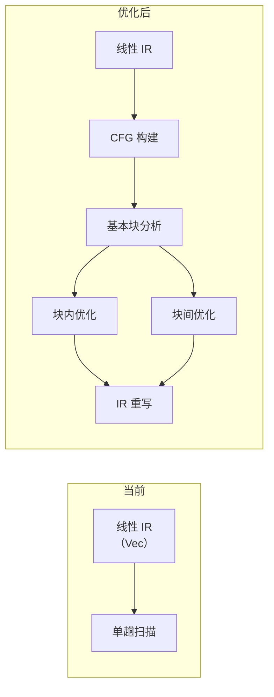

# AEP-003: 指令优化策略
Atomix Enhancement Proposal

| 字段 | 内容 |
|------|------|
| **状态** | Draft |
| **优先级** | P2 |
| **关联文档** | 02-指令集规范.md, 04-编译管线.md§6, 07-Runner完整架构设计.md |
| **提出日期** | 2026-07-19 |

## 1. 动机

Atomix VM 的指令集（54 条 opcode）接近硬件 ISA 的抽象层级——比 Python/Java 的字节码更贴近底层，比 x86/ARM 更安全、可移植。这种"半硬件"的定位使得指令优化空间巨大：

- 编译器 IR 层面的优化（常量折叠、死代码消除）已实现 O1 级别
- 但 VM 执行层面的优化尚未触及
- 现有优化器是**单趟扫描**，缺乏基于数据流分析和控制流图的深度优化

本提案枚举可行的指令优化方向，评估收益与实现成本。

## 2. 优化方向

### 2.1 窥孔优化扩展（短期，低风险）

当前窥孔优化仅覆盖 4 种模式。可扩展的模式：

```
# 冗余 MOV 消除
MOV Rd, Rs        →  删除（Rs 直接作为后续指令的操作数）
<任何使用 Rd 的指令>  →  替换为使用 Rs

# 加载后立即使用（无需溢出）
LOAD Rd, [sp+0]   →  NOP（值已在寄存器中）
<使用 Rd 的指令>

# 比较后直接条件跳转（合并）
SEQ Rd, Rs1, Rs2  →  JZ/JNZ Rs1, Rs2, target（单条指令）
JZ Rd, target

# 常量传播
MOVI Rd, c        →  （将 c 代入后续使用 Rd 的指令）
ADD Rs, Rd, Rt    →  ADDI Rs, Rt, c
```

**预期收益**：指令数减少 5-15%，执行时间减少 3-10%。
**实现成本**：约 200 行 Rust 代码。

### 2.2 寄存器分配优化（中期，中风险）

当前线性扫描分配器使用简单的 T0-T5 临时寄存器，溢出策略是"结束最晚的溢出"：

```
# 改进方向
1. 活跃区间分裂（Live Interval Splitting）
   - 在循环边界处分裂活跃区间，减少寄存器压力
   
2. 第二次机会寄存器分配（Second-Chance Allocation）
   - 缓存最近使用的溢出值，减少 LOAD/STORE

3. 循环感知分配（Loop-Aware Allocation）
   - 循环体内的变量优先分配物理寄存器
   - 循环体外的变量优先溢出
```

**预期收益**：溢出次数减少 30-50%，执行时间减少 5-15%。
**实现成本**：约 500 行 Rust 代码。

### 2.3 数据流分析与全局优化（中期，中风险）

```
# 可用表达式分析（Available Expressions）
- 检测重复计算的子表达式
- CSE（公共子表达式消除）在 O2 已声明但未实现

# 复写传播（Copy Propagation）
- MOV Rd, Rs 后，将 Rd 的使用替换为 Rs
- 消除冗余 MOV

# 死代码消除扩展（Extended DCE）
- 当前 DCE 只做正向可达性标记
- 扩展为反向数据流分析，消除写入后永不读取的指令
```

**预期收益**：指令数减少 10-20%。
**实现成本**：约 800 行 Rust 代码。

### 2.4 控制流图优化（长期，高风险）



- 将线性 IR 构建为控制流图（CFG）
- 在每个基本块内执行局部优化
- 在基本块之间执行全局优化（循环不变量外提、全局代码移动）
- 将优化后的 CFG 重写回线性 IR

**预期收益**：指令数减少 15-30%，执行时间减少 10-25%。
**实现成本**：约 2000 行 Rust 代码，涉及 CFG 数据结构。

### 2.5 窥孔优化：模式匹配引擎（长期，高风险）

将当前手写的 if-else 模式匹配替换为基于 DSL 的模式匹配引擎：

```
# 当前：手写 if-else
if op == MOV && next_op == ADD { ... }
else if op == JZ && next_op == JMP { ... }

# 目标：声明式模式
pattern "mov_add_elim" {
    match: [MOV(rd, rs), ADD(rd, R0, rs)]
    replace: [ADD(rd, R0, rs)]
}

pattern "jz_jmp_reverse" {
    match: [JZ(rt, .L), JMP(.L2)]
    replace: [JNZ(rt, .L2), JMP(.L)]
}
```

**预期收益**：降低添加新窥孔模式的门槛，提升优化器可维护性。
**实现成本**：约 1500 行 Rust 代码 + 宏系统。

### 2.6 执行期自适应优化（远期，试验性）

- 在 VM 执行过程中统计"热指令/热路径"
- 对热路径做内联缓存（inline cache）
- 对频繁执行的指令序列做微优化（micro-patching）

**预期收益**：长期运行的同一任务吞吐量提升 20-40%。
**实现成本**：高，涉及 VM 执行循环改造。

## 3. 优先级建议

| 优先级 | 优化项 | 收益/成本比 |
|--------|--------|:-----------:|
| P1 | 窥孔模式扩展 | ★★★★★ |
| P1 | 寄存器分配改进 | ★★★★☆ |
| P2 | CSE + 复写传播 | ★★★★☆ |
| P2 | CFG 构建 + 块内优化 | ★★★☆☆ |
| P3 | 模式匹配引擎 | ★★★☆☆ |
| P3 | 执行期优化 | ★★☆☆☆ |

## 4. 影响范围

- 编译器：优化器模块（`codegen/optimizer.rs`）
- 寄存器分配器（`codegen/reg_alloc.rs`）
- 可能涉及 IR 数据结构（`codegen/instr.rs`）

## 5. 向后兼容性

所有优化对语义透明。不同优化级别产生不同的 IR 但语义等价。
O0 级别不受任何优化影响。

## 6. 未解决的问题

- CFG 构建带来的编译时间增加如何控制在可接受范围？
- 优化器的测试策略——如何保证 1000+ 模式组合的语义正确性？
- 执行期优化与沙箱安全模型的兼容性？
