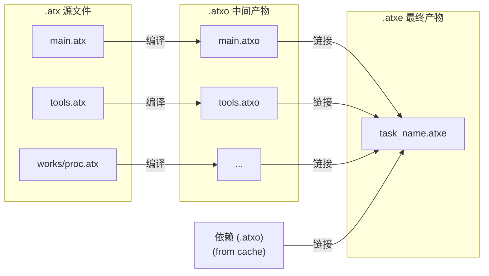

# Atomix 编译管线

> 架构版本: v0.1 (设计阶段)
> 配套文档: 详见 01-总纲与哲学.md、02-指令集规范.md、编译行为.md

---

## 1. 总览



| 阶段 | 输入 | 输出 | 产物格式 |
|------|------|------|----------|
| **词法分析** | `.atx` UTF-8 文本 | Token 流 | 内存结构 |
| **语法分析** | Token 流 | AST | 内存结构 |
| **语义分析** | AST | 类型标注 AST + 符号表 | 内存结构 |
| **IR 生成** | 类型标注 AST | IR 模块 | `.atxo`（单文件 IR） |
| **优化** | IR 模块 | 优化后 IR 模块 | `.atxo` |
| **链接** | N × `.atxo` + 依赖 | 可执行产物 | `.atxe` |

---

## 2. 词法分析

### 2.1 Token 类型

```
TOKEN_EOF           # 文件结束
TOKEN_IDENT         # 标识符（大小写折叠后内部存储）
TOKEN_INT           # 整数字面量 (i64)
TOKEN_FLOAT         # 浮点字面量 (f64)
TOKEN_STRING        # 字符串字面量
TOKEN_FSTRING       # F-字符串字面量

# 关键词（按惯例大小写折叠后匹配）
TOKEN_KW_USE        TOKEN_KW_TRUE       TOKEN_KW_FALSE
TOKEN_KW_AND        TOKEN_KW_OR         TOKEN_KW_NOT
TOKEN_KW_FN         TOKEN_KW_RETURN     TOKEN_KW_DO
TOKEN_KW_IF         TOKEN_KW_ELIF       TOKEN_KW_ELSE
TOKEN_KW_FOR        TOKEN_KW_BREAK      TOKEN_KW_CONTINUE
TOKEN_KW_CALL       TOKEN_KW_WAIT       TOKEN_KW_JOIN
TOKEN_KW_ASSERT     TOKEN_KW_RAISE      TOKEN_KW_TRY
TOKEN_KW_CONST      TOKEN_KW_GOOUT      TOKEN_KW_PUB
TOKEN_KW_TOOLS      TOKEN_KW_INPUT      TOKEN_KW_WORKS
TOKEN_KW_TASK       TOKEN_KW_OUT        TOKEN_KW_TEST
TOKEN_KW_EXCEPTION  TOKEN_KW_ENUM       TOKEN_KW_TYPE
TOKEN_KW_FROM       TOKEN_KW_AS
TOKEN_KW_WEBS       TOKEN_KW_FILES      TOKEN_KW_MEMS
TOKEN_KW_HTTP       TOKEN_KW_TCP        TOKEN_KW_DB
TOKEN_KW_OSS         TOKEN_KW_TXT        TOKEN_KW_CSV
TOKEN_KW_JSON       TOKEN_KW_JSONS      TOKEN_KW_YAML
TOKEN_KW_TOML       TOKEN_KW_XML
TOKEN_KW_INT        TOKEN_KW_FLOAT      TOKEN_KW_BOOL
TOKEN_KW_STR        TOKEN_KW_BYTES      TOKEN_KW_LIST
TOKEN_KW_DICT       TOKEN_KW_TUPLE      TOKEN_KW_SELF

# 符号
TOKEN_COLON         # :
TOKEN_DCOLON        # ::
TOKEN_ARROW_R       # =>
TOKEN_ARROW_L       # <=
TOKEN_EQ            # =
TOKEN_LBRACE        # {
TOKEN_RBRACE        # }
TOKEN_LPAREN        # (
TOKEN_RPAREN        # )
TOKEN_LBRACKET      # [
TOKEN_RBRACKET      # ]
TOKEN_LANGLE        # <
TOKEN_RANGLE        # >
TOKEN_COMMA         # ,
TOKEN_DOT           # .
TOKEN_DOLLAR        # $
TOKEN_PLUS          # +
TOKEN_MINUS         # -
TOKEN_STAR          # *
TOKEN_SLASH         # /
TOKEN_PERCENT       # %
TOKEN_AMP           # &
TOKEN_PIPE          # |
TOKEN_CARET         # ^
TOKEN_TILDE         # ~
TOKEN_BANG          # 用于 != (与 = 组合)
TOKEN_SHL           # <<
TOKEN_SHR           # >>
TOKEN_EQEQ          # ==
TOKEN_NEQ           # !=
TOKEN_LE            # <=
TOKEN_GE            # >=
```

### 2.2 词法规则

标准 DFA 词法分析器。关键点：

- **大小写折叠**：标识符和关键词在词法阶段折叠为小写后匹配。源码原始大小写保留在 Token 的 span 信息中（用于错误报告），但不影响匹配
- **空白**：空格、制表符、换行为分隔符，不产生 Token
- **注释**：`#` 至换行为行注释；`#!` 至 `!#` 为块注释。块注释在区外位置时产出一个特殊 Token `TOKEN_META_BLOCK`（详见 §2.3）
- **字符串**：`"..."` 为普通字符串；`f"..."` 为 F-字符串，其中的 `{expr}` 由解析器处理
- **数字**：前缀 `0x`（十六进制）、`0b`（二进制）、`0o`（八进制）、无前缀（十进制）。含 `.` 或 `e` 为浮点数

### 2.3 元信息块的处理

区外（所有区域声明之前）的 `#! ... !#` 块编译进 IR 元信息。词法分析器根据当前位置决定行为：

- **在区域声明之前**：收集 `#! ... !#` 内容为 `TOKEN_META_BLOCK`
- **在区域声明之后**：`#! ... !#` 等同于空白（普通注释）

---

## 3. 语法分析

### 3.1 方法

**递归下降解析器**（Recursive Descent Parser），每个语法结构对应一个解析函数。模板表示法（`<名称> : ...`）直接映射到解析函数。

顶层结构：

```
File        → (MetaBlock)? (UseDecl | FromDecl | ExceptionDef | EnumDef | TypeAlias)*
              ToolsZone? InputZone? WorksZone* TaskZone? OutZone? TestBlock*
```

### 3.2 AST 节点类型

```
# 顶层
AST_FILE            # 文件根节点
AST_META_BLOCK      # 元信息块
AST_USE_DECL        # USE : "path"
AST_FROM_DECL       # FROM path USE target as alias
AST_EXCEPTION_DEF   # EXCEPTION Name :: Parent
AST_ENUM_DEF        # enum Name { ... }
AST_TYPE_ALIAS      # type Name<Params> = Type

# 区域
AST_ZONE_TOOLS      # TOOLS : { ... }
AST_ZONE_INPUT      # INPUT : { ... }
AST_ZONE_WORKS      # WORKS Name : { ... }
AST_ZONE_TASK       # TASK : { ... }
AST_ZONE_OUT        # OUT : { ... }

# 语句
AST_LET             # x : Type = expr
AST_CONST           # CONST x : Type = expr
AST_GOOUT           # GOOUT x : Type = expr
AST_CALL            # CALL [input =>] func(args) [=> output] [TRY]
AST_WAIT            # WAIT [input =>] template [(overrides)] [=> output] [TRY]
AST_IF              # IF cond { body } [ELIF ...]* [ELSE ...]
AST_FOR             # FOR cond { body }
AST_BREAK           # BREAK [cond]
AST_CONTINUE        # CONTINUE [cond]
AST_ASSERT          # ASSERT expr [, msg]
AST_RAISE           # RAISE expr [, msg]
AST_RETURN          # return [expr]
AST_BLOCK           # { stmt* }

# 表达式
AST_BINARY          # lhs op rhs
AST_UNARY           # op expr
AST_IDENT           # 标识符引用
AST_LITERAL_INT     # 整数字面量
AST_LITERAL_FLOAT   # 浮点字面量
AST_LITERAL_STRING  # 字符串字面量
AST_LITERAL_BOOL    # true / false
AST_LITERAL_LIST    # [expr, ...]
AST_LITERAL_DICT    # {key: val, ...}
AST_LITERAL_TUPLE   # (expr, ...)
AST_INDEX           # expr[index]
AST_DOT             # expr.field
AST_DOLLAR          # $ 或 $[key]
AST_CROSS_REF       # ZONE :: name
AST_FN              # fn name<T>(params) [: ret] { body }
AST_DO              # do (params) [: ret] { body }
AST_DECORATOR       # [func]
AST_TYPE            # 类型标注节点（int, float, str, list[T], dict[K,V], tuple(T,...), 枚举名）
```

> **AST 节点不存储类型信息。** 类型标注和推导结果在语义分析阶段填充到符号表和单独的类型映射结构中（而非直接修改 AST）。

### 3.3 运算符优先级

从低到高：

| 优先级 | 运算符 | 结合性 |
|--------|--------|--------|
| 1 | `and` `or` | 左 |
| 2 | `==` `!=` `<` `>` `<=` `>=` | 左 |
| 3 | `\|` | 左 |
| 4 | `^` | 左 |
| 5 | `&` | 左 |
| 6 | `<<` `>>` | 左 |
| 7 | `+` `-` | 左 |
| 8 | `*` `/` `%` | 左 |
| 9 | `-` `not` `~`（一元） | 右 |

表达式解析使用 **Pratt 解析器**或标准优先级爬升。

---

## 4. 语义分析

### 4.1 符号表

分层符号表（栈式），每进入一个作用域 Push 一层，退出 Pop。

```
符号表层级：
  Level 0: 文件级（USE 导入、EXCEPTION、enum、type 别名、INPUT 常量、WORKS 模板名）
  Level 1: 区域级（TOOLS 函数名、WORKS 属性/方法、TASK 局部变量）
  Level 2+: 块级（IF/FOR 体、TRY 块、匿名函数体）
```

每个符号条目：

```
Symbol {
    name:       InternedString    # 折叠后标识符
    kind:       SymbolKind        # VARIABLE | FUNCTION | CONST | TYPE | WORKS | ENUM | ...
    type:       Type              # 语义分析后填充
    def_node:   ASTNode           # 定义所在 AST 节点
    is_public:  bool              # PUB 声明
    is_goout:   bool              # GOOUT 标注
}
```

### 4.2 遍历顺序

按五区顺序遍历（编译器已重排），每区独立分析。**加载与卸载遵循阶段性生命周期**——区外+TOOLS 常驻、INPUT 即用即卸、TASK 执行前依赖修剪、OUT 懒加载。详见 编译行为.md §3。

1. **区外**：收集 USE/FROM（加载依赖符号表）、EXCEPTION（注册异常类型）、enum（注册枚举类型）、type（注册类型别名）
2. **TOOLS**：注册函数签名（名、参数类型、返回类型），暂不检查函数体
3. **INPUT**：检查数据源声明，注册产出常量类型
4. **WORKS**：注册模板名、属性类型、方法签名
5. **TASK**：完整类型检查（此时所有依赖已就绪）
6. **OUT**：检查交付声明，验证 GOOUT 变量引用
7. **TEST**：完整类型检查

### 4.3 类型检查

采用 **自底向上类型合成**（详见 类型系统.md §4.6）：

```
对每个表达式节点：
  1. 叶节点 → 查符号表（变量）或按字面量规则（常量）
  2. 内部节点 → 根据运算类型规则由子节点类型推导
  3. 类型不兼容 → 报告错误 + 标记为 any 继续（最大努力模式）
```

泛型函数调用：
1. 根据实参类型推断类型参数
2. 生成单态化副本（`fn_name_T1_T2`）
3. 在副本上执行常规类型检查

### 4.4 可达性分析

从 TASK 入口出发标记所有可达的函数/WORKS。不可达代码产生警告（非错误），不参与 IR 生成。

---

## 5. IR 生成

### 5.1 寄存器分配

采用 **线性扫描寄存器分配器**（Linear Scan Register Allocator），16 个通用寄存器（R0–R15）：

- R0 = zero（硬编码）
- R1 = sp（栈指针）
- R2 = fp（帧指针）
- R3 = ra（返回地址）
- R4–R7 = 参数/返回值
- R8–R14 = 通用临时
- R15 = tmp

分配策略：
1. 计算每个虚拟寄存器（SSA 形式或变量）的活跃区间
2. 按起始位置排序
3. 线性扫描分配物理寄存器
4. 溢出（spill）到栈——通过 sp 相对偏移 LOAD/STORE

### 5.2 语法结构 → IR 映射

#### 变量声明

```
x : int = 42          →  MOVI R8, 42
y : int = a + b       →  ADD  R9, R10, R11
```

#### 常量

```
CONST PI : float = 3.14
```
→ 存入 `.rodata`，使用时 `LOAD Rd, [.rodata + offset]`

#### CALL

```
CALL process(a, b) => result
```
→
```
MOV  R4, Ra           ; 参数 1
MOV  R5, Rb           ; 参数 2
CALL process_offset   ; R3 ← ret addr
MOV  Rresult, R4      ; 返回值在 R4
```

#### IF / ELIF / ELSE

```
IF cond {
    A
} ELIF cond2 {
    B
} ELSE {
    C
}
```
→
```
    ; 求值 cond → Rt
    JZ  Rt, .L_elif
    ; A 的 IR
    JMP .L_end
.L_elif:
    ; 求值 cond2 → Rt
    JZ  Rt, .L_else
    ; B 的 IR
    JMP .L_end
.L_else:
    ; C 的 IR
.L_end:
```

#### FOR

```
FOR i < 10 {
    body
}
```
→
```
.L_loop:
    ; 求值 i < 10 → Rt
    JZ  Rt, .L_exit
    ; body 的 IR
    JMP .L_loop
.L_exit:
```

#### BREAK / CONTINUE

```
BREAK cond           →  ; 求值 cond → Rt
                         JNZ Rt, .L_exit    ; 跳到循环出口

CONTINUE cond        →  ; 求值 cond → Rt
                         JNZ Rt, .L_loop    ; 跳到循环头
```

#### RAISE

```
RAISE SomeError      →  MOV  R4, <error_value>
                         THROW R4
```

#### TRY

```
CALL foo() TRY ISERROR is TimeoutError {
    handler_body
}
```
→
```
    ; .exn 条目: [start=CALL, end=after_CALL, handler=.L_handler, filter=1]
    CALL foo_offset
    JMP  .L_after_try
.L_handler:
    ; 检查 ISERROR 类型 → 不匹配则 THROW
    ; 匹配则执行 handler_body
    JMP  .L_after_try
.L_after_try:
```

#### WAIT

```
WAIT DataProcessor (RAW = input_data) => result
```
→
```
    MOV  R4, Rinput         ; 覆盖参数 RAW
    TASK_FORK R10, task_id  ; 派生 WORKS 实例
    TASK_JOIN Rresult, R10  ; 等待结果
```

#### 装饰器

```
HTTP : "url" [gzip] => RAW : bytes
```
→
```
    ; ECALL HTTP_GET → R4
    ; MOV R4, R5           ; 参数：原始数据
    ; CALL gzip_offset     ; 装饰器函数调用
    ; MOV Rraw, R4         ; 结果
```

### 5.3 .rodata 常量区

以下内容存入 `.rodata`：
- 字符串字面量（含 F-字符串求值后的结果）
- 大整数常量（超出 MOVI/LCONST 范围）
- 浮点常量
- 枚举值映射表（调试用）

### 5.4 .task 段生成

从 TASK 入口出发，扫描所有 `TASK_FORK` 指令，构建依赖图：

```
1. 收集所有 TASK_FORK 的 task_id
2. 为每个 task_id 建立节点
3. 根据 FORK 出现位置确定父子关系：
   - 父任务在 FORK 后继续执行 → 子任务是父的依赖
   - 父任务在 JOIN 处阻塞 → 父依赖子
4. 拓扑排序 → 填充 .task 段
```

### 5.5 .exn 段生成

扫描所有 TRY 块，为每个保护区域生成条目：

```
1. 记录 TRY 对应的 CALL/WAIT 指令在 .text 中的起止偏移
2. 记录 handler 代码的起始偏移
3. 根据 TRY 条件类型设置 filter 字段
4. 链式 TRY：多个 start/end 指向同一 handler
```

### 5.6 单态化

泛型函数/类型在 IR 生成阶段展开：

```
fn first<T>(list : list[T]) : T { list[0] }

# 调用点 first([1,2,3]) → T=int
# 生成: fn first_int(list : list[int]) : int { list[0] }
# 内部函数名: first::int
```

单态化的函数名由原始名 + 类型参数组合而成（如 `identity::int`、`pair::int::bool`）。链接阶段按唯一名称解析。

---

## 6. 优化

### 6.1 优化级别

| 级别 | flag | 说明 |
|------|------|------|
| O0 | （默认） | 无优化，最快编译。dev 模式默认 |
| O1 | `--opt 1` | 基本优化：常量折叠、死代码消除、窥孔 |
| O2 | `--opt 2` | 中级优化：+ 函数内联、循环展开、公共子表达式消除 |
| Os | `--opt s` | 体积优化：优先减小 `.atxe` 体积 |

### 6.2 常量折叠

编译期求值常量表达式：

```
x : int = 2 + 3 * 4      →  MOVI R8, 14
y : bool = 1 < 2 and true →  MOVI R9, 1
```

### 6.3 死代码消除 (DCE)

从 TASK 入口标记所有可达指令，未标记的指令移除。

### 6.4 窥孔优化 (Peephole)

滑动窗口扫描指令序列，匹配→替换：

```
MOV Rd, Rs      →  删除（nop 等效）
ADD Rd, R0, Rs
MOVI Rd, 0      →  （已在寄存器分配时处理）
ADD Rd, Rs, R0
JMP .L          →  删除前一条（JMP 后不可达）
<不可达指令>
JZ  Rt, .L      →  JNZ Rt, .L2
JMP .L2             JMP .L
```

### 6.5 函数内联

满足以下全部条件时内联：
- 被调用函数体 ≤ N 条指令（默认 N=20）
- 非递归调用
- 只有一个调用点（或调用点 ≤ M，默认 M=3）
- 内联后不溢出寄存器预算

### 6.6 循环优化

- **循环不变量外提**：循环内不依赖迭代变量的计算提到循环前
- **强度削减**：`i * 8` 替换为 `i << 3`
- **循环展开**：小循环体展开 2-4 次减少分支（O2 级别）

---

## 7. 链接

### 7.1 输入

- 当前项目所有 `.atxo` 文件
- `atomix.lock` 中记录的依赖 `.atxo` 文件
- 标准库 `.atxo` 文件

### 7.2 流程

```
1. 段合并
   - 合并所有 .text 段（重定位符号引用）
   - 合并所有 .rodata 段（去重字符串常量）
   - 合并所有 .task 段（重建 task_id，更新依赖列表）
   - 合并所有 .exn 段（PC 偏移重定位）

2. 区域分区
   - 按来源区域（区外/TOOLS/INPUT/WORKS/TASK/OUT/TEST）标记 .text 子区间
   - 记录每个区间的起止指令偏移

3. 依赖修剪（链接期闭包分析）
   - 从 TASK 入口出发，遍历所有 CALL、TASK_FORK 目标
   - 标记所有可达的函数、WORKS 模板、类型引用
   - 未标记的代码段不进入最终 .text

4. 符号解析
   - 解析所有跨文件符号引用
   - 未解析符号 → 链接错误
   - 多定义符号 → 链接错误（除非 PUB 声明）

5. 生成 .zones 段
   - 为每个分区生成生命周期条目（zone_id + lifecycle + flags）
   - 标注常驻/即卸/懒加载策略
   - 标注 TASK zone 的 prune 标记（表示已做闭包修剪）

6. 依赖图拓扑排序
   - 扫描修剪后的 .text，重建依赖图
   - 按最深层优先排序 .task 段条目

7. 入口点确定
   - TASK 区第一条指令为 Entry
   - 写入 Header.Entry

8. 产出 .atxe
   - 写入 Header（Magic、Version、Flags、Entry、TotalInstrs、SectionCount）
   - 写入 Section Table（含 .zones）
   - 写入各段数据
```

### 7.3 链接期修剪

编译器在链接阶段执行的闭包分析是 Atomix 最核心的优化。不同于传统"全量链接→执行时才知道需要什么"，Atomix 在链接阶段就把不需要的代码砍掉。

**修剪算法：**

```
输入: 合并后的完整 IR（所有 .atxo 的并集）
输出: 修剪后的最小闭包

1. 初始化: 所有函数、WORKS 模板、类型标记为"不可达"
2. 种子: 从 TASK zone 的 text_start 出发，标记为"可达"
3. 传播:
   a. 遍历当前指令，遇到 CALL target → 标记 target 函数为可达 → 递归
   b. 遇到 TASK_FORK task_id → 标记对应 WORKS 模板为可达 → 递归模板方法
   c. 遇到跨域引用 (INPUT::X, TOOLS::fn) → 标记对应符号
4. 汇总: 收集所有"可达"的 .text 区间
5. 重写: 只保留可达区间，重建 PC 偏移表
```

**修剪效果：**

```
修剪前:  50 个 WORKS 模板 + 200 个 TOOLS 函数 = 250 个代码单元
         TASK 实际只用到 5 个模板 + 20 个函数
修剪后:  仅 25 个代码单元进入 .atxe
         节省: 90% 的代码体积和加载内存
```

### 7.4 .zones 段生成

链接器根据修剪结果生成 `.zones` 段（详见 02-指令集规范.md §4.7）：

| zone_id | lifecycle | flags | 说明 |
|---------|-----------|-------|------|
| 0 (区外) | persistent | 0 | 类型定义/导入路径，全程常驻 |
| 1 (TOOLS) | persistent | 0 | 修剪后的函数签名表 |
| 2 (INPUT) | exec_unload | 0 | 数据拉取代码 |
| 3 (WORKS) | persistent | prune | 修剪后的模板集 |
| 4 (TASK) | exec_unload | prune | 编排代码 |
| 5 (OUT) | lazy | 0 | 交付代码 |

> **`prune` 标记的含义：** 不是"请执行器修剪"，而是"编译器已修剪完毕"——这是一个声明标记，告诉执行器这个 zone 的代码已经过闭包分析，仅包含可达代码。

### 7.5 .atxe 结构

详见 02-指令集规范.md §4。最终产物的 Section 顺序：

```
Header
Section Table
.text      (修剪后的指令)
.rodata    (修剪后的常量)
.task      (依赖图 + 调度元信息)
.exn       (异常表)
.zones     (区域生命周期表)
.debug     (可选)
```

---

## 8. 错误报告

### 8.1 错误格式

```
error: 类型不匹配
  ┌─ tasks/cleanup.atx:12:15
  │
12│   x : int = "hello"
  │               ^^^^^^ 期望 int，实际 str
```

### 8.2 错误恢复

语法分析采用**恐慌模式**（Panic Mode）恢复——遇到错误后跳到下一个同步 Token（`}`、换行 + 非缩进关键字）继续解析。单次编译报告所有错误（不遇错即停）。

---

> 编译器管线规格到此覆盖了从词法到链接的完整路径。各阶段的算法复杂度、内存管理策略、并行编译（多文件并行）等工程细节在实现阶段确定。
