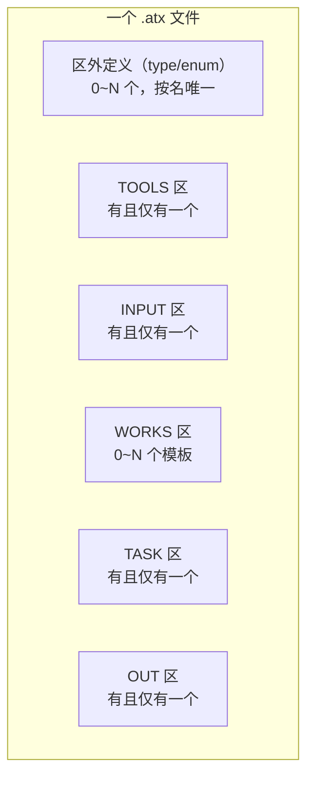
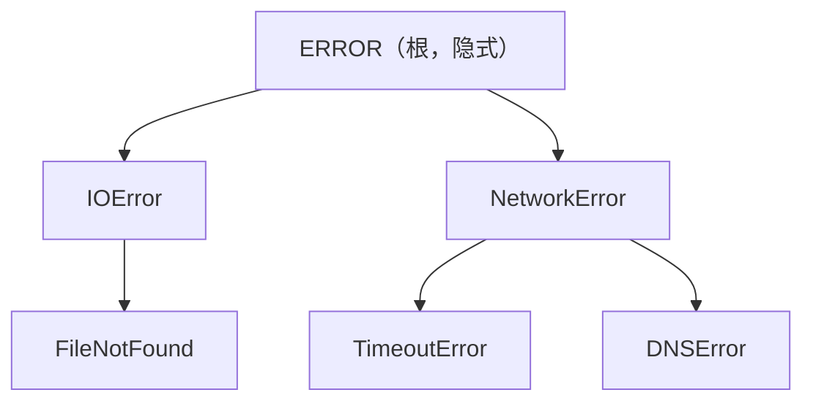

# Atomix 区外语法

> 架构版本: v0.1 (设计阶段)
> 适用范围: 文件级（不属于任何语法域）
> 配套文档: 详见 通用语法.md

---

## 1. 概述

区外语法出现在文件头部、各区域声明之外。不属于 TOOLS / INPUT / WORKS / TASK / OUT 中的任何一个。

当前区外语法包括：
- 导入声明（`USE` 及 `FROM ... USE ...`）
- 异常定义
- 枚举定义
- 类型别名与泛型
- 测试定义
- 元信息块（被编译的块注释）

---

## 2. 导入声明

### 2.1 简单导入

```
<USE声明>   : USE : <字符串>
```

USE 在文件头部引入外部依赖，不属于任何区域：

```
USE : "http"
USE : "fs"
```

### 2.2 选择性导入

```
<选择性导入> : FROM <路径/包名> USE <文件名/包名> :: <目标名> as <别名>
             | FROM <路径/包名> USE <文件名> :: TOOLS :: <函数名> as <别名>
             | FROM <路径/包名> USE <文件名> :: type <类型别名> as <别名>
             | FROM <路径/包名> USE <文件名> :: enum <枚举名> as <别名>
```

三种模板：

**模板一：导入 WORKS 模板**

```
FROM <路径/包名> USE <文件名/包名> :: <WORKS名称> as <别名>
```

```
FROM "std/io" USE "file_utils" :: FILE_READER as reader
FROM "std/net" USE "http_client" :: HTTP_FETCH as fetcher
```

**模板二：导入 TOOLS 函数**

```
FROM <路径/包名> USE <文件名> :: TOOLS :: <函数名> as <别名>
```

```
FROM "std/net" USE "http" :: TOOLS :: fetch as http_get
FROM "utils" USE "string" :: TOOLS :: format as fmt
```

**模板三：导入类型定义（`type` / `enum`）**

类型别名和枚举定义在文件级（区外），按名导入。`type`/`enum` 前缀消歧——与 WORKS 模板名区分：

```
FROM <路径/包名> USE <文件名> :: type <类型别名> as <别名>
FROM <路径/包名> USE <文件名> :: enum <枚举名> as <别名>
```

```
FROM "std/types" USE "common" :: type Pair as Pair
FROM "std/types" USE "common" :: enum Status as Status
FROM "my_project" USE "models" :: type UserID as UID
```

> **`as` 别名可选。** 不写 `as` 时以原名导入。别名冲突时编译器报错。

### 2.3 设计理由：导入层级的深度

两种模板的 `::` 层级深度不同，根因是**被导入对象在目标文件中的结构唯一性**：

一个 `.atx` 文件的结构：



**TOOLS 导入为何多一层 `:: TOOLS ::`：** TOOLS 区在文件中唯一存在——`:: TOOLS` 已经精确定位了"这个文件的 TOOLS 区"。再往下 `:: fetch` 选取该区内的具体函数。两层分别对应"定位区 → 定位函数"。

**WORKS 导入为何只有一层 `:: WORKSName`：** WORKS 区不唯一——一个文件可以有 N 个 WORKS 模板。写 `:: WORKS` 不能定位到具体模板，因此必须直接写模板名 `:: DataPipeline`。解析器根据名称是否为区关键词来区分：是关键词 → 区引用；不是关键词 → WORKS 模板名。

**type/enum 导入为何用 `:: type Name`：** 类型定义在区外，与 WORKS 模板共享同一名称空间——`type Pair` 和 `WORKS Pair` 可能同名。`type`/`enum` 前缀显式消歧，告诉解析器"去文件的类型表里找这个名字"。

**为何导入整个 WORKS 模板而非模板内方法：** WORKS 模板的方法是实例方法，脱离模板实例不存在。导入整个模板，通过 `WAIT` 实例化后自然拥有所有方法。导入单个方法无意义——没有实例的方法不可调用。

### 2.4 非法情况

> **`::` 分隔符消歧：** `FROM ... USE ... :: Target` 中的 `::` 是导入语法专用分隔符。与跨域引用 `TOOLS :: func`（通用语法 §20）共享同一符号，但两者上下文互斥：
> - **导入 `::`** 出现在文件头部、所有区域声明（`TOOLS : {` 等）之前
> - **跨域引用 `::`** 出现在域声明之后、区域内部
>
> 解析器根据当前位置（是否已进入语法域）即可无歧义区分。

| 情况 | 说明 |
|------|------|
| 导入路径为空 | `FROM "" USE ...` |
| 别名冲突 | 同一文件内 `as reader` 出现两次 |
| 导入不存在的目标 | `FROM "x" USE "y" :: UNDEFINED as z` |

---

## 3. 异常定义

### 3.1 模板

```
<异常定义> : EXCEPTION <名称> [ :: <父异常> ]
```

- `EXCEPTION` 为关键词，全大写
- `<名称>` 为异常名，建议大写驼峰
- `:: <父异常>` 可选——不写则为裸异常，继承自根异常

```
EXCEPTION IOError                    # 裸异常，继承根
EXCEPTION NetworkError               # 裸异常
EXCEPTION TimeoutError :: NetworkError   # 继承 NetworkError
EXCEPTION DNSError :: NetworkError       # 继承 NetworkError
EXCEPTION FileNotFound :: IOError        # 继承 IOError
```

### 3.2 异常层级

未指定父异常时，默认继承自根异常 `ERROR`。异常定义形成树状层级：



### 3.3 使用场景

异常定义后可在 TRY 条件中匹配：

```
CALL fetch_data() TRY ISERROR is TimeoutError {
    print("timeout occurred")
}
```

### 3.4 非法情况

| 情况 | 说明 |
|------|------|
| 异常定义出现在区域内部 | 在 `TASK : { }` 中写 `EXCEPTION` |
| 循环继承 | `A :: B` 且 `B :: A` |
| 引用未定义的父异常 | `EXCEPTION X :: Y` 但 `Y` 不存在 |

---

## 4. 枚举定义

### 4.1 模板

```
<枚举定义> : enum <名称> { <枚举项>+ }

<枚举项>   : <标识符> [ = <整数> ]
```

枚举是具名整数常量的集合。定义在文件级（所有区域声明之前），全局可见：

```
enum Color {
    Red
    Green
    Blue
}

enum Status {
    OK = 200
    NotFound = 404
    Error = 500
}
```

### 4.2 取值规则

- 未指定 `= <整数>` 时，从 `0` 开始自动递增
- 指定值时使用指定值，后续未指定的项从该值继续递增
- 值必须为整数常量（编译期可求值）

```
enum Mixed {
    A          # = 0
    B          # = 1
    C = 10     # = 10
    D          # = 11
    E = 0xFF   # = 255
}
```

### 4.3 使用

枚举类型在类型标注中使用枚举名，枚举值通过 `枚举名::项名` 引用：

```
status : Status = Status::OK
color : Color = Color::Red

IF status == Status::NotFound {
    RAISE "not found"
}
```

### 4.4 非法情况

| 情况 | 说明 |
|------|------|
| 枚举定义出现在区域内部 | 在 `TASK : { }` 中写 `enum` |
| 枚举项重名 | 同一枚举内两项同名 |
| 枚举名与已有类型重名 | `enum int { ... }` |
| 值非编译期常量 | `A = some_var` |

---

## 5. 类型别名与泛型

### 5.1 模板

```
<类型别名>  : type <名称> [ <泛型参数> ] = <类型>
```

`type` 定义具名类型别名，可附带泛型参数。与 `enum` 一样，定义在文件级（所有区域声明之前），全局可见：

```
type UserID = int
type Point = tuple(float, float)
type Pair<A, B> = tuple(A, B)
type Result<T, E> = dict[str, T]    # 简化示例
type Handler<T> = fn(T) : bool
```

### 5.2 泛型类型别名

类型别名可携带泛型参数，参数在 `<>` 中声明（与函数泛型语法一致，详见 通用语法.md §16.2）：

```
type Pair<A, B> = tuple(A, B)
type Stack<T> = list[T]
type MapFn<A, B> = fn(A) : B
```

使用时需提供具体类型参数：

```
x : Pair<int, str> = (42, "hello")
items : Stack<float> = [1.0, 2.0, 3.0]
mapper : MapFn<int, bool> = fn(x : int) : bool { x > 0 }
```

### 5.3 约束

- 类型别名**不可递归**（`type T = list[T]` 非法）
- 泛型参数必须在右侧类型中出现
- `type` 定义的别名与原始类型在语义上完全等价（非 newtype）

### 5.4 非法情况

| 情况 | 说明 |
|------|------|
| 类型别名出现在区域内部 | 在 `TASK : { }` 中写 `type` |
| 递归类型别名 | `type T = list[T]` |
| 泛型参数未使用 | `type Foo<T> = int` |
| 类型名与已有类型重名 | `type int = str` |

---

## 6. 元信息块

### 6.1 语法

```
<元信息块> : #! <KV 行>+ !#
```

区外的 `#! ... !#` 块**不是注释**——编译器会将其编译为 IR 二进制中的元信息段，按 KV 结构存储，每行一条。

### 6.2 存储规则

- K 统一命名为 `meta_0`、`meta_1`、`meta_2`……按出现顺序自动递增
- V 为每行的原始内容
- 存储在 IR 的元信息段（`.meta`）

```
#!
author = Atomix Team
version = 1.0.0
description = Data processing pipeline
license = MIT
!#
```

编译后 IR 中的元信息表：

| Key | Value |
|-----|-------|
| `meta_0` | `author = Atomix Team` |
| `meta_1` | `version = 1.0.0` |
| `meta_2` | `description = Data processing pipeline` |
| `meta_3` | `license = MIT` |

### 6.3 限制

| 规则 | 说明 |
|------|------|
| **仅文件级有效** | 元信息块必须出现在所有区域声明**之前**，在 `TOOLS : {` 之前 |
| **仅限一个** | 整个文件最多一个元信息块 |
| **KV 结构不定** | 编译器不做语义检查，只存不解析 |

### 6.4 非法情况

| 情况 | 说明 |
|------|------|
| 元信息块出现在区域内部 | 在 `TASK : { ... }` 内写 `#! ... !#` |
| 多个元信息块 | 文件中有两段 `#! ... !#` |
| 块注释在区域内被编译 | 各区域内部的 `#! ... !#` 仍为普通注释，不产出元信息 |

---

## 7. 测试定义

### 7.1 模板

```
<TEST定义>  : TEST <字符串> { <测试体> }

<测试体>    : <声明>*           # 可含 ASSERT、变量声明、CALL 等
```

`TEST` 定义命名测试块。测试文件（`*_test.atx`）中可有一个或多个 `TEST` 块，与区域声明（TOOLS/TASK 等）互斥——测试文件不包含五区结构：

```
TEST "addition works" {
    ASSERT add(1, 2) == 3
}

TEST "identity preserves value" {
    result = identity("hello")
    ASSERT result == "hello"
}

TEST "pipeline produces expected output" {
    data = CALL process(sample_input)
    ASSERT data != ""
    ASSERT len(data) > 0
}
```

### 7.2 执行模型

- 每个 `TEST` 块独立执行，互不依赖
- `TEST` 块内可使用全部通用语法（ASSERT、变量声明、CALL、IF、FOR 等）
- 测试不可使用 INPUT/OUT 区——测试数据直接在测试体内构造
- 可通过 `FROM ... USE ...` 导入 WORKS 模板和 TOOLS 函数
- `atomix test` 命令收集所有 `*_test.atx` 中的测试块并逐一执行

### 7.3 非法情况

| 情况 | 说明 |
|------|------|
| `TEST` 出现在非测试文件中 | 在含五区结构的普通 `.atx` 中混写 `TEST` |
| 测试块内使用 INPUT/OUT 区 | `TEST` 块中不可声明数据源或交付 |
| 测试块访问外部 INPUT 常量 | 测试文件没有 INPUT 区，不可引用 |
| 测试名为空 | `TEST "" { }` |
