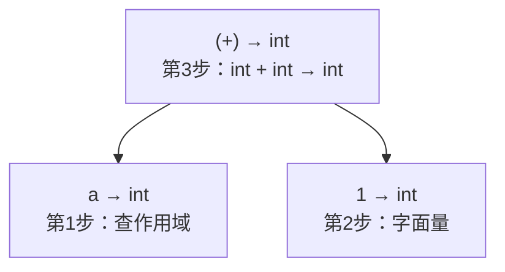
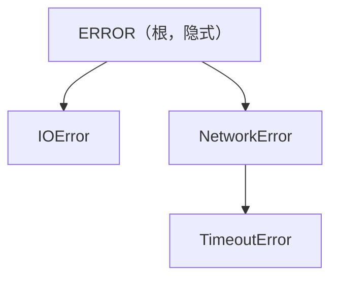

# Atomix 类型系统

> 架构版本: v0.1 (设计阶段)
> 适用范围: 所有语法域
> 配套文档: 详见 通用语法.md、02-指令集规范.md

---

## 1. 设计原则

VM 寄存器为 **64 位**，LOAD/STORE 只操作 64 位。不设窄类型（i8/i16/u32 等）——编译器可掩码组合模拟，语法层不暴露。

类型系统的核心原则：**够用就行，不堆砌。**

---

## 2. 基础类型

| 类型 | 说明 | 对应指令 |
|------|------|----------|
| `int` | 有符号 64 位整数 | ADD、SUB、MUL、DIV…… |
| `float` | IEEE 754 双精度浮点 | FADD、FSUB、FMUL、FDIV…… |
| `bool` | 布尔值 `true` / `false` | SEQ、SNE、SLT…… |
| `str` | 字符串（UTF-8） | 内存操作 |
| `bytes` | 原始字节序列 | 内存操作 |
| `enum` | 具名整数常量 | MOV、SEQ 等整数指令（底层为整数值） |
| `duration` | 时间长度，底层为有符号 64 位整数（纳秒） | ADD、SUB 等整数指令 |

**没有** i8/i16/i32/u8/u16/u32/u64/f32——VM 只认 64 位，窄类型由编译器自行掩码处理，语法层不存在。

> `duration` 支持带单位后缀的字面量：`30s`（秒）、`5ms`（毫秒）、`10m`（分钟）。编译器将单位转换为纳秒整数值。

枚举类型详解见 区外语法.md §4。枚举类型之间不可隐式转换（即使底层整数值相同），与整数运算非法。

---

## 3. 复合类型

| 类型 | 写法 | 说明 |
|------|------|------|
| 列表 | `list[T]` | 同类型元素的有序集合 |
| 字典 | `dict[K, V]` | 同类型键值对映射 |
| 元组 | `tuple(T1, T2, ...)` | 固定数量的异构值集合 |

```
x : list[int] = [1, 2, 3]
y : dict[str, int] = {"a": 1, "b": 2}
z : tuple(str, int, bool) = ("hello", 42, true)
```

---

## 4. 类型推导

### 4.1 原则

一句原则：**最终的运行时类型必须是确定性的。**

推导方式：从源头出发，沿表达式链向前传递。源头类型确定后，后续一切可推。

### 4.2 源头类型

| 源头 | 确定方式 | 类型 |
|------|----------|------|
| 字面量 | 按字面量类型定 | `42`→int, `3.14`→float, `true`→bool, `"hi"`→str |
| INPUT 声明 | 显式标注 `: type` | 用户声明 |
| 函数返回值 | 显式标注 `: type` | 函数签名 |
| GOOUT 变量 | 显式标注 `: type` | 用户声明 |
| 匿名函数 `do` | 显式标注 `: type` | 函数签名 |

所有源头类型都是显式可知的，不存在歧义。

### 4.3 链式推导

类型沿表达式链传递：

```
a = 42                 # a → int（源头：字面量）
b = a                  # b → int（从 a 传递）
c = a + 1              # c → int（a:int + 1:int → int）
d = c * 2              # d → int（从 c 传递）

name = "hello"         # name → str
msg = name + " world"  # msg → str（str + str → str）

data = CALL process(x) # data → process 的返回类型
```

### 4.4 运算类型规则

| 运算 | 左类型 | 右类型 | 结果类型 |
|------|--------|--------|----------|
| `+ - * / %` | int | int | int |
| `+ - * /` | float | float | float |
| `+ - * /` | int | float | **float**（int 提升为 float） |
| `+` | str | str | str（拼接） |
| `== != < > <= >=` | 任意 | 相同 | bool |
| `and or` | bool | bool | bool |
| `not` | bool | — | bool |

### 4.5 `any` 兜底

如果经过完整的链式追溯仍无法确定类型，编译器将该变量标记为 `any` 并**报告异常**：

```
x = CALL ambiguous()   # ambiguous 无返回类型标注 → x 无法推导
```

`any` 不是运行时类型——它是编译器的"推导失败"标记。`any` 类型的变量在后续使用中会持续引发类型错误，直到用户补上显式标注。

> **显式标注优先于推导。** 如果用户写了 `x : float = 42`，以 `: float` 为准。

### 4.6 推导算法

算法是**自底向上类型合成**（Bottom-Up Type Synthesis），不是 Hindley-Milner。

对表达式树从叶节点向根节点逐层推导：



步骤：
1. **叶节点**：字面量按类型表定，标识符查当前作用域
2. **内部节点**：根据运算类型规则（§4.4），由子节点类型推导父节点类型
3. **检查**：类型规则无法匹配（如 `int + bool`）→ 报告类型错误

不需要 Hindley-Milner 的原因——Atomix 函数签名都显式标注了返回类型，没有需要全局统一求解的类型变量。自底向上合成足够。

### 4.7 泛型与单态化

泛型函数的类型参数（详见 通用语法.md §16.2）在**调用点**确定：

1. **类型参数推断**：编译器根据实参类型推断每个类型参数的具体类型
2. **单态化**：为该类型组合生成一份独立函数体，替换所有类型参数
3. **类型检查**：在单态化后的函数体上执行常规类型检查

```
fn first<T>(list : list[T]) : T { list[0] }

x = first([1, 2, 3])       # T → int，单态化为 first_int
                            # 检查：list[0] : int，返回类型 int ✅
y = first(["a", "b"])       # T → str，单态化为 first_str
                            # 检查：list[0] : str，返回类型 str ✅
```

**单态化的类型检查顺序：** 不在泛型定义时检查（类型参数是不确定的），而在每个调用点单态化后独立检查。这意味着泛型函数体中对类型参数的操作受限于**调用点实际类型**——某种类型组合可以编译通过，另一种可能报类型错误。

```
fn double<T>(x : T) : T { x + x }   # 通用语法 §7 中 + 对 int/float/str 合法

a = double(42)           # T → int，int+int → int ✅
b = double(3.14)         # T → float，float+float → float ✅
c = double("hi")         # T → str，str+str → str ✅
d = double(true)         # T → bool，bool+bool 在运算规则中非法 ❌
```

---

## 5. 类型转换

### 5.1 自动提升

| 场景 | 规则 | 示例 |
|------|------|------|
| int → float | 隐式提升 | `42 + 3.14` → `float` |
| 窄→宽 | 编译器掩码组合 | 编译器层处理，语法层不暴露 |

### 5.2 显式转换

```
x : int = 42
y : float = float(x)     # int → float
z : int = int(y)         # float → int（截断，不四舍五入）
s : str = str(x)         # int → str
b : bytes = bytes(s)     # str → bytes（UTF-8 编码）
```

### 5.3 禁止的隐式转换

| 转换 | 说明 |
|------|------|
| bool → int | `42 + true` 非法（true 不可隐式转为 1） |
| float → int | 必须显式 `int(x)`，精度损失由用户确认 |
| str → int | 必须显式 |

---

## 6. 列表与字典访问

### 6.1 列表访问

```
<列表访问> : <表达式> [ <值表达式> ]
```

索引从 0 开始，使用方括号访问：

```
items : list[int] = [10, 20, 30]
first  = items[0]        # 10，类型 int
second = items[1]        # 20，类型 int
```

### 6.2 字典访问

```
<字典访问> : <表达式> [ <值表达式> ]
```

使用键值访问：

```
scores : dict[str, int] = {"alice": 95, "bob": 87}
alice  = scores["alice"]  # 95，类型 int
```

### 6.3 非法情况

| 情况 | 说明 |
|------|------|
| 越界索引 | 编译期不作检查，运行时由 VM 保障安全 |
| 键不存在 | 编译期不作检查，运行时返回空值或报错 |
| 对非容器类型使用 `[ ]` | `42[0]` |

---

## 7. 错误类型

由 `EXCEPTION` 定义（详见 区外语法.md）形成层级：



### 7.1 错误传播规则

异常沿调用栈向上传播，规则如下：

1. **函数内异常**：函数中 `RAISE` 或运行时错误沿调用栈向上冒泡
2. **TRY 拦截**：`CALL ... TRY { }` 在 Step 级别捕获异常，阻止继续传播
3. **未捕获异常**：传播到 TASK 顶层时，任务标记为失败，通过 `TASK_RET` 向父任务返回错误码
4. **ECALL 错误**：系统调用失败返回负值，VM 自动将其映射为对应异常类型（详见 运行时架构.md §6.1）

```
CALL fetch_data() TRY ISERROR is TimeoutError {
    # 捕获超时异常，传播链在此终止
}
# 未捕获的异常继续向上传播到 TASK 顶层
```

---

## 8. 非法情况

| 情况 | 说明 |
|------|------|
| 类型不匹配 | `42 + true` |
| 列表中混合类型 | `[1, "a"]` |
| 函数返回类型不匹配 | 声明 `: int` 但返回 `true` |
| 未标注类型的变量 | `x = 42`（缺少 `: type`） |
